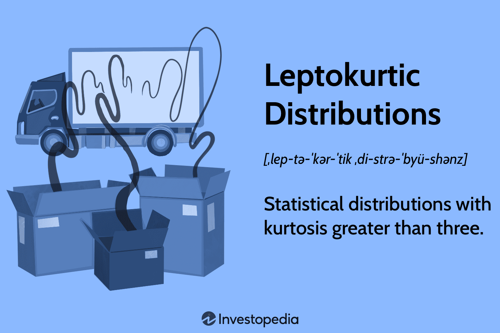

In today's financial markets, understanding statistical distributions can significantly impact trading strategies. Leptokurtic and platykurtic distributions are particularly important in algorithmic trading, where they influence risk management and decision-making processes. Dealer and market makers continually strive to predict price movements and manage risks, and knowledge of these distributions can offer a competitive edge.

Leptokurtic distributions, characterized by a higher kurtosis than the normal distribution, exhibit "fat tails" and sharper peaks around the mean, suggesting a higher likelihood of extreme price movements. These properties can be leveraged in high-frequency trading and advanced risk management techniques to anticipate significant market events and adjust trades accordingly. By acknowledging the probability of such extreme values, traders can refine their strategies to either capitalize on or hedge against large swings in asset prices.



Conversely, platykurtic distributions, which possess a kurtosis less than the normal distribution, have "thin tails" and a flatter peak, indicating a lower probability of extreme market events. Such characteristics are viewed favorably in strategies aiming for stability and consistent returns, making them a suitable choice for risk-averse portfolios. Understanding these distributions helps mitigate exposure to unexpected market volatility and prioritizes steadier performance over the potential for high returns.

This article will explore the concepts of leptokurtic and platykurtic distributions in greater detail and discuss their implications for algorithmic trading strategies. By adapting strategies to these varying statistical features, traders can optimize risk management, enhance decision-making, and potentially improve their financial returns.

## Table of Contents

## Understanding Leptokurtic and Platykurtic Distributions

Kurtosis is a fundamental statistical measure that provides insight into the shape of a data distribution, particularly the tails and peak. It helps identify the tendency of data to have clusters of extreme values, a characteristic essential for financial modeling and risk assessment.

Leptokurtic distributions are characterized by a kurtosis value greater than three. This indicates the presence of 'fat tails,' where there is a higher likelihood of experiencing extreme values compared to a normal distribution. The peak of a leptokurtic distribution is sharp and pronounced near the mean, suggesting that most data points are tightly clustered around the average, with a significant chance of encountering outliers. This behavior is often observed in financial returns where sudden and drastic price movements can occur.

In contrast, platykurtic distributions exhibit a kurtosis less than three. These distributions are typified by 'thin tails' and a flatter peak. Unlike leptokurtic distributions, platykurtic ones suggest a lower probability of extreme values, indicating a more uniform spread of data points around the mean. The flatter peak implies a reduced concentration of data close to the average, which can often be seen in asset returns that exhibit more stable and less volatile price changes over time.

Understanding the kurtosis of a distribution aids in selecting appropriate statistical models and risk management strategies. For instance, in Python, calculating kurtosis can be executed using libraries such as SciPy:

```python
from scipy.stats import kurtosis

data = [...]  # A list of data points
kurtosis_value = kurtosis(data)

# Identify the type of distribution
if kurtosis_value > 3:
    distribution_type = "Leptokurtic"
elif kurtosis_value < 3:
    distribution_type = "Platykurtic"
else:
    distribution_type = "Mesokurtic"
```

This code snippet calculates the kurtosis of a given dataset to classify it as leptokurtic, platykurtic, or mesokurtic. Understanding these distinctions enables more informed decisions in [algorithmic trading](/wiki/algorithmic-trading), helping tailor strategies to fit specific distribution properties.

## Implications of Leptokurtic Distributions in Algo Trading

Leptokurtic distributions, characterized by "fat tails" and a sharp peak around the mean, suggest a higher probability of extreme values. This characteristic has significant implications for algorithmic trading, especially in risk assessment and management. In trading algorithms, understanding and incorporating leptokurtic properties can lead to more accurate predictions of market moves and more effective risk management strategies.

High kurtosis in a distribution indicates that the data has heavier tails and a sharper peak compared to a normal distribution. This means that extreme outcomes, both high and low, are more likely than they would be under a Gaussian assumption. In the context of algo trading, this translates to a higher likelihood of large price swings, which can be both an opportunity and a risk. Traders can capitalize on these extreme movements for potential gains, but they must also be prepared for the increased risk of significant losses.

In high-frequency trading ([HFT](/wiki/high-frequency-trading-strategies)) and market prediction models, leptokurtic distributions are particularly relevant. HFT strategies often rely on lightning-fast decisions based on subtle shifts in market data. The higher incidence of extreme values in leptokurtic distributions can provide valuable signals for these strategies. An algorithm that anticipates such swings can better position itself to buy or sell assets at the most opportune moments, thereby maximizing potential profits.

Moreover, the ability to model leptokurtic distributions allows trading algorithms to enhance their risk management components. By factoring in the likelihood of extreme outcomes, these algorithms can adjust their risk parameters dynamically. For instance, they might tighten stop-loss limits or adjust the size of trades in anticipation of potential [volatility](/wiki/volatility-trading-strategies) spikes, thereby mitigating possible losses.

A practical example can be demonstrated using Python. Assume we have a price series of an asset and we want to model potential future prices considering leptokurtic behavior:

```python
import numpy as np
from scipy.stats import kurtosis

# Sample asset returns
asset_returns = np.random.normal(0, 1, 1000)

# Increase kurtosis artificially to mimic leptokurtic behavior
leptokurtic_returns = np.concatenate([asset_returns, np.random.normal(0, 5, 20)])

# Calculate kurtosis
original_kurtosis = kurtosis(asset_returns)
leptokurtic_kurtosis = kurtosis(leptokurtic_returns)

print(f'Original Kurtosis: {original_kurtosis}')
print(f'Leptokurtic Kurtosis: {leptokurtic_kurtosis}')
```

In the above example, we artificially increase the kurtosis of a normally distributed return series by adding extreme values. This mimics a leptokurtic distribution, demonstrating how financial data might behave in the presence of such statistical characteristics.

In conclusion, recognizing and leveraging the implications of leptokurtic distributions within algo trading frameworks can significantly affect a trader's ability to manage risks and seize profit opportunities. By anticipating extreme values and integrating appropriate risk management protocols, algorithmic trading systems can enhance their performance in volatile markets.

## Role of Platykurtic Distributions in Financial Analysis

Platykurtic distributions, characterized by a kurtosis of less than three, exhibit traits that make them particularly attractive to risk-averse investors who prioritize stability over the potential for substantial, albeit rare, returns. These distributions are noted for their thinner tails and a flatter peak compared to the normal distribution, indicating a reduced likelihood of extreme values. This property diminishes the probability of significant deviations from the mean, aligning well with investment strategies that seek to maintain consistency.

In financial analysis, the incorporation of platykurtic distributions aids in crafting portfolios that reduce exposure to volatility by favoring moderate fluctuations over unpredictable market swings. By minimizing the presence of outliers, these distributions cater to investors aiming to preserve capital and achieve steady growth. This predictability is especially valuable in constructing balance-seeking asset allocations that favor capital preservation.

When developing trading strategies, understanding platykurticity can be instrumental in risk management. Investors and traders inclined towards conservative approaches can analyze the distribution of asset returns to discern which investments might offer lower exposure to significant risks. This can entail using statistical tools and modeling techniques to assess the kurtosis of prospective financial instruments or portfolio components and adjust positions accordingly for resilience against market anomalies.

Furthermore, algorithmic trading strategies can be enhanced by integrating principles of platykurticity. Algorithm designers can program trading systems to recognize and prioritize assets exhibiting platykurtic behavior, thereby allowing for automated decision-making processes that emphasize reduced exposure to erratic price movements. Such systems can employ Python code to calculate kurtosis or integrate libraries like NumPy or pandas for efficient data analysis:

```python
import pandas as pd

# Assuming 'returns' is a pandas Series of asset returns
kurtosis = returns.kurtosis()

if kurtosis < 3:
    print("The asset displays platykurtic behavior.")
```

By doing so, trading algorithms are better equipped to adapt swiftly to changing market conditions without falling prey to extreme variance, fortifying both strategic execution and overall portfolio resilience. As a result, understanding and applying the principles of platykurtic distributions in financial analysis is a prudent step for those emphasizing risk mitigation and stable returns.

## Comparing Leptokurtic and Platykurtic for Investment Strategies

In investment strategies, the selection between leptokurtic and platykurtic distributions hinges predominantly on the investor's risk tolerance and strategic objectives. Leptokurtic distributions, characterized by their pronounced peaks and 'fat tails,' present significant opportunities for extraordinary gains due to their higher probability of extreme values. This inherent volatility can attract risk-seeking investors who are willing to endure substantial short-term fluctuations in exchange for the potential of outsized returns. These investors might implement strategies designed to capitalize on the extreme price movements often associated with leptokurtic assets. For instance, certain high-frequency trading and option trading strategies might be optimized to exploit these extreme variations effectively.

On the other hand, risk-averse investors generally gravitate towards assets exhibiting platykurtic distributions. These distributions, noted for their thin tails and flatter peaks, signify a lower probability of extreme outlier returns. Such features make platykurtic distributions appealing to those prioritizing stability and consistent performance over potential high-risk, high-reward scenarios. Investing in assets with platykurtic characteristics can lead to more predictable and stable returns, aligning with the objectives of portfolios seeking to minimize exposure to substantial volatility and focus on capital preservation.

The appropriate choice between these distribution types can facilitate more informed investment decisions, aligned with individual risk profiles and financial goals. Investors must assess the trade-off between risk and return, analyzing whether their strategic preferences align with the volatile nature of leptokurtic distributions or the steadiness offered by platykurtic distributions. Effective evaluation of statistical distribution can serve as a guiding principle for constructing diversified portfolios that balance the pursuit of growth with risk management considerations. Through thoughtful analysis and application of these statistical insights, investors can enhance their portfolios' robustness and resilience against unpredictable market dynamics.

## Case Studies and Applications

Analyzing historical market data is critical in determining the prevalent type of distribution in various asset classes. This analysis often involves examining large datasets comprising asset returns, which are then statistically modeled to assess the nature of their distribution—whether leptokurtic or platykurtic. For instance, many financial assets, especially during volatile market periods, tend to show a leptokurtic distribution, characterized by frequent occurrences of extreme returns.

One notable application in algorithmic trading is the development of trading algorithms that leverage leptokurtic distributions. These algorithms are designed to capture large price swings which are more common in such distributions. The presence of 'fat tails' in a leptokurtic distribution indicates a higher likelihood of obtaining returns that deviate significantly from the mean, both positively and negatively. Algorithmic strategies often use this property to anticipate and exploit these price movements. For example, models such as Conditional Value at Risk (CVaR) often incorporate leptokurtic properties to optimize decision-making under uncertainty.

Here is a simple Python example using a statistical library to identify and work with leptokurtic data:

```python
import numpy as np
from scipy.stats import kurtosis

data = np.random.normal(loc=0.0, scale=1.0, size=1000)
kurt = kurtosis(data)

if kurt > 3:
    print("The distribution is likely leptokurtic.")
    # Implement trading strategy
else:
    print("The distribution is not leptokurtic.")
```

Conversely, platykurtic distributions have thinner tails and suggest a lower probability of extreme outcomes. These are often employed in hedging strategies for portfolios aiming to avoid volatility. By prioritizing assets or trading strategies that align with a platykurtic distribution, traders can maintain greater stability, mitigating exposure to drastic price changes. This stability is particularly desired in uncertain or highly volatile market conditions.

To develop hedging strategies, one can analyze historical data to determine the kurtosis of asset returns. Returning to our Python example, this analysis is an initial step in delineating which assets may contribute to a more platykurtic distribution within a portfolio. For portfolios inclined towards steadiness, adopting strategies that involve assets characterized by platykurtic distributions can help maintain it through turbulent periods, fostering an environment of controlled risk exposure.

Ultimately, the successful application of these statistical insights into algorithmic trading depends on the ability to effectively analyze market data and implement models that suit specific financial objectives, whether they be capturing high volatility through leptokurtic exploitation or ensuring stability through platykurtic hedging.

## Conclusion

Understanding the nuances between leptokurtic and platykurtic distributions is essential for optimizing trading strategies in algorithmic trading. Leptokurtic distributions, with their propensity for fat tails and peak characteristics, highlight the increased probability of extreme market movements. This deviation from normality suggests that traders can encounter unexpected price swings, which can be both a risk and an opportunity, depending on the strategy employed. Implementing trading strategies that acknowledge these deviations allows traders to anticipate potential market volatility better and devise systematic approaches that capitalize on large price shifts while managing associated risks.

Conversely, platykurtic distributions, characterized by thin tails and a flatter peak, indicate a lower likelihood of extreme values. Such distributions offer favorable conditions for risk-averse strategies that prioritize stability and consistency over the pursuit of rare, high-return events. Algorithmic traders focusing on platykurtic properties can foster greater predictability in returns, thus aligning with investment objectives centered on minimizing exposure to extreme risks.

Adapting strategies to these distribution characteristics enhances risk management by equipping traders with the tools required to align their algorithms with desired risk-reward profiles. The integration of statistical insights specific to distribution types enables a more tailored approach to portfolio design and risk mitigation.

As algorithmic trading platforms continue to evolve, future research and technological advancements promise to deepen the understanding and practical application of these statistical measures. Enhanced computational capabilities and [machine learning](/wiki/machine-learning) techniques may further refine how these distributions are identified and leveraged, leading to more innovative strategies that seamlessly integrate leptokurtic and platykurtic considerations. The ongoing development of sophisticated trading models underscores the importance of these statistical tools in navigating and optimizing financial markets effectively.

## References & Further Reading

[1]: ["Market Risk Management: An Application to Financial Markets"](https://www.financestrategists.com/wealth-management/investment-risk/market-risk/) by Morton Glantz and Robert Kissell

[2]: Mandelbrot, B. B., & Hudson, R. L. (2004). ["The (Mis)behavior of Markets: A Fractal View of Risk, Ruin, and Reward"](https://books.google.com/books/about/The_Mis_Behaviour_of_Markets.html?id=zg91TAIs6bgC). Basic Books.

[3]: Fama, E. F. (1965). ["The Behavior of Stock-Market Prices."](https://www.rybn.org/ANTI/ARTICLES/1965%20-%20The%20Behavior%20of%20Stock-Market%20Prices%20-%20Eugene%20Fama.pdf) The Journal of Business, 38(1), 34-105.

[4]: Taleb, N. N. (2007). ["The Black Swan: The Impact of the Highly Improbable."](https://archive.org/details/10.1.1.695.4305) Random House.

[5]: Lo, A. W., & MacKinlay, A. C. (1999). ["A Non-Random Walk Down Wall Street."](https://www.amazon.com/Non-Random-Walk-Down-Wall-Street/dp/0691092567) Princeton University Press.

[6]: Bouchaud, J. P., & Potters, M. (2003). ["Theory of Financial Risk and Derivative Pricing: From Statistical Physics to Risk Management"](https://www.cambridge.org/core/books/theory-of-financial-risk-and-derivative-pricing/5BBBA04CE72ED9E5E7C1C028D9A94FCB) (2nd ed.). Cambridge University Press.

[7]: Cont, R. (2001). ["Empirical properties of asset returns: stylized facts and statistical issues"](http://rama.cont.perso.math.cnrs.fr/pdf/empirical.pdf). Quantitative Finance, 1(2), 223-236.