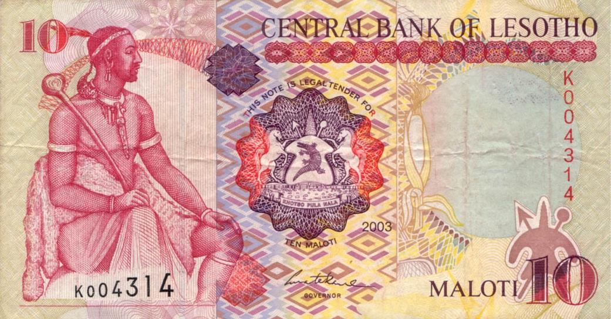

Lesotho, officially known as the Kingdom of Lesotho, is a small, landlocked nation encircled by South Africa. It is a country known for its mountainous terrain and a unique cultural heritage deeply intertwined with the region's history. The economy of Lesotho is heavily dependent on agriculture, manufacturing, and worker remittances, with textiles and water being crucial export products. Despite these economic activities, Lesotho faces challenges, including high poverty and unemployment rates.

The official currency of Lesotho is the Lesotho Loti (LSL). Introduced in 1966 to replace the South African Rand, the Loti is further divided into 100 lisente. In the Lesotho financial system, understanding the Loti is vital due to its peg to the South African Rand at a 1:1 ratio. This fixed exchange rate means that economic developments in South Africa can significantly impact the Lesotho economy. Therefore, the stability of the Loti is directly linked to the performance of the South African economy, influencing inflation, interest rates, and overall economic health in Lesotho. The Central Bank of Lesotho plays a crucial role in managing the currency, focusing on monetary stability to support economic growth.

In recent years, there has been increased interest in algorithmic trading, a method where computer algorithms execute trades based on set parameters. This interest extends to trading the Lesotho Loti, as investors seek to capitalize on its peg to the South African Rand. Understanding the nuances of the LSL, its economic implications, and potential trading opportunities is becoming increasingly important for investors and market participants. Algorithmic trading offers the potential for more efficient and accelerated execution of trade orders, presenting both opportunities and challenges in the context of the Lesotho Loti.

## Table of Contents

## Understanding the Lesotho Loti (LSL)

The Lesotho Loti (LSL), introduced in 1966 to replace the South African Rand within Lesotho's borders, serves as the national currency of the Kingdom of Lesotho. The currency's name originates from the Sesotho language, with "loti" referring to a "mountain" and symbolizing the nation's topography. The Loti exists alongside the Rand as legal tender, reflecting Lesotho's economic intertwining with South Africa.

Subdivided into 100 lisente (singular: sente), the Loti's denominations are both in coins and banknotes. Coins circulate in denominations of 1, 2, 5, 10, 20, and 50 lisente, alongside 1, 2, and 5 loti coins. Banknotes are issued in denominations of 10, 20, 50, 100, and 200 loti, catering to varying transaction sizes in the economy.

A notable feature of the Lesotho Loti is its peg to the South African Rand at a one-to-one exchange rate, established to stabilize the currency and facilitate trade with its primary economic partner, South Africa. This peg permeates economic policy and affects monetary flow, making the Loti's value sensitive to economic changes in South Africa. The peg minimizes foreign exchange risk in cross-border transactions and harmonizes economic policies under the Common Monetary Area (CMA), comprising Lesotho, South Africa, Eswatini, and Namibia.

The Central Bank of Lesotho plays a pivotal role in currency management, overseeing the issuance and regulation of the Loti. The Bank's responsibilities include maintaining currency stability and implementing monetary policies to promote economic growth. Additionally, the Central Bank of Lesotho manages Lesotho's foreign reserves, influencing the Loti's international value and competitiveness.

In summary, the Lesotho Loti is not just legal tender but a reflection of the country's economic synergies with South Africa. Through its peg to the Rand and oversight by the Central Bank, it remains a significant facet of Lesotho's economic architecture.

## Economic Overview of Lesotho

Lesotho's economy is characterized by a predominantly agrarian structure, with subsistence agriculture playing a crucial role. The majority of the rural population engages in farming activities, mainly cultivating crops such as maize, sorghum, and wheat, which are vital for local consumption. Despite the emphasis on agriculture, the sector faces challenges such as climate variability, inadequate infrastructure, and limited access to modern farming techniques, which constrain productivity and development.

In addition to agriculture, the manufacturing sector contributes significantly to Lesotho's economy. Textile and apparel manufacturing form the backbone of this sector, driven by foreign investments and preferential trade agreements with major markets, such as the United States through the African Growth and Opportunity Act (AGOA). The sector has provided numerous employment opportunities, particularly for women, and has spurred growth in ancillary services.

Remittances also constitute a substantial portion of Lesotho's GDP. Many Basotho work in South Africa, particularly in mining and labor-intensive industries, sending money back home to support their families. These remittances help alleviate poverty and stimulate domestic consumption, although they also expose the economy to [volatility](/wiki/volatility-trading-strategies) based on South Africa's economic conditions.

The economy faces certain challenges due to high poverty and unemployment rates, compounded by external vulnerabilities. With approximately 30% of the population living below the poverty line and unemployment remaining elevated, efforts to enhance economic diversification and improve the business environment are essential. Additionally, Lesotho's landlocked nature and dependence on South Africa for trade and employment underscore its vulnerability to external economic shifts.

Lesotho maintains significant economic ties with South Africa, facilitated by its membership in the Southern African Customs Union (SACU). SACU, the oldest existing customs union in the world, allows member states—including Botswana, Eswatini, Namibia, and South Africa—to benefit from a common external tariff, unhindered trade of goods, and a revenue-sharing formula that provides substantial fiscal receipts to Lesotho. These ties are instrumental for Lesotho's economic stability, but they also highlight the need for greater economic independence to cushion against regional economic fluctuations.

In summary, Lesotho's economy relies on a mix of agriculture, manufacturing, and remittances, each presenting unique opportunities and challenges. The country's close ties with South Africa, particularly through SACU, play a pivotal role in its economic landscape. Addressing current challenges requires strategic planning to enhance productivity, diversify economic activities, and mitigate external dependencies.

## The Common Monetary Area and the Loti

The Common Monetary Area (CMA) is a regional monetary union composed of Lesotho, South Africa, Namibia, and Eswatini (formerly Swaziland). It facilitates the streamlined movement of capital across member states and provides a framework for monetary cooperation and policy coordination. Established in 1986, the CMA evolved from the Rand Monetary Area (RMA), reflecting a continued economic interdependence among member countries. 

One of the primary benefits of the CMA to the Lesotho economy is the access to a stable regional currency system, reducing the risk of currency volatility. Lesotho's participation in the CMA means that while the Loti is its official currency, the South African Rand is also accepted as legal tender within the country. This dual-currency system enhances financial stability as the Rand is considered a robust currency due to South Africa's larger and more diversified economy. In practical terms, it provides Lesotho with a stable exchange rate environment, reducing transactional and conversion costs for businesses and consumers who trade or remit money across borders.

Moreover, by being part of the CMA, Lesotho benefits from a credible monetary framework which could otherwise be challenging for its relatively smaller economy to maintain on its own. The presence of the South African Reserve Bank's monetary policy effectively extends to Lesotho, thereby indirectly offering greater monetary credibility and lower inflation risks. Another advantage is fostering increased investment from both domestic and foreign stakeholders who find comfort in the stability and predictability offered by the CMA framework.

However, the incorporation of the South African Rand as legal tender in Lesotho can have significant implications for monetary sovereignty. Since the Rand is a prominent currency within Lesotho, the Central Bank of Lesotho has limited capacity to enforce independent monetary policy decisions. For instance, any shifts in South Africa's monetary policy automatically reverberate through the Lesotho economy, impacting inflation, interest rates, and overall economic performance. 

Overall, the CMA arrangement provides substantial benefits in terms of economic stability and integration, while also presenting challenges regarding Lesotho's monetary policy independence. The economic relationship with South Africa, underpinned by the South African Rand, remains a crucial component of Lesotho's financial landscape, impacting both macroeconomic policies and everyday economic transactions.

## Algo Trading with the Lesotho Loti

Algorithmic trading, commonly referred to as algo trading, involves using computer programs to execute trades at speeds and frequencies that are impossible for human traders. This rapid execution is based on pre-defined criteria, which can cover aspects such as timing, price, or quantity. Over the past few decades, algo trading has significantly grown in popularity due to its ability to process vast amounts of data and execute trades on multiple markets simultaneously, often capitalizing on minute price discrepancies.

### Algo Trading and the Lesotho Loti

Algorithmic trading holds potential for markets involving the Lesotho Loti (LSL), Lesotho's official currency. In the context of [forex](/wiki/forex-system) trading, integrating the LSL into algorithmic strategies can open up new trading avenues. Given the currency's peg to the South African Rand (ZAR), algo trading systems can be designed to exploit any short-lived price inefficiencies between the LSL and ZAR or against other currency pairs.

The LSL's characteristic of being closely tied to the Rand creates a unique environment for [algorithmic trading](/wiki/algorithmic-trading). Traders could develop [arbitrage](/wiki/arbitrage) strategies to take advantage of any discrepancy between the LSL and its pegged equivalent in the ZAR. For instance, if the market exchange rate of LSL/ZAR deviates from the official pegged rate due to temporary supply-demand imbalances, an algorithm could identify and act on these disparities instantly.

### Challenges and Opportunities in Trading the LSL

Despite its potential, trading the Lesotho Loti algorithmically presents several challenges:

1. **Market Liquidity**: The LSL market is relatively small and less liquid compared to major global currencies. This can lead to increased volatility, larger spreads, and potential slippage, making it harder to execute large trades without affecting the market price.

2. **Regulatory Environment**: Lesotho's financial market regulations might not be as developed as those in more established markets, potentially leading to uncertainties or risks for algo trading practitioners.

3. **Access to Market Data**: Successful algo trading relies heavily on high-quality data. For currency pairs involving the LSL, acquiring comprehensive and real-time market data might be more difficult than for more liquid currencies.

4. **Infrastructure**: The technological infrastructure in Lesotho may pose limitations for high-frequency trading systems, which require robust and reliable connectivity and computing power.

However, the opportunities include:

- **Arbitrage Opportunities**: As mentioned, the pegging mechanism between the LSL and the ZAR can present arbitrage opportunities which can be exploited by sophisticated algorithms designed to recognize and trade on small price discrepancies.

- **Portfolio Diversification**: Including the LSL in an algorithmic trading strategy can provide portfolio diversification benefits due to its unique economic ties and conditions distinct from other currencies.

- **Emerging Market Potential**: As global investors increasingly seek opportunities in emerging markets, the LSL could gain more visibility and become integrated into broader trading strategies, enhancing its liquidity and market depth over time.

In summary, while there are considerable challenges associated with algorithmic trading of the Lesotho Loti, the potential for developing profitable strategies exists, especially with careful analysis and strategy development tailored to the unique characteristics of the LSL market.

## Conclusion

The Lesotho Loti (LSL) plays a pivotal role in the economic framework of the Kingdom of Lesotho. Understanding the Loti's mechanism and its connection to Lesotho's economic activities is crucial for anyone interested in the country's economy or engaged in foreign exchange (forex) and algorithmic trading. The Loti's peg to the South African Rand and Lesotho's membership in the Common Monetary Area (CMA) provides stability while also linking Lesotho's economic fortunes to those of its larger neighbor. This makes the currency a subject of interest for economists and traders alike, seeking to understand its dynamics in regional and global contexts.

Recognizing the intricacies of the LSL is essential for forex traders and investors, particularly with the burgeoning field of algorithmic trading. Algo trading, defined by its reliance on algorithms to manage trading decisions, demands a strong understanding of the currencies being traded, including factors influencing their value and stability. The Loti, given its connections and economic underpinnings, presents both opportunities and challenges for such trading strategies. Its predictability, due to the peg with the Rand, can offer a relatively stable environment for algorithmic models, yet also comes with risks associated with shifts in the South African economy.

Looking forward, Lesotho’s economic trajectory and the future of the Loti are closely tied to regional integration and development within the Southern African Customs Union (SACU). Economic ties with South Africa and the CMA continue to shape macroeconomic policies, impacting both local and international perceptions of the LSL. As global markets evolve and technological advancements continue to influence trading practices, Lesotho's economy and the Loti may experience shifts that could redefine their roles and significance on a broader scale. It remains imperative for economic stakeholders to remain vigilant and adaptive to changes within this dynamic landscape.

## References & Further Reading

[1]: Bank for International Settlements. ["The Role of the Central Bank in a Macroprudential Framework"](https://www.bis.org/)

[2]: ["Advances in Financial Machine Learning"](https://www.amazon.com/Advances-Financial-Machine-Learning-Marcos/dp/1119482089) by Marcos Lopez de Prado

[3]: ["Quantitative Trading: How to Build Your Own Algorithmic Trading Business"](https://github.com/LucindaYa/quant-resources/blob/master/Quantitative%20Trading%20How%20to%20Build%20Your%20Own%20Algorithmic%20Trading%20Business.pdf) by Ernest P. Chan

[4]: Aronson, D. R. [Evidence-Based Technical Analysis: Applying the Scientific Method and Statistical Inference to Trading Signals](https://www.amazon.com/Evidence-Based-Technical-Analysis-Scientific-Statistical/dp/0470008741) 

[5]: Central Bank of Lesotho. ["Monetary Policy."](https://www.centralbank.org.ls/index.php/monetary-policy)

[6]: Jansen, S. ["Machine Learning for Algorithmic Trading"](https://github.com/stefan-jansen/machine-learning-for-trading)

