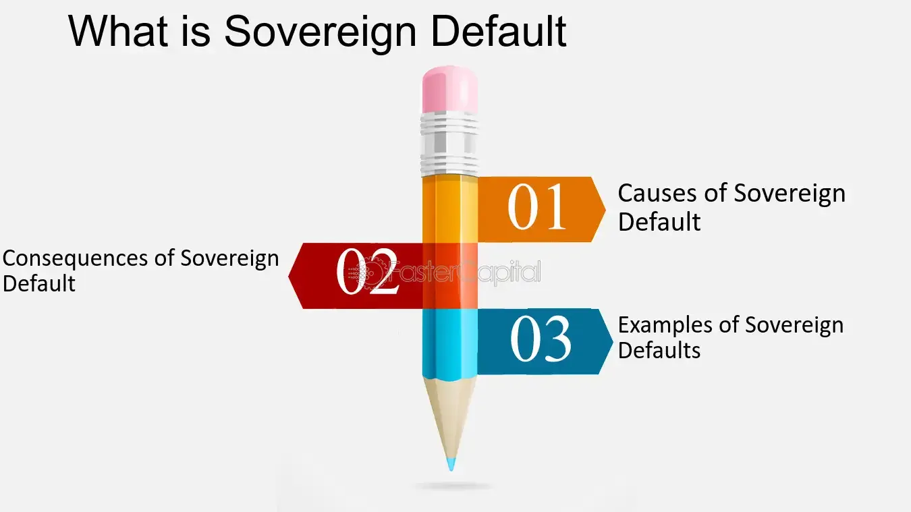

## Table of Contents

## What is a sovereign default?

A sovereign default happens when a country cannot pay back the money it borrowed. This can occur if a country has borrowed too much money and cannot earn enough to pay it back. When a country defaults, it can cause big problems for its economy and the people living there.

When a country defaults, it might have trouble borrowing money in the future. Other countries and investors might not trust them anymore. This can make it hard for the country to get loans, which can slow down its economy. It can also lead to higher prices and less money for people to spend.

## How common are sovereign defaults?

Sovereign defaults are not very common, but they do happen from time to time. Since the year 1900, there have been about 150 cases of sovereign defaults around the world. This might sound like a lot, but there are many countries, so it's not happening all the time.

Most sovereign defaults happen in poorer countries that have a hard time managing their money. Rich countries can usually avoid defaulting because they have more resources and better ways to handle their debts. However, even rich countries can face problems if they borrow too much or if there's a big economic crisis.

## What are the causes of sovereign defaults?

Sovereign defaults can happen for a few reasons. One big reason is when a country borrows too much money and can't pay it back. This can happen if the country spends more than it earns from taxes and other income. Sometimes, countries borrow money to build roads, schools, or hospitals, but if they can't make enough money to pay back the loans, they might default.

Another reason is when a country's economy gets into trouble. This can happen if there's a big economic crisis, like a recession, where people lose jobs and businesses close down. When this happens, the country makes less money from taxes, and it becomes harder to pay back what they owe. Also, if a country depends a lot on selling one thing, like oil, and the price of that thing drops a lot, it can cause big problems and lead to a default.

Sometimes, things outside the country can cause a default too. For example, if there's a big change in the world economy, like a financial crisis in another country, it can affect other countries too. If investors suddenly stop lending money to a country because they're worried about its economy, that country might not be able to borrow the money it needs to keep going, which can lead to a default.

## What are the immediate effects of a sovereign default on a country's economy?

When a country defaults on its debt, it can cause big problems right away. The country might find it hard to borrow more money because other countries and investors won't trust them anymore. This can make it tough for the government to pay for important things like schools, hospitals, and roads. Also, the value of the country's money might go down, which can make prices go up and make life more expensive for people living there.

Another immediate effect is that businesses and people might lose confidence in the economy. They might stop spending money and start saving it instead, which can slow down the economy even more. If businesses are worried about the future, they might not want to invest or hire new workers, which can lead to more people losing their jobs. All these things together can make the country's economic problems even worse right after a default.

## Can you list some historical examples of sovereign defaults?

One big example of a sovereign default happened in Argentina in 2001. Argentina had borrowed a lot of money and couldn't pay it back. This caused a huge economic crisis. Banks closed, and people lost their savings. Many people lost their jobs, and there were big protests in the streets. It took Argentina a long time to recover from this default.

Another example is Greece in 2015. Greece had borrowed a lot of money from other European countries and couldn't pay it back. This led to a big crisis in Europe. Greece had to make big cuts in spending, which made life hard for many people. They had to change a lot of their laws and get help from other countries to start paying back their debts.

A third example is Russia in 1998. Russia defaulted on its debt because its economy was in bad shape. The value of the Russian currency dropped a lot, and many people lost their savings. This made life very hard for a lot of Russians, and it took years for the country to get better.

## How do sovereign defaults impact global financial markets?

When a country defaults on its debt, it can shake up global financial markets. Investors around the world might start to worry about other countries that owe money. They might sell off their investments in those countries, causing the value of stocks and bonds to drop. This can lead to a lot of uncertainty and fear in the markets, making it harder for countries and companies to borrow money.

The effects can spread quickly because many countries and banks are connected through trade and finance. If one country defaults, it can make banks in other countries nervous about their loans to that country. These banks might then have less money to lend, which can slow down the global economy. Overall, a sovereign default can create a ripple effect, causing problems far beyond the country that defaulted.

## What are the long-term consequences of a sovereign default for a country?

A sovereign default can have big long-term effects on a country. After a default, it can be hard for the country to borrow money again. Other countries and investors might not trust them anymore, so they might have to pay higher interest rates if they want to borrow. This can make it tough for the government to spend money on important things like schools and hospitals. It can also take a long time for the country's economy to get better, sometimes many years.

Another long-term effect is that people might lose trust in their government. When a country defaults, it can make life hard for everyone living there. People might lose their jobs, and prices might go up. This can lead to less spending and slower growth for the economy. It can also cause social problems, like more people leaving the country to find better opportunities elsewhere. Overall, a sovereign default can change a country's economy and society for a long time.

## What role do international organizations like the IMF play in sovereign defaults?

The International Monetary Fund (IMF) helps countries that are in financial trouble, including those that might default on their debt. When a country is struggling to pay back what it owes, it can ask the IMF for help. The IMF might give the country money to help it pay its debts. But, in return, the country usually has to agree to make changes to its economy, like cutting spending or raising taxes. These changes are meant to help the country get its finances in order so it can avoid defaulting.

Sometimes, the IMF's help can stop a country from defaulting. But, the changes the country has to make can be hard on people living there. For example, cutting spending might mean less money for schools and hospitals. This can make life harder for people and can cause protests. Even with the IMF's help, it can still take a long time for a country to recover from being close to a default.

## How do credit rating agencies affect the likelihood and aftermath of sovereign defaults?

Credit rating agencies, like Moody's, Standard & Poor's, and Fitch, play a big role in sovereign defaults. They give countries a grade, called a credit rating, that shows how likely it is that the country will pay back its debts. If a country's credit rating goes down, it can make investors worried. They might think the country is more likely to default. This can make it harder for the country to borrow money because it might have to pay higher interest rates. So, a lower credit rating can increase the chances of a default.

After a sovereign default, credit rating agencies often lower the country's rating even more. This makes it even harder for the country to borrow money to fix its problems. It can take a long time for a country to get its credit rating back up after a default. During this time, the country might have to make big changes to its economy to show investors it can be trusted again. So, credit rating agencies can affect both the chances of a default happening and how hard it is for a country to recover afterward.

## What are the differences between a sovereign default and a debt restructuring?

A sovereign default happens when a country can't pay back the money it borrowed. It's like when you borrow money and can't pay it back on time. When a country defaults, it might stop paying its debts completely, which can cause big problems for its economy and make it hard to borrow money again.

A debt restructuring is different. It's when a country and its lenders agree to change the terms of the debt. Instead of not paying at all, the country might ask to pay less money each month or to pay back the money over a longer time. This can help the country avoid a default and still pay back what it owes, but it usually means the country has to make some changes to its economy.

## How do domestic political factors influence the decision to default?

Domestic political factors can really affect whether a country decides to default on its debt. Sometimes, the leaders of a country might think that defaulting is the only way to fix big economic problems. They might believe that the pain of a default is less than the pain of keeping things the same. Also, if there's a lot of fighting between different political groups, it can be hard to agree on what to do. Some groups might want to default to show they're doing something different from their rivals.

Another big [factor](/wiki/factor-investing) is what the people in the country think. If people are really unhappy with how things are going, they might push their leaders to do something big, like defaulting. They might think that a default will make things better for them, even if it's risky. Leaders might listen to what the people want, especially if they're worried about losing their jobs in the next election. So, the political situation inside a country can make a big difference in whether it decides to default or not.

## What strategies can countries employ to avoid or mitigate the impact of a sovereign default?

Countries can use different strategies to avoid or lessen the impact of a sovereign default. One way is to be careful with borrowing. If a country borrows less money and spends it wisely, it can avoid getting into too much debt. Another way is to grow the economy. By making it easier for businesses to start and grow, a country can earn more money from taxes, which can help pay back debts. Also, a country can work with international organizations like the IMF to get help before things get too bad. The IMF might give money or advice to help the country manage its debts better.

If a default happens, countries can still do things to make the impact less bad. One way is to talk to the people they owe money to and see if they can change the terms of the debt. This is called debt restructuring, and it can help the country pay back what it owes over a longer time or with less money each month. Another way is to make changes to the economy to make it stronger. This might mean cutting spending or raising taxes, which can be hard but can help the country recover faster. By planning ahead and being ready to make tough choices, countries can handle the problems that come with a default.

## References & Further Reading

[1]: Hausmann, R., Panizza, U., & Stein, E. (2001). ["Why Do Countries Float the Way They Float?"](https://www.sciencedirect.com/science/article/abs/pii/S0304387801001687) Journal of Development Economics, 66(2), 387-414.

[2]: Reinhart, C. M., & Rogoff, K. S. (2009). ["This Time is Different: Eight Centuries of Financial Folly"](https://www.nber.org/system/files/working_papers/w13882/w13882.pdf) Princeton University Press.

[3]: Stiglitz, J. E., & Guzman, M. (2016). ["Creating a Framework for Sovereign Debt Restructuring that Works."](https://www.degruyter.com/document/doi/10.7312/guzm17926-003/html) CESifo Working Paper.

[4]: Bolton, P., & Jeanne, O. (2007). ["Structuring and Restructuring Sovereign Debt: The Role of Seniority"](https://crei.cat/wp-content/uploads/2016/09/Jeanne.pdf) National Bureau of Economic Research.

[5]: Cliff, D., & Northrop, L. (2016). ["The Global Financial Markets: An Ultra-Large-Scale Systems Perspective."](https://www.researchgate.net/publication/262237886_The_Global_Financial_Markets_An_Ultra-Large-Scale_Systems_Perspective) Software Architecture Program, Carnegie Mellon University.

[6]: Zigrand, J. P. (2015). ["Economic impact assessments on MiFID reforms: Final report."](https://impact.ref.ac.uk/casestudies/CaseStudy.aspx?Id=35087) Financial Conduct Authority.