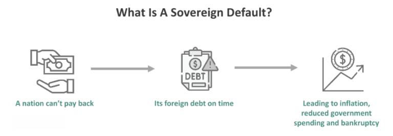

Sovereign defaults have been a persistent concern in the global financial landscape, often leading to economic crises and significant market disruptions. When a country fails to meet its debt obligations, the repercussions can extend beyond its national borders, affecting global markets and economies. As sovereign debt holds a critical role in the financial stability of a country, any default or potential default can impact investor confidence and prompt significant shifts in international investment patterns.

The intersection of sovereign default, debt crises, and algorithmic trading presents a unique set of challenges and opportunities for investors and policymakers. With the advancement of technology, algorithmic trading has become a prominent feature in financial markets, allowing for rapid data processing and execution of trades. This technological capability can be both a tool for stability and a potential source of volatility during financial turmoil. On one hand, algorithmic trading improves market liquidity and efficiency, making it easier for markets to absorb shocks. On the other hand, the speed and volume of trades executed by algorithms can exacerbate market fluctuations, particularly during debt crises.



This article explores the economic implications of sovereign defaults, the dynamics of debt crises, and the role of algorithmic trading in navigating these complex financial situations. By understanding these elements, investors and policymakers can better assess risks and devise strategies to mitigate the adverse effects of sovereign defaults. The need for a balanced approach, integrating technological advances in trading with robust financial regulation and policy interventions, is critical for maintaining global economic stability.

## Table of Contents

## Understanding Sovereign Defaults

Sovereign default occurs when a nation is unable to fulfill its debt obligations, potentially leading to a scenario analogous to bankruptcy for a sovereign state. This financial event has widespread implications, often resulting in severe economic consequences both domestically and internationally. The inability to meet debt payments can be caused by various factors such as a decline in foreign exchange reserves, political instability, a decrease in government revenue, or an increase in external debt burden relative to the country’s GDP.

Historically, several countries have experienced sovereign defaults, exemplifying the risks associated with excessive national debt levels. For instance, Venezuela has faced numerous defaults, with its most recent being in 2017 when it missed interest payments on several of its bonds [1]. Persistent political and economic volatility, along with a sharp drop in oil prices, has significantly diminished Venezuela's capacity to meet its international financial obligations. Ecuador also provides a pertinent example, having defaulted multiple times, including a notable strategic default in 2008 when the government declared $3.2 billion of its debt illegitimate and subsequently ceased payments [2].

Although the United States has never experienced an official sovereign default, there has been a near-miss scenario: the 1979 technical default. This event occurred due to a combination of computational errors, a failure in processing payments, and a stalemate in the U.S. Congress regarding the raising of the debt ceiling. Although short-lived, this technical default highlighted potential vulnerabilities within the U.S. financial system, despite the country's robust economic framework [3]. It underlines the importance of efficient fiscal management even for economically potent countries.

These instances underscore the inherent risk of high sovereign debt levels, which can destabilize economies and strain international financial systems. They also highlight the nuanced nature of sovereign defaults, which, while primarily financial, are also deeply entwined with political and strategic considerations.

References:
1. "Venezuela’s grim history of defaults," Financial Times, November 2017.
2. Geithner, T. F. (2014). Stress Test: Reflections on Financial Crises. Crown.
3. "The Legacy of Technical Default in 1979," Federal Reserve Archives.

## Economic Impact of Debt Crises

Debt crises present complex challenges to national and global economies, often sparking downturns that extend across financial markets and into the real economy. At the core of these crises is a country's inability to service its debt, prompting severe fiscal and economic turbulence. One significant consequence of debt crises is the reduction in a nation’s credit rating. Credit rating agencies, such as Moody's, Standard & Poor's, and Fitch, play a critical role in defining the creditworthiness of nations. A lower credit rating increases the cost of borrowing, as investors demand higher yields to compensate for increased risk. This scenario was evident during the Eurozone debt crisis, where countries like Greece experienced dramatic downgrades that precipitated further economic distress.

Furthermore, debt crises undermine investor confidence, triggering capital flight and reducing foreign direct investments. This loss of confidence can exacerbate a country's fiscal problems as it struggles to attract the necessary capital to stabilize its economy. During the Eurozone crisis, the PIIGS nations (Portugal, Italy, Ireland, Greece, and Spain) faced a vicious cycle of increasing austerity measures and declining economic growth. The associated austerity measures imposed further strains on the economies, leading to prolonged recessions and high unemployment rates, particularly in Greece and Spain.

In Latin America, repeated defaults by countries such as Brazil and Venezuela have underscored the fragile nature of investor trust in the region. Venezuela, for instance, has faced economic collapse influenced by its repeated failure to meet debt obligations, exacerbated by political instability and declining oil revenues. This scenario leads to regional economic instability, where neighboring countries are often impacted by the turmoil, either through economic contagion or decreased trade.

The economic impact of such debt crises is magnified by their interaction with global financial markets. Investors, wary of exposure to unstable countries, may implement risk-averse strategies that include reallocating investments to perceived safer havens, thus impacting global capital flows. The interconnectivity of global financial markets means that a crisis in one country can result in [volatility](/wiki/volatility-trading-strategies) worldwide, affecting stock markets, currency valuations, and commodities.

In conclusion, the economic impact of debt crises is profound and multifaceted, affecting not only borrower countries but extending to regional and global economies. Increased borrowing costs, reduced creditworthiness, and weakened investor confidence are significant factors that exacerbate these crises, necessitating robust economic policies and international cooperation to mitigate their adverse effects.

## Role of Algorithmic Trading in Debt Crises

Algorithmic trading, the use of computerized systems to execute trades based on pre-determined strategies, plays a significant role in modern financial markets, especially during periods of economic turmoil such as debt crises. By leveraging powerful computational algorithms, traders and financial institutions can make rapid decisions to capitalize on market inefficiencies and maintain market [liquidity](/wiki/liquidity-risk-premium), a crucial [factor](/wiki/factor-investing) during times of financial instability.

Algorithms analyze vast datasets to predict market trends and optimize trading strategies. These systems employ statistical models and [machine learning](/wiki/machine-learning) techniques to evaluate indicators such as price movements, trading volumes, and macroeconomic news. For instance, a simple moving average (SMA) can be implemented in Python to assist in making buy or sell decisions:

```python
def simple_moving_average(prices, window):
    return [sum(prices[i:i+window]) / window for i in range(len(prices) - window + 1)]

prices = [100, 102, 101, 105, 107, 110, 108, 112]
sma = simple_moving_average(prices, 3)
print(sma)
```

This code calculates a simple moving average, which traders use to identify trends over a set period. Enhanced versions of such models, coupled with high-frequency trading ([HFT](/wiki/high-frequency-trading-strategies)) strategies, allow for faster execution and better adaptability to volatile markets.

However, the rapid execution of trades by algorithms, while increasing market efficiencies, can also contribute to market volatility. High-frequency trading can exacerbate price swings as algorithms quickly react to market changes, often amplifying the effects of economic downturns. This phenomenon was observed during the Flash Crash of May 6, 2010, when automated trading contributed to a temporary but significant market drop.

Moreover, [algorithmic trading](/wiki/algorithmic-trading) can lead to herding behavior, where similar algorithms make identical trades, causing abrupt price movements and reduced liquidity in certain assets. Such actions can deepen the challenges for countries experiencing debt crises by complicating price stabilization efforts and increasing the difficulty for these nations to manage their financial obligations effectively.

In conclusion, while algorithmic trading has the potential to stabilize markets by ensuring liquidity and efficient price discovery, it also poses risks, particularly during economic downturns. The challenge for regulatory bodies and market participants lies in balancing these opportunities with the potential for increased volatility, ensuring robust systems and oversight mechanisms are in place to mitigate adverse effects in debt-laden economies.

## Case Study: European Sovereign Debt Crisis

The European Sovereign Debt Crisis, which emerged in 2009, revealed critical flaws in the financial architecture of the eurozone. Primarily, the crisis exposed the difficulty of maintaining economic cohesion among member states with disparate fiscal policies and economic conditions. High levels of sovereign debt in countries such as Greece, Italy, Ireland, Portugal, and Spain led to increased borrowing costs and reduced investor confidence, highlighting the vulnerabilities inherent in the shared currency without a fully integrated fiscal policy framework.

The crisis prompted significant interventions by the European Union (EU) and the International Monetary Fund (IMF), which provided financial assistance packages to the affected nations. These interventions underscored the importance of crisis management strategies and financial stability mechanisms within the eurozone. The packages were conditional on the implementation of austerity measures and structural reforms, aiming to restore fiscal balance and enhance economic competitiveness.

One of the key responses to the crisis was the establishment of the European Stability Mechanism (ESM), a permanent rescue funding program designed to provide financial assistance to eurozone countries in financial distress. The ESM plays a crucial role in safeguarding the financial stability of the euro area by offering a safety net for member states at risk of default, thereby boosting investor confidence and contributing to market stability.

The crisis also highlighted the necessity for greater fiscal policy integration among member states. The lack of a unified fiscal policy made it challenging to address the asymmetric economic shocks experienced by various countries. This realization has led to ongoing discussions about deeper fiscal integration, including the potential establishment of a fiscal union in the eurozone to provide a more coordinated and comprehensive policy response to future economic challenges.

Overall, the European Sovereign Debt Crisis underscored the need for robust financial stability mechanisms and greater fiscal policy integration to enhance economic resilience in the eurozone. The lessons learned have informed ongoing efforts to reinforce the financial architecture of the EU and ensure the long-term stability of the euro currency.

## Strategic Responses to Mitigate Sovereign Defaults

Governments sometimes choose to default strategically, often driven by extenuating political or economic motives. A notable instance is the Russian debt repudiation following the 1917 Bolshevik Revolution. In this context, the new regime chose not to honor the debts incurred by previous governments, viewing them as incompatible with the new political and economic philosophy. This act underscores the complex interplay between economic policy and political ideology in shaping responses to national debt obligations.

Effective crisis management mechanisms are essential in avoiding sovereign defaults and stabilizing economies. Fiscal compacts, which are agreements that bind participating nations to adhere to certain fiscal rules, play a significant role in maintaining discipline in public finances. By setting limits on budget deficits and debt levels, these compacts help mitigate the risk of defaults. Structural reforms aimed at improving economic performance and fiscal health are also crucial. Such reforms may encompass tax system overhauls, changes in public spending priorities, and labor market adjustments to enhance productivity and economic resilience.

International alliances and financial institutions provide indispensable support to countries facing financial difficulties. For example, entities like the European Central Bank (ECB) are pivotal in sustaining at-risk economies within their jurisdiction. The ECB, through monetary policy tools and financial assistance programs, often acts to stabilize member states experiencing financial duress, as observed during the European Sovereign Debt Crisis. Additionally, international bodies such as the International Monetary Fund (IMF) offer financial resources and technical expertise to assist countries in crisis, promoting recovery and long-term stability.

In these efforts, collaboration between national governments and international bodies facilitates the design and implementation of comprehensive strategies to safeguard against the destabilizing effects of sovereign defaults. By combining fiscal and structural reforms with international support mechanisms, countries can enhance their economic resilience and reduce the likelihood of future defaults.

## Conclusion

Sovereign defaults represent complex economic events that can significantly challenge the stability of global financial systems. However, with a strategic and informed approach, these challenges become manageable. Managing such situations effectively requires an understanding of the broader economic implications and the application of intelligent strategies.

Algorithmic trading plays a dual role in this context, offering potential benefits and posing certain risks. On the one hand, its capability to process large volumes of data swiftly can facilitate improved market efficiency and liquidity during crises. This can act as a stabilizing factor amidst economic uncertainty. On the other hand, algorithmic trading can also lead to heightened market volatility, particularly in the face of rapid trading decisions that might exacerbate a downturn. Consequently, this necessitates careful oversight and stringent regulatory measures to ensure that the potential advantages of algorithmic trading are harnessed while mitigating associated risks.

Learning from past sovereign defaults and debt crises is paramount to shaping effective strategies for maintaining financial stability. Historical instances have provided valuable insights into best practices and necessary mechanisms for crisis management. For example, coordinated international support and the establishment of robust financial stability frameworks have proven effective in navigating such crises. These lessons continue to inform current strategic planning, reinforcing the importance of proactive measures and collaboration among international economic entities to safeguard against future sovereign defaults. Through strategic oversight, informed by historical precedents and aided by technological advancements like algorithmic trading, the global economic landscape can be navigated toward sustainable stability.

## References & Further Reading

[1]: Hausmann, R., Panizza, U., & Stein, E. (2001). ["Why Do Countries Float the Way They Float?"](https://www.sciencedirect.com/science/article/abs/pii/S0304387801001687) Journal of Development Economics, 66(2), 387-414.

[2]: Reinhart, C. M., & Rogoff, K. S. (2009). ["This Time is Different: Eight Centuries of Financial Folly"](https://www.nber.org/system/files/working_papers/w13882/w13882.pdf) Princeton University Press.

[3]: Stiglitz, J. E., & Guzman, M. (2016). ["Creating a Framework for Sovereign Debt Restructuring that Works."](https://www.degruyter.com/document/doi/10.7312/guzm17926-003/html) CESifo Working Paper.

[4]: Bolton, P., & Jeanne, O. (2007). ["Structuring and Restructuring Sovereign Debt: The Role of Seniority"](https://crei.cat/wp-content/uploads/2016/09/Jeanne.pdf) National Bureau of Economic Research.

[5]: Cliff, D., & Northrop, L. (2016). ["The Global Financial Markets: An Ultra-Large-Scale Systems Perspective."](https://www.researchgate.net/publication/262237886_The_Global_Financial_Markets_An_Ultra-Large-Scale_Systems_Perspective) Software Architecture Program, Carnegie Mellon University.

[6]: Zigrand, J. P. (2015). ["Economic impact assessments on MiFID reforms: Final report."](https://impact.ref.ac.uk/casestudies/CaseStudy.aspx?Id=35087) Financial Conduct Authority.