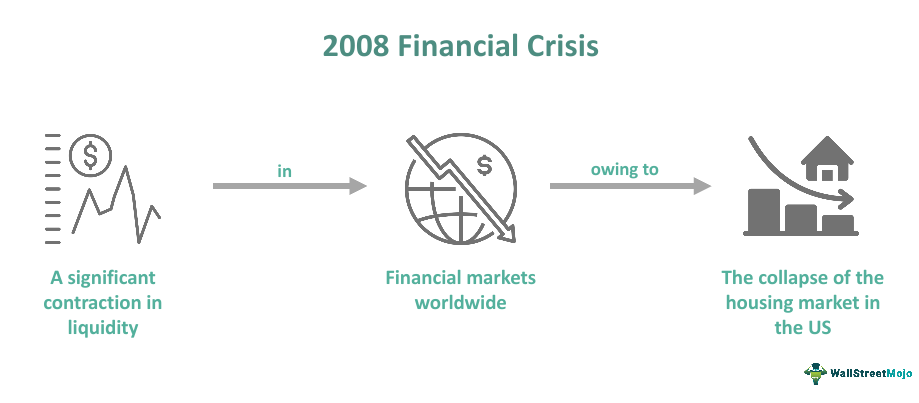

In 2008, the global economy was shaken by a financial crisis of unprecedented scale, the most severe since the Great Depression of the 1930s. The crisis had a profound impact on all financial markets, sparking widespread economic turmoil. The collapse began with the bursting of the U.S. housing bubble, a crisis that quickly expanded into a global financial disaster. The ripple effects were catastrophic, leading to the failure of key financial institutions, a massive plummet in consumer wealth, and a subsequent downturn in economic activity worldwide.

This article examines the vital lessons gleaned from the financial upheaval, focusing primarily on economic strategies that were implemented in the aftermath, policy reforms such as the Dodd-Frank Act, and technological advancements like algorithmic trading that have transformed financial markets. Recognizing the pivotal lessons from this crisis is essential for fortifying economies against future financial disturbances and promoting a stable global economic environment.

The 2008 financial crisis served as an eye-opener for policymakers, economists, and financial institutions, exposing vulnerabilities in the financial system that demanded urgent attention. By analyzing the causes and responses to the crisis, valuable insights can be gained. This knowledge aids in the formulation and implementation of more effective financial regulations and policies, fostering conditions that can mitigate the risks of future downturns. Furthermore, innovations in financial technology, such as algorithmic trading, present both opportunities and challenges, requiring careful oversight to harness their potential benefits while minimizing associated risks.

In summary, understanding the intricacies and lessons of the 2008 financial crisis is not merely an academic exercise but a necessary endeavor to safeguard against the repetition of such a global economic catastrophe.

## Table of Contents

## The 2008 Financial Crisis: An Overview

The 2008 financial crisis, one of the most severe economic downturns in modern history, was primarily triggered by the collapse of the housing bubble in the United States. This bubble was fueled by a blend of low interest rates, relaxed mortgage lending standards, and an unprecedented increase in housing prices. As housing prices peaked and began to decline, it set off a cascade of financial distress that spread across the globe.

Central to this crisis was the collapse of key financial institutions, most notably Lehman Brothers, which filed for bankruptcy in September 2008. Lehman's failure was a critical event that underscored the fragility of financial systems worldwide. It led to a severe credit crunch as banks became unwilling to lend to one another, given the uncertainty about the value of mortgage-backed securities (MBS) and other high-risk financial products held by these institutions.

The crisis was further magnified by the proliferation of complex and high-risk financial instruments, such as collateralized debt obligations (CDOs) and credit default swaps (CDS). These products were designed to distribute risk but instead concentrated it, largely due to insufficient risk management practices and a lack of transparency in their true value. The reliance on these opaque products, combined with excessive leverage among financial institutions, created a highly unstable financial environment.

Regulatory frameworks at the time were inadequate to cope with the mounting risks. Oversight bodies failed to impose necessary restrictions on high-risk lending and did not anticipate the interconnectedness of global financial markets, leaving them vulnerable to systemic shocks. As financial institutions faced [liquidity](/wiki/liquidity-risk-premium) shortages, governments around the world were compelled to intervene with emergency measures. These included large-scale bailouts and guarantees to stabilize banks and restore confidence in the financial system.

The 2008 crisis served as a stark reminder of the need for robust regulatory oversight and effective risk management frameworks to prevent the amplification of localized financial problems into global economic downturns.

## Too Big to Fail: A False Sense of Security

The 2008 financial crisis brought to light the precarious assumption that certain financial institutions were "too big to fail." This notion led to extensive government bailouts, revealing significant weaknesses within the global financial system. Massive bailouts emerged as a desperate measure to prevent systemic collapse, but they also underscored the vulnerability inherent in having financial institutions so large and interconnected that their failure posed a grave threat to the economy.

The concept of "too big to fail" essentially created a paradox where the very size and interconnection of these institutions made them both a linchpin of economic stability and a potential catalyst for economic disaster. When Lehman Brothers collapsed, and other major entities teetered on the brink, the federal response involved providing emergency funds to stabilize these institutions. For example, the U.S. government injected capital into banks through the Troubled Asset Relief Program (TARP), which allocated $700 billion to purchase distressed assets and inject capital directly into banks. 

However, the reliance on bailouts highlighted the pressing need for rigorous regulatory frameworks to prevent future crises. The aftermath of the 2008 crisis led to the enactment of the Dodd-Frank Wall Street Reform and Consumer Protection Act in 2010. This comprehensive legislation aimed to reduce the threat of "too big to fail" through measures like the Volcker Rule, which restricted banks from engaging in proprietary trading and limited their investments in hedge funds and private equity.

Despite these reforms, debates regarding systemic risk and the necessity of justified bailouts continue. Critics argue that while regulations have become more stringent and oversight has improved, the problem of "too big to fail" may persist due to the sheer complexity and global entanglement of modern financial institutions. Proponents of the Dodd-Frank Act assert that increased capital requirements, stress testing, and enhanced regulatory oversight have strengthened the resilience of financial markets.

Nevertheless, balancing regulatory rigor with financial innovation is a continuing challenge. The question remains whether the systemic improvements are sufficient to avert another crisis or whether more radical measures are required. The concept of "too big to fail" continues to be scrutinized, with ongoing discussions about how to safeguard the financial system without stifling economic growth or innovation.

## Reducing Risk on Wall Street

The 2008 financial crisis underscored the perils associated with risky proprietary trading practices on Wall Street. Banks and financial institutions were heavily engaged in such activities, taking significant bets with their own capital to generate profits. However, these speculative endeavors contributed to massive losses and financial instability when the markets soured.

In response to these issues, the Dodd-Frank Wall Street Reform and Consumer Protection Act was enacted in 2010, with one of its pivotal components being the Volcker Rule. Named after former Federal Reserve Chairman Paul Volcker, the rule aims to curtail high-risk trading activities by prohibiting banks from conducting proprietary trading, unless for specific exceptions. The idea was to separate banks' core functions—accepting deposits and making loans—from speculative trading to safeguard consumers and the broader financial system.

The Volcker Rule applies to entities insured by the Federal Deposit Insurance Corporation (FDIC) and restricts their ability to invest in or sponsor hedge funds and private equity funds. The rule provided a clear dichotomy: banks can either engage in traditional banking activities or risky investment trading, but not both.

Initially, the implementation of the Volcker Rule faced resistance from banks, which argued that the regulations would curtail their profitability and hinder their competitive edge globally. The rule necessitated revisions in trading strategies and compliance mechanisms, which some financial institutions viewed as burdensome. Nonetheless, the regulations have since proven to be critical in contributing to the stabilization of financial entities. They have decreased the probability of insolvency triggered by speculative trading practices, thus adding an additional layer of security for consumers and the financial markets.

The effectiveness of the Volcker Rule also relies on the rigorous oversight and enforcement by regulatory bodies such as the Federal Reserve, the Office of the Comptroller of the Currency (OCC), and the Securities and Exchange Commission (SEC). These agencies ensure that institutions adhere to the stipulations of the rule and continuously monitor their activities to detect any violations or risky behavior.

In conclusion, the introduction of the Volcker Rule marks a significant shift towards reducing systemic risks on Wall Street. By limiting high-risk investment activities within the banking sector, the rule plays a vital role in promoting a more resilient and stable financial system. As financial markets evolve, maintaining balanced regulatory frameworks is essential to protect consumers and prevent a recurrence of the crises experienced in the past.

## The Overheated Housing Market

The pre-crisis period leading up to 2008 was marked by an overheated housing market characterized by excessively loose lending standards and the proliferation of mortgage-backed securities (MBS). The expansion of the housing bubble was driven by aggressive lending practices, including subprime mortgages given to borrowers with poor credit histories who were unlikely to repay their loans. These practices were further exacerbated by financial institutions' reliance on complex financial products such as mortgage-backed securities, which packaged these high-risk mortgages and sold them to investors worldwide.

As housing prices continued to climb, both lenders and borrowers operated under the assumption that property values would only appreciate, encouraging riskier behavior without adequate risk assessment. This unsustainable growth eventually led to a collapse, revealing profound weaknesses in the underlying systems of mortgage lending and housing finance. The widespread default on mortgages resulted in significant losses for financial institutions globally and precipitated a cascade of economic repercussions.

The aftermath of the crisis highlighted the urgent need for regulatory reforms to address these systemic vulnerabilities. Regulatory bodies introduced more stringent criteria and regulations post-crisis, aiming to reinforce the resilience of the housing and financial markets. For instance, the Dodd-Frank Wall Street Reform and Consumer Protection Act implemented stricter oversight of lending practices and increased transparency requirements for financial instruments like MBS.

Additional measures included higher capital requirements for banks, improved risk management protocols, and better underwriting standards for mortgages. These reforms were designed to ensure that lending institutions adequately assessed borrowers' ability to repay loans, thus preventing another unchecked housing bubble. Enhanced consumer protections and more robust appraisal and verification processes also played pivotal roles in ensuring financial stability in the housing market moving forward.

Overall, the lessons learned from the overheated housing market of the pre-2008 era underscored the necessity for prudent lending practices and comprehensive regulatory oversight to safeguard against future crises. The reforms introduced post-crisis aimed to correct past excesses and protect consumers and the broader economy from similar destabilizing shocks.

## Algorithmic Trading: The Double-edged Sword

Algorithmic trading, which involves the use of computer algorithms to automate trading decisions in financial markets, experienced notable growth around the time of the 2008 financial crisis. These automated systems can process vast amounts of data at high speeds, executing trades with precision and efficiency, thereby offering increased market liquidity. This was particularly beneficial in complex and fast-paced trading environments, where human decision-making alone could not keep pace.

However, the very speed and efficiency that make [algorithmic trading](/wiki/algorithmic-trading) attractive also introduce risks of heightened market [volatility](/wiki/volatility-trading-strategies). A key concern is the phenomenon known as "flash crashes," sudden market downturns driven by automated trading anomalies. One of the most well-known instances of a flash crash occurred on May 6, 2010, when the Dow Jones Industrial Average dropped nearly 1,000 points within minutes, largely due to high-frequency trading algorithms operating without adequate safeguards.

This reliance on automated systems raises questions about the robustness and safety of financial markets. The rapid execution of trades by algorithms can lead to cascading effects, where minor anomalies can trigger widespread sell-offs, amplifying volatility. This has led regulators to scrutinize algorithmic trading more closely, emphasizing the need for enhanced oversight and control mechanisms.

Efforts to address these concerns have included the introduction of circuit breakers and other regulatory measures designed to prevent market disruptions caused by algorithmic trading. These measures aim to limit the potential for extreme price swings and ensure orderly market function. Regulators have also focused on improving the resilience of algorithmic trading systems by encouraging best practices in algorithm design and the implementation of comprehensive risk management frameworks.

Furthermore, transparency in trading algorithms has become a focal point for regulatory bodies. Ensuring that these systems are well-understood by market participants and regulators alike is crucial for maintaining trust and stability in financial markets. The balance between innovation and regulation is delicate, but necessary to harness the benefits of algorithmic trading while minimizing its risks.

## Investing in the Future: Economic Recovery and Growth

Following the 2008 financial crisis, economic recovery and growth were largely driven by innovative financial technologies and strategic monetary policies. These efforts were aimed at rebuilding market confidence and ensuring sustainable economic development.

One of the key innovations was the rise of robo-advisors and automated investment platforms. These technologies democratized access to financial advice by offering cost-effective, algorithm-driven investment management. By utilizing data analysis and [machine learning](/wiki/machine-learning), robo-advisors provided personalized investment strategies without the need for human intervention. This not only increased efficiency but also reduced management costs, making investment opportunities more accessible to a broader segment of the population. 

Exchange-Traded Funds (ETFs) also gained popularity during the recovery phase. ETFs offered a flexible and diversified investment option, allowing investors to gain exposure to various sectors and asset classes with relatively low fees. The liquidity, transparency, and tax efficiency of ETFs contributed to restoring investor confidence in the financial markets. Their appeal grew substantially, as they allowed for portfolio diversification and risk management in a cost-effective manner. 

Central banks played a fundamental role in stabilizing economies post-crisis through monetary policies such as quantitative easing (QE). This involved large-scale purchases of government and other securities to inject liquidity into the economy. The primary objective was to lower interest rates and encourage lending and investment. By increasing the money supply, QE sought to spur economic activity and avert deflationary pressures. The success of QE depended heavily on the timing and scale of its implementation, which varied across different economies.

The combined effect of these financial innovations and policies helped to rejuvenate the global economy, facilitating a period of sustained growth and development. However, the lessons learned highlighted the importance of ongoing regulatory oversight to ensure that financial technologies continue to enhance market stability without introducing new risks.

## Conclusion

The 2008 financial crisis served as a stark reminder of the vulnerabilities inherent in global financial systems. It exposed systemic weaknesses that prompted significant shifts in policy and innovations within financial management. Key among these were the inadequacies in regulatory frameworks, risk management practices, and the overall transparency of financial activities which had to be addressed to prevent similar occurrences in the future.

The lessons learned from the crisis continue to influence both economic policies and financial regulations worldwide. Governments and regulatory bodies have become increasingly vigilant, compelling financial institutions to adopt more robust risk management practices. This vigilance led to the implementation of comprehensive regulatory reforms like the Dodd-Frank Wall Street Reform and Consumer Protection Act in the United States, which sought to decrease risks in the financial system through increased transparency and accountability.

Moreover, the evolution of algorithmic trading and other financial technologies demonstrates significant promise, provided these innovations are integrated within a well-established regulatory framework. Algorithmic trading, while beneficial in enhancing market liquidity, has also been associated with increased market volatility. Thus, regulators have been focusing on setting guidelines to ensure these technologies contribute positively to financial stability. For instance, introducing fail-safes and circuit breakers can help mitigate the effects of sudden market movements caused by algorithmic errors.

The financial industry has also witnessed a rise in financial technologies aimed at improving stability and resilience in markets. Innovations such as robo-advisors and automated investment platforms have democratized financial services, making investing more accessible to the general public. At the same time, the expansion of Exchange-Traded Funds (ETFs) has offered more diverse options for investors to restore market confidence.

Central banks have played a crucial role in economic recovery through monetary policies like quantitative easing (QE), which helped stabilize the economy by injecting liquidity and supporting economic growth. This approach, while effective in the short term, requires careful consideration to manage long-term inflationary pressures.

In conclusion, while the 2008 crisis highlighted critical flaws in the financial system, it also catalyzed essential reforms. By learning from past mistakes and embracing advancements in financial technology within a regulatory framework, the global financial ecosystem can aim for a future that is both dynamic and secure. The objective is not only to guard against future crises but also to foster sustainable economic growth that benefits society at large.

## References & Further Reading

[1]: Bernanke, B. S. (2015). ["The Courage to Act: A Memoir of a Crisis and its Aftermath"](https://archive.org/details/couragetoactmemo0000bern). W. W. Norton & Company.

[2]: Gorton, G. B. (2012). ["Misunderstanding Financial Crises: Why We Don't See Them Coming"](https://archive.org/details/misunderstanding0000gort). Oxford University Press.

[3]: Lewis, M. (2010). ["The Big Short: Inside the Doomsday Machine"](https://www.amazon.com/Big-Short-Inside-Doomsday-Machine/dp/0141043539). W. W. Norton & Company.

[4]: McLean, B., & Nocera, J. (2010). ["All the Devils Are Here: The Hidden History of the Financial Crisis"](https://onlinelibrary.wiley.com/doi/full/10.1111/j.1468-0270.2011.02140_4.x). Portfolio.

[5]: United States Congress. (2010). "Dodd-Frank Wall Street Reform and Consumer Protection Act." [Public Law 111-203](https://www.congress.gov/bill/111th-congress/house-bill/4173).

[6]: Patterson, S. (2012). ["Dark Pools: High-Speed Traders, A.I. Bandits, and the Threat to the Global Financial System"](https://dl.acm.org/doi/10.5555/2385786). Crown Business.

[7]: Stiglitz, J. E. (2010). ["Freefall: America, Free Markets, and the Sinking of the World Economy"](https://cgt.columbia.edu/research/books/archive/freefall-america-free-markets-and-the-sinking-of-the-world-economy/). W. W. Norton & Company.

[8]: Financial Crisis Inquiry Commission. (2011). ["The Financial Crisis Inquiry Report"](https://www.govinfo.gov/app/details/GPO-FCIC/).

[9]: Haldane, A. G., & May, R. M. (2011). ["Systemic risk in banking ecosystems"](https://www.nature.com/articles/nature09659). Nature, 469(7330), 351-355.

[10]: Johnson, S., & Kwak, J. (2010). ["13 Bankers: The Wall Street Takeover and the Next Financial Meltdown"](https://www.emerald.com/insight/content/doi/10.1108/17422041111149543/full/html). Vintage.