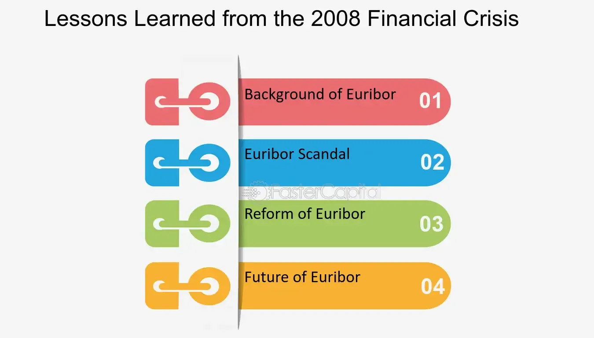

## Table of Contents

## What was the 2008 Global Financial Crisis?

The 2008 Global Financial Crisis was a big economic problem that started in the United States but affected the whole world. It began because many people took out loans they couldn't pay back, especially for buying houses. Banks had given out these loans, called subprime mortgages, thinking the housing market would keep going up. But when house prices started to fall, people couldn't sell their homes for enough money to pay off their loans. This caused many people to default on their loans, which meant they couldn't pay them back.

As more and more people defaulted, banks started losing a lot of money. Some banks even failed because they had too many bad loans. This caused a big panic, and people started taking their money out of banks. The problem spread to other countries because banks all over the world had invested in these risky loans. Governments had to step in to help save the banks and prevent the economy from getting even worse. The crisis led to a lot of job losses and made it harder for people to get loans, which affected the global economy for years.

## What were the main causes of the 2008 Financial Crisis?

The 2008 Financial Crisis was caused by a few main things. One big reason was the housing bubble in the United States. Banks were giving out lots of loans, called subprime mortgages, to people who couldn't really afford them. They did this because they thought house prices would keep going up. But when house prices started to fall, people couldn't sell their homes for enough money to pay back their loans. This led to many people defaulting on their loans, which means they couldn't pay them back.

Another cause was the way banks were handling these risky loans. Banks were packaging these loans into things called mortgage-backed securities and selling them to investors all over the world. When the loans started to fail, these securities lost a lot of value, causing big losses for banks and investors. This made people lose trust in the banks, and they started taking their money out, which made the situation even worse. Governments had to step in to help, but the damage was already done, and it affected the global economy for years.

## How did the housing market contribute to the 2008 crisis?

The housing market played a big role in causing the 2008 financial crisis. In the years leading up to the crisis, there was a huge increase in home buying in the United States. Banks were giving out a lot of loans, called mortgages, to people who couldn't really afford them. These were called subprime mortgages. Banks thought it was safe because they believed house prices would keep going up. But when the housing market started to cool down, house prices stopped going up and actually began to fall.

As house prices fell, many people found themselves owing more on their mortgages than their homes were worth. This made it hard for them to sell their homes to pay off their loans. As a result, many people started defaulting on their loans, which means they couldn't pay them back. This caused big problems for banks because they had given out so many of these risky loans. The trouble in the housing market spread to other parts of the economy and eventually led to the global financial crisis.

## What role did financial instruments like derivatives play in the crisis?

Financial instruments like derivatives played a big part in making the 2008 financial crisis worse. Derivatives are like bets on other financial things, like loans or stocks. Banks were using derivatives to bet on the housing market. They took the risky loans they had given out and turned them into something called mortgage-backed securities. These securities were then sold to investors all over the world. The problem was, when people started defaulting on their loans, these securities lost a lot of value. This caused big losses for the banks and investors who had bought them.

Because of these losses, banks started to have trouble. They didn't have enough money to cover all the bets they had made with derivatives. This made people lose trust in the banks, and they started taking their money out. This panic made the situation even worse. The trouble with derivatives didn't just stay in the United States; it spread to other countries because banks everywhere had invested in these risky securities. This is how derivatives helped turn a housing problem into a global financial crisis.

## How did the failure of Lehman Brothers impact the global economy?

The failure of Lehman Brothers was a big event in the 2008 financial crisis. Lehman Brothers was a huge bank, and when it went bankrupt, it shocked the whole world. People and other banks had trusted Lehman Brothers with their money, so when it failed, everyone got scared. They started taking their money out of other banks too, which made the financial system even more unstable. This panic spread quickly because Lehman Brothers had a lot of connections with banks and businesses all over the world.

The impact of Lehman Brothers' failure was felt everywhere. It made the global economy go into a big downturn. Many businesses had to close, and a lot of people lost their jobs. Governments had to step in to help save other banks and try to stop the economy from getting even worse. But the damage was already done, and it took years for the world to recover. The failure of Lehman Brothers showed how connected and fragile the global financial system was, and it made people realize that they needed to be more careful with their money and investments.

## What were the immediate effects of the 2008 crisis on the world economy?

The 2008 financial crisis had big and quick effects on the world economy. Right away, many banks and financial companies started to fail because they had lost a lot of money. This made people scared, and they started taking their money out of banks, which made the situation even worse. Many businesses had trouble getting loans because banks were afraid to lend money. This led to a lot of businesses closing down and people losing their jobs. The stock market also crashed, which meant that people who had invested their money lost a lot of it.

Governments around the world had to step in to try to fix things. They gave money to banks to help them stay open and started programs to help people keep their jobs. But even with this help, the economy still got a lot worse. Trade between countries went down because businesses weren't buying and selling as much. This made the global economy shrink, which is called a recession. It took a long time for things to start getting better, and many people felt the effects of the crisis for years.

## How did governments and central banks respond to the 2008 crisis?

Governments and central banks around the world took quick action to try to fix the problems caused by the 2008 financial crisis. They knew they had to do something to stop the banks from failing and to help the economy recover. Governments started programs to help banks by giving them money, which is called a bailout. This was important because if the banks failed, it would make the crisis even worse. They also passed new laws to make sure banks would be safer in the future. Central banks, like the Federal Reserve in the United States, lowered interest rates to make it easier for people and businesses to borrow money. They also bought bonds and other financial things to put more money into the economy.

These actions helped stop the crisis from getting even worse, but it still took a long time for the economy to get better. Governments spent a lot of money on programs to help people keep their jobs and to support businesses. They also worked together with other countries to make sure the global economy didn't fall apart. Central banks kept interest rates low for a long time to help the economy grow again. Even though these steps helped, the effects of the crisis were felt for years, and many people and businesses struggled to recover.

## What were the long-term economic impacts of the 2008 crisis?

The 2008 financial crisis had big long-term effects on the world's economy. Many people lost their jobs and homes, and it took a long time for them to get back on their feet. Countries had to spend a lot of money to help their economies, which led to big debts. This made it hard for governments to spend money on other important things like schools and hospitals. The crisis also made people more careful about borrowing money, which slowed down the economy. Banks had to follow stricter rules, which made them less likely to take risks. This meant that it was harder for people and businesses to get loans, which slowed down growth.

The crisis also changed how people thought about the economy. It made everyone realize that the financial system was more connected and fragile than they thought. This led to new laws and rules to make banks safer and to prevent another big crisis. But these changes also made it harder for the economy to grow quickly. Some countries took longer to recover than others, and the effects were felt for many years. The crisis showed that what happens in one part of the world can affect everyone, and it made people more aware of the need to work together to keep the global economy strong.

## What regulatory changes were implemented post-2008 to prevent future crises?

After the 2008 financial crisis, governments around the world made new rules to try to stop something like it from happening again. One big change was the Dodd-Frank Act in the United States. This law made banks have more money set aside, called capital, to cover any losses. It also created a new group called the Consumer Financial Protection Bureau to make sure banks were treating people fairly. Other countries made similar rules to make their banks safer too. They also started watching banks more closely to make sure they weren't taking too many risks.

Another important change was how banks were allowed to use money. Before the crisis, banks could do a lot of risky things with their money, like betting on the housing market. After the crisis, new rules said banks had to be more careful and couldn't take as many risks. This was to make sure they wouldn't lose a lot of money again. Governments also worked together more to share information and help each other keep their economies safe. These changes made the financial system stronger, but it also made it harder for banks to make big profits, which some people didn't like.

## How did the 2008 crisis influence economic theories and financial models?

The 2008 financial crisis made people rethink a lot of economic theories and financial models. Before the crisis, many economists thought that markets were usually stable and that big problems were rare. But when the crisis happened, it showed that this wasn't true. People realized that markets could be very risky and that bad things could happen quickly. This led to new ideas about how to watch the economy more closely and how to make rules to keep it safer. Economists started looking more at how banks and other big companies could affect the whole economy and how to stop them from taking too many risks.

The crisis also changed how people thought about financial models. Before 2008, many models didn't take into account how risky some investments could be. They thought that if a lot of people were buying and selling something, it must be safe. But the crisis showed that even things that seemed safe could be very risky. This made people start using new models that paid more attention to risk. They also started to think more about how things in one part of the economy could affect other parts. This helped them make better plans to protect against future problems.

## What lessons can financial institutions learn from the 2008 crisis?

The 2008 financial crisis taught financial institutions a lot about being careful with their money. They learned that giving out loans to people who can't pay them back is a big risk. Banks need to check if people can really afford the loans they want. They also learned that betting on things like the housing market can be very dangerous. Banks should have enough money saved up to cover losses if things go wrong. It's important for banks to not take too many risks and to always be ready for bad times.

Another big lesson is about trust. When Lehman Brothers failed, it made everyone scared and they started taking their money out of banks. This showed banks that they need to be honest and clear about what they're doing with people's money. They also need to follow the rules and make sure they're not doing anything too risky. The crisis showed that what happens in one bank can affect the whole world, so banks need to work together and share information to keep the financial system safe.

## How can individuals apply the lessons from the 2008 crisis to their personal finance strategies?

The 2008 financial crisis taught everyone that it's important to be careful with money. People learned that taking out big loans, like for a house, can be risky if they can't afford to pay them back. It's a good idea to save up some money for emergencies and not to borrow more than you can handle. If you're thinking about buying a house, make sure you can still pay the mortgage even if things get tough. It's also smart to have a plan for your money and stick to it, so you don't end up in a bad spot if the economy goes down.

Another lesson from the crisis is to not put all your money in one place. If you have savings or investments, it's better to spread them out so that if one thing goes bad, you're not losing everything. For example, don't put all your money in the stock market or just one bank. Also, it's good to learn about money and how the economy works. This way, you can make better choices and be ready for anything that might happen. The crisis showed that being prepared and careful can help keep your finances safe.

## References & Further Reading

[1]: Bernanke, B. S. (2015). ["The Courage to Act: A Memoir of a Crisis and its Aftermath"](https://archive.org/details/couragetoactmemo0000bern). W. W. Norton & Company.

[2]: Gorton, G. B. (2012). ["Misunderstanding Financial Crises: Why We Don't See Them Coming"](https://archive.org/details/misunderstanding0000gort). Oxford University Press.

[3]: Lewis, M. (2010). ["The Big Short: Inside the Doomsday Machine"](https://www.amazon.com/Big-Short-Inside-Doomsday-Machine/dp/0141043539). W. W. Norton & Company.

[4]: McLean, B., & Nocera, J. (2010). ["All the Devils Are Here: The Hidden History of the Financial Crisis"](https://onlinelibrary.wiley.com/doi/full/10.1111/j.1468-0270.2011.02140_4.x). Portfolio.

[5]: United States Congress. (2010). "Dodd-Frank Wall Street Reform and Consumer Protection Act." [Public Law 111-203](https://www.congress.gov/bill/111th-congress/house-bill/4173).

[6]: Patterson, S. (2012). ["Dark Pools: High-Speed Traders, A.I. Bandits, and the Threat to the Global Financial System"](https://dl.acm.org/doi/10.5555/2385786). Crown Business.

[7]: Stiglitz, J. E. (2010). ["Freefall: America, Free Markets, and the Sinking of the World Economy"](https://cgt.columbia.edu/research/books/archive/freefall-america-free-markets-and-the-sinking-of-the-world-economy/). W. W. Norton & Company.

[8]: Financial Crisis Inquiry Commission. (2011). ["The Financial Crisis Inquiry Report"](https://www.govinfo.gov/app/details/GPO-FCIC/).

[9]: Haldane, A. G., & May, R. M. (2011). ["Systemic risk in banking ecosystems"](https://www.nature.com/articles/nature09659). Nature, 469(7330), 351-355.

[10]: Johnson, S., & Kwak, J. (2010). ["13 Bankers: The Wall Street Takeover and the Next Financial Meltdown"](https://www.emerald.com/insight/content/doi/10.1108/17422041111149543/full/html). Vintage.