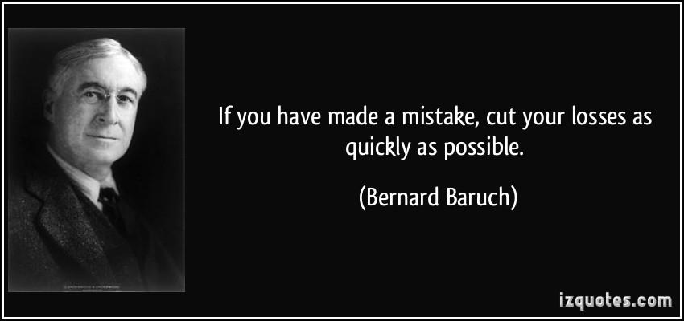

The world of finance encompasses a diverse array of disciplines and methodologies, making it a complex field to navigate successfully. A fundamental understanding of past strategies, current trends, and future possibilities is essential for making informed decisions. Investment techniques, profit strategies, and financial history form the cornerstone of this knowledge, providing the tools necessary for investors to minimize risks and maximize returns.

Investment techniques have continuously evolved to adapt to changing market conditions, with historical approaches laying the groundwork for modern strategies. From traditional stock and bond investments to advanced financial instruments like derivatives, the evolution of investment techniques highlights the dynamic nature of financial markets. Understanding these techniques allows investors to construct well-diversified portfolios, manage risks effectively, and make informed decisions based on past performances and trends.



Algorithmic trading, a contemporary advancement in financial markets, employs computer programs to automate trading decisions. By minimizing human error and enhancing trading efficiency, algorithmic trading has transformed how market participants execute trades. Utilizing sophisticated algorithms, this method capitalizes on market opportunities with precision and speed unattainable by human traders alone.

This article examines a range of investment techniques, historical profit strategies, and the emergence of algorithmic trading as an instrumental tool in today's financial markets. By delving into these topics, we aim to provide clarity and actionable insights for investors seeking to optimize their portfolios. Understanding both historical and modern financial strategies enables investors to better position themselves for success in a constantly evolving market landscape.

## Table of Contents

## Investment Techniques Across Financial History

Investment techniques have undergone significant evolution over the centuries, reflecting changes in economic conditions, technological advancements, and investor psychology. Traditional investment avenues, such as stocks and bonds, laid the foundation for modern investment practices, which now include complex derivatives and alternative assets.

The dynamic nature of investments started with basic commodity trading in ancient marketplaces, gradually evolving into the organized stock exchanges we recognize today. With the advent of modern finance, various investment philosophies emerged, each with unique strategies and objectives.

Value investing, popularized by Benjamin Graham and later Warren Buffett, is a strategy focused on purchasing undervalued securities that are perceived to trade for less than their intrinsic value. This approach relies on a thorough analysis of financial statements and market conditions, aiming for long-term capital appreciation. Value investors often emphasize [fundamental analysis](/wiki/fundamental-analysis) to discern securities that the market has undervalued, thus looking for opportunities where stocks are priced below their book value or have a low price-to-earnings ratio.

In contrast, growth investing seeks companies expected to experience significant earnings increase, even at the expense of higher valuation multiples. This approach is often associated with technology and innovation sectors, where rapid expansion and potential market disruption are prevalent. Growth investors prioritize future potential over current undervaluation, often accepting higher risks for the promise of greater returns.

Income investing concentrates on generating a steady cash flow from dividends or interest payments. This strategy appeals particularly to individuals seeking reliable income streams, such as retirees. Typical income investments include dividend-paying stocks, bonds, and real estate investment trusts (REITs). A critical component of this strategy is the evaluation of the stability and sustainability of income sources.

Diversification has consistently been recognized as a cornerstone of risk management within investment portfolios. By allocating assets across various classes, sectors, and geographies, investors can mitigate the impact of [volatility](/wiki/volatility-trading-strategies) in specific markets. The principle of diversification aligns with Harry Markowitz's Modern Portfolio Theory, which emphasizes optimizing the risk-reward balance through judicious asset allocation.

Past financial crises underscore the influence of market psychology and economic fundamentals on investment outcomes. For instance, the Great Depression revealed the dangers of speculative bubbles and excessive leverage, influencing regulations and the development of more robust risk management practices. Similarly, the 2008 financial crisis demonstrated the systemic risk arising from complex financial products and inadequate oversight, prompting significant changes in regulatory frameworks and investor behavior.

These historical experiences provide valuable insights and underscore the necessity of adaptability in investment strategies as markets evolve. The interplay between traditional techniques and contemporary innovations continues to shape the landscape of financial investments, offering investors a diverse array of options to build resilient and profitable portfolios.

## Profit Strategies: Lessons from Financial History

Studying financial history reveals several profit-maximizing strategies employed by successful investors, each providing insights into market dynamics and investor behavior. The foundational strategy of 'buy low, sell high' is intuitive, yet its consistent application requires an understanding of market cycles and valuation metrics. Historical case studies show that this approach remains effective across various asset classes, emphasizing the importance of patience and timing in unlocking value.

Value-based investing, popularized by Benjamin Graham and Warren Buffett, focuses on identifying undervalued assets with strong fundamentals. This strategy rests on the principle that markets will eventually recognize and correct mispricings, rewarding investors who have conducted thorough due diligence. Techniques such as discounted cash flow analysis and valuation ratios (e.g., P/E and P/B ratios) are commonly employed by value investors to gauge intrinsic value.

Market trend analysis, a staple of technical analysis, involves studying price movements and chart patterns to forecast future price action. This strategy relies on historical data, asserting that past trends often repeat due to the collective behavior of market participants. Tools such as moving averages, relative strength index (RSI), and Bollinger Bands are frequently used to evaluate market [momentum](/wiki/momentum) and potential reversals.

One fundamental lesson from historical market behavior is the principle of 'letting profits run' while cutting losses early. This approach underscores the need to control emotions and adhere to pre-defined [exit](/wiki/exit-strategy) strategies, thereby limiting the impact of adverse price movements. Implementing stop-loss orders and trailing stops can effectively mitigate losses and secure profits.

Behavioral finance has further enriched our understanding of the psychological factors influencing investment decisions. Cognitive biases, such as overconfidence, confirmation bias, and loss aversion, often lead to suboptimal choices, affecting profit and loss outcomes. By recognizing these biases, investors can adopt more rational decision-making processes, improving the odds of successful investment outcomes.

Historical analysis of market returns and failures provides valuable insights into the development of robust profit strategies. For instance, the Great Depression and the 2008 financial crisis highlight the perils of excessive leverage and inadequate risk management. Conversely, periods of economic expansion and technological innovation showcase the potential for substantial gains through strategic investment and innovation.

In summary, financial history offers a wealth of knowledge on profit-maximizing strategies, blending quantitative analysis with an understanding of human psychology. By examining past successes and failures, investors can refine their approaches, ensuring they remain equipped to navigate today's complex financial landscape.

## Algorithmic Trading: Revolutionizing Financial Markets

Algorithmic trading represents a transformative development in financial markets by employing sophisticated computer algorithms to automate trading decisions. This technological approach enables market participants to execute orders at speeds and frequencies that surpass human capabilities, effectively capitalizing on market inefficiencies.

Among the most prevalent [algorithmic trading](/wiki/algorithmic-trading) strategies are [trend following](/wiki/trend-following), mean reversion, and [arbitrage](/wiki/arbitrage). 

- **Trend following** involves identifying and investing in securities that demonstrate sustained directional movement based on historical price patterns. Algorithms in this domain leverage indicators like moving averages to make trading decisions.

- **Mean reversion** is predicated on the statistical concept that asset prices tend to return to their historical mean over time. This strategy involves identifying and exploiting short-term price deviations from the average. A simple algorithm for mean reversion might consider an asset overpriced when its moving average exceeds a certain threshold and prompt a sell order.

- **Arbitrage** involves identifying and exploiting price discrepancies across different markets or instruments that are otherwise equivalent. Algorithms monitor multiple exchanges simultaneously to identify arbitrage opportunities, executing trades in real-time to lock in risk-free profits.

Python, with its extensive libraries for numerical computation and data analysis, is a preferred tool for implementing these strategies. 

For example, an algorithmic trading script using Python might use libraries such as `pandas` for data handling, `numpy` for numerical operations, and `scipy` alongside others to identify trading opportunities.

```python
import numpy as np
import pandas as pd

# Simple mean reversion strategy
def mean_reversion_strategy(prices, window=20, threshold=0.02):
    rolling_mean = prices.rolling(window=window).mean()
    std_dev = prices.rolling(window=window).std()
    z_score = (prices - rolling_mean) / std_dev

    buy_signals = np.where(z_score < -threshold, 1, 0)
    sell_signals = np.where(z_score > threshold, -1, 0)
    signals = buy_signals + sell_signals
    return signals

# Sample price data
prices = pd.Series([100, 102, 101, 98, 105, 107, 110, 108, 107, 109])

# Generating trading signals
signals = mean_reversion_strategy(prices)
print(signals)
```

Algorithmic trading reduces emotional bias, a significant advantage over manual trading, by adhering strictly to predefined criteria. This consistency enhances the reliability and predictability of trading outcomes. Additionally, the ability to backtest strategies on historical data allows traders and institutions to evaluate the effectiveness of their algorithms before deploying them in live markets. 

Advancements in technology, particularly in [machine learning](/wiki/machine-learning) and [artificial intelligence](/wiki/ai-artificial-intelligence), are increasingly integrated into algorithmic trading systems, enhancing their predictive accuracy and adaptability. Machine learning models can identify complex patterns in large datasets, enabling more nuanced trading strategies and real-time adaptability. 

The proliferation of high-frequency trading, a subset of algorithmic trading characterized by extremely short holding periods, further exemplifies the impact of technology in financial markets. These developments portend a future where algorithmic trading continues to revolutionize market dynamics, offering unparalleled opportunities for efficiency and profit maximization.

## Risks and Challenges in Algorithmic Trading

Algorithmic trading, despite its numerous advantages, presents several risks and challenges that need to be carefully managed to ensure successful implementation and sustainable profitability.

### Technology Failures and Over-Optimization
Algorithmic trading relies heavily on technology, making it vulnerable to hardware malfunctions, software bugs, and connectivity issues. A single technical glitch can lead to significant financial losses due to missed trading opportunities or erroneous transactions. Over-optimization, sometimes referred to as "curve fitting," is another substantial risk. Traders may develop models that perform exceptionally well on historical data but fail in live markets because the model is too finely tuned to past data and does not generalize to unseen market conditions.

### Lack of Oversight
The speed and complexity of algorithmic trading can lead to a lack of human oversight, which makes it challenging to detect and correct errors in real-time. Without real-time monitoring, these systems might execute unintended trades based on flawed algorithms, potentially leading to large-scale market disruptions. For instance, the "Flash Crash" of 2010 was partially attributed to algorithmic trading systems reacting to unusual market conditions faster than humans could respond.

### Regulatory Challenges
Algorithmic trading must conform to various regulatory frameworks to ensure market integrity and protect investors. Different countries and exchanges have specific rules governing high-frequency trading, and non-compliance can result in hefty fines and reputational damage. This requires firms to maintain dedicated compliance teams and systems that can adapt to evolving legal requirements, ensuring that trading activities adhere to ethical and legal standards.

### Rigorous Testing and Risk Management
Effective algorithmic trading necessitates rigorous testing of models and strategies. Backtesting using historical data is an essential step to validate the trading strategies under consideration. However, this must be complemented by forward testing in a simulated live environment to observe the algorithm's behavior under various market conditions. 

Having a robust risk management system is critical. This includes setting limits on trading [volume](/wiki/volume-trading-strategy) and notional exposure to prevent runaway losses. One common practice is the creation of "kill switches" that can immediately halt trading activities if certain predefined conditions are met, helping to limit potential negative impacts.

#### Python Implementation of Risk Management
Below is a simple Python code snippet demonstrating a threshold-based risk management mechanism:

```python
class AlgoTrader:
    def __init__(self, balance_threshold):
        self.balance = 100000  # Initial balance
        self.balance_threshold = balance_threshold

    def execute_trade(self, trade_amount):
        if (self.balance - trade_amount) < self.balance_threshold:
            print("Trade aborted: Risk threshold reached.")
        else:
            self.balance -= trade_amount
            print(f"Trade executed: Remaining balance is {self.balance}")

# Usage
trader = AlgoTrader(balance_threshold=50000)
trader.execute_trade(60000)  # This will abort since it breaches the threshold.
```

Understanding these risks and challenges is essential for traders and firms looking to optimize their algorithmic trading strategies. By acknowledging and addressing potential pitfalls, they can enhance the strategic deployment of algorithmic systems, thereby minimizing financial risks while capitalizing on opportunities for market efficiencies and profit maximization.

## Conclusion

Investment techniques, profit strategies, and algorithmic trading form the cornerstone of modern financial markets. Each element, time-tested or technologically advanced, contributes uniquely to the financial ecosystem, providing avenues for growth, risk management, and efficiency. 

Financial history serves as a rich tapestry of insights, revealing the effectiveness of numerous strategies and the progression of investment methodologies. From the meticulous analysis of past financial crises to the study of legendary investors like Benjamin Graham and Warren Buffett, history underscores the importance of diversification, sound economic principles, and understanding market psychology. These lessons are pivotal, illustrating how past experiences shape contemporary investment strategies, promoting a more informed approach to market participation.

The advent of algorithmic trading marks a substantial evolution in financial practices, allowing participants to engage with markets with increased precision and efficiency. Algorithms capitalizing on [high frequency](/wiki/high-frequency-trading) and speed enable traders to exploit market inefficiencies, presenting opportunities previously unavailable to human brokers. Strategies such as trend following, mean reversion, and arbitrage benefit significantly from the computational prowess and unemotional operations that algorithms offer. The integration of machine learning and artificial intelligence further promises unprecedented advancements in predicting market movements and enhancing trading outcomes.

By merging the lessons of historical financial practices with the innovations of cutting-edge technology, investors are strategically positioned to navigate and capitalize on market complexities. The meticulous utilization of historical knowledge allows for the identification of enduring patterns and strategies that bolster investment decisions today.

However, continual learning and adaptation are essential as financial markets and technologies remain in constant flux. As regulatory landscapes, economic conditions, and technological capabilities evolve, investors must remain vigilant. Embracing an adaptive mindset ensures that strategies remain relevant and effective, thus positioning investors for sustained success in the ever-evolving financial landscape. Continual education, coupled with an openness to technological innovation, will continue to drive the future of finance, offering new opportunities and challenges for those willing to engage thoughtfully with market dynamics.

## References & Further Reading

[1]: Graham, B. (2006). ["The Intelligent Investor: The Definitive Book on Value Investing."](https://www.amazon.com/Intelligent-Investor-Definitive-Investing-Essentials/dp/0060555661) HarperBusiness Essentials.

[2]: Tharp, V. J. (2006). ["Trade Your Way to Financial Freedom."](https://www.amazon.com/Trade-Your-Way-Financial-Freedom/dp/007147871X) McGraw-Hill Education.

[3]: Lopez de Prado, M. (2018). ["Advances in Financial Machine Learning."](https://www.amazon.com/Advances-Financial-Machine-Learning-Marcos/dp/1119482089) Wiley.

[4]: Aronson, D. (2006). ["Evidence-Based Technical Analysis: Applying the Scientific Method and Statistical Inference to Trading Signals."](https://www.amazon.com/Evidence-Based-Technical-Analysis-Scientific-Statistical/dp/0470008741) Wiley.

[5]: Chan, E. P. (2008). ["Quantitative Trading: How to Build Your Own Algorithmic Trading Business."](https://github.com/ftvision/quant_trading_echan_book) Wiley.

[6]: Jansen, S. (2020). ["Machine Learning for Algorithmic Trading."](https://github.com/stefan-jansen/machine-learning-for-trading) Packt Publishing.