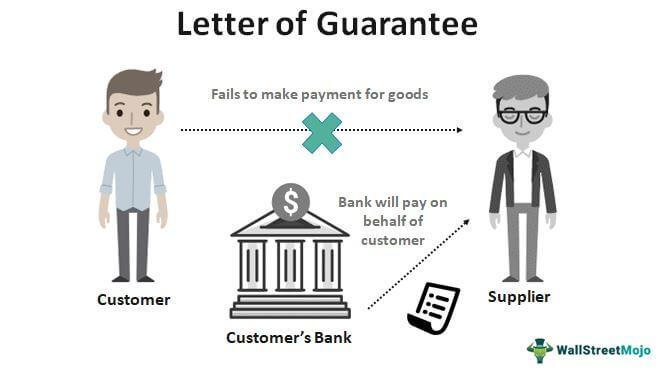

In the complex world of business finance, understanding the role of financial guarantees is crucial for risk management and strategic planning. Financial guarantees serve as pivotal components that provide assurance of payment and performance among parties in various financial transactions. These instruments are especially vital in mitigating risks associated with credit and operational uncertainties, thus forming a backbone for secure financial dealings.

This article explores the concept of a letter of guarantee, a specific kind of financial guarantee that is commonly issued by banks or other financial institutions. It guarantees that the liabilities of a debtor will be fulfilled in case they default. This is particularly important in business finance as it facilitates not only the securing of loans but also plays a critical role in international trade by assuring that the contractual obligations will be met. As such, letters of guarantee are indispensable for reducing financial risk for all involved parties, promoting smoother and more confident commercial exchanges.



Further, the article examines the relationship between these guarantees and broader financial guarantees. While letters of guarantee focus on ensuring liabilities are met, financial guarantees encompass a wider array of commitments, which includes insurances and bonds. These instruments provide varied forms of financial security, thus aiding businesses in achieving financial stability and reducing exposure to potential losses.

An intriguing aspect covered in this article is the intersection of these financial instruments with algorithmic trading. Algorithmic trading leverages computer algorithms to automate trading strategies in financial markets. The inclusion of financial guarantees in such systems can improve risk management by providing a safety net against high-frequency trading and volatile market conditions. Through enhancements in risk mitigation, algorithmic trading systems can operate more efficiently and with increased reliability.

By the end of this article, you will gain an understanding of how letters of guarantee and broader financial guarantees are integrated with the innovative realm of algorithmic trading. This knowledge will illuminate the strategies businesses can employ to ensure smoother financial operations and strategic advancements. Join us as we unravel the intricate dynamics of guarantees within the financial sector, highlighting their role in enhancing both traditional and technology-driven finance.

## Table of Contents

## Understanding Letters of Guarantee

A letter of guarantee is a formal pledge made by a bank or financial institution to ensure that the financial obligations of a debtor will be fulfilled. This type of guarantee serves as a safety net in various commercial transactions, particularly those involving loans and international trade. 

In the context of securing loans, letters of guarantee are vital. They offer reassurance to lenders that they will be reimbursed even if the borrower defaults. This assurance significantly reduces the risk for the lender and can enable borrowers to access financing that might otherwise be unavailable. 

International trade is another domain where letters of guarantee prove indispensable. They are often utilized to facilitate transactions between parties from different countries, mitigating the inherent risks associated with cross-border trade. In these scenarios, a letter of guarantee might be used alongside other financial instruments, such as letters of credit, to ensure that contractual obligations are met without hindrance.

The primary objective of a letter of guarantee is to minimize financial risk for all parties in a transaction. By providing a financial backstop, these guarantees instill confidence in business dealings, allowing transactions to proceed smoothly even in uncertain conditions.

Common scenarios for the deployment of letters of guarantee include import-export operations, where they serve as a critical aspect of trade agreements. In these operations, a letter can ensure the exporter receives payment once the goods are dispatched, while also assuring the importer of their right to a refund if conditions are not met. 

Similarly, in securing credit facilities, letters of guarantee can be used to bolster a company's creditworthiness. Companies might leverage these guarantees to acquire the necessary capital for growth or operational needs, presenting the letter as collateral to reassure creditors of their commitment.

Understanding and utilizing letters of guarantee effectively can enhance financial operations, providing a buoyant framework that supports confident and secure business transactions.

## Financial Guarantees in Business

Financial guarantees are a critical component of business finance, offering various forms of security beyond the traditional letter of guarantee. These guarantees serve as commitments by a guarantor to assume responsibility for a borrower's financial obligations in the event of default. They provide a safety net that enables businesses to engage in economically beneficial transactions while minimizing the risks associated with financial commitments.

One of the primary forms of financial guarantees is insurance. In a business context, insurance guarantees can cover a wide range of risks, including credit risk, operational risk, and market risk. For instance, credit insurance protects companies against the risk of a customer defaulting on payment, thereby offering the insured party compensation up to the insured amount. This type of guarantee is particularly valuable for businesses with significant exposure to accounts receivable, allowing them to secure financing or invest in growth without the overarching fear of potential customer insolvency.

Another prevalent form of financial guarantee is the bond. Bonds are financial instruments that represent a loan made by an investor to a borrower, typically corporate or governmental. While not a guarantee in the traditional sense, bonds often include various guarantees or covenants to protect the interests of the bondholder. For example, performance bonds are frequently used in construction and service contracts as a type of guarantee assuring that a project will be completed per the agreed-upon terms. If the contractor fails to fulfill these obligations, the bond covers the project costs, thus safeguarding the client's interests.

Further, standby letters of credit (SLCs) are a versatile type of financial guarantee often utilized in international trade and finance. An SLC acts as a safety net assuring that the beneficiary will receive payment, given the specific conditions are met, even if the creditor faces financial difficulties. This instrument boosts the credibility of businesses in international markets, facilitating smoother and more secure trade transactions.

Understanding the roles and functionalities of these varied financial guarantees is essential for businesses aiming to mitigate risks and achieve financial stability. Effective utilization of financial guarantees ensures that firms can engage in strategic planning and seize new business opportunities without undue exposure to financial loss. The judicious application of these instruments not only enhances a company's risk management framework but also contributes to a more stable and predictable financial landscape.

## The Intersection of Financial Guarantees and Algorithmic Trading

Algorithmic trading, known as algo trading, automates investment strategies by using pre-programmed algorithms to execute trades at optimal times, often within milliseconds. It leverages historical data, market analysis, and quantitative models, allowing traders to capitalize on market inefficiencies with minimal human intervention. As financial markets become increasingly complex and competitive, incorporating financial guarantees can improve the reliability and performance of [algorithmic trading](/wiki/algorithmic-trading) systems.

Financial guarantees serve as a risk management tool that provides assurance against potential losses or counterparty default in trading operations. These guarantees can be structured through various financial instruments, such as credit facilities, insurance, or collateral. When integrated into algorithmic trading, financial guarantees help manage the inherent risks of high-frequency trading and volatile market conditions.

In high-frequency trading ([HFT](/wiki/high-frequency-trading-strategies)), which often involves executing a large number of trades rapidly, financial guarantees can mitigate operational risks and credit exposures. Traders engaging in HFT face the challenge of maintaining [liquidity](/wiki/liquidity-risk-premium) and securing rapid settlement. Financial guarantees help ensure that counterparties fulfill their obligations, thus reducing the risk of default and enhancing market stability.

Consider a scenario where an HFT firm is engaged in a large number of trades across various asset classes. By securing financial guarantees, the firm can protect itself against the potential default of a counterparty that may be unable to settle the trade. This assurance enables the firm to maintain its trading position without having to allocate excessive capital for risk mitigation.

Additionally, robust risk management protocols are essential in using financial guarantees effectively within algo trading systems. These protocols involve monitoring the market, analyzing potential risk factors, and optimizing the allocation of guarantees to different trading strategies. For instance, the use of statistical models and real-time analytics can help identify when and where to deploy guarantees most effectively, based on current market conditions.

Python, with its rich ecosystem of financial libraries, offers tools for developing these risk management strategies. For example, using libraries like NumPy and pandas, traders can analyze historical market data to simulate various trading scenarios and determine the optimal levels of financial guarantee allocation.

```python
import numpy as np
import pandas as pd

# Simulate historical price data
np.random.seed(42)
price_changes = np.random.normal(0, 1, 1000)

# Calculate potential returns from algorithmic trading strategy
initial_price = 100
prices = initial_price + np.cumsum(price_changes)
returns = np.diff(prices) / prices[:-1]

# Analyze risk and determine appropriate guarantee levels
expected_return = np.mean(returns)
risk = np.std(returns)

# Assume acceptable risk tolerance level
risk_tolerance = 0.02  # Example risk tolerance level of 2%

# Calculate guarantee level needed
guarantee_level = (expected_return - risk_tolerance) / risk if risk > 0 else 0
print(f"Recommended guarantee level: {guarantee_level:.2f}")
```

This code snippet illustrates how traders can assess historical data to estimate returns and risk, ultimately determining the necessary level of financial guarantee for their trading strategies. By harmonizing financial guarantees with algorithmic trading, traders can enhance their operational resilience and navigate volatile markets more effectively. The integration of these tools marks a significant advancement in financial technology, providing improved risk mitigation and fostering greater confidence in algorithmic trading systems.

## Benefits and Challenges of Integrating Guarantees with Algo Trading

Integrating financial guarantees with algorithmic trading presents numerous benefits, primarily revolving around risk mitigation and enhanced trust among trading partners. Financial guarantees serve as a safety net, reducing the potential financial losses associated with trading [volatility](/wiki/volatility-trading-strategies) and unexpected counterparty defaults. In algorithmic trading, where transactions are executed at high speeds and volumes, this assurance can lead to smoother trading operations and increased participation from investors seeking lower risk profiles.

**Advantages of Integration:**

1. **Risk Mitigation:** Financial guarantees can effectively buffer trading systems against abrupt market shifts. By ensuring that trades are met, even in volatile conditions, these guarantees protect traders from potential losses. The presence of guarantees can reduce the need for excessive margin postings, thereby increasing liquidity available for trading.

2. **Increased Trust and Participation:** Guarantees enhance trust by assuring trading partners that financial obligations will be honored. This increased reliability can attract more participants to trading platforms, including institutional investors who may have strict risk management protocols.

3. **Operational Efficiency:** By lowering the perceived risk in trading activities, algorithmic traders can allocate resources more efficiently. This additional efficiency might be evident in reduced transaction costs and more streamlined compliance with regulatory requirements.

**Challenges of Integration:**

1. **Compatibility Issues:** One of the primary challenges involves ensuring that traditional financial guarantees are compatible with modern digital trading platforms. Traditional guarantees might not easily integrate with the rapid data processing and transaction speeds typical in algo trading. This challenge necessitates innovative solutions to bridge systems with different operational architectures.

2. **Complexity in Implementation:** Integrating guarantees with algorithmic trading systems may involve significant technical and organizational changes. The development and implementation of algorithms capable of understanding and utilizing guarantees can be complex, requiring robust computational frameworks and skilled personnel.

3. **Regulatory Compliance:** The use of financial guarantees within algo trading must align with existing financial regulations, which can vary across jurisdictions. Ensuring compliance requires continuous monitoring and potential adjustments to trading strategies and systems.

**Addressing the Challenges:**

Overcoming these obstacles involves a combination of technological innovation and strategic planning. For compatibility issues, developing API-based solutions that allow seamless communication between traditional financial systems and modern trading platforms can enhance integration. Additionally, leveraging [machine learning](/wiki/machine-learning) techniques can optimize the application of financial guarantees in trading algorithms by predicting market conditions and adjusting trades accordingly.

For organizations facing complexity in implementation, investing in training programs and hiring skilled personnel who understand both financial guarantees and algorithmic trading can provide a solution. Moreover, collaborations with fintech companies specializing in such integrations can serve as a shortcut to efficient implementation.

Ensuring regulatory compliance requires a proactive approach: organizations should engage with legal experts to stay updated on regulatory changes and regularly audit their trading systems to ensure adherence.

In summary, while the integration of financial guarantees with algorithmic trading presents clear advantages, potential challenges require strategic approaches for their resolution. As technology and financial markets evolve, businesses that successfully navigate these challenges are likely to achieve optimal financial performance and secure a competitive edge.

## Conclusion

In conclusion, letters of guarantee and financial guarantees have established themselves as indispensable components in both conventional business finance and the increasingly sophisticated world of algorithmic trading. As businesses adapt to technological advancements, a profound understanding of these financial instruments becomes crucial. The integration of financial guarantees with algorithmic trading not only mitigates risks but also signals a promising development in financial innovation. By mastering these tools, companies can refine their financial strategies, achieving enhanced stability and resilience against market uncertainties.

The synergy between financial guarantees and algorithmic trading is especially significant as it enables traders to navigate volatile markets with greater confidence. By reducing counterparty risk, financial guarantees foster trust and collaboration among market participants, which is essential for efficient trading systems. Moreover, as machine learning and [artificial intelligence](/wiki/ai-artificial-intelligence) continue to evolve, the application of these technologies in crafting smarter algorithmic trading strategies is likely to increase. This progression will inevitably facilitate more effective integration of guarantees, enhancing the overall efficiency of financial markets.

With ongoing advancements in technology and finance, the potential to leverage these instruments continues to grow. Emerging blockchain technologies, for example, hold the promise of digitizing and streamlining the issuance and management of financial guarantees, making them more accessible and efficient. As the landscape of global finance shifts towards digitalization, businesses that navigate these changes adeptly will be better positioned to thrive in future financial ecosystems.

## References & Further Reading

[1]: ["Understanding Financial Guarantees"](https://www.investopedia.com/terms/f/financial-guarantee.asp) by Valsamis Mitsilegas, International and Comparative Law Quarterly.

[2]: ["Algorithmic Trading and DMA: An Introduction to Direct Access Trading Strategies"](https://www.amazon.com/Algorithmic-Trading-DMA-introduction-strategies/dp/0956399207) by Barry Johnson.

[3]: ["Advances in Financial Machine Learning"](https://www.amazon.com/Advances-Financial-Machine-Learning-Marcos/dp/1119482089) by Marcos Lopez de Prado.

[4]: ["Quantitative Momentum: A Practitioner's Guide to Building a Momentum-Based Stock Selection System"](https://books.google.com/books/about/Quantitative_Momentum.html?id=K2npCgAAQBAJ) by Wesley R. Gray and Jack R. Vogel.

[5]: Bank for International Settlements. (2020). ["Financial Market Intermediation in the Age of Machine Learning and AI."](https://www.bis.org/publ/arpdf/ar2020e.htm)

[6]: Basel Committee on Banking Supervision. (2017). ["Sound Practices: Implications of Fintech Developments for Banks and Bank Supervisors."](https://www.bis.org/bcbs/publ/d431.htm)

