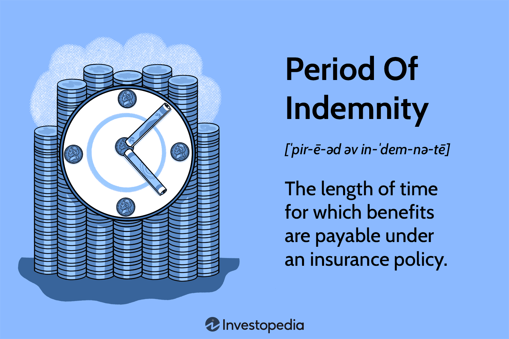

Understanding the importance of various legal and contractual documents is crucial in finance and trading. Among these documents, the Letter of Indemnity (LOI) serves a pivotal function in numerous sectors, notably trading and shipping. As a legal instrument, an LOI offers a formal assurance that one party will bear the risk associated with potential losses experienced by another, establishing a mechanism for risk allocation and protection against unforeseen liabilities.

The primary aim of this article is to demystify the concept of indemnity by providing a comprehensive example of an LOI in the context of algorithmic trading—a sector increasingly reliant on automated systems to execute high-frequency trades. Algorithmic trading is particularly susceptible to risks associated with rapid market changes and technological failures, which makes understanding indemnity crucial for mitigating losses and ensuring smooth operations.



Indemnity and LOIs also hold great significance across the broader trading landscape, influencing transactions, regulatory compliance, and risk management strategies. A well-crafted LOI can act as a buffer against financial turmoil caused by operational discrepancies or market volatilities, thus safeguarding a firm's financial interests.

By gaining insight into these concepts, traders and firms can devise strategies to manage the inherent risks and liabilities in their operations effectively. This understanding not only aids in protecting assets but also enhances decision-making capabilities, ensuring long-term sustainability in ever-evolving financial markets.

## Table of Contents

## What is a Letter of Indemnity (LOI)?

A Letter of Indemnity (LOI) is a crucial legal document designed to protect one party from potential losses or damages incurred during specific transactions. As a formal promise, an LOI plays a vital role in various business sectors such as shipping, finance, and trading by ensuring that one party compensates another under predetermined conditions.

LOIs are often employed to facilitate smooth commercial operations, particularly where risk is involved. For instance, in shipping, an LOI might be issued to convince a carrier to release goods without a bill of lading. In such cases, the LOI functions as a guarantee from the shipper or consignee to protect the carrier from any resulting liabilities.

The structure of a LOI typically includes several key components: the identities of the parties involved, the nature of the indemnity, specific conditions under which the indemnity is valid, and an explicit promise of compensation. Clarity and precision in these elements are essential to avoid disputes and misunderstandings. This is particularly important in complex transactions, where multiple conditionalities may apply.

In financial agreements, the necessity of an LOI stems from the unpredictable nature of markets and transactions. For example, in trading, an LOI can assure one party that they will be indemnified for losses resulting from the counterparty’s failure to fulfill contractual obligations. This assurance is especially pertinent when the potential for significant financial exposure exists.

Understanding the purpose and mechanics of LOIs is critical for any business or individual involved in high-stakes operations. LOIs not only provide a framework for risk management but also facilitate trust and cooperation between otherwise hesitant parties, enabling smoother execution of commercial activities.

## Indemnity Meaning and Importance

Indemnity is a fundamental concept in financial and legal realms, providing security or protection against financial liabilities or losses. In legal terms, indemnity serves as compensation for damages or loss, a feature integral to the risk management strategies of various organizations. Organizations and individuals utilize indemnity to ensure financial protection by transferring risks and liabilities. This is accomplished through contractual agreements where one party agrees to cover the losses of another under specified conditions.

The importance of indemnity is anchored in its ability to manage liabilities effectively. Through indemnity agreements, parties are able to clearly delineate responsibility, thus ensuring an equitable distribution of risk. For example, in a business contract, indemnity clauses can protect businesses from unforeseen circumstances that might lead to financial loss. These contracts legally obligate one party to compensate the other, should certain predetermined events occur. 

In the trading sector, both traditional and algorithmic, indemnity serves as a critical mechanism to manage and mitigate risks. In traditional trading environments, indemnity agreements can protect trading firms from losses due to errors or defaults by trading partners. They can also safeguard against regulatory fines and compliance issues. As financial transactions and obligations become more sophisticated, having a solid understanding of indemnity ensures that all parties have clarity on potential liabilities and their respective coverages.

Within [algorithmic trading](/wiki/algorithmic-trading), the rapid and automated nature of operations introduces unique risks, such as technical failures or erroneous algorithm executions. Indemnity in algorithmic trading is about preemptively addressing these technical risks by setting clear terms under which compensation will be provided, should an algorithm malfunction or if there are system outages that lead to financial losses. 

The process involves drafting specific clauses that cover potential technical issues and unforeseen market events, thereby providing firms with the necessary financial protection. Since algorithmic trading can involve substantial amounts of capital and high-frequency transactions, indemnity becomes an integral component of the trading contract, offering protection against significant financial impacts.

In conclusion, indemnity's role across various sectors lies in its ability to offer financial protection and equitable risk distribution. By integrating indemnity clauses in contracts and transactional agreements, entities can hedge against potential financial setbacks, providing a stable foundation especially amidst the unpredictability inherent in financial markets. Understanding indemnity and its applications allows firms and individuals to secure a more robust financial protection mechanism, crucial for sustained operations in volatile trading environments.

## How Does Indemnity Relate to Algorithmic Trading?

Algorithmic trading, commonly known as algo trading, is a method of carrying out trade instructions through automated and pre-programmed systems. This process demands rapid execution and often involves high-frequency trading, where decisions and transactions occur in microseconds. Amidst these fast-paced environments, the principle of indemnity holds an especially critical role, primarily due to the significant risk of financial losses stemming from a variety of potential issues.

In algorithmic trading, indemnity agreements essentially function as a safeguard, providing compensation coverage against possible losses arising from technical glitches, algorithm malfunctions, or unexpected market disruptions. This protection is crucial because even minor technical errors in trading algorithms can lead to substantial financial repercussions. For instance, if an algorithm is incorrectly set to execute a high [volume](/wiki/volume-trading-strategy) of trades that are not aligned with market conditions, the resulting financial loss can be devastating. An indemnity in such a context can be structured to cover these losses, ensuring that trading firms are not left vulnerable.

The integration of indemnity agreements in algorithmic trading environments often involves stipulating conditions under which compensation will be provided. These clauses may include, but are not limited to, failures in electronic communication networks, power outages, or sudden market events like flash crashes. By clearly defining these conditions, firms can effectively limit their financial exposure and maintain a degree of stability even when facing unforeseen challenges.

Understanding the relationship between indemnity and algorithmic trading can thus be pivotal for firms operating in these cutting-edge trade ecosystems. Firms can shield themselves from substantial financial damage by embedding detailed indemnity clauses within their operational contracts or agreements. Risk managers and legal teams typically play a critical role here, evaluating potential risks associated with algorithmic strategies and formulating indemnity provisions that align with the firm's risk tolerance levels.

The symbiotic relationship between indemnity agreements and algorithmic trading is evident, as indemnity provides the necessary security net that supports the rapid and complex trading strategies embodied in algorithmic systems. This interplay ensures that while trading algorithms function at their optimized levels, the business operations remain safeguarded against the inherent uncertainties of such high-tech environments.

## Example of an LOI in Algo Trading

To illustrate the application of a Letter of Indemnity (LOI) within algorithmic trading, consider a scenario where a trading firm engages with a financial institution and both parties need a robust risk management framework to protect against unforeseen losses due to algorithmic failures. In this context, the trading firm might issue an LOI as an assurance that the financial institution will be indemnified against potential losses arising from technical errors, unforeseen market phenomena, or rapid systemic failures inherent in high-frequency trading environments.

The LOI in this setting could include several specific clauses that outline the conditions under which indemnity will be provided. For instance, one key clause might specify that the indemnity is applicable in the event of a critical technical failure, such as a malfunction in the algorithmic execution software or connectivity issues with the trading platform. This ensures that if the algorithm were to execute erroneous trades or fail to execute trades altogether, the financial institution would not suffer financially without compensation.

Another potential clause might address unexpected market volatilities. Algorithmic trading often involves dealing with highly volatile markets, and significant, rapid price changes can lead to substantial losses. The LOI may stipulate indemnification for losses exceeding a predefined threshold caused by such volatilities, thereby ensuring that the institution is covered against extraordinary market movements.

In providing an LOI, the trading firm must carefully craft these clauses to ensure they provide adequate coverage without exposing the firm to excessive liability. This involves a careful delineation of what constitutes a technical failure or unexpected market [volatility](/wiki/volatility-trading-strategies), typically necessitating the involvement of legal experts to define these terms explicitly. This precision in language helps prevent disputes regarding the applicability of the indemnity when a claim is made.

For traders and firms looking to draft or evaluate an LOI relevant to algorithmic trading, understanding these aspects is crucial. It involves not only anticipating possible scenarios of algorithmic failure or market anomalies but also constructing an agreement that reflects these possibilities while aligning with risk management strategies and regulatory requirements.

Here is a hypothetical example of a Python function that could be part of an algorithmic trading system, which may need to be covered by an LOI in case of its failure:

```python
def execute_trade_order(order_queue):
    try:
        for order in order_queue:
            # Simulating trade execution
            if not order.is_valid():
                raise ValueError("Invalid order detected")
            order.execute()
    except Exception as e:
        # Notify the financial institution of the failure
        notify_failure(e)
        # Trigger LOI indemnity claim process
        initiate_loi_claim(e)

def notify_failure(error):
    # Code to notify the institution about the failure
    print(f"Trade execution failed due to: {error}")

def initiate_loi_claim(error):
    # Code to initiate the LOI claim process
    print(f"Initiating LOI claim for error: {error}")
```

In this example, any errors encountered during trade execution trigger predefined notification and indemnity procedures, highlighting the practical need for LOIs in safeguarding against operational failures in algorithmic trading. Through such measures, both trading firms and financial institutions can protect themselves, fostering a more secure trading environment.

## Best Practices for Utilizing LOIs in Trading

Utilizing Letters of Indemnity (LOIs) effectively in trading is integral to managing and mitigating risk. These documents serve as crucial assurances, ensuring compensation in the event of loss or damage. To maximize their protective benefits, traders and firms must follow certain best practices.

Firstly, the importance of clarity in LOIs cannot be overstated. The language used should be precise and unambiguous, with exact definitions of the conditions under which indemnity will be provided. Ambiguities in the document can lead to disputes between parties, potentially undermining the very purpose of the indemnity agreement. Therefore, ensuring that each term and condition is clearly defined can prevent misunderstandings and enforceability issues.

Secondly, it is vital to seek expertise from legal professionals when drafting LOIs. Legal experts bring a wealth of knowledge about regulatory standards and risk management policies that are essential for compliance. They can provide insights into the ever-changing legal landscapes of trading and ensure that the indemnity agreements adhere to all necessary legal requirements. This not only protects the parties involved but also enhances the robustness of the indemnity clauses.

Regular updating of LOIs is also critical. Given the dynamic nature of markets and the rapid technological advancements in trading platforms, LOIs must be reviewed and revised periodically. Such updates ensure that the documents remain relevant and effective in addressing current risks. Changes in market conditions, regulations, and technological infrastructures necessitate revisions to keep the indemnity protections aligned with the latest developments.

Moreover, traders and firms should consider the specific risk environments in which they operate and tailor their LOIs accordingly. This involves understanding the unique risks associated with particular markets or trading strategies and reflecting these considerations in the indemnity agreements. By doing so, traders can ensure that their LOIs provide comprehensive coverage that addresses their most significant vulnerabilities.

By adhering to these best practices, traders can harness the full potential of LOIs as a risk management tool. The strategic use of well-crafted indemnity agreements not only protects against financial losses but also contributes to the overall stability and sustainability of trading operations.

## Conclusion

Understanding the significance of a Letter of Indemnity (LOI) and the wider concept of indemnity is essential in the trading industry, where managing risk is a pivotal concern. In environments characterized by volatility and complexity, such as algorithmic trading, LOIs play a crucial role as risk management tools. These legal documents provide necessary protection against potential financial losses, allowing traders to navigate the uncertain waters of financial markets with more confidence.

The discussed examples and principles of LOIs empower traders with the knowledge to effectively mitigate risks inherent in their operations. By ensuring the proper drafting and implementation of LOIs, traders can protect themselves from unforeseen liabilities, thereby securing their financial interests.

As the financial landscape continues to evolve rapidly, with technological advancements and new trading practices continually emerging, staying informed about legal protections such as indemnities becomes increasingly crucial. Implementing robust indemnity measures not only aids in risk management but also supports sustainable trading practices by ensuring that traders are prepared for potential adversities.

Looking forward, the adaptation and updating of indemnity measures will remain a fundamental aspect of financial risk management. Traders who recognize the strategic importance of these protections and update their practices accordingly will be better positioned to succeed in the dynamic world of trading.

## References & Further Reading

[1]: ["Advances in Financial Machine Learning"](https://www.amazon.com/Advances-Financial-Machine-Learning-Marcos/dp/1119482089) by Marcos Lopez de Prado

[2]: ["Machine Learning for Algorithmic Trading"](https://github.com/stefan-jansen/machine-learning-for-trading) by Stefan Jansen

[3]: de Fontnouvelle, P., Jordan, J., Rosengren, E., & Levonian, M. (2003). ["Using Loss Data to Quantify Operational Risk."](https://papers.ssrn.com/sol3/papers.cfm?abstract_id=395083) Federal Reserve Bank of Boston.

[4]: Aronson, D. (2007). ["Evidence-Based Technical Analysis: Applying the Scientific Method and Statistical Inference to Trading Signals."](https://www.amazon.com/Evidence-Based-Technical-Analysis-Scientific-Statistical/dp/0470008741) Wiley Trading.

[5]: Chan, E. P. (2008). ["Quantitative Trading: How to Build Your Own Algorithmic Trading Business."](https://github.com/ftvision/quant_trading_echan_book) Wiley.