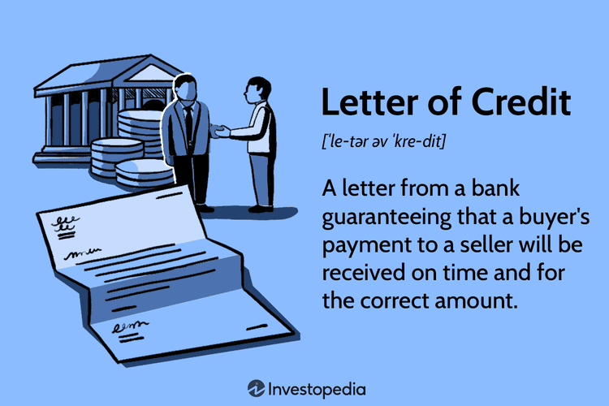

In the rapidly evolving world of technology and finance, understanding the intersection of intellectual property laws and algorithmic trading is essential. Algorithmic trading, which relies heavily on sophisticated mathematical models and computer algorithms to execute trading decisions, represents a significant innovation within the financial industry. The exclusivity of these algorithms is not just a technological feature but a competitive advantage that drives market success.

Letters patent, a legal instrument issued by a sovereign authority, play a fundamental role in protecting such innovations. These public legal documents grant inventors exclusive rights to their inventions, thereby enabling them to control and monetize their intellectual property effectively. In the context of algorithmic trading, securing a letters patent can protect a firm's algorithmic innovations from unauthorized replication, generating a sustainable competitive edge.

The importance of safeguarding these algorithms cannot be overstated. With rapid technological advancements, the risk of algorithmic strategies being duplicated or reverse-engineered by competitors necessitates robust protection mechanisms. Patents and trade secrets offer viable strategies for maintaining the confidentiality and exclusivity of trading algorithms. While patents require public disclosure of the invention's functionality and design, they offer a time-bound monopoly over its usage. Alternatively, trade secrets protect the proprietary elements of an algorithm as long as confidentiality is preserved, without necessitating public disclosure.

Exploring the intricacies of letters patent and their significance in intellectual property rights illuminates the challenges and opportunities present in the trading industry. Businesses operating in this space must navigate complex legal frameworks to ensure their algorithms remain safeguarded against misuse, thereby securing their position in a fiercely competitive market. Effective strategies for protecting trading algorithms under current legal frameworks are crucial for maintaining their confidentiality and exclusivity, ensuring that they serve as a strategic asset for growth and innovation.

## Table of Contents

## Understanding Letters Patent

Letters patent are official public documents issued by a governing authority that grant specific rights or privileges to individuals or entities. Fundamentally, they serve as a means to formally confer rights concerning inventions and innovations. Historically, letters patent were utilized to appoint representatives, confer titles, or grant monopoly rights for certain trades. Today, they hold significant importance in securing patent rights for inventions, including those in algorithmic trading.

These documents are distinct from private letters close, which remain sealed and confidential. Instead, letters patent are openly published, allowing the public to view the details of the agreements and rights conferred. This transparency plays a crucial role in safeguarding innovation, as it clarifies the boundaries of the rights granted and serves as a public record of ownership.

In the context of innovations and technological advancements, letters patent provide inventors and developers with exclusive rights to their creations. These rights typically last for a fixed period, often up to 20 years from the filing date, during which the patent holder can exclude others from making, using, or selling the patented innovation without consent. This exclusivity is a powerful tool for monetizing and commercializing inventions, as it allows patent holders to potentially license their innovations to others or use them as a basis for forming lucrative partnerships.

The role of letters patent in protecting and commercializing innovations such as trading algorithms is particularly significant. Algorithmic trading relies on complex mathematical models and computation-intensive algorithms to execute trades at speeds and efficiencies beyond human capability. These algorithms embody innovative processes and technologies that, if patented, can provide a competitive advantage by legally curbing rivals from replicating the technology. 

The strategic use of letters patent helps trading firms secure their intellectual property (IP) and establish themselves as leaders in technological innovation. As such, understanding the processes and requirements for securing letters patent ensures that trading firms can effectively safeguard their valuable algorithmic assets and maintain their competitive edge in the fast-paced trading industry.

## Intellectual Property and Algorithmic Trading

Algorithmic trading, a method of executing trading strategies using pre-programmed instructions within a computer program, relies heavily on complex algorithms. These algorithms analyze market data, identify trading opportunities, and execute trades at speeds and frequencies impossible for human traders. As such, they represent a significant asset for firms engaged in trading and financial markets, qualifying them as valuable intellectual property (IP).

Protecting these algorithms is essential to prevent unauthorized use and secure a competitive edge in the financial sector. Intellectual property laws provide the legal frameworks to safeguard these innovations, with patent law and trade secret law being the primary mechanisms utilized.

Patent law grants inventors exclusive rights to commercially exploit their innovations for a limited period, typically 20 years, as long as the invention meets the criteria of novelty, non-obviousness, and utility. For an algorithm to be patented, it must be part of a process or application that is novel and has practical significance in solving specific problems. This legal protection helps establish a barrier against competitors, enabling firms to leverage their patented algorithms in the marketplace. However, the requirement to disclose the invention's details in the patent application could pose risks by exposing the core aspects of the algorithm to the public, potentially allowing competitors to design around the patented solution or improve upon it.

Trade secret law presents an alternative means of protection, which requires no formal registration and can last indefinitely as long as the secrecy is maintained. This form of protection is achieved by keeping the details of an algorithm confidential. Essential elements of effective trade secret management include implementing stringent confidentiality agreements, restricting access to sensitive details within the organization, and employing technical measures to prevent unauthorized disclosure. Trade secrets are especially suitable for algorithms that derive value from maintaining their confidentiality rather than being publicly disclosed. A critical advantage of trade secret protection is the absence of any disclosure requirements, maintaining the competitive advantage of the firm provided the secret is not independently discovered or reverse-engineered by others.

Understanding both the applicability and limitations of patent and trade secret protection is crucial for trading firms and algorithm developers. Patents offer the benefit of exclusivity and legal recourse in case of infringement but require the public disclosure of the invention. Conversely, trade secrets maintain confidentiality without the requirement for disclosure but offer no protection against independent discovery. Consequently, firms must carefully evaluate which form of IP protection aligns best with their business strategy, considering factors such as the nature of the algorithm, the competitive landscape, and the potential for reverse engineering or independent development by competitors.

In some cases, a hybrid approach might be optimal, where parts of an algorithm that benefit from public disclosure and commercialization could be patented, while core components that are difficult to reverse-engineer can be maintained as trade secrets. This strategic blend allows firms to maximize the protective benefits of both patents and trade secrets, securing both novelty and confidentiality in their [algorithmic trading](/wiki/algorithmic-trading) assets.

## Patent Law: Protections and Challenges

Patent law offers extensive protections crucial for those aiming to safeguard their innovations. At its core, patent law grants inventors the exclusive right to exclude others from making, using, or selling their inventions, thus providing a critical competitive advantage. For an algorithm to qualify for patent protection, it must satisfy three principal criteria: novelty, non-obviousness, and practical applicability. This means that the algorithm must be new, meaning no prior art exists. It must be non-obvious, illustrating an inventive step that isn't easily deduced by someone with ordinary skill in the field. Additionally, it must have a clear and useful purpose.

However, the requirement for disclosure in the patent process represents a significant challenge. To obtain a patent, an inventor must publicly disclose the details of the algorithm, including how it functions and how it can be implemented. While this disclosure is intended to enrich public knowledge and spur further innovation, it can paradoxically reveal trade secrets, making the specifics of the algorithm accessible to competitors once the patent expires or becomes public.

The strategic value of patents for startups is substantial. Patents can bolster a startup's market position by protecting groundbreaking innovations, thereby deterring potential infringers. Moreover, owning a patent portfolio can enhance a company's credibility, making it more attractive to investors and partners. For startups, successfully navigating the patenting process involves not only preparing a robust patent application but also addressing challenges such as potential litigation, monitoring for infringement, and managing the costs associated with patenting.

Nevertheless, patenting trading algorithms presents distinct challenges. In the rapidly evolving world of technology, the pace of development often outstrips the patent process, which can take years to complete. By the time a patent is granted, the technology may have become outdated or been surpassed by new innovations. Furthermore, the financial costs of maintaining a patent and enforcing it against infringers can be substantial.

In this fast-paced technological environment, companies must carefully assess whether patenting is the right strategy for protecting their algorithms. While patents can provide legal certainty and potential revenue through licensing, they may not always be the optimal choice compared to other forms of intellectual property protection, such as trade secrets, which maintain confidentiality without disclosure requirements. Thus, businesses must weigh the benefits of patent protection against the risks and limitations inherent in the process.

## Trade Secret Law: An Alternative Approach

Trade secret protection offers a distinctive alternative to patents by allowing innovations, such as trading algorithms, to remain confidential without requiring public disclosure. Unlike patents, which typically provide protection for up to 20 years, trade secrets can potentially last indefinitely, provided that the secret is maintained effectively and consistently.

A robust trade secret strategy is essential for preserving the confidentiality of trading algorithms. This involves implementing comprehensive confidentiality measures, including non-disclosure agreements (NDAs) with employees and partners, and ensuring that sensitive information is accessible only to individuals on a need-to-know basis. Regular audits and security protocols, such as encryption and access controls, should be in place to protect the integrity and confidentiality of data.

Cultivating a culture of secrecy within an organization is also pivotal. This can be achieved through continuous employee training programs aimed at reinforcing the significance of maintaining confidentiality and the potential legal repercussions of accidental or intentional breaches. Encouraging a culture where information security is a shared responsibility can enhance the overall effectiveness of trade secret protection.

However, relying on trade secret protection carries inherent risks. Accidental disclosures, which can occur through human error or technological failures, or industrial espionage, where competitors or malicious actors seek to uncover confidential information, pose significant threats. Startups, in particular, must carefully balance the advantages of trade secret protection with these potential vulnerabilities. Consideration of the likelihood and impact of such risks is crucial in deciding whether trade secrets are the most appropriate form of protection for a specific algorithm.

To craft an effective trade secret strategy for trading algorithms, businesses should focus on developing layered security measures, emphasizing employee education, and fostering an environment that prioritizes information security. By effectively managing these elements, companies can strengthen their competitive advantage by safeguarding their proprietary innovations.

Implementing a trade secret protection plan should be seen not only as a legal necessity but also as a strategic business decision. Properly managed, a trade secret strategy can provide a long-term competitive edge, enabling firms to innovate without prematurely revealing their technological advances to the public or competitors.

## Choosing Between Patents and Trade Secrets

When choosing between patents and trade secrets for protecting algorithmic trading strategies, businesses must consider several critical factors, including the inherent characteristics of the algorithm, strategic business objectives, and the overarching dynamics of the trading industry. 

Patents serve as a robust mechanism for establishing credibility in the market. The examination process by patent offices adds a layer of validation to the innovation, reassuring investors and stakeholders of its novelty and utility. For algorithms that represent groundbreaking advancements or new methodologies in trading, securing a patent can offer a significant competitive edge by granting the holder exclusive rights to the technology for a set period, typically up to 20 years. During this time, competitors are legally barred from using, making, or selling the patented innovation without permission, making patents an attractive option for innovations that are susceptible to replication.

On the other hand, trade secrets provide a different yet equally potent form of protection. They are most advantageous for algorithms that are integral to business operations and can be protected through confidentiality measures. Unlike patents, trade secret protection does not require public disclosure of the algorithm, which is critically important for innovations that, if exposed, could quickly be reverse-engineered or copied. Provided that secrecy is adequately maintained, trade secret protection can last indefinitely, making it ideal for algorithms that have intrinsic, long-term value that relies on confidentiality.

A combination strategy that employs both patents and trade secrets may sometimes be the most strategic approach. For instance, a business might choose to patent certain innovative components of their trading algorithm, thereby gaining the legal shield and credibility that patents provide, while simultaneously keeping other elements of the algorithm as trade secrets to protect the core logic or data sets involved. This dual approach enables a nuanced protection scheme, safeguarding the most crucial aspects of the intellectual property while potentially benefiting from the strengths of both patent and trade secret law.

Ultimately, making informed decisions about the protection of trading algorithms requires a careful assessment of the algorithm’s nature, the strategic objectives of the business, and the competitive landscape of the trading industry. Businesses must weigh the potential advantages of securing a patent against the benefits of maintaining a trade secret, considering factors such as the algorithm's life cycle, the ease with which it could be independently developed by competitors, and the strategic imperatives of the company. By aligning intellectual property strategies with business goals, firms can optimize their protection framework and sustain a competitive position in the fast-evolving trading industry.

## Conclusion

Navigating the legal landscape of intellectual property protection for algorithmic trading is complex but crucial for securing competitive advantages. Understanding the nuances of letters patent, patent law, and trade secret options allows businesses to make informed strategic decisions when protecting their innovations. The integration of these intellectual property protections ensures that companies can sustain growth and fend off competition within the fast-paced trading industry.

As innovation is a key driver in the trading sector, protecting the unique aspects of algorithmic developments is vital. Companies should evaluate the protectability of their algorithms, considering factors such as novelty, competitive significance, and the ease of reverse-engineering. Armed with this information, businesses can construct an intellectual property portfolio that not only shields their creations but also capitalizes on their economic value.

Furthermore, aligning intellectual property strategies with overarching business goals is critical. By strategically assessing the business impact of their algorithms, companies can position themselves to maximize potential and secure long-term success. This alignment facilitates a proactive approach to navigating the ever-evolving market conditions, ensuring that companies are not only reactive to threats but also strategically positioning themselves for future opportunities.

In essence, the complex interplay of patent and trade secret laws offers a robust framework for protecting innovations in algorithmic trading. By leveraging these legal tools effectively, businesses can maintain a competitive edge, drive innovation, and achieve sustainable growth.

## References & Further Reading

[1]: Bessen, J., & Meurer, M. J. (2008). ["Patent Failure: How Judges, Bureaucrats, and Lawyers Put Innovators at Risk"](https://www.jstor.org/stable/24562900). Princeton University Press.

[2]: Lerner, J. (2002). "Patent Protection and Innovation Over 150 Years." NBER Working Paper No. 8977. National Bureau of Economic Research. [Link](https://www.nber.org/papers/w8977).

[3]: Graham, S. J. H., & Mowery, D. C. (2004). "Intellectual Property Protection in the U.S. Software Industry." In Patents in the Knowledge-Based Economy. National Academies Press. Available at: [National Academies Press](https://www.researchgate.net/profile/Stuart-Graham-7/publication/254715779_Intellectual_Property_Protection_in_the_Software_Industry1/links/54beb02d0cf28ad7e7190347/Intellectual-Property-Protection-in-the-Software-Industry1.pdf).

[4]: WIPO. (2018). ["World Intellectual Property Report: The Changing Face of Innovation"](https://www.wipo.int/publications/en/details.jsp?id=4369). World Intellectual Property Organization.

[5]: Kitch, E. W. (1977). "The Nature and Function of the Patent System." The Journal of Law and Economics, 20(2), 265-290. [Link](https://www.jstor.org/stable/725193).