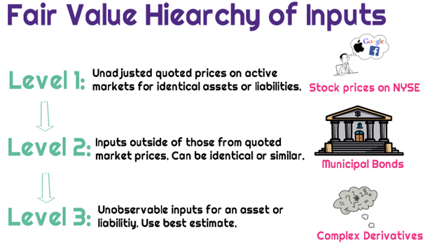

## Table of Contents

## What are Level 1 assets?

Level 1 assets are the easiest type of assets to value because they have clear, observable prices. These prices come from active markets where the assets are traded often. For example, stocks listed on major stock exchanges like the New York Stock Exchange are Level 1 assets. The value of these assets is easy to find because you can just look at the current market price.

These assets are important for businesses and investors because they provide a reliable way to measure the value of their investments. Since the prices are based on real market data, there is less guesswork involved. This makes financial reporting and decision-making more straightforward and trustworthy.

## How are Level 1 assets valued?

Level 1 assets are valued by looking at the prices in active markets where these assets are traded a lot. For example, if you want to know the value of a stock that's listed on the New York Stock Exchange, you just check the current market price. This price is easy to find because it's based on real trades happening all the time.

Using these market prices makes valuing Level 1 assets simple and reliable. There's no need to guess or use complicated methods because the value is right there in the market. This helps businesses and investors make decisions quickly and with confidence, knowing the numbers are based on actual trading data.

## What are some examples of Level 1 assets?

Level 1 assets are things that are easy to value because they have clear prices you can see. Some examples are stocks listed on big stock markets like the New York Stock Exchange or the NASDAQ. If you want to know how much a stock is worth, you just look at what it's trading for right now on these markets.

Another example of a Level 1 asset is government bonds that are traded a lot. These bonds, like U.S. Treasury bonds, have prices that are easy to find because they are bought and sold often. So, if you need to know the value of these bonds, you can quickly check the current market price.

These examples show how Level 1 assets are valued based on real market data, making it simple and reliable to figure out their worth.

## What are Level 2 assets?

Level 2 assets are a bit harder to value than Level 1 assets. They don't have prices you can see right away like stocks on big stock markets. Instead, their value comes from looking at similar assets that do have clear prices. For example, if you want to know the value of a certain bond that isn't traded a lot, you might look at the prices of similar bonds that are traded more often.

These assets are important because they help businesses and investors figure out the value of things that aren't as easy to price. By using the prices of similar assets, you can make a good guess about the value of a Level 2 asset. This method isn't as direct as looking at a stock's current market price, but it's still based on real market data, which makes it reliable enough for financial reporting and decision-making.

## How do Level 2 assets differ from Level 1 assets in terms of valuation?

Level 1 assets are easy to value because they have clear prices you can see right away. These prices come from active markets where the assets are traded a lot, like stocks on the New York Stock Exchange. So, if you want to know the value of a Level 1 asset, you just look at what it's trading for right now. This makes valuing Level 1 assets simple and reliable because you're using real market data.

Level 2 assets are a bit trickier to value because they don't have those clear, easy-to-see prices. Instead, you have to look at the prices of similar assets that are traded more often. For example, if you want to value a bond that isn't traded a lot, you might check the prices of similar bonds that are. This method isn't as direct as looking at a stock's current market price, but it's still based on real market data, which makes it reliable enough for financial reporting and decision-making.

## Can you provide examples of Level 2 assets?

Level 2 assets include things like certain types of bonds that don't trade as often as stocks on big stock markets. For example, if you have a corporate bond that isn't traded a lot, you might look at the prices of similar corporate bonds that are traded more often to figure out its value. This way, you can get a good guess about what the bond is worth, even if it doesn't have a clear price you can see right away.

Another example of a Level 2 asset is a mortgage-backed security that isn't traded in a very active market. To value this, you might look at the prices of similar mortgage-backed securities that are traded more often. By comparing these prices, you can come up with a reliable estimate of the value of your mortgage-backed security. This method helps businesses and investors make decisions even when the exact market price isn't easy to find.

## What are Level 3 assets?

Level 3 assets are the hardest to value because they don't have clear prices you can see right away. These assets are not traded in active markets like stocks on big stock exchanges. Instead, their value comes from using models and guesses based on what the company thinks they're worth. For example, if a company owns a unique piece of art or a private business, they might use their own estimates to figure out how much these things are worth.

These assets are important but tricky for businesses because they have to make their own judgments about value. This can be risky because different people might come up with different values for the same asset. Companies use their best guesses and sometimes look at what similar assets sold for in the past to help them, but it's not as reliable as looking at real market prices. This makes financial reporting and decision-making more complicated for Level 3 assets.

## How are Level 3 assets valued, and what makes them different from Level 1 and Level 2 assets?

Level 3 assets are valued using models and guesses because they don't have clear prices from active markets. If a company owns something unique, like a piece of art or a private business, they have to use their own estimates to figure out how much it's worth. They might look at what similar things sold for in the past, but it's still a lot of guesswork. This makes valuing Level 3 assets tricky and less reliable because different people might come up with different values for the same thing.

Level 3 assets are different from Level 1 and Level 2 assets because Level 1 assets have clear prices you can see right away. For example, stocks on big stock markets like the New York Stock Exchange are easy to value because you just check the current market price. Level 2 assets are a bit harder because they don't have those clear prices, so you look at the prices of similar assets that are traded more often. But Level 3 assets don't even have that; they rely on the company's own estimates, making them the hardest to value and the most uncertain.

## What are some common examples of Level 3 assets?

Level 3 assets include things like private company stocks, which are not traded on public stock markets. If you own a piece of a private business, there's no easy way to know how much it's worth because it doesn't have a clear price you can look up. Instead, you might have to guess based on how much similar private businesses sold for in the past or use other financial models to come up with a value.

Another example of a Level 3 asset is a unique piece of art or a rare collectible. These items don't have prices you can see right away because they're not bought and sold often. To figure out how much they're worth, you might look at what similar pieces have sold for at auctions or use an appraiser who makes an educated guess. This makes valuing these assets tricky and less certain than valuing stocks or bonds that trade a lot.

## How do regulatory requirements impact the classification and reporting of Level 1, 2, and 3 assets?

Regulatory requirements play a big role in how companies classify and report their Level 1, 2, and 3 assets. These rules come from groups like the Financial Accounting Standards Board (FASB) in the U.S., which sets guidelines on how to value and report different kinds of assets. For Level 1 assets, the rules are pretty straightforward because they have clear prices from active markets. Companies just need to report the current market price, which makes it easy to follow the regulations. For Level 2 assets, the rules get a bit more complicated because you have to use the prices of similar assets to figure out the value. Companies need to explain how they came up with these values, which means more detailed reporting.

For Level 3 assets, the regulatory requirements are the toughest because these assets are the hardest to value. Since Level 3 assets don't have clear prices, companies have to use their own models and guesses to come up with a value. This means they have to provide a lot of information about how they made these guesses, including the assumptions they used and any risks involved. Regulators want to make sure that these values are as accurate as possible, so they require a lot of transparency and detailed reporting. This can make it more challenging for companies to comply with the rules, but it's important for keeping financial reports trustworthy.

## What are the potential risks associated with holding Level 2 and Level 3 assets compared to Level 1 assets?

Holding Level 2 and Level 3 assets can be riskier than holding Level 1 assets because their values are not as clear. Level 1 assets, like stocks on big stock markets, have prices you can see right away. This makes it easy to know how much they're worth and helps you make quick decisions. But with Level 2 assets, you have to guess their value by looking at the prices of similar assets. This means there's more chance of getting it wrong because the prices might not be a perfect match.

Level 3 assets are even riskier because their values come from the company's own guesses and models. These assets, like private company stocks or unique pieces of art, don't have clear prices at all. So, different people might come up with different values for the same thing, which can make it hard to trust the numbers. This uncertainty can make it tough to make good financial decisions and can lead to bigger surprises if the guessed values turn out to be way off.

In short, while Level 1 assets give you a clear and reliable picture of what you own, Level 2 and Level 3 assets involve more guesswork and uncertainty. This makes them riskier because you're not as sure about their true value, which can affect your financial planning and decisions.

## How can an investor or financial manager optimize a portfolio using a mix of Level 1, 2, and 3 assets?

An investor or financial manager can optimize a portfolio by carefully balancing Level 1, 2, and 3 assets. Level 1 assets, like stocks listed on major stock exchanges, are easy to value and trade, making them a good choice for adding stability and [liquidity](/wiki/liquidity-risk-premium) to a portfolio. By including a solid base of Level 1 assets, an investor can ensure they have assets that are easy to sell if they need cash quickly. Level 2 assets, like certain bonds, can add diversity to the portfolio. Even though they're harder to value than Level 1 assets, they can offer good returns if the investor does their homework and finds the right ones.

Adding Level 3 assets, such as private company stocks or unique pieces of art, can increase the potential for high returns but also comes with more risk. These assets are harder to value and less liquid, meaning they can't be sold as quickly. However, if the investor believes in the long-term value of these assets, they might be willing to take on that extra risk. The key to optimizing a portfolio is to find the right mix of these assets. By balancing the stability of Level 1 assets, the potential returns of Level 2 assets, and the high-risk, high-reward nature of Level 3 assets, an investor can create a portfolio that meets their goals and risk tolerance.

## References & Further Reading

[1]: ["IFRS 13 Fair Value Measurement"](https://www.ifrs.org/content/dam/ifrs/publications/pdf-standards/english/2021/issued/part-a/ifrs-13-fair-value-measurement.pdf) - International Financial Reporting Standards (IFRS).

[2]: ["Understanding Level 1, Level 2, and Level 3 Assets"](https://www.investopedia.com/terms/l/level3_assets.asp) - Investopedia.

[3]: ["Algorithmic Trading and DMA: An Introduction to Direct Access Trading Strategies"](https://www.amazon.com/Algorithmic-Trading-DMA-introduction-strategies/dp/0956399207) by Barry Johnson.

[4]: ["Level 2 versus Level 3 Assets"](https://www.investopedia.com/terms/l/level3_assets.asp) - CFA Institute.

[5]: ["Trading and Exchanges: Market Microstructure for Practitioners"](https://www.amazon.com/Trading-Exchanges-Market-Microstructure-Practitioners/dp/0195144708) by Larry Harris. 

[6]: ["High-Frequency Trading: A Practical Guide to Algorithmic Strategies and Trading Systems"](https://www.ahmetbeyefendi.com/wp-content/uploads/2020/07/High-Frequency-Trading-Irene-Aldridge.pdf) by Irene Aldridge.

[7]: ["The Impact of Market Liquidity on Securities Pricing"](https://www.researchgate.net/publication/228317407_Liquidity_and_Asset_Prices) - The Journal of Finance.