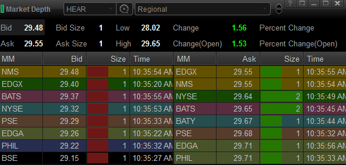

## Table of Contents

## What is Level 1 market data?

Level 1 market data is basic information about a stock or other financial product. It shows the current price at which you can buy or sell the stock, which are called the bid and ask prices. It also tells you how many shares people want to buy or sell at those prices, which is called the bid and ask size. This data is easy to find on many financial websites and trading platforms.

This type of data is useful for people who want a quick look at the market. It helps them see the current price and decide if they want to buy or sell a stock. However, Level 1 data does not give you all the details about the market. If you want to know more about the different prices people are willing to pay, you would need Level 2 market data.

## How can I access Level 1 market data?

You can access Level 1 market data easily from many places. Most financial websites and trading platforms show this data for free. For example, if you go to a site like Yahoo Finance or Google Finance, you can type in the name of a stock and see its current price, the bid and ask prices, and how many shares are available at those prices.

Some brokerages also provide Level 1 market data through their trading apps or websites. When you log into your account, you can usually find this information on the main page or by looking up a specific stock. This makes it convenient for you to check the market before making any trading decisions.

## What are the key components of a trading screen?

A trading screen shows important information that traders use to make decisions. The main part of the screen is the price chart, which shows how the price of a stock or other investment has changed over time. This chart can have lines, bars, or candles, and it helps traders see patterns and trends. On the chart, you can also see indicators like moving averages or [volume](/wiki/volume-trading-strategy), which give more clues about what the market might do next.

Another key part of the trading screen is the [order book](/wiki/order-book-trading-strategies), which lists the current buy and sell orders for a stock. This shows the bid and ask prices, and how many shares people want to buy or sell at those prices. Traders use this information to decide if they want to make a trade. The trading screen also has a news feed, which shows important news that might affect the market. This helps traders stay up to date and make better decisions.

Lastly, the trading screen often has a watchlist, where traders can keep track of different stocks they are interested in. This list shows the current price and how much the price has changed since the last trading day. Traders use the watchlist to quickly see which stocks are doing well or poorly. Together, all these parts of the trading screen help traders understand the market and make smart trading choices.

## How does Level 1 data differ from Level 2 data?

Level 1 data gives you the basic information you need to know about a stock. It shows you the current price, which is the last price the stock was traded at. It also shows the bid price, which is the highest price someone is willing to pay to buy the stock, and the ask price, which is the lowest price someone is willing to sell the stock for. You can also see the bid size and ask size, which tell you how many shares people want to buy or sell at those prices. This data is easy to find on many financial websites and is useful for people who just want a quick look at the market.

Level 2 data gives you more detailed information than Level 1 data. It shows you all the different prices people are willing to buy or sell a stock at, not just the highest and lowest prices. This is called the order book, and it can help you see the whole market for a stock. Level 2 data is more useful for people who want to trade a lot or who want to understand the market better. However, you usually have to pay for Level 2 data, and it's not as easy to find as Level 1 data.

## What are the common sources for obtaining Level 1 market data?

You can get Level 1 market data from many places. Websites like Yahoo Finance and Google Finance are easy to use and show the current price of stocks, along with the bid and ask prices. They also tell you how many shares people want to buy or sell at those prices. These sites are good for people who want a quick look at the market without paying any money.

Brokerage firms also offer Level 1 market data. When you log into your trading account, you can see this information on the main page or by searching for a specific stock. This makes it easy to check the market before you decide to buy or sell. Some trading apps also show Level 1 data, so you can keep an eye on the market from your phone.

## How can accessibility features enhance the trading screen experience for visually impaired users?

Accessibility features can make trading screens easier for visually impaired users to use. Screen readers can read out the information on the screen, like the current price of a stock or the news feed. This helps users who can't see the screen well to still know what's happening in the market. Also, high contrast modes can make the text and charts easier to see. This is good for people who have trouble seeing colors or small details.

Another helpful feature is the ability to zoom in on parts of the screen. This makes the text and charts bigger, so they are easier to read. Some trading platforms also let users change the size of the text or use different fonts that are easier to read. These changes can make a big difference for visually impaired users, helping them trade more easily and confidently.

## What are the regulatory considerations when using Level 1 market data?

When you use Level 1 market data, you have to follow some rules set by financial regulators. These rules are there to make sure everyone has fair access to the data and to stop people from using it in a way that could hurt others. For example, you can't share the data with people who aren't supposed to have it, and you have to use it in a way that follows the rules of the stock exchange or the company that gives you the data.

Regulators also want to make sure that the data is accurate and up to date. This means that the companies providing the data have to make sure it's correct and that they update it quickly. If you're using the data for trading, you need to make sure you're getting it from a reliable source. Breaking these rules can lead to fines or other punishments, so it's important to know and follow them.

## How can traders customize their trading screens to better utilize Level 1 data?

Traders can customize their trading screens to make the most out of Level 1 data by focusing on what information is most important to them. They can set up their screens to show the current price, bid, and ask prices prominently. This helps them quickly see if a stock is a good buy or sell. They can also add a watchlist to keep an eye on multiple stocks at once, showing the current price and how much it has changed. By arranging these elements in a way that makes sense to them, traders can make faster and better decisions.

Another way to customize the trading screen is by using different colors or alerts to highlight important changes in the Level 1 data. For example, traders can set up alerts to notify them when a stock reaches a certain price or when the bid-ask spread changes significantly. This can help them react quickly to market movements. By tailoring the screen to their trading style and preferences, traders can use Level 1 data more effectively and improve their overall trading experience.

## What technologies are used to improve the accessibility of trading screens?

Technologies like screen readers help make trading screens easier for visually impaired users. A screen reader can read out the information on the screen, like the current price of a stock or the news feed. This helps users who can't see the screen well to still know what's happening in the market. High contrast modes are another useful technology. They make the text and charts easier to see by using colors that stand out more. This is good for people who have trouble seeing colors or small details.

Zooming in on parts of the screen is another technology that helps. By making the text and charts bigger, it becomes easier for visually impaired users to read them. Some trading platforms also let users change the size of the text or use different fonts that are easier to read. These changes can make a big difference for visually impaired users, helping them trade more easily and confidently.

## How does real-time Level 1 data impact trading decisions?

Real-time Level 1 data gives traders the most up-to-date information about a stock's price, which helps them make quick decisions. When traders can see the current price, the bid price (the highest someone is willing to pay), and the ask price (the lowest someone is willing to sell for), they can decide if it's a good time to buy or sell. This real-time data lets traders react fast to changes in the market, which can be really important, especially in a fast-moving market where prices can change quickly.

Having real-time Level 1 data also helps traders see trends and patterns as they happen. If a stock's price is going up or down quickly, traders can use this information to make smart choices about when to enter or [exit](/wiki/exit-strategy) a trade. This can lead to better trading results because they're working with the latest information, not old data that might not be useful anymore.

## What are the best practices for integrating Level 1 data into automated trading systems?

When you're setting up an automated trading system, it's really important to make sure it can use Level 1 data well. This means your system should be able to get the latest price, bid, and ask information quickly. You need to connect your system to a good data source that gives you real-time Level 1 data. This helps your system make decisions based on the most current information, so it can buy or sell at the right time. Also, your system should be able to handle a lot of data without slowing down, because the market can change fast and you don't want to miss any chances.

Another good practice is to set up clear rules for how your system will use the Level 1 data. For example, you might tell your system to buy a stock when the price goes below a certain level, or to sell when it goes above another level. These rules should be based on what you know about the market and what you want to achieve with your trading. It's also a good idea to test your system with old data to see how it would have done in the past. This can help you make your rules better and make sure your system works well with Level 1 data.

## How can advanced analytics be applied to Level 1 market data to gain a competitive edge?

Advanced analytics can help traders get a better understanding of the market by looking closely at Level 1 data. By using tools like [machine learning](/wiki/machine-learning), traders can find patterns and trends in the data that they might not see otherwise. For example, they can use algorithms to predict how the price of a stock might change based on past data. This can help them make smarter decisions about when to buy or sell. They can also use analytics to see how different stocks are related to each other, which can give them ideas for new trading strategies.

Another way advanced analytics can help is by making it easier to handle and understand a lot of data quickly. With so much information coming in all the time, it can be hard to keep up. But with the right tools, traders can sort through the data and find the most important bits. They can use this information to spot good opportunities before other people do. By using advanced analytics on Level 1 data, traders can get a competitive edge and make better trading choices.

## References & Further Reading

[1]: ["Advances in Financial Machine Learning"](https://www.amazon.com/Advances-Financial-Machine-Learning-Marcos/dp/1119482089) by Marcos Lopez de Prado

[2]: ["Evidence-Based Technical Analysis: Applying the Scientific Method and Statistical Inference to Trading Signals"](https://www.amazon.com/Evidence-Based-Technical-Analysis-Scientific-Statistical/dp/0470008741) by David Aronson

[3]: ["Machine Learning for Algorithmic Trading"](https://github.com/stefan-jansen/machine-learning-for-trading) by Stefan Jansen

[4]: ["Quantitative Trading: How to Build Your Own Algorithmic Trading Business"](https://www.amazon.com/Quantitative-Trading-Build-Algorithmic-Business/dp/1119800064) by Ernest P. Chan

[5]: ["Algorithms for Hyper-Parameter Optimization."](https://papers.nips.cc/paper/4443-algorithms-for-hyper-parameter-optimization.pdf) Advances in Neural Information Processing Systems 24, by Bergstra, J., Bardenet, R., Bengio, Y., & Kégl, B. (2011).