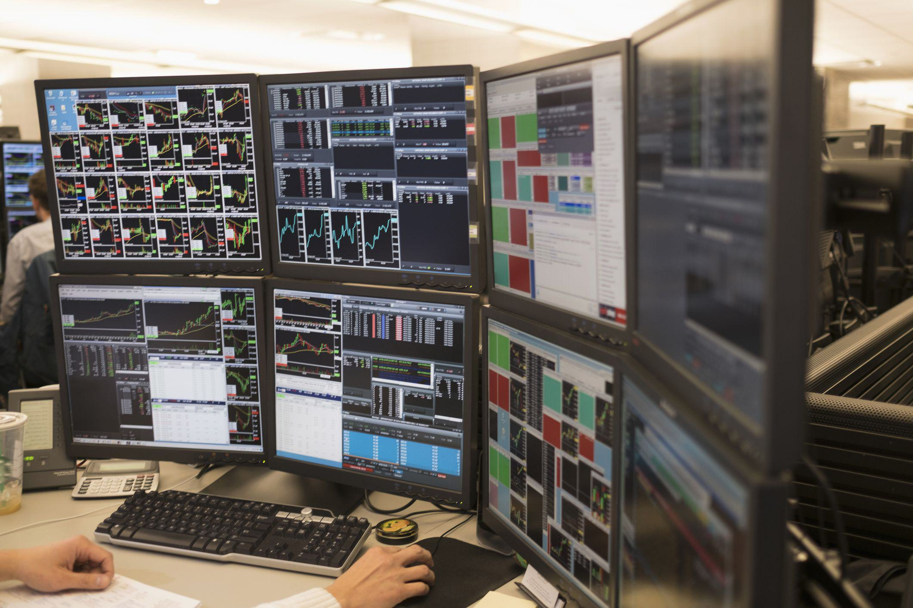

The digital age has fundamentally transformed the landscape of trading, making it significantly more accessible to both individuals and businesses. This transformation is largely driven by advancements in technology and the proliferation of trading screens. Central to these screens is Level 1 market data, which provides foundational insights into the financial markets by displaying real-time best bid-offer-volume quotes. Such data is integral for traders as it reveals the national best bid and offer (NBBO), allowing for informed decision-making.

Market accessibility has been vastly improved through the democratization of essential trading information. The availability of real-time data via the internet allows a diverse range of participants to engage in financial markets. This democratization is further evidenced by the widespread use of online trading platforms, which bring Level 1 data directly to users' devices without the need for intermediary institutions.



Algorithmic trading, also known as algo trading, leverages these technological advancements to automate trade execution based on pre-defined criteria. Algorithms can be designed to process large amounts of data rapidly, execute trades at optimal prices, and reduce human errors. Understanding trading screens and data levels is essential for navigating the complexities of modern markets, where speed and accuracy are paramount.

In summary, the digital age has ushered in an era where understanding trading data levels, particularly Level 1 market data, is crucial. Such comprehension is necessary not only for traditional trading strategies but also for the sophisticated mechanisms employed in algorithmic trading. As accessibility to market data continues to improve, traders and investors are better equipped to capitalize on opportunities within the fast-paced environments of modern financial markets.

## Table of Contents

## Understanding Level 1 Market Data

Level 1 market data is a fundamental component of modern trading screens, providing real-time insights into the highest bid and lowest ask prices for specific stocks. This data is essential for traders and investors as it presents the basic bid-offer-volume quotes required to evaluate market opportunities effectively.

The primary function of Level 1 market data is to reveal the national best bid and offer (NBBO), which constitutes the most competitive buying (bid) and selling (ask) prices available for a given stock across all exchanges. The NBBO is an essential metric for executing trades at the most advantageous prices, serving as a benchmark for trading decisions.

For most long-term investors, Level 1 data offers a sufficient overview of market dynamics, providing accessible insights without overwhelming complexity. Such investors typically employ high-level strategies that do not necessitate the deeper market depth or extensive [order book](/wiki/order-book-trading-strategies) visibility offered by advanced data levels. Instead, they use the clear and concise information of Level 1 data to make informed investment decisions over a longer time horizon.

The accessibility of Level 1 market data has increased markedly with the proliferation of online trading platforms. Broker websites and financial media portals commonly offer this data to their clients as part of their standard services, often at no additional cost. This democratization of market access plays a critical role in empowering individual traders and investors, enabling them to participate in financial markets with essential tools for decision-making.

While Level 1 data suffices for many market participants, active traders and sophisticated investors may seek further insights through more advanced data levels, such as Level 2 and Level 3. These levels provide greater depth, including order book visibility and additional price levels beyond the best bids and offers. Nonetheless, Level 1 data remains a cornerstone of market analysis, providing the essential information needed to navigate the dynamic landscape of modern financial markets.

## Market Accessibility and Trading Screens

The internet and technological advancements have democratized access to financial markets, enabling traders from all backgrounds to engage in trading activities that were once confined to institutional players. Central to this evolution are trading screens that display Level 1 market data, providing real-time information crucial for making informed decisions.

Level 1 market data is easily accessible through broker websites and financial media portals. These platforms generally offer real-time bid and ask prices, allowing traders to observe the national best bid and offer (NBBO) without incurring additional costs. This accessibility is particularly beneficial in fast-moving markets where timing is crucial. With the convenience of online platforms, traders can execute trades swiftly by responding to market changes as they occur.

The structure of market data is hierarchical, with different levels offering varying degrees of depth and insight. While Level 1 data provides the most basic information required for trading—such as the highest bid and lowest ask prices—Level 2 and Level 3 data offer more detailed views. Level 2 data reveals additional layers of market depth, including multiple bid and ask prices beyond the best available, giving traders insights into market [liquidity](/wiki/liquidity-risk-premium) and supply/demand dynamics. Level 3 data further enhances this by providing information on individual orders, useful for traders who require comprehensive market analytics.

As technological progress continues to enhance accessibility, traders have the opportunity to leverage these advanced data levels to refine their trading strategies. By incorporating insights from Level 2 and Level 3 data, traders can make more nuanced decisions, predicting potential market movements and optimizing their trading approaches.

Overall, the improved accessibility of trading screens and market data due to technological advancements empowers traders, enabling them to participate effectively in modern financial markets. As the landscape continues to evolve, the ability to synthesize information across multiple data levels will be essential for a competitive trading edge.

## Algorithmic Trading: The Role of Market Data

Algorithmic trading, often referred to as algo trading, involves using advanced algorithms to automate trading decisions and execute orders in financial markets. This modern investment strategy capitalizes on high-quality market data, which includes real-time, delayed, and historical data, to craft and refine its trading algorithms. The demand for reliable market data is a fundamental aspect of [algorithmic trading](/wiki/algorithmic-trading), as it ensures precise decision-making and efficient trade execution.

High-quality market data enhances both the speed and accuracy of trades, directly reducing slippage—the difference between the expected price of a trade and the actual price. By minimizing slippage, traders can maximize their profits. Consequently, the accuracy of real-time data is paramount in creating robust trading strategies. Traders rely on sophisticated data analytics tools to scrutinize this information, optimizing their algorithms for better performance.

Various exchanges and authorized data vendors play a crucial role in providing the essential market data that fuels algorithmic trading systems. Exchanges, such as Nasdaq and the New York Stock Exchange (NYSE), offer different tiers of data, accommodating both institutional and individual trader needs. Authorized vendors aggregate this data and often provide enhanced services through comprehensive data packages, which cater to specific trading requirements.

For an algorithmic trader, maintaining a competitive edge requires constantly updating and fine-tuning their trading models and strategies based on fresh market data. Markets are dynamic, and algorithms must adapt to new conditions, patterns, and anomalies to maintain profitability. Such adaptability often involves [machine learning](/wiki/machine-learning) techniques, where algorithms learn from historical data and adjust to current market conditions in real-time.

In the context of algo trading, Python is a highly popular programming language due to its extensive libraries and frameworks, which facilitate data analysis and algorithm development. The following example demonstrates how Python can be used to receive real-time market data and execute a basic trading strategy:

```python
import requests
import pandas as pd

def fetch_market_data(stock_symbol):
    url = f"https://api.example.com/marketdata/{stock_symbol}"
    response = requests.get(url)
    data = response.json()
    df = pd.DataFrame(data)
    return df

def simple_moving_average_strategy(df):
    df['SMA'] = df['close'].rolling(window=20).mean()
    df['Signal'] = 0
    df['Signal'][20:] = np.where(df['close'][20:] > df['SMA'][20:], 1, -1)
    return df

# Fetch market data for a specific stock symbol
stock_data = fetch_market_data('AAPL')

# Execute a simple moving average strategy
trading_signals = simple_moving_average_strategy(stock_data)
```

The constant evolution of trading strategies stems from the continuous influx of market data. Thus, traders not only require access to high-quality data but must also possess the analytical capabilities to interpret and apply it effectively in their trading algorithms. By staying informed and adaptable, algorithmic traders can significantly enhance their trading strategies and achieve success in today's fast-paced financial markets.

## Choosing the Right Market Data Sources

Market data is essential for traders and analysts to make informed decisions. It can be obtained from various sources, each with its own advantages and constraints.

Stock exchanges, such as the New York Stock Exchange (NYSE), are primary sources of market data. They offer different data levels, providing various depths of market information. However, accessing data directly from stock exchanges can be costly, especially for retail traders, due to high fees associated with direct data feeds and the infrastructure required to handle massive data volumes. Nevertheless, the data obtained is often raw and unfiltered, making it highly valuable for those who need real-time insights into the markets.

Authorized data vendors serve as intermediaries between stock exchanges and traders. They compile, standardize, and distribute data to various clients. These vendors provide comprehensive data packages through subscription models that cater primarily to institutional clients with the resources to handle extensive data needs. A typical offering might include historical data, real-time feeds, analytics, and customizable alerts. The advantage of using authorized vendors is the reliability and breadth of data, but this comes at a higher cost compared to other sources.

Broker platforms have made significant strides in making market data accessible to individual investors. Many brokers provide Level 1 and Level 2 data, often at little to no additional cost for account holders. These platforms often include APIs and user-friendly interfaces, allowing traders to seamlessly integrate data into their trading strategies. This option is particularly economical for retail traders who need basic data and reliable interfaces without incurring substantial costs.

Selecting the appropriate market data source depends largely on the trader's individual needs and budget. For retail traders with limited resources, brokers offer a cost-effective solution to access basic market data. Institutional investors, on the other hand, may prefer the comprehensive and detailed offerings of authorized data vendors. Meanwhile, traders and firms that require the highest level of detail and speed may choose to invest in direct feeds from stock exchanges despite the higher expense.

Ultimately, the decision on which market data source to utilize should consider the balance between cost and the depth of insights needed. As market strategies evolve, having access to the right data can provide a significant edge.

## Conclusion

In today's trading environment, where data and technological advancements play a central role, understanding the various levels of market data has become essential. At its most basic, Level 1 market data is foundational, offering key information such as the highest bid and lowest ask prices alongside their respective volumes, which are crucial for many trading strategies. This data's broad accessibility enables a wide range of investors, from novices to seasoned professionals, to make informed decisions with a solid understanding of market dynamics.

The expansion of algorithmic trading underscores the necessity of procuring high-quality and dependable market data. These algorithms rely heavily on real-time and accurate data to make swift trading decisions that can significantly impact profitability. Reliable data sources reduce the chances of slippage—mismatches between expected and actual trade execution prices—thus maximizing returns. As a result, traders keen on developing effective algorithmic strategies must ensure they have access to such critical data.

However, understanding and obtaining different layers of market data comes with financial considerations. Traders must judiciously weigh the costs associated with acquiring advanced market data against the advantageous insights they provide. Level 2 and Level 3 data, for example, offer more detailed market depth information but typically come at a higher price, requiring traders to evaluate whether these insights justify the expenditure relative to their specific trading objectives and methods.

Ultimately, by utilizing the appropriate tools and leveraging the right market data, traders can refine their strategies. This strategic enhancement equips them to capitalize on opportunities within today's complex financial markets efficiently, ensuring they remain competitive and successful in an ever-evolving trading landscape.

## References & Further Reading

[1]: ["Advances in Financial Machine Learning"](https://www.amazon.com/Advances-Financial-Machine-Learning-Marcos/dp/1119482089) by Marcos Lopez de Prado

[2]: ["Evidence-Based Technical Analysis: Applying the Scientific Method and Statistical Inference to Trading Signals"](https://www.amazon.com/Evidence-Based-Technical-Analysis-Scientific-Statistical/dp/0470008741) by David Aronson

[3]: ["Machine Learning for Algorithmic Trading"](https://github.com/stefan-jansen/machine-learning-for-trading) by Stefan Jansen

[4]: ["Quantitative Trading: How to Build Your Own Algorithmic Trading Business"](https://www.amazon.com/Quantitative-Trading-Build-Algorithmic-Business/dp/1119800064) by Ernest P. Chan

[5]: ["Algorithms for Hyper-Parameter Optimization."](https://papers.nips.cc/paper/4443-algorithms-for-hyper-parameter-optimization.pdf) Advances in Neural Information Processing Systems 24, by Bergstra, J., Bardenet, R., Bengio, Y., & Kégl, B. (2011).