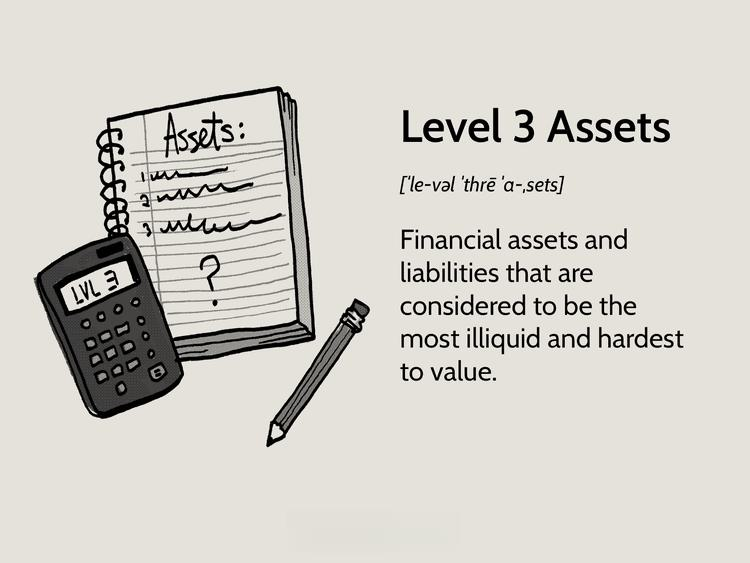

Understanding the landscape of financial assets is crucial for successful investing and trading. Financial markets offer a diverse array of assets, each with its unique characteristics and roles within an investment portfolio. Among these, Level 2 assets present a particularly intriguing category due to their valuation complexities and lack of regular market pricing. 

This article aims to provide a comprehensive comparison of various financial assets, placing a special emphasis on Level 2 assets. Level 2 assets, such as corporate bonds, interest rate swaps, and certain derivatives, derive their value from observable market inputs rather than direct market pricing. This lack of straightforward pricing requires nuanced valuation techniques, which can be both a challenge and an opportunity for investors and traders seeking to diversify their portfolios.



In addition to exploring these asset classes, the article will examine the growing field of algorithmic trading and its significance in the modern financial ecosystem. Algorithmic trading makes use of predefined rules for executing trades at high speed and volume, leveraging complex data analytics to optimize outcomes. Understanding how algorithmic trading interacts with different types of financial assets, especially Level 2 assets, is essential for professional investors and traders who wish to effectively navigate today's financial markets.

By the end of this article, readers will have gained insights into the valuation and trading complexities associated with Level 2 assets and the role of algorithmic strategies in managing these complexities. This knowledge is fundamental for making informed decisions in the ever-evolving financial landscape.

## Table of Contents

## Overview of Financial Assets

Financial assets represent claims to future cash flows and encompass a wide range of instruments that allow investors to potentially earn returns. The primary categories of financial assets are stocks, bonds, and derivatives, each distinct in its nature and function within an investment portfolio.

**Stocks** represent ownership in a corporation, giving shareholders a claim on part of the company’s assets and earnings. Stocks are often divided into common and preferred stocks, with common stocks providing voting rights and a residual claim on assets, while preferred stocks typically offer fixed dividends and higher claims in the event of liquidation. Stocks are considered growth assets and can contribute significantly to portfolio appreciation over time.

**Bonds** are debt instruments that entities such as governments or corporations issue to raise capital. When an investor buys a bond, they are lending money to the issuer in return for periodic interest payments and the return of the bond’s face value upon maturity. Bonds are typically considered less volatile than stocks and are valued for their ability to provide steady income through interest payments.

**Derivatives** are complex financial instruments whose value is derived from an underlying asset, index, or rate. These include options, futures, and swaps, among others. Derivatives are mainly used for hedging risks or for speculative purposes, allowing investors to leverage positions or manage exposure to various financial risks without needing to trade the underlying asset directly.

The importance of these assets in diversifying an investment portfolio cannot be overstated. Diversification aims to minimize risk by allocating investments across various financial assets, thereby reducing the impact of [volatility](/wiki/volatility-trading-strategies) in any one category. A well-diversified portfolio balances the higher potential returns and risks of stocks with the more stable but potentially lower returns of bonds, while derivatives can provide additional strategies for risk management or enhanced returns.

Moreover, financial assets are grouped into levels based on their valuation methods and market [liquidity](/wiki/liquidity-risk-premium). This classification is crucial as it pertains to the asset's valuation reliability:

- **Level 1 assets** are those with observable inputs and liquid markets, enabling easy valuation through quoted prices in active markets, such as listed stocks or government bonds.
- **Level 2 assets** are characterized by having inputs other than quoted prices that are directly or indirectly observable for the asset or liability and require some level of estimation. These include corporate bonds and certain derivatives.
- **Level 3 assets** are those with unobservable inputs that rely heavily on the entity's own assumptions. These assets include private equity investments and certain complex derivatives.

Understanding these classifications helps investors assess the valuation accuracy and liquidity of their holdings, aiding in constructing a more resilient portfolio.

## Defining Level 2 Assets

Level 2 assets are categorized as financial instruments that do not have readily observable market prices. Unlike Level 1 assets, which are actively traded and have a transparent market price, Level 2 assets require more complex valuation methods due to their limited liquidity and infrequent trading. These assets are typically valued using observable inputs other than quoted prices, such as data from similar instruments or market prices prevailing in related markets.

The estimation of fair value for Level 2 assets often involves comparison with similar securities for which market data is available. For instance, corporate bonds might not have a constant market price due to less frequent trading compared to government bonds. Therefore, their valuation can be approached by observing the prices of government bonds with similar maturities and credit ratings, adjusted for specific differences.

Interest rate swaps are another example of Level 2 assets. These are derivatives used to exchange cash flows based on different interest rates, and their valuation depends on observable market inputs like the yield curve, [interest rate](/wiki/interest-rate-trading-strategies) volatility, and credit spreads. Since these inputs can be obtained from active markets, they provide a foundation for estimating the swaps' fair value, albeit not directly.

Certain derivatives also fall under Level 2 assets, especially when they derive their value from less actively traded underlying assets. For example, over-the-counter (OTC) options might lack a direct market price but can be valued based on models that incorporate observable inputs such as implied volatilities and interest rates.

In summary, Level 2 assets require valuation techniques that utilize observable market inputs rather than direct market prices. This reliance on market data from similar securities introduces an element of professional judgment to accurately reflect the fair value. While not as straightforward as Level 1 assets, Level 2 assets still maintain a significant degree of valuation reliability, supported by observable data.

## Valuation Techniques for Level 2 Assets

Level 2 assets are classified as financial instruments that require alternative means for valuation due to the absence of a direct market price. This absence of market price necessitates methods such as matrix pricing and discounted cash flow (DCF) to estimate their fair value.

Matrix pricing involves the comparison of similar securities to determine the market price of a less frequently traded asset. This technique relies heavily on available reference prices from comparable instruments. For instance, if a corporate bond does not trade actively, matrix pricing may utilize the prices of similar bonds based on issuer credit quality, duration, and coupon rate. The accuracy of matrix pricing thus closely hinges on the availability and reliability of data concerning comparable securities.

Discounted cash flow (DCF) analysis is another pivotal technique for valuing Level 2 assets, involving the estimation of future cash flows and discounting them to present value using a suitable discount rate. This method requires careful assessment of inputs such as expected cash flows, growth assumptions, and the risk-adjusted discount rate. DCF's precision is contingent upon accurate forecasts of these inputs, which can be inherently uncertain.

The importance of observable market inputs, such as interest rates and credit spreads, is paramount in the valuation process of Level 2 assets. Interest rates influence the discount rates used in DCF analysis, while credit spreads provide insight into the risk premium required by the market for holding a particular security. These inputs serve as foundational elements in constructing accurate valuations, and any changes in these variables can have significant effects on asset valuation.

Furthermore, professional judgment plays a critical role in valuing Level 2 assets. Given that these assets often lack direct market comparables, financial analysts must exercise significant expertise and discretion in choosing assumptions and models. This includes evaluating the quality of data, selecting appropriate comparable instruments for matrix pricing, and applying relevant discount rates in DCF calculations. Analysts must also remain vigilant to changes in economic conditions and market sentiment, which can impact assumptions and valuations.

In conclusion, the valuation of Level 2 assets necessitates a multifaceted approach combining matrix pricing and DCF methods with observable market inputs. Analysts must exhibit a strong acumen in both quantitative techniques and qualitative judgment to navigate the complexities of these financial instruments effectively.

## Algo Trading: An Introduction

Algorithmic trading, often referred to as algo trading, automates trade execution at high speeds and volumes using pre-programmed instructions. These instructions are based on variables such as timing, price, quantity, or any mathematical model. The defining characteristic of [algorithmic trading](/wiki/algorithmic-trading) is its ability to backtest strategies and operate without human intervention, allowing traders to execute large numbers of orders simultaneously and more effectively than manual trading methods.

The optimization of trading strategies is a significant area where algorithmic trading excels. By leveraging vast amounts of market data, algorithms identify and exploit market inefficiencies, enhancing the overall profitability of trading activities. For instance, statistical [arbitrage](/wiki/arbitrage) exploits price discrepancies between securities, and the high-frequency nature of algorithms allows traders to profit from minute price movements within milliseconds. The algorithms are designed to react to market conditions instantaneously, which human traders might miss due to the speed and [volume](/wiki/volume-trading-strategy) of data involved.

Algorithmic trading interacts with various asset classes, creating opportunities for enhanced efficiency and precision. With stocks, the algorithms analyze a multitude of market factors, ranging from real-time price changes to historical data patterns. This allows for strategies like mean reversion, [momentum](/wiki/momentum) trading, or market-making. In derivatives markets, algorithms can dynamically adjust options pricing models to account for real-time market volatility, optimizing their potential for profit or hedge risks.

Level 2 assets, which lack frequent market pricing, present unique challenges and opportunities for algorithmic trading. Algorithms can be tailored to navigate the opaque pricing of these assets. They use data inputs and models to estimate the fair value of these assets and execute trades accordingly. The interaction with Level 2 assets often involves sophisticated strategies, like spread trading, where algorithms buy and sell related securities to profit from pricing inefficiencies.

In conclusion, algorithmic trading has transformed trading strategies by enhancing speed, accuracy, and efficiencies across various asset classes including Level 2 assets. This interaction not only broadens the scope of trading opportunities but also introduces complexities that require continual refinement of algorithms to adapt to evolving market conditions.

## Algorithmic Strategies for Trading Level 2 Assets

Algorithmic trading involves the use of computerized systems to execute trades based on pre-set strategies, leveraging technology to achieve high efficiency and speed. For Level 2 assets, which lack regular market pricing, these models can be particularly beneficial due to their ability to manage large volumes of data and identify patterns that human traders might miss. 

One strategy that algorithmic models employ is spread trading. This approach involves making simultaneous purchases and sales of related securities to capitalize on price differences. For Level 2 assets, spread trading can help manage the valuation uncertainty by pairing less liquid securities with more liquid benchmarks. Algorithms can efficiently identify potential spreads between similar or related financial instruments, such as two different corporate bonds or interest rate swaps, optimizing for anticipated price convergence.

Algorithms can also address the challenges of valuing Level 2 assets by incorporating advanced data analysis techniques. For instance, [machine learning](/wiki/machine-learning) models like regression analysis or neural networks can be adapted to predict the fair value of these assets based on historical performance, observable market inputs, and other relevant data. This predictive capability can guide decision-making in trading strategies, enabling more accurate pricing models even in the absence of daily market prices.

Python, a popular programming language in quantitative finance, can be used to implement these strategies. Here is a basic example of a Python script to conduct spread trading:

```python
import numpy as np
import pandas as pd

# Sample data: Prices of two related financial assets.
price_asset1 = np.array([105, 108, 110, 107, 109])
price_asset2 = np.array([102, 106, 108, 103, 105])

# Calculate the spread between the two assets
spread = price_asset1 - price_asset2

# Define a trading threshold
threshold = 2

# Simple trading strategy based on the spread
def trade_spread(spread, threshold):
    trades = []
    for i in range(1, len(spread)):
        if spread[i-1] > threshold and spread[i] <= threshold:
            trades.append("Buy Asset 1, Sell Asset 2")
        elif spread[i-1] < -threshold and spread[i] >= -threshold:
            trades.append("Sell Asset 1, Buy Asset 2")
        else:
            trades.append("Hold")

    return trades

# Execute the strategy
trades = trade_spread(spread, threshold)
pd.DataFrame({'Spread': spread, 'Action': trades})
```

This code calculates the spread between two assets and suggests trading actions when the spread crosses a certain threshold. Algorithms can handle more complex data, integrating multiple inputs to refine strategies continuously.

Overall, algorithms offer a scalable and systematic approach to navigating the complexity and valuation challenges of Level 2 assets, enhancing the efficiency of trading activities. They provide the flexibility needed to adjust to evolving market conditions, making them an invaluable tool for modern asset managers and traders.

## Challenges in Algo Trading and Level 2 Asset Valuation

Algorithmic trading and the valuation of Level 2 assets present several challenges for financial professionals. One significant challenge is obtaining reliable data for Level 2 assets, which do not have regular market pricing. The absence of active market prices complicates the valuation process and requires the use of observable market inputs such as interest rates and credit spreads. However, these inputs can exhibit variability and may not always reflect the real-time market conditions accurately.

Moreover, the inherent risks and limitations in algorithmic models further complicate trading strategies involving Level 2 assets. Algorithms rely on historical data to identify patterns and make trading decisions. However, past market behavior may not always predict future movements, especially during periods of market turbulence or unexpected economic events. This reliance on historical data, coupled with the potential for overfitting models to past trends, can lead to ineffective or risky trades.

Navigating the regulatory and ethical aspects of algorithmic trading introduces additional complexity. The regulatory environment governing financial markets is dynamic and often lagging the rapid technological advancements in trading. Compliance with regulatory requirements, such as the Securities and Exchange Commission (SEC) and Financial Industry Regulatory Authority (FINRA) guidelines, is crucial to mitigate legal risks. Furthermore, ethical considerations in developing and deploying algorithmic strategies necessitate transparency and fairness to prevent market manipulation and ensure investor protection.

To address these challenges, it is essential for financial professionals to adopt robust risk management practices, ensure continuous monitoring and updating of algorithms, and maintain compliance with regulatory standards. Additionally, fostering an ethical culture within trading teams encourages responsible trading practices and promotes a sustainable financial market environment.

## The Future of Financial Assets and Algo Trading

The financial markets are constantly evolving, and Level 2 assets and algorithmic trading are poised to play a significant role in their future. As markets become increasingly complex, Level 2 assets, which lack regular market pricing, will demand more sophisticated valuation techniques and trading strategies. This evolution will be driven by technological advancements and data analytics that are reshaping asset management.

The growing role of technology and data analytics in asset management is one of the most significant trends affecting financial markets. Advanced technology enables the collection, storage, and processing of massive amounts of financial data. This data serves as the foundation for building models that can estimate the fair value of Level 2 assets more accurately. Techniques such as machine learning and [artificial intelligence](/wiki/ai-artificial-intelligence) (AI) offer enhanced capabilities in analyzing data patterns and predicting asset pricing. By applying these technologies, asset managers can identify mispriced assets and arbitrage opportunities in real-time, thereby optimizing their portfolios.

In addition, data analytics provides deeper insights into market behavior, enhancing the accuracy of pricing models for Level 2 assets. For example, credit spreads, interest rates, and economic indicators can be analyzed to fine-tune valuation models. This is particularly relevant for complex assets like interest rate swaps and certain derivatives, where market data may be scarce. Python, with its powerful libraries such as NumPy, pandas, and scikit-learn, is widely used to handle financial data and develop such models. A simple Python code snippet to compute the moving average of a financial time series is shown below:

```python
import pandas as pd

# Sample financial data as a pandas DataFrame
data = pd.DataFrame({'price': [100, 102, 101, 104, 107, 110]})

# Calculate the moving average
data['moving_average'] = data['price'].rolling(window=3).mean()

print(data)
```

Evolving algorithmic strategies are also crucial in adapting to future market changes. Algorithms can process vast datasets at high speeds, allowing for enhanced trading efficiency, especially in markets where Level 2 assets operate. As these strategies advance, trading systems will become more adept at handling the nuances of assets with limited market pricing information. Strategies like spread trading can be enhanced using algorithmic systems that leverage real-time data analytics to take advantage of temporary market inefficiencies.

Moreover, the adaptation of these algorithms to incorporate artificial intelligence will enable them to learn from market scenarios and continuously improve decision-making processes. This adaptive nature is essential for navigating future market conditions that are likely to be characterized by increased volatility and complexity.

In conclusion, the future of financial assets and algorithmic trading will be defined by their ability to adapt to technological advancements and the efficient use of data analytics. As these trends continue, professionals in the financial industry must stay informed and agile to capitalize on the opportunities and challenges presented by Level 2 assets and evolving trading strategies.

## Conclusion

Level 2 assets, characterized by their lack of regular market pricing, require meticulous valuation techniques and professional judgment to ascertain their fair value. These assets, including corporate bonds, interest rate swaps, and certain derivatives, are pivotal in constructing diversified investment portfolios. Algorithmic trading, with its capacity to execute trades with speed and precision, presents a sophisticated interface for engaging with these complex asset classes. 

As we navigate the complexities of financial markets, the effective integration of technology in trading strategies becomes increasingly crucial. Algorithms can optimize the trading of Level 2 assets by leveraging historical and real-time market data to handle the nuances of assets without regular pricing efficiently. However, the effective implementation of such strategies necessitates careful selection of assets and a deep understanding of the limitations and challenges inherent in algorithmic trading. These challenges include the acquisition of reliable data and navigating the regulatory landscape. 

Moreover, as financial markets continue to evolve, staying informed and adaptable is indispensable. This includes keeping abreast of technological advancements, refining asset valuation and trading strategies, and adhering to ethical standards in trading. Ongoing education in finance and technology will not only enhance the capability to navigate these ever-changing waters but will also facilitate more informed decision-making processes. This continuous learning journey is vital to harnessing the potential of both Level 2 assets and algorithmic trading, ensuring sustained success in the investment landscape.

## References & Further Reading

[1]: ["Advances in Financial Machine Learning"](https://www.amazon.com/Advances-Financial-Machine-Learning-Marcos/dp/1119482089) by Marcos Lopez de Prado

[2]: ["Quantitative Trading: How to Build Your Own Algorithmic Trading Business"](https://books.google.com/books/about/Quantitative_Trading.html?id=j70yEAAAQBAJ) by Ernest P. Chan

[3]: ["Machine Learning for Algorithmic Trading"](https://github.com/PacktPublishing/Machine-Learning-for-Algorithmic-Trading-Second-Edition) by Stefan Jansen

[4]: ["Evidence-Based Technical Analysis: Applying the Scientific Method and Statistical Inference to Trading Signals"](https://www.amazon.com/Evidence-Based-Technical-Analysis-Scientific-Statistical/dp/0470008741) by David Aronson

[5]: Bergstra, J., Bardenet, R., Bengio, Y., & Kégl, B. (2011). ["Algorithms for Hyper-Parameter Optimization."](https://dl.acm.org/doi/10.5555/2986459.2986743) Advances in Neural Information Processing Systems 24.