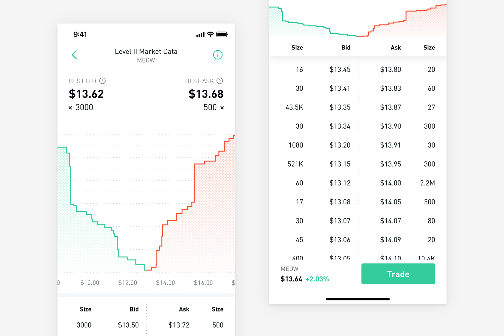

In the fast-paced world of stock trading, understanding market dynamics is crucial for making informed decisions that can lead to profitable outcomes. One important tool that traders use to gain a comprehensive understanding of market activity is Level 2 market data. Providing a detailed view of the Nasdaq order book, Level 2 data offers insights into price movements and market depth that go beyond the surface-level information available through regular trading platforms.

Level 2 data presents real-time reporting of all bid and ask prices from various market participants, including market makers and other trading entities. This information is invaluable for traders as it offers a detailed perspective on buy and sell pressures, showing multiple levels of bids and asks at different price points. Such granularity helps traders identify potential support and resistance levels, giving them the ability to anticipate market movements with greater accuracy.



This article explores how access to Level 2 market data can meaningfully enhance stock trading strategies. Through advanced insights into the order book, traders are better positioned to execute trades based on a deeper understanding of market sentiment and liquidity. Furthermore, algorithmic trading has become integral to exploiting these data-driven insights effectively. Utilizing advanced software, algorithmic trading systems can automate trades based on criteria derived from Level 2 data, enabling high-speed execution that outpaces manual trading.

With the integration of Artificial Intelligence (AI), trading strategies can be optimized with an unprecedented level of precision and speed. AI can process vast amounts of Level 2 data rapidly, identifying patterns and opportunities that may not be apparent through simple observation. By applying AI-enhanced analysis to Level 2 data, traders can gain a competitive edge in the marketplace, developing and adjusting strategies in real-time to account for evolving market conditions.

This piece provides a comprehensive overview of how Level 2 market data on the Nasdaq can transform trading activities, particularly when leveraged through algorithmic trading platforms. It aims to empower both novice and experienced traders by equipping them with knowledge and strategies to navigate the complex landscape of modern stock trading successfully.

## Table of Contents

## Understanding Level 2 Market Data

Level 2 market data, formally recognized as the Nasdaq Quotation Dissemination Service (NQDS), offers a richer dataset compared to basic Level 1 quotes. Unlike Level 1, which provides the best bid and ask prices for a security, Level 2 data provides a comprehensive view of market depth. It showcases several price levels on both the buy (bid) and sell (ask) sides, along with the order sizes associated with those prices.

### Market Depth

Market depth is a critical component of Level 2 data, giving traders insight into the [liquidity](/wiki/liquidity-risk-premium) and potential [volatility](/wiki/volatility-trading-strategies) of a stock. It is illustrated through an [order book](/wiki/order-book-trading-strategies), where multiple layers of prices and corresponding quantities are displayed. For example, an order book for a stock might show the following:

| Price    | Bid Size | Ask Size |
|----------|----------|----------|
| $99.80   | 500      | -        |
| $100.00  | 300      | 600      |
| $100.20  | -        | 200      |

In this table, the bid sizes indicate the number of shares traders are willing to purchase at different prices, while the ask sizes show the number of shares available for sale.

### Buy and Sell Pressure

By analyzing Level 2 data, traders gain the ability to ascertain buy and sell pressures within the market. A significant concentration of buy orders at a particular price point may suggest a support level, implying that the price could stabilize or rebound, as demand outweighs supply. Conversely, a dominance of sell orders may indicate a resistance level, where the price might struggle to rise due to excess supply.

### Components of Level 2 Data

Level 2 data is defined by several essential components:

1. **Market Makers**: These are participants that provide liquidity by continuously offering to buy and sell securities. They are pivotal in facilitating trades and stabilizing market prices.
2. **Bid/Ask Sizes**: These quantities at various price levels show how many shares are available to be bought or sold at those prices.
3. **Price Levels**: The various prices listed on both the bid and ask sides that present different levels of supply and demand.

With this detailed perspective, traders can construct a nuanced understanding of the potential movements in a stock's price by examining the structured layout of the order book. Such insights are invaluable for identifying strategic entry and [exit](/wiki/exit-strategy) points, ultimately aiding in the development of more informed and effective trading strategies.

## Benefits of Level 2 Data in Stock Trading

Access to level 2 market data offers a multitude of advantages for traders aiming to enhance their decision-making capabilities and refine their trading strategies. By providing a granular view of the order book, level 2 data allows traders to identify key support and resistance levels by observing the concentration of buy and sell orders at various price points. This visibility into order flow dynamics enables traders to predict potential price movements with greater accuracy.

By analyzing the market depth represented in level 2 data, traders can gain insights into potential market manipulations. Such data may reveal large buy or sell orders that could influence price action, allowing traders to adjust their strategies to mitigate risks associated with market volatility or artificial price inflation. The ability to recognize these patterns is crucial in developing robust trading strategies that can withstand unexpected market shifts.

Furthermore, level 2 data aids in the effective execution of trades by reducing slippage—the difference between the expected price of a trade and the actual price after execution. By understanding the quantities available at each price level, traders can strategically place their orders to ensure sufficient liquidity, thus maximizing profit potential and minimizing the cost of large trades. 

Additionally, level 2 data allows for more precise timing of trades, ensuring that entry and exit points are chosen based on comprehensive market insights. This level of detail supports traders in formulating strategies that can adapt to changing market conditions, ultimately leading to improved trading performance and success.

## Algorithmic Trading and Level 2 Data

Algorithmic trading refers to the use of advanced software systems to automate trading decisions, leveraging predefined criteria to execute trades efficiently and at high speeds. In this context, Level 2 market data plays a crucial role. This data provides traders not only with the current bid and ask prices but also with the market depth, showcasing multiple levels of bids and asks. By having access to the detailed information that Level 2 data offers, [algorithmic trading](/wiki/algorithmic-trading) platforms are empowered to make more informed and precise trading decisions. 

For instance, platforms like UltraAlgo are designed with sophisticated tools that utilize Artificial Intelligence (AI) to backtest trading strategies against historical market data. This process involves running a strategy with past data to understand how it might have performed, allowing traders to optimize their strategies before actual implementation. Such AI-driven [backtesting](/wiki/backtesting) is pivotal as it allows traders to evaluate the performance of their strategies, adjust parameters, and reduce potential risks before they commit real capital to trades. 

The incorporation of AI into algorithmic trading further allows for real-time analysis of Level 2 data to determine precise entry and exit points in trading strategies. Advanced algorithms can process vast amounts of market depth information quickly, assessing buy and sell pressures to make rapid decisions. For example, by analyzing data on bid and ask sizes at different price levels, an AI model could predict potential market movements and make trading decisions without human intervention.

Python, with its numerous libraries like pandas, NumPy, and [machine learning](/wiki/machine-learning) tools, is frequently used in the development of algorithmic trading systems due to its capability to handle large datasets and perform complex calculations efficiently. Below is a simple example of how Python might be used to assess market depth from Level 2 data:

```python
import pandas as pd

# Example Level 2 market data
data = {'price': [101, 102, 103, 104],
        'bid_size': [200, 150, 300, 100],
        'ask_size': [250, 100, 350, 80]}

df = pd.DataFrame(data)

# Calculate imbalance which can be an indicator of market pressure
df['imbalance'] = df['bid_size'] - df['ask_size']

# Determine trading signal based on market pressure
def trading_signal(row):
    if row['imbalance'] > 0:
        return 'Buy'
    elif row['imbalance'] < 0:
        return 'Sell'
    else:
        return 'Hold'

df['signal'] = df.apply(trading_signal, axis=1)

print(df[['price', 'signal']])
```

This simple script illustrates how a trader might use Level 2 data to generate trading signals based on market imbalance. By integrating more sophisticated models and AI algorithms, traders can further enhance the precision and reliability of these signals. 

Ultimately, the fusion of AI with algorithmic trading and the insights from Level 2 data provides traders with a substantial edge, enabling them to implement strategies with higher accuracy and efficacy, thereby optimizing their trading performance and minimizing risk.

## Implementing Level 2 Data in Trading Strategies

To effectively implement level 2 data in trading strategies, traders must first develop a solid understanding of how to read and interpret the order book and market depth. The order book provides a real-time display of bids and asks, revealing where buyers and sellers are positioned at different price levels. By analyzing this information, traders can gain insights into market liquidity and the potential movement of stock prices.

One key tactic in utilizing level 2 data is identifying hidden orders, which may not be immediately apparent in the order book. Institutional investors often use hidden orders to execute large trades without significantly impacting the market. By closely monitoring changes in bid and ask sizes, traders can infer the presence of these hidden orders, gaining a tactical advantage in anticipating price movements.

Refining entry and exit points is another crucial aspect of using level 2 data effectively. Traders can use the detailed market depth information to pinpoint optimal points for entering or exiting a trade, ensuring they do so when there is sufficient liquidity to support their transaction. This minimizes the risk of slippage and helps in executing trades at desired price levels.

Moreover, a well-rounded trading strategy can be developed by integrating level 2 data insights with technical and [fundamental analysis](/wiki/fundamental-analysis). Technical analysis involves examining historical price patterns and indicators to predict future movements, while fundamental analysis considers the intrinsic value based on financial statements and economic indicators. For example, a trader might use a technical indicator such as moving averages in conjunction with level 2 data to confirm a trend before placing a trade. They could also analyze changes in the level 2 order book alongside news about the company to validate fundamental analysis conclusions.

By marrying the quantitative data from level 2 with qualitative analyses, traders can create strategies that are adaptable to different market conditions. This integrated approach provides a more comprehensive view of market dynamics, enabling traders to make informed decisions and improve their trading performance. Thus, understanding and applying level 2 data can significantly enhance the effectiveness of trading strategies, offering a competitive edge in the fast-paced world of stock trading.

## Conclusion

Level 2 market data, also known as the Nasdaq Quotation Dissemination Service, provides crucial insights for traders seeking to adeptly navigate the intricacies of stock trading on the Nasdaq exchange. By offering a detailed view of the order book, including multiple layers of bid and ask prices alongside the quantities available at each price level, traders can gauge the depth of market interest and make more informed predictions about future price movements. This granular visibility into market behaviors allows traders to spot potential support and resistance levels, which can significantly improve the timing and effectiveness of trading decisions.

Integrating Level 2 data with algorithmic trading platforms has become increasingly important for both analyzing trends and refining trading strategies. Advanced platforms equipped with algorithmic capabilities and AI can process this complex data set more efficiently, aiding in decision-making through enhanced analytics. AI-driven tools can backtest and optimize trading strategies by simulating how they would perform using historical data, reducing the potential for human error and improving the reliability of predicted outcomes.

Both novice and experienced traders stand to benefit from a comprehensive understanding of Level 2 data, as it enables more precise execution of trades and enhances overall trading performance. Novices can learn to interpret market dynamics with greater clarity, while seasoned traders can fine-tune their strategies and identify subtle market shifts that might otherwise go unnoticed.

In conclusion, staying informed by utilizing Level 2 data empowers traders to seize market opportunities effectively. By leveraging the right tools and incorporating this high-resolution data into their strategic arsenal, traders can achieve superior investment outcomes and sustain a competitive edge in the volatile stock market environment.

## References & Further Reading

[1]: Bergstra, J., Bardenet, R., Bengio, Y., & Kégl, B. (2011). ["Algorithms for Hyper-Parameter Optimization."](https://dl.acm.org/doi/10.5555/2986459.2986743) Advances in Neural Information Processing Systems 24.

[2]: ["Advances in Financial Machine Learning"](https://www.amazon.com/Advances-Financial-Machine-Learning-Marcos/dp/1119482089) by Marcos Lopez de Prado

[3]: ["Evidence-Based Technical Analysis: Applying the Scientific Method and Statistical Inference to Trading Signals"](https://www.amazon.com/Evidence-Based-Technical-Analysis-Scientific-Statistical/dp/0470008741) by David Aronson

[4]: ["Machine Learning for Algorithmic Trading"](https://github.com/stefan-jansen/machine-learning-for-trading) by Stefan Jansen

[5]: ["Quantitative Trading: How to Build Your Own Algorithmic Trading Business"](https://www.amazon.com/Quantitative-Trading-Build-Algorithmic-Business/dp/1119800064) by Ernest P. Chan