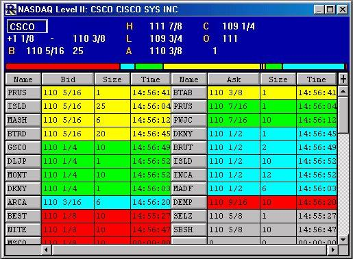

## Table of Contents

## What is Level 2 market data?

Level 2 market data is information that shows more details about what's happening in the stock market than just the basic price and volume. It includes the best bid and ask prices from different places where stocks are traded, like different stock exchanges. This data helps traders see the full picture of supply and demand for a stock at different price levels. It's like looking at a detailed map instead of just knowing the final destination.

Traders use Level 2 data to make better decisions about buying and selling stocks. By seeing all the different bid and ask prices, they can guess where the stock price might go next. For example, if there are a lot of people wanting to buy a stock at a certain price, it might mean the stock price could go up soon. This extra information can be really helpful for people who trade a lot and need to understand the market better.

## How does Level 2 data differ from Level 1 data?

Level 1 data gives you the basic information about a stock, like its current price and the total number of shares that were traded recently. It's like looking at a scoreboard that shows you the score and how many points were scored in the last play. This data is good for people who just want to know the basics without getting into the details.

On the other hand, Level 2 data goes deeper and shows you more than just the current price and [volume](/wiki/volume-trading-strategy). It includes a list of all the buy and sell orders for the stock from different places where it's traded. This means you can see not just the best price someone is willing to pay or sell at, but also other prices people are interested in. It's like having a detailed map of the game, showing you where all the players are and what they're planning to do next. This extra information can help traders make smarter decisions about when to buy or sell.

## Why is Level 2 market data important for trading on Nasdaq?

Level 2 market data is really important for trading on Nasdaq because it gives traders a lot more information than just the basic price and volume. On Nasdaq, stocks are traded in many different places, and Level 2 data shows all the buy and sell orders from these places. This means traders can see not just the best price someone is willing to pay or sell at, but also other prices people are interested in. This extra information helps traders understand the supply and demand for a stock better, which can help them make smarter decisions about when to buy or sell.

For example, if a trader sees a lot of people wanting to buy a stock at a certain price on Nasdaq, it might mean the stock price could go up soon. This kind of detailed information can be really helpful for people who trade a lot and need to understand the market better. By using Level 2 data, traders can get a clearer picture of what's happening in the market and make better guesses about where the stock price might go next.

## How can traders access Level 2 market data on Nasdaq?

Traders can access Level 2 market data on Nasdaq through various trading platforms and brokerage services that offer this level of detail. Many professional trading platforms, like those provided by firms such as E*TRADE, TD Ameritrade, and [Interactive Brokers](/wiki/interactive-brokers-api), include Level 2 data as part of their services. To use this data, traders usually need to subscribe to a specific plan or pay an additional fee, as Level 2 data is more detailed and valuable than basic Level 1 data.

Once subscribed, traders can view Level 2 data directly on their trading platform. This data appears as a list of all the buy and sell orders for a stock from different market makers and exchanges. By looking at this information, traders can see the depth of the market and make more informed decisions about their trades. It's like having a detailed map of the market, showing where all the players are and what they're planning to do next.

## What types of information are included in Nasdaq's Level 2 market data?

Nasdaq's Level 2 market data gives traders a lot more information than just the basic price and volume of a stock. It shows all the buy and sell orders for a stock from different places where it's traded. This means you can see not just the best price someone is willing to pay or sell at, but also other prices people are interested in. It's like looking at a detailed map of the market, showing you where all the players are and what they're planning to do next.

This data includes the prices and sizes of all the bids and asks from different market makers and exchanges. A bid is what someone is willing to pay for the stock, and an ask is what someone is willing to sell it for. By seeing all these different bids and asks, traders can understand the supply and demand for the stock better. This can help them make smarter decisions about when to buy or sell, and guess where the stock price might go next.

## How can understanding Level 2 data help in making trading decisions?

Understanding Level 2 data can really help traders make better decisions about buying and selling stocks. This data shows all the different buy and sell orders from various places where stocks are traded. By looking at this information, traders can see not just the best price someone is willing to pay or sell at, but also other prices people are interested in. This gives them a clearer picture of the supply and demand for a stock. For example, if there are a lot of people wanting to buy a stock at a certain price, it might mean the stock price could go up soon.

Using Level 2 data, traders can make smarter guesses about where the stock price might go next. If they see a lot of buy orders at a higher price than the current price, it could be a sign that the stock is about to go up. On the other hand, if there are a lot of sell orders at a lower price, it might mean the stock price could go down. This extra information helps traders decide the best time to buy or sell, making their trading strategies more effective.

## What are the costs associated with accessing Level 2 market data on Nasdaq?

The costs for accessing Level 2 market data on Nasdaq can vary depending on the trading platform or brokerage service you use. Many platforms charge a monthly fee for this data because it's more detailed and valuable than basic Level 1 data. For example, some brokers might charge around $10 to $20 per month for access to Level 2 data, but the exact price can be different for each service.

Some trading platforms include Level 2 data as part of their premium or professional trading packages, which can be more expensive. These packages might cost anywhere from $50 to $200 per month, depending on what else they offer. It's a good idea to check with your broker or trading platform to find out the exact costs and see if there are any special deals or discounts available.

## Can Level 2 data be used for all types of securities on Nasdaq?

Level 2 data on Nasdaq is mostly used for stocks. It shows all the buy and sell orders for a stock from different places where it's traded. This helps traders see the supply and demand for stocks better and make smarter decisions about when to buy or sell. But, Level 2 data is not available for all types of securities on Nasdaq. For example, it's not usually available for options, bonds, or other types of financial products.

If you're trading stocks on Nasdaq, Level 2 data can be very helpful. It gives you a detailed view of the market, showing you not just the best price someone is willing to pay or sell at, but also other prices people are interested in. This can help you guess where the stock price might go next. But if you're trading other types of securities, you might need to use different kinds of data or tools to get the information you need.

## How does the depth of market shown in Level 2 data influence trading strategies?

The depth of market shown in Level 2 data can really change how traders make their plans. When traders see all the different buy and sell orders for a stock, they get a better idea of how many people want to buy or sell at different prices. This helps them guess where the stock price might go next. For example, if there are a lot of buy orders at a higher price than the current price, it might mean the stock is about to go up. Traders can use this information to decide if they should buy the stock now or wait for a better price.

Knowing the depth of the market also helps traders decide how to place their own orders. If they see a lot of sell orders at a certain price, they might decide to sell their stock before it goes down. Or, if they see a lot of buy orders, they might feel more confident about buying the stock. By understanding the depth of the market, traders can make smarter choices about when to buy or sell, and how much they should be willing to pay or accept. This can make their trading strategies more effective and help them make more money.

## What are the common misconceptions about using Level 2 market data?

One common misconception about using Level 2 market data is that it can predict the future price of a stock with certainty. While Level 2 data provides valuable insights into the supply and demand at different price levels, it doesn't guarantee where the stock price will go next. It's more like a helpful tool that gives traders a better understanding of the market, but it's not a crystal ball. Traders need to use this data along with other information and their own judgment to make smart decisions.

Another misconception is that Level 2 data is only useful for professional traders. Many people think that because it's more detailed and often comes with a higher cost, it's only for experts. But, even beginner traders can benefit from understanding Level 2 data. It can help them see the bigger picture of what's happening in the market and make better choices about when to buy or sell stocks. The key is to learn how to use this data correctly and not to rely on it as the only source of information.

## How can one interpret the order book dynamics using Level 2 data on Nasdaq?

Interpreting the [order book](/wiki/order-book-trading-strategies) dynamics using Level 2 data on Nasdaq involves looking at all the buy and sell orders for a stock at different price levels. When you see a lot of buy orders (bids) at a certain price, it means many people want to buy the stock at that price. This can be a sign that the stock price might go up because there's a lot of demand. On the other hand, if there are a lot of sell orders (asks) at a certain price, it means many people want to sell the stock at that price, which could mean the stock price might go down because there's a lot of supply.

By watching how the order book changes over time, traders can get a good idea of what might happen next. For example, if new buy orders keep coming in at higher prices, it's a strong signal that the stock price could rise soon. Traders can use this information to decide if they should buy the stock now or wait for a better price. Understanding these dynamics helps traders make smarter decisions about when to enter or [exit](/wiki/exit-strategy) a trade, making their strategies more effective.

## What advanced techniques can traders use with Nasdaq's Level 2 data to gain a competitive edge?

Traders can use a technique called "order flow analysis" to get a better understanding of what's happening in the market. This means looking at how buy and sell orders are coming in and changing over time. By watching the order flow, traders can spot patterns and trends that might not be obvious from just looking at the price and volume. For example, if they see a lot of big buy orders coming in quickly, it might mean that a big investor is trying to buy the stock, which could push the price up. By paying attention to these details, traders can make smarter guesses about where the stock price might go next and get a competitive edge.

Another advanced technique is called "[liquidity](/wiki/liquidity-risk-premium) analysis." This involves looking at how easy it is to buy or sell a stock without affecting its price too much. Traders can use Level 2 data to see how much liquidity is available at different price levels. If there's a lot of liquidity at a certain price, it means there are a lot of people willing to buy or sell at that price, which can make it easier to trade without moving the price too much. By understanding the liquidity in the market, traders can plan their trades better and avoid getting stuck with a stock they can't sell easily. This can help them make more profitable trades and stay ahead of other traders.

## References & Further Reading

[1]: Bergstra, J., Bardenet, R., Bengio, Y., & Kégl, B. (2011). ["Algorithms for Hyper-Parameter Optimization."](https://dl.acm.org/doi/10.5555/2986459.2986743) Advances in Neural Information Processing Systems 24.

[2]: ["Advances in Financial Machine Learning"](https://www.amazon.com/Advances-Financial-Machine-Learning-Marcos/dp/1119482089) by Marcos Lopez de Prado

[3]: ["Evidence-Based Technical Analysis: Applying the Scientific Method and Statistical Inference to Trading Signals"](https://www.amazon.com/Evidence-Based-Technical-Analysis-Scientific-Statistical/dp/0470008741) by David Aronson

[4]: ["Machine Learning for Algorithmic Trading"](https://github.com/stefan-jansen/machine-learning-for-trading) by Stefan Jansen

[5]: ["Quantitative Trading: How to Build Your Own Algorithmic Trading Business"](https://www.amazon.com/Quantitative-Trading-Build-Algorithmic-Business/dp/1119800064) by Ernest P. Chan