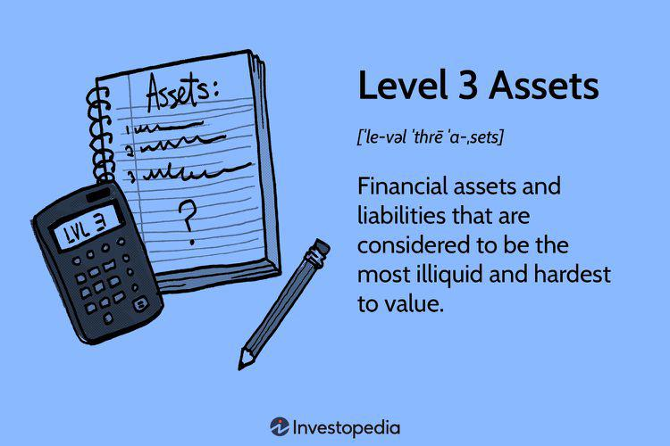

## Table of Contents

## What are Level 1 assets and how are they valued?

Level 1 assets are financial assets that have a readily observable market price. This means you can easily find out their value by looking at the prices they are being bought and sold for in active markets, like stock exchanges. Examples of Level 1 assets include stocks and bonds that are traded on major stock exchanges. Because these assets have clear, transparent prices, they are considered the easiest to value accurately.

Valuing Level 1 assets is straightforward because it involves using the current market price. For instance, if you want to know the value of a share of a company listed on the New York Stock Exchange, you just need to check the latest trading price of that share. This method of valuation is reliable because it reflects what buyers and sellers in the market are actually willing to pay for the asset at that moment. This makes Level 1 assets very liquid, meaning they can be quickly bought or sold without affecting their price much.

## What are Level 2 assets and what methods are used to value them?

Level 2 assets are financial assets that don't have a direct market price like Level 1 assets, but their value can still be figured out using other information that's easy to find. These assets might not be traded on big stock exchanges, but there are still ways to estimate what they're worth. For example, they could be bonds that aren't listed on a major exchange, or they could be stocks of smaller companies that don't trade as often.

To value Level 2 assets, people use methods that look at similar assets that do have clear prices. They might compare the asset to others that are similar and are traded in active markets. Another way is to use models that take into account things like interest rates or other market data to come up with a fair price. These methods are a bit more complicated than just looking up a stock price, but they still rely on information that's out there and can be trusted.

## What are Level 3 assets and why are they considered the most complex to value?

Level 3 assets are financial assets that are the hardest to value because they don't have a clear market price and there isn't much public information to help figure out their worth. These assets can include things like private company stocks, complex derivatives, or even art and collectibles. Because they are not traded often, or sometimes not at all, it's tough to know what someone would pay for them.

Valuing Level 3 assets is tricky because you have to make a lot of guesses and use special models to come up with a price. People might look at the company's financials, future earnings predictions, or even what similar assets sold for in the past. But since there's so much uncertainty, the value can be very different depending on who's doing the valuation. This makes Level 3 assets the most complex because there's a lot more room for error and disagreement about what they're really worth.

## How do the valuation techniques differ among Level 1, Level 2, and Level 3 assets?

Valuing Level 1 assets is the easiest because they have clear market prices. You just look at the price they're being bought and sold for on a stock exchange or other active market. For example, if you want to know the value of a share of Apple, you check the current price on the stock market. This method is straightforward and reliable because it shows what people are actually willing to pay for the asset right now.

Level 2 assets don't have a direct market price, but you can still figure out their value using other information. You might compare them to similar assets that do have clear prices, or use models that consider things like interest rates. For example, if you're valuing a bond that isn't traded on a major exchange, you might look at the prices of similar bonds that are traded. This method is a bit more complicated but still uses reliable data to come up with a value.

Level 3 assets are the trickiest to value because there's very little public information to go on. You have to make a lot of guesses and use special models to estimate their worth. For instance, valuing a private company's stock might involve looking at its financials and predicting future earnings, but there's a lot of uncertainty. Because of this, different people might come up with very different values for the same asset, making Level 3 assets the most complex to value.

## What are the common examples of assets classified under each level?

Level 1 assets are easy to value because they have clear prices you can look up. Common examples include stocks and bonds that are traded on big stock exchanges like the New York Stock Exchange. If you want to know the value of a share of a company like Apple, you just check the latest trading price. These assets are easy to buy and sell because their prices are clear and everyone can see them.

Level 2 assets don't have direct market prices, but you can still figure out their value by looking at similar assets or using models. Common examples are bonds that aren't traded on major exchanges, or stocks of smaller companies that don't trade often. For instance, if you're trying to value a bond not listed on a big exchange, you might look at the prices of similar bonds that are listed. This way, you can come up with a good guess about what the bond is worth.

Level 3 assets are the hardest to value because there's not much public information about them. Common examples include private company stocks, complex financial products like derivatives, and things like art or collectibles. For example, if you're trying to value a private company's stock, you might look at its financials and make predictions about future earnings. But because there's so much guesswork involved, different people might come up with very different values for the same asset.

## What are the implications of holding Level 3 assets on a company's financial statements?

Holding Level 3 assets can make a company's financial statements more complicated. Because these assets are hard to value, the numbers on the financial statements can be less reliable. When a company reports the value of its Level 3 assets, it has to explain how it came up with those numbers. This means there might be a lot of notes and explanations in the financial statements, which can make them harder to understand. Investors and analysts might be less sure about the company's true financial health because the values of Level 3 assets can change a lot based on the guesses and models used to value them.

Another issue with Level 3 assets is that they can affect how people see the company's risk. Since these assets are harder to sell quickly and their values can be very uncertain, holding a lot of them might make a company seem riskier. This can affect things like the company's credit rating or how much it costs to borrow money. Companies with a lot of Level 3 assets might also have to spend more time and money to get their financial statements audited, because auditors will want to make sure the values are as accurate as possible.

## How does the transparency and reliability of data affect the classification of assets into different levels?

The transparency and reliability of data are key factors in deciding whether an asset is a Level 1, Level 2, or Level 3 asset. Level 1 assets are the easiest to value because they have clear, reliable prices that anyone can see on active markets like stock exchanges. This means there's a lot of transparency, and everyone can trust the prices are accurate because they come from real buying and selling.

For Level 2 assets, the data isn't as clear, but it's still reliable enough to make good guesses about their value. These assets don't have direct market prices, but you can use information about similar assets or models based on things like interest rates to figure out what they're worth. This makes them a bit less transparent than Level 1 assets, but you can still trust the data to some extent.

Level 3 assets are the hardest to value because the data about them is neither transparent nor reliable. These assets don't have clear market prices, and there's very little public information to go on. This means that valuing them involves a lot of guesswork and special models, which can lead to big differences in what people think they're worth. So, the less transparent and reliable the data, the more likely an asset is to be classified as a Level 3 asset.

## What are the regulatory requirements and standards for reporting Level 1, Level 2, and Level 3 assets?

The rules for reporting Level 1, Level 2, and Level 3 assets come from accounting standards like the International Financial Reporting Standards (IFRS) and the Generally Accepted Accounting Principles (GAAP) in the United States. These standards say that companies have to show the fair value of their assets on their financial statements. For Level 1 assets, it's easy because you just use the market price. But for Level 2 and Level 3 assets, companies have to explain how they figured out the value. This means they need to write down the methods and assumptions they used, so people can understand how they came up with the numbers.

For Level 2 assets, companies need to say what similar assets or models they used to find the value. They have to make sure the information they used is reliable and explain it clearly. Level 3 assets are the trickiest because there's a lot of guesswork involved. Companies have to give a lot of details about how they valued these assets, including any big guesses they made. They also need to say how changes in those guesses could affect the value. This helps investors and regulators understand the risks and uncertainties around these assets.

## How do changes in market conditions impact the valuation of assets across the three levels?

Changes in market conditions can have a big effect on how assets are valued, but it impacts Level 1, Level 2, and Level 3 assets differently. For Level 1 assets, like stocks and bonds traded on big exchanges, the value changes right away when the market moves. If the stock market goes up, the value of these assets goes up too. If it goes down, their value drops. It's quick and clear because these assets have prices that everyone can see.

For Level 2 assets, market changes can also affect their value, but it's not as direct. These assets don't have clear market prices, so people have to use other information to figure out what they're worth. If interest rates change or similar assets change in price, the value of Level 2 assets might change too. It takes a bit more work to see how market conditions affect them, but the impact is still there.

Level 3 assets are the trickiest because they don't have clear prices and depend a lot on guesses and special models. Changes in the market can make a big difference in how these assets are valued, but it's harder to see exactly how. If the market gets better or worse, the guesses and models used to value these assets might need to change. This can lead to big swings in their reported value, making it harder to predict and understand how market conditions affect them.

## What are the risks associated with investing in Level 3 assets compared to Level 1 and Level 2?

Investing in Level 3 assets comes with more risks than investing in Level 1 and Level 2 assets. The main reason is that Level 3 assets are hard to value because there's not much clear information about them. This means you might not know exactly what they're worth, and different people might come up with very different numbers. This uncertainty can make it hard to know if you're getting a good deal or not. Plus, Level 3 assets are often harder to sell quickly, which means you might have to wait a long time to get your money back if you need it.

Level 1 assets, like stocks and bonds traded on big exchanges, are much safer because their prices are clear and easy to find. You can see what they're worth right away and sell them quickly if you need to. This makes them less risky because you know what you're getting into. Level 2 assets are in the middle. They don't have direct market prices, but you can still figure out their value using other information. They're riskier than Level 1 assets because their values can be a bit less certain, but they're not as risky as Level 3 assets because there's still some reliable data to go on.

## How can investors and analysts assess the accuracy of Level 3 asset valuations?

Investors and analysts can assess the accuracy of Level 3 asset valuations by looking at the details the company gives in its financial statements. Companies have to explain how they figured out the value of these assets, including the guesses and models they used. By reading these explanations, investors can see if the methods make sense and if the guesses seem reasonable. They can also compare the company's valuations to what other companies are saying about similar assets. If the numbers are very different, it might mean one of the valuations is off.

Another way to check the accuracy is by watching how the value of the Level 3 assets changes over time. If the value goes up and down a lot without clear reasons, it might mean the guesses and models aren't working well. Investors can also look at what happens when these assets are actually sold. If the selling price is very different from the reported value, it could show that the valuation was not accurate. By keeping an eye on these things, investors and analysts can get a better idea of how well the company is valuing its Level 3 assets.

## What advanced modeling techniques are used for valuing Level 3 assets and how do they compare to those used for Level 1 and Level 2?

Valuing Level 3 assets often requires advanced modeling techniques because there's not much clear information about them. One common method is the discounted cash flow (DCF) model, where you predict how much money the asset will make in the future and then figure out what that's worth today. Another technique is the Monte Carlo simulation, which uses a lot of different guesses about the future to come up with a range of possible values. These models need a lot of guesses and assumptions, which can make the final number less certain. Because of this, Level 3 assets can be tricky to value accurately.

For Level 1 assets, the valuation is much simpler because you just use the current market price. You don't need advanced models because the value is clear and easy to find. Level 2 assets fall in between. They don't have direct market prices, but you can use models like the Black-Scholes model for valuing options or look at the prices of similar assets. These models are less complicated than those used for Level 3 assets because there's more reliable data to work with. So, while Level 1 assets need no modeling, Level 2 assets use simpler models, and Level 3 assets require the most advanced and complex techniques.

## What are financial instruments?

Financial instruments encompass a broad range of assets, each serving distinct roles within investment portfolios. These instruments include, but are not limited to, stocks, bonds, derivatives, and commodities, each offering unique attributes regarding risk, return, and strategic positioning.

Stocks represent ownership in a corporation and come with potential dividends and capital gains. They are categorized into common and preferred stocks, with common shareholders typically having voting rights but being last in line in asset liquidation. Preferred shareholders, conversely, are prioritized for dividends but generally lack voting rights.

Bonds are debt securities that allow issuers to raise capital by borrowing from investors, who in turn receive periodic interest payments along with the return of the principal at maturity. They are characterized by credit risk, [interest rate](/wiki/interest-rate-trading-strategies) risk, and duration, affecting their performance in an investment portfolio. Bonds can further be segmented into government, municipal, and corporate bonds, each differing in risk profiles and return potential.

Derivatives are financial contracts deriving their value from underlying assets like stocks, bonds, commodities, or indices. Common forms include options, futures, and swaps. They are instrumental in risk management and speculative strategies, offering leverage and the potential to hedge against price fluctuations in the underlying assets.

Commodities are tangible goods such as oil, gold, and agricultural products that are traded in specific markets. Their prices often reflect supply and demand dynamics and can serve as a hedge against inflation.

The valuation and trading of financial instruments can vary significantly based on their market presence and [liquidity](/wiki/liquidity-risk-premium). Market liquidity affects an investor's ability to enter or [exit](/wiki/exit-strategy) positions quickly without significant price concessions. For instance, stocks traded on major exchanges usually offer higher liquidity compared to over-the-counter derivatives, enhancing their attractiveness to various investors.

A fundamental aspect of evaluating financial instruments involves assessing their risk-return profiles. The Capital Asset Pricing Model (CAPM), for example, is frequently utilized to estimate the expected return of an asset given its risk relative to the market. The formula is:

$$
E(R_i) = R_f + \beta_i (E(R_m) - R_f)
$$

where $E(R_i)$ is the expected return on the investment, $R_f$ is the risk-free rate, $\beta_i$ represents the asset's beta or its sensitivity to market movements, and $E(R_m)$ is the expected market return.

These financial instruments' behavior in markets is complex and influenced by numerous factors, such as interest rates, economic indicators, and geopolitical events, requiring well-informed strategies to optimize portfolio performance and minimize risks.

## What are the valuation techniques for Level 3 assets?

Mark-to-model valuation serves as the primary technique for valuing Level 3 assets, which lack observable market prices. This approach relies heavily on theoretical models and involves significant estimation and subjective judgment. One of the most common methods employed under mark-to-model is discounted cash flow (DCF) analysis, which estimates the present value of anticipated future cash flows from the asset. 

$$

\text{DCF} = \sum \left( \frac{C_t}{(1 + r)^t} \right) 
$$

Where $C_t$ represents the cash flow at time $t$, and $r$ is the discount rate. This approach is particularly useful for illiquid assets such as private equity or mortgage-backed securities. However, the accuracy of DCF valuations can be affected by the assumptions made regarding the growth rate, discount rate, and the terminal value of cash flows, leading to potentially significant valuation discrepancies between analysts.

Another component of mark-to-model valuation involves using complex financial models that incorporate unobservable inputs. These inputs may include assumptions about market trends, economic conditions, or specific asset attributes, which can vary significantly depending on the analyst's expertise and perspective. This intrinsic subjectivity necessitates a high degree of professionalism and caution to ensure valuations are as accurate and fair as possible.

Given the subjective nature of these valuations, regulatory bodies have set forth guidelines requiring transparency in the disclosure of the methodologies and assumptions used. This is aimed at maintaining investor confidence and ensuring that all market participants have an equal understanding of how asset values are derived. As these disclosures are crucial for evaluating the risks and returns associated with Level 3 assets, they are often a focus during audits and regulatory reviews. 

Additionally, these regulations emphasize the need for proper documentation and the justification of assumptions used in the valuation process. As a result, firms are encouraged to regularly update their valuation models and assumptions to reflect the latest market conditions and ensure compliance with evolving regulatory standards.

## References & Further Reading

[1]: Bergstra, J., Bardenet, R., Bengio, Y., & Kégl, B. (2011). ["Algorithms for Hyper-Parameter Optimization."](https://dl.acm.org/doi/10.5555/2986459.2986743) Advances in Neural Information Processing Systems 24.

[2]: ["Advances in Financial Machine Learning"](https://www.amazon.com/Advances-Financial-Machine-Learning-Marcos/dp/1119482089) by Marcos Lopez de Prado

[3]: ["Evidence-Based Technical Analysis: Applying the Scientific Method and Statistical Inference to Trading Signals"](https://www.amazon.com/Evidence-Based-Technical-Analysis-Scientific-Statistical/dp/0470008741) by David Aronson

[4]: ["Machine Learning for Algorithmic Trading"](https://github.com/stefan-jansen/machine-learning-for-trading) by Stefan Jansen

[5]: ["Quantitative Trading: How to Build Your Own Algorithmic Trading Business"](https://www.amazon.com/Quantitative-Trading-Build-Algorithmic-Business/dp/1119800064) by Ernest P. Chan