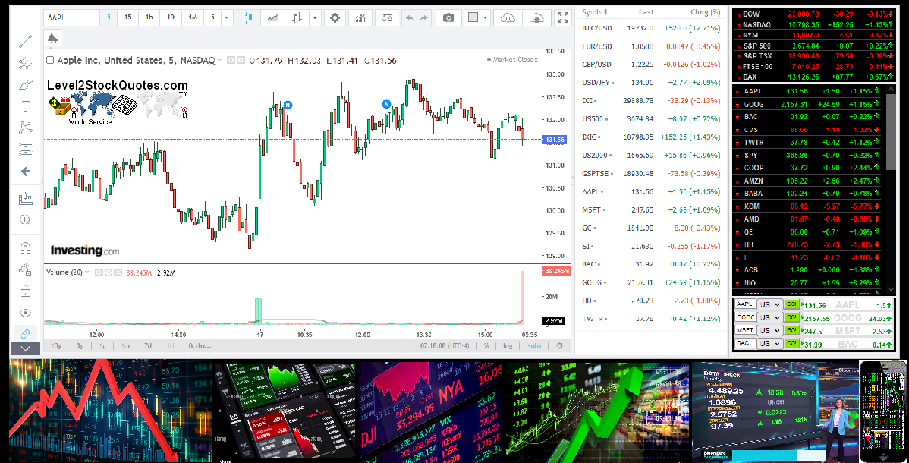

## Table of Contents

## What are Level II Market Quotes?

Level II Market Quotes give you more detailed information about what's happening in the stock market than just the basic price. They show you not only the current price of a stock, but also the prices that different buyers and sellers are willing to pay or accept. This is shown through something called the order book, which lists all the buy and sell orders at different price levels. This can help you see the demand and supply for a stock more clearly.

This kind of information can be very useful if you are trading stocks. For example, if you see a lot of people wanting to buy a stock at a higher price than it's currently trading at, it might mean the stock's price could go up soon. On the other hand, if there are a lot of people wanting to sell at a lower price, the stock's price might go down. By looking at Level II quotes, you can make better decisions about when to buy or sell a stock.

## How do Level II Market Quotes differ from Level I?

Level I Market Quotes give you the basic information about a stock, like the current price, the highest and lowest price it reached that day, and how many shares were traded. It's like looking at the front of a store and seeing the price tags on the items in the window. This is the simplest way to get an idea of what's happening with a stock, and it's usually enough for people who are just investing for the long term and don't need to know every detail.

On the other hand, Level II Market Quotes go deeper. They show you not just the current price, but also all the different prices that people are willing to buy or sell the stock at. It's like being able to peek inside the store and see how many people are waiting to buy or sell each item at different prices. This is really useful for people who trade stocks more actively, because it can help them guess which way the price might move next based on what they see in the "[order book](/wiki/order-book-trading-strategies)."

## Why are Level II Market Quotes important for traders?

Level II Market Quotes are important for traders because they show more than just the current price of a stock. They let traders see the whole order book, which lists all the buy and sell orders at different prices. This helps traders understand the supply and demand for a stock in real time. By looking at this, traders can get a better idea of where the stock price might be headed next. If they see a lot of people wanting to buy at higher prices, it might mean the stock's price could go up soon.

This information can help traders make smarter decisions about when to buy or sell. For example, if a trader sees that there are a lot of people wanting to sell at a lower price than the current one, they might decide to sell their shares before the price drops. On the other hand, if they see many people waiting to buy at higher prices, they might choose to buy more shares, hoping the price will go up. So, Level II Market Quotes give traders a clearer picture of the market, which can lead to better trading choices.

## What information is typically included in Level II Market Quotes?

Level II Market Quotes show you a lot more than just the current price of a stock. They include the order book, which is a list of all the buy and sell orders at different prices. This means you can see how many people want to buy the stock at different prices, and how many people want to sell it at different prices. This is called the bid and ask prices. The bid price is what people are willing to pay to buy the stock, and the ask price is what people are asking to sell it for.

This information helps traders see the supply and demand for a stock in real time. They can see if there are a lot of people wanting to buy at higher prices, which might mean the stock's price could go up soon. Or, they might see a lot of people wanting to sell at lower prices, which could mean the price might go down. By looking at all these different prices and orders, traders can make better guesses about where the stock price might be headed next.

## How can one access Level II Market Quotes?

To access Level II Market Quotes, you usually need to use a special kind of trading platform or software. These platforms are often provided by brokerage firms or financial data services. You might need to pay a fee or have a certain type of account to use them. Some popular platforms that offer Level II quotes include thinkorswim by TD Ameritrade, E*TRADE Pro, and [Interactive Brokers](/wiki/interactive-brokers-api)' Trader Workstation.

Once you have access to a platform that provides Level II Market Quotes, you can see the order book for a stock. This shows you all the different prices that people are willing to buy or sell the stock at. You can watch the bids and asks change in real time, which helps you understand the supply and demand for the stock. This information can be really useful for making trading decisions, but it's important to remember that it's just one part of the puzzle when it comes to trading stocks.

## What are the costs associated with accessing Level II Market Quotes?

The costs for accessing Level II Market Quotes can vary depending on which platform or brokerage you use. Some brokers include Level II quotes as part of their regular trading fees, while others might charge you extra for this service. For example, a broker might charge a monthly fee, like $10 or $20, just for the ability to see Level II quotes. Some brokers might offer this service for free if you have a certain type of account or if you trade a certain amount each month.

It's important to check with your broker or the trading platform you're interested in to find out exactly what the costs are. Sometimes, you might need to pay for a subscription to a financial data service to get Level II quotes. These subscriptions can range from a few dollars a month to more expensive plans, depending on how much detail and how many features you want. So, it's a good idea to look at different options and see what fits your needs and budget best.

## How do Level II Market Quotes help in understanding market depth?

Level II Market Quotes help traders understand market depth by showing them the order book, which lists all the buy and sell orders at different prices. This means you can see how many people want to buy a stock at different prices (the bids) and how many people want to sell it at different prices (the asks). By looking at this, you can see if there are a lot of people waiting to buy at higher prices or a lot of people waiting to sell at lower prices. This gives you a good idea of the supply and demand for the stock.

Understanding market depth is important because it helps traders guess where the stock price might go next. If there are a lot of bids at higher prices, it might mean the stock's price could go up soon because there's a lot of demand. On the other hand, if there are a lot of asks at lower prices, it might mean the price could go down because there's a lot of supply. By looking at the Level II Market Quotes, traders can make better decisions about when to buy or sell their stocks.

## What are some common strategies traders use with Level II Market Quotes?

Traders use Level II Market Quotes to make smart choices about when to buy or sell stocks. One common strategy is called "[scalping](/wiki/gamma-scalping)." This means traders look for small price changes and try to make quick profits by buying and selling stocks in a short time. They use Level II quotes to see if there are a lot of people wanting to buy at higher prices or sell at lower prices. If they see more buyers than sellers, they might buy the stock hoping the price will go up a little bit, and then sell it quickly for a small profit.

Another strategy is called "[momentum](/wiki/momentum) trading." Traders using this strategy look for stocks that are moving a lot in one direction. They use Level II quotes to see if the trend is likely to keep going. If they see a lot of buy orders at higher prices, they might think the price will keep going up, so they buy the stock and hold it until the price goes up even more. On the other hand, if they see a lot of sell orders at lower prices, they might sell the stock, thinking the price will keep going down.

Some traders also use Level II Market Quotes to spot "support and resistance levels." These are prices where the stock price might stop going down or up. By looking at the order book, traders can see where there are a lot of buy orders (support) or sell orders (resistance). If a stock's price is close to a support level, traders might buy, thinking the price will bounce back up. If it's close to a resistance level, they might sell, thinking the price will start to go down.

## How can Level II Market Quotes be used to detect potential price manipulation?

Level II Market Quotes can help traders spot possible price manipulation by showing them the order book, which lists all the buy and sell orders at different prices. If someone is trying to manipulate the price, they might place a lot of fake orders to make it look like there's more demand or supply than there really is. For example, if a trader sees a lot of buy orders at a higher price that suddenly appear and then disappear quickly, it could be a sign that someone is trying to push the stock's price up artificially.

By watching the Level II quotes closely, traders can look for patterns that don't seem normal. If they see big orders being placed and then canceled right away, or if the same order keeps getting placed and canceled, it might mean someone is trying to trick other traders. This can help traders be more careful and avoid getting caught in a manipulated price move.

## What are the limitations of relying solely on Level II Market Quotes for trading decisions?

While Level II Market Quotes can give you a lot of useful information about what's happening with a stock, they're not perfect. They show you the buy and sell orders at different prices, which can help you see the supply and demand. But, these quotes only show what's happening right now. They don't tell you why people are buying or selling, or what might happen in the future. So, if you only use Level II quotes to make your trading decisions, you might miss out on important news or events that could affect the stock's price.

Also, Level II Market Quotes can sometimes be misleading. People might place fake orders to make it look like there's more demand or supply than there really is. This is called price manipulation, and it can trick you into making the wrong trading decisions. So, it's important to use Level II quotes along with other tools and information, like company news, financial reports, and market trends, to get a fuller picture of what's going on with a stock.

## How do Level II Market Quotes integrate with other trading tools and platforms?

Level II Market Quotes work well with other trading tools and platforms because they give you more detailed information about what's happening with a stock. For example, many trading platforms like thinkorswim by TD Ameritrade or Interactive Brokers' Trader Workstation let you see Level II quotes right next to other tools like charts and technical indicators. This means you can look at the order book to see the buy and sell orders at different prices, and at the same time, use charts to see how the stock's price has been moving. This can help you make better trading decisions because you can see more about what's going on.

Some platforms also let you set up alerts based on what you see in the Level II quotes. For example, you could set an alert to go off if a lot of buy orders suddenly appear at a higher price. This way, you can be ready to act quickly if you think the stock's price might go up. By using Level II quotes along with other tools like news feeds and financial reports, you get a fuller picture of the market. This can help you understand not just what's happening right now, but also why it's happening and what might happen next.

## What advanced techniques can experts use to analyze Level II Market Quotes for better trading outcomes?

Experts can use a technique called "order flow analysis" to better understand Level II Market Quotes. This means they look at how the buy and sell orders are changing over time. By watching the order book closely, they can see if there's a lot of buying or selling happening. For example, if they see a lot of big buy orders coming in quickly, it might mean that big investors think the stock's price will go up soon. On the other hand, if they see a lot of big sell orders, it might mean the price could go down. By paying attention to these patterns, experts can make smarter guesses about where the stock's price might go next.

Another advanced technique is using "time and sales data" along with Level II quotes. Time and sales data shows every trade that happens, including the price and the number of shares traded. By looking at this data together with the order book, experts can see if the trades match up with the orders they see in the Level II quotes. If they see a lot of trades happening at prices that match the big orders in the order book, it can confirm that those orders are real and not just fake ones meant to trick other traders. This can help experts make more confident trading decisions based on what they see in the market.

## References & Further Reading

[1]: Harris, L. (2003). ["Trading and Exchanges: Market Microstructure for Practitioners."](https://academic.oup.com/book/52292) Oxford University Press.

[2]: Hasbrouck, J. (2007). ["Empirical Market Microstructure: The Institutions, Economics, and Econometrics of Securities Trading."](https://academic.oup.com/book/52241) Oxford University Press.

[3]: Aldridge, I. (2013). ["High-Frequency Trading: A Practical Guide to Algorithmic Strategies and Trading Systems."](https://www.amazon.com/High-Frequency-Trading-Practical-Algorithmic-Strategies/dp/1118343506) Wiley.

[4]: Narang, M. A. (2013). ["Inside the Black Box: A Simple Guide to Quantitative and High Frequency Trading."](https://onlinelibrary.wiley.com/doi/book/10.1002/9781118662717) Wiley Finance.

[5]: Kissell, R. (2013). ["The Science of Algorithmic Trading and Portfolio Management."](https://www.sciencedirect.com/book/9780124016897/the-science-of-algorithmic-trading-and-portfolio-management) Academic Press.

[6]: Nasdaq. ["Trading Insights: Understanding Nasdaq Level 2."](https://www.nasdaq.com/articles/should-you-buy-nvidia-stock-jan-6) Nasdaq TotalView.