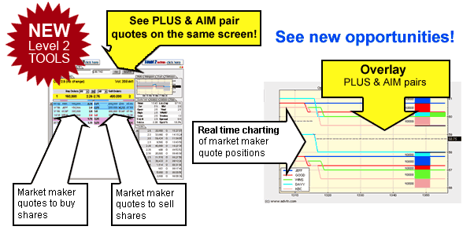

## Table of Contents

## What is a Level III Quote in financial markets?

A Level III Quote is a type of quote used in financial markets, especially in stock trading. It is the highest level of access that a trader can have. With a Level III Quote, a trader can not only see the current bid and ask prices for a stock, but they can also enter their own bid and ask prices. This means they can directly influence the market by setting the prices at which they are willing to buy or sell a stock.

This level of access is usually reserved for market makers and other professional traders. Market makers are people or firms that help keep the market running smoothly by always being ready to buy or sell stocks. Because they have this special role, they need the ability to set prices. Not everyone can get a Level III Quote because it requires special permissions and often involves meeting certain regulatory requirements.

## How does a Level III Quote differ from Level I and Level II Quotes?

A Level I Quote is the most basic type of quote you can get in the stock market. It shows you the current best bid price (what people are willing to pay to buy the stock) and the best ask price (what people are willing to sell the stock for). This is all the information you get with a Level I Quote. It's like looking at a snapshot of the market, but you don't get to see who is making these bids and asks or how many shares are involved.

A Level II Quote gives you more details than a Level I Quote. With a Level II Quote, you can see not just the best bid and ask prices, but also the prices from different market makers and other traders. You'll see a list of all the bids and asks at different price levels, showing you the depth of the market. This means you can see how many shares are available at each price, which can help you understand the supply and demand for the stock. However, you still can't set your own prices with a Level II Quote.

A Level III Quote is the most advanced type of quote and is usually only available to market makers and professional traders. With a Level III Quote, you get all the information from Level II, but you can also enter your own bid and ask prices into the market. This means you can directly influence the market by setting the prices at which you're willing to buy or sell a stock. It's a powerful tool that requires special permissions and often involves meeting regulatory requirements.

## Who typically has access to Level III Quotes?

Level III Quotes are usually available to market makers and professional traders. Market makers are people or firms that help keep the stock market running smoothly by always being ready to buy or sell stocks. They need to be able to set their own prices to do their job well, so they get access to Level III Quotes.

To get a Level III Quote, you need special permissions and often have to meet certain rules set by regulators. Not everyone can have this kind of access because it lets you directly affect the market by setting your own prices for buying and selling stocks. It's a powerful tool that's reserved for those who play a key role in the financial markets.

## What kind of information does a Level III Quote provide?

A Level III Quote gives you all the information you get from a Level II Quote, but it also lets you do more. With a Level II Quote, you can see the best prices people are willing to buy and sell a stock at, and you can see all the other prices from different market makers and traders. It shows you how many shares are available at each price, which helps you understand the supply and demand for the stock.

With a Level III Quote, you can do everything a Level II Quote does, but you can also set your own prices for buying and selling stocks. This means you can directly influence the market by deciding what prices you want to use. Only market makers and professional traders usually have access to Level III Quotes because it's a powerful tool that needs special permissions and has to follow certain rules set by regulators.

## How can traders use Level III Quotes to their advantage?

Traders with Level III Quotes can use them to their advantage by setting their own prices for buying and selling stocks. This means they can try to make better deals by choosing prices that might be more attractive to other traders. For example, if they see that the current best price to buy a stock is too high, they might set a lower price to attract sellers. Or, if they think the current best price to sell is too low, they might set a higher price to attract buyers. This ability to influence the market can help them get better prices and make more money.

Also, having a Level III Quote lets traders see all the same information as a Level II Quote, which shows the depth of the market. This means they can see all the different prices and how many shares are available at each price. By understanding the supply and demand better, they can make smarter trading decisions. For instance, if they see a lot of shares available at a certain price, they might decide to buy or sell at that price, knowing it's a popular level. This extra information can give them an edge over traders who only have Level I or Level II Quotes.

## What are the technological requirements for accessing Level III Quotes?

To access Level III Quotes, traders need special software and a fast, reliable internet connection. The software must be able to connect to the stock exchange's systems and handle the high-speed data that comes with Level III Quotes. This software is usually provided by trading platforms that are approved by the stock exchange. These platforms need to be able to send and receive data quickly and accurately, so they often require powerful computers with a lot of processing power.

In addition to the software and internet connection, traders need to have the right permissions from the stock exchange. This means they need to be registered as market makers or professional traders, which involves meeting certain regulatory requirements. Once they have the permissions, they can use their software to set their own prices for buying and selling stocks. This ability to influence the market directly is what makes Level III Quotes so powerful, but it also means that the technology used must be very reliable and secure.

## Can you explain the process of entering and modifying orders using Level III Quotes?

When a trader with Level III Quotes wants to enter an order, they use special trading software to set their own prices for buying or selling a stock. They type in the price they want to buy at or the price they want to sell at, and then they also type in how many shares they want to trade. Once they hit the button to send the order, their price shows up on the market for other traders to see. If someone agrees to their price, the trade happens right away.

If the trader wants to change their order, they can do that easily with the software. They just go back to their order and change the price or the number of shares they want to trade. They can do this as many times as they need to until someone takes their offer. This ability to quickly change orders helps traders keep up with the fast-moving stock market and find the best prices for their trades.

## What are the regulatory considerations for using Level III Quotes?

Using Level III Quotes comes with a lot of rules that traders need to follow. These rules are set by groups like the Securities and Exchange Commission (SEC) in the United States. To use Level III Quotes, traders need to be registered as market makers or professional traders. This means they have to go through a process to make sure they meet the rules and can be trusted to use this powerful tool responsibly. They also need to keep good records of all their trades and report them correctly to the regulators. This helps make sure the market stays fair and honest.

Another important rule is that traders with Level III Quotes have to make sure their prices are fair and not meant to trick other traders. They can't set prices just to make the market look different than it really is. This is called market manipulation, and it's against the rules. If traders break these rules, they can get in big trouble, like having to pay fines or even going to jail. So, using Level III Quotes is a big responsibility, and traders need to be very careful to follow all the rules.

## How do Level III Quotes impact market transparency and liquidity?

Level III Quotes help make the market more transparent because they show all the prices that market makers and professional traders are willing to buy and sell at. This means everyone can see more information about what's happening in the market. When traders can see all these prices, they can make better decisions about when to buy or sell. This openness helps everyone trust the market more because they can see exactly what's going on.

Level III Quotes also help make the market more liquid. Liquidity means there are enough buyers and sellers so that trades can happen quickly and easily. When market makers use Level III Quotes to set their own prices, they make sure there are always prices available for buying and selling. This means other traders can find someone to trade with more easily. More trading happening means the market stays active and healthy, which is good for everyone.

## What are some common strategies employed by professionals using Level III Quotes?

Professionals using Level III Quotes often use a strategy called "price improvement." This means they set their buy or sell prices a little better than the current best prices in the market. By doing this, they hope to attract more traders to trade with them. For example, if the best price to buy a stock is $10, they might offer to buy it at $10.05. This small difference can make a big impact because it can lead to more trades happening.

Another common strategy is "[order book](/wiki/order-book-trading-strategies) manipulation." This is a bit trickier and needs to be done carefully because it can be against the rules if not done right. Traders might set many different prices to make it look like there is more demand or supply for a stock than there really is. This can influence other traders to buy or sell at certain prices. It's important for traders to do this ethically and within the rules to avoid getting in trouble.

## How have Level III Quotes evolved with advancements in trading technology?

Level III Quotes have changed a lot because of new trading technology. In the past, traders had to call each other on the phone or use special machines to set their prices. Now, with computers and the internet, they can do it all online. This makes things faster and easier. Special software lets traders see all the prices and set their own prices with just a few clicks. This has made the market more active and easier to use for everyone.

These changes have also made it possible for more people to use Level III Quotes. Before, only big traders in special places could do it. Now, with the right permissions, traders can do it from anywhere with a good computer and internet. This has made the market more open and fair. But, it also means traders need to be careful to follow all the rules, because the technology makes it easier to check if they are doing things right.

## What future developments might we expect in the use of Level III Quotes?

In the future, we might see Level III Quotes become even easier to use because of new technology. Computers and the internet keep getting faster and better, so traders might be able to set their prices and see the market even quicker than they can now. This could make the market more active and help traders make better deals. Also, new kinds of software might come out that make it simpler for traders to use Level III Quotes, even if they are not experts.

Another thing that could happen is that rules about using Level III Quotes might change. As more people start using them, the groups that make the rules might decide to make them stricter to keep the market fair. Or, they might make the rules easier so more traders can use Level III Quotes. Either way, these changes could make a big difference in how traders use this powerful tool.

## References & Further Reading

[1]: Harris, L. (2003). ["Trading and Exchanges: Market Microstructure for Practitioners."](https://academic.oup.com/book/52292) Oxford University Press.

[2]: Johnson, B. (2010). ["Algorithmic Trading & DMA: An Introduction to Direct Access Trading Strategies."](https://archive.org/details/algorithmictradi0000john) 4Myeloma Press.

[3]: Hasbrouck, J. (2007). ["Empirical Market Microstructure: The Institutions, Economics, and Econometrics of Securities Trading."](https://academic.oup.com/book/52241) Oxford University Press.

[4]: Lopez de Prado, M. (2018). ["Advances in Financial Machine Learning."](https://books.google.com/books/about/Advances_in_Financial_Machine_Learning.html?id=oU9KDwAAQBAJ) Wiley.

[5]: Kissell, R. (2013). ["The Science of Algorithmic Trading and Portfolio Management."](https://www.sciencedirect.com/book/9780124016897/the-science-of-algorithmic-trading-and-portfolio-management) Academic Press.