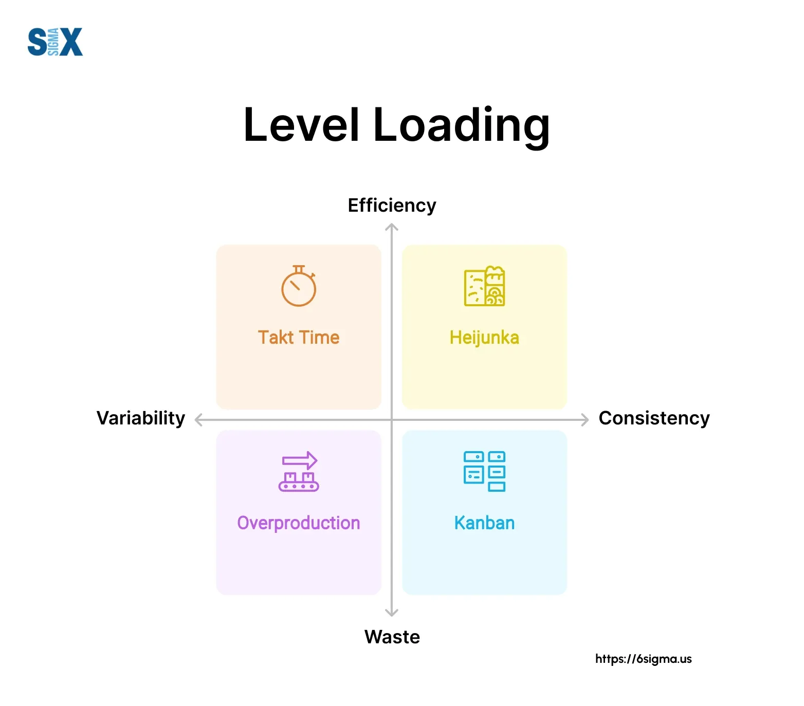

## Table of Contents

## What is a level load?

A level load is a type of fee that you pay when you invest in certain mutual funds. It is also called a 12b-1 fee. This fee is taken out of your investment every year, and it is the same amount each year. The fee is used to pay for things like marketing the fund and paying the people who sell it.

Level loads are different from other types of fees, like front-end loads and back-end loads. A front-end load is a fee you pay when you first buy the fund, and a back-end load is a fee you pay when you sell the fund. With a level load, you don't pay a big fee at the start or end, but you do pay a smaller fee every year you own the fund. This can be good or bad, depending on how long you plan to keep your money in the fund.

## How does a level load differ from other types of loads?

A level load is a fee you pay every year for owning a mutual fund. It's the same amount each year and is used to cover costs like marketing the fund and paying the people who sell it. This fee is taken directly from your investment, so it reduces the amount of money you have in the fund over time.

Other types of loads work differently. A front-end load is a fee you pay when you first buy the fund. This means less of your money goes into the fund right away. A back-end load, on the other hand, is a fee you pay when you sell the fund. This fee can go down the longer you keep your money in the fund. Unlike level loads, front-end and back-end loads are one-time fees, but they can be larger than the annual fee of a level load.

## What are the basic components of a level load?

A level load is a fee that you pay every year for owning a mutual fund. It's called a level load because the fee stays the same each year. This fee comes out of your investment, so it reduces the amount of money you have in the fund over time. The money from the level load is used to pay for things like marketing the fund and paying the people who sell it.

Level loads are different from other types of fees like front-end loads and back-end loads. A front-end load is a fee you pay when you first buy the fund, and a back-end load is a fee you pay when you sell the fund. These are one-time fees, but they can be bigger than the yearly fee of a level load. With a level load, you don't pay a big fee at the start or end, but you do pay a smaller fee every year you own the fund.

## What are the primary benefits of using a level load?

One of the main benefits of using a level load is that it spreads out the cost of owning a mutual fund over time. Instead of paying a large fee when you buy or sell the fund, you pay a smaller fee every year. This can be easier on your wallet, especially if you are planning to keep your money in the fund for a long time. It can make the cost of owning the fund more predictable and manageable.

Another benefit is that level loads can help you avoid the decision of when to buy or sell a fund based on fees. With front-end or back-end loads, you might think twice about buying or selling because of the big fees. But with a level load, you don't have to worry about that. You just keep paying the same small fee every year, no matter what you decide to do with your investment.

## Can you explain how a level load impacts financial planning?

A level load can make financial planning easier because it spreads out the cost of owning a mutual fund over time. Instead of paying a big fee when you buy or sell the fund, you pay a smaller fee every year. This can help you plan your finances better because you know exactly how much the fee will be each year. It makes the cost of owning the fund more predictable, so you can budget for it without any surprises.

Another way a level load impacts financial planning is by giving you more flexibility with your investment decisions. With front-end or back-end loads, you might feel stuck because of the big fees you would have to pay to buy or sell the fund. But with a level load, you don't have to worry about that. You can decide to keep your money in the fund or take it out without having to think about a big fee. This can help you make better financial plans because you have more control over your investments.

## What industries commonly use level loads and why?

Level loads are often used in the mutual fund industry. This is because mutual funds need money to pay for things like marketing and paying the people who sell them. A level load helps cover these costs by taking a small fee out of the investor's money every year. This makes it easier for mutual fund companies to manage their expenses without asking investors to pay a big fee all at once.

Another industry that might use level loads is the insurance industry, especially for certain types of life insurance policies. These policies can have fees that are taken out over time to cover the costs of keeping the policy active. Using a level load helps insurance companies keep their policies affordable for customers while still covering their costs. It's a way to spread out the fees so that they are easier to manage for both the company and the policyholder.

## How does a level load affect investment returns over time?

A level load can affect your investment returns over time because it takes a small amount of money out of your investment every year. This fee is used to pay for things like marketing the fund and paying the people who sell it. Since the fee is taken out every year, it can add up over time and reduce the amount of money you have in the fund. This means your investment might not grow as much as it could if there were no fees.

But, the impact of a level load on your returns can be different depending on how long you keep your money in the fund. If you plan to keep your investment for a long time, the yearly fee might be less than a big one-time fee like a front-end or back-end load. This can make a level load a good choice for long-term investments because it spreads out the cost. But if you are only planning to keep your money in the fund for a short time, the yearly fees might add up to more than a one-time fee, and that could lower your returns more.

## What are some common misconceptions about level loads?

One common misconception about level loads is that they are always better than front-end or back-end loads. People might think this because level loads are smaller fees that you pay every year, instead of one big fee. But, this isn't always true. If you are only going to keep your money in the fund for a short time, the yearly fees from a level load can add up to more than a one-time fee from a front-end or back-end load. So, it's important to think about how long you plan to keep your money in the fund before deciding which type of fee is better for you.

Another misconception is that level loads don't affect your investment returns. Some people might think that because the fee is small and spread out over time, it won't make a big difference. But, over many years, these small fees can add up and take away from the money you could have earned. It's important to remember that any fee, no matter how small, will reduce the amount of money you have in the fund. So, always look at the fees and think about how they will affect your investment over time.

## Can you provide examples of successful implementations of level loads?

One successful example of using level loads is in a mutual fund called the ABC Growth Fund. This fund charges a level load of 0.25% every year to cover marketing and distribution costs. Investors who put their money in the ABC Growth Fund like the level load because it's easy to understand and plan for. They know exactly how much the fee will be each year, so they can budget for it without any surprises. Over time, many investors have found that the level load helps them keep more of their money in the fund, leading to better returns compared to funds with front-end or back-end loads.

Another example is in the insurance industry, with a life insurance policy offered by XYZ Insurance Company. They use a level load to charge a small fee each year to keep the policy active. This has been successful because it makes the policy more affordable for customers. Instead of paying a big fee at the start or end, customers pay a smaller fee every year. This helps them manage their finances better and keep the policy without feeling a big hit to their wallet. Many customers have stayed with XYZ Insurance because of this approach, showing that level loads can work well in different industries.

## How can one calculate the effectiveness of a level load in a specific scenario?

To calculate the effectiveness of a level load in a specific scenario, you need to look at how much the fee costs you each year and how it affects your investment over time. Start by finding out the percentage of the level load fee. If it's 0.25% per year, that means for every $100 you have in the fund, you'll pay $0.25 each year. Next, think about how long you plan to keep your money in the fund. The longer you keep your money in, the more the yearly fees will add up. You can use a simple formula to figure this out: take the amount of money you have in the fund, multiply it by the level load percentage, and then multiply that by the number of years you plan to keep your money in the fund.

For example, if you have $10,000 in a fund with a 0.25% level load and you plan to keep your money in the fund for 10 years, you would pay $25 each year. Over 10 years, that's $250 in total fees. To see if the level load is effective, compare this to what you might pay with a front-end or back-end load. If a front-end load would cost you 5% of your $10,000 right away, that's $500. In this case, the level load might be more effective because it's less money over time. But if you only plan to keep your money in the fund for 2 years, the level load would cost you $50, which is less than the front-end load but might still be more than a smaller back-end load. So, the effectiveness of a level load really depends on how long you plan to keep your money in the fund and what other fees you might have to pay.

## What advanced strategies can be employed to optimize the use of level loads?

One advanced strategy to optimize the use of level loads is to use them in a long-term investment plan. Since level loads take a small fee out of your investment every year, they can be less costly over time than a big one-time fee like a front-end or back-end load. If you plan to keep your money in the fund for many years, the yearly fees from a level load might add up to less than a one-time fee. This can help you keep more of your money in the fund, which can lead to better returns over time. So, think about your long-term goals and see if a level load fits well with them.

Another strategy is to use level loads in a diversified investment portfolio. By spreading your money across different types of investments, you can balance out the costs of the level loads. For example, you might put some of your money in a mutual fund with a level load and some in a fund with no load at all. This way, the fees from the level load won't take away as much from your overall returns. It's like spreading out the cost so it's easier to manage. By doing this, you can make the most of level loads while still keeping your investment costs down.

## What are the potential risks and limitations associated with level loads?

One risk of using level loads is that they can add up over time and take away from your investment returns. Even though the fee is small every year, if you keep your money in the fund for a long time, the total amount you pay in fees can be a lot. This means you might end up with less money in the end than if you had chosen a fund with no load or a different type of fee. So, it's important to think about how long you plan to keep your money in the fund and see if the level load will be worth it.

Another limitation of level loads is that they might not be the best choice for everyone. If you are only planning to keep your money in the fund for a short time, the yearly fees from a level load might add up to more than a one-time fee like a front-end or back-end load. This can make level loads less effective for short-term investments. Also, some people might find it hard to keep track of the yearly fees and how they affect their investment over time. So, it's a good idea to look at all your options and see what works best for your own financial goals.

## What is Understanding Supply Chain Optimization?

Supply chain optimization is the systematic approach to refining the operational processes within a supply chain to achieve higher efficiency and effectiveness. Crucially, the process seeks to minimize costs while enhancing the quality of services and facilitating the seamless flow of goods from suppliers to consumers.

Key objectives in supply chain optimization include reducing operational costs, which may encompass expenses related to production, transportation, and warehousing. An optimized supply chain can also significantly improve service quality. This improvement is achieved by minimizing lead times, enhancing product availability, and improving customer satisfaction rates. Moreover, optimizing the flow of goods ensures that products move swiftly and efficiently across the various nodes of the supply chain, thereby reducing delays and enhancing delivery reliability.

Several techniques are employed in supply chain optimization. Strategic sourcing involves selecting suppliers that provide the highest value and aligning procurement strategies with business objectives to enhance overall performance. Effective demand forecasting is another cornerstone technique, enabling businesses to predict future customer demand accurately and adjust their operations accordingly. This forecasting can leverage various methodologies, such as time series analysis, [machine learning](/wiki/machine-learning) models, or a combination of statistical techniques for enhanced accuracy.

Inventory management is another critical aspect of optimization. It encompasses determining the optimal order quantities and timing to minimize holding and shortage costs. One widely used model in this regard is the Economic Order Quantity (EOQ) model, which calculates the ideal order size to minimize total inventory costs. The EOQ formula is given by:

$$
\text{EOQ} = \sqrt{\frac{2DS}{H}}
$$

where $D$ is the demand rate, $S$ is the ordering cost per order, and $H$ is the holding cost per unit per period.

Logistics planning involves optimizing the transportation and handling of goods, focusing on route optimization, scheduling, and warehouse management. Advanced software solutions and technologies, including Geographic Information Systems (GIS) and Internet of Things (IoT) devices, can greatly enhance logistics operations by providing real-time data and insights.

By adopting these optimization techniques, businesses can enhance their supply chain efficiency, reduce costs, and improve service delivery, ultimately leading to a more competitive market position.

## What is Exploring Level Load in Financial Contexts?

Level load refers to a specific fee structure predominantly used in the financial sector, especially with mutual funds. Unlike front-end loads that are charged at the time of purchase or back-end loads assessed when sold, level loads are continuous and applied annually as a percentage of the fund's average net assets. This fee is consistent over time, typically facilitating the coverage of various operational aspects such as distribution, marketing, and advisory services.

From an operational perspective, level loads are part of the fund's overall expense ratio and are deducted from the fund's assets, thereby reducing the investor's returns over time. The stability of these fees makes them preferable for investors seeking predictability in fee structures, as they eliminate the need to pay large commissions upfront or upon [exit](/wiki/exit-strategy). However, it is crucial for investors to be aware of these charges as they have a direct impact on the fund's net performance.

Mathematically, the impact of a level load fee can be represented by the reduction in the investor's return. If $r$ represents the gross return of the fund, and $l$ is the level load fee expressed as a percentage, the net return $R$ can be calculated as:

$$
R = r - l
$$

This model highlights the necessity for investors to consider such fees when evaluating mutual fund investments, as cumulative fees over an extended period can significantly erode potential earnings. For example, a 1% level load on a fund with an annual return of 5% effectively reduces the investor's return to 4%.

Understanding how level loads operate assists investors in making well-informed decisions about fund investments. By comparing the level load percentage with the fund's performance and potential benefits, investors can evaluate whether the operational services provided justify the fee and align with their investment strategy.

The consistency of level load fees provides transparency but requires careful evaluation within the broader context of total fund expenses. This understanding is essential for optimizing investment portfolios and achieving financial goals.

## References & Further Reading

[1]: Chopra, S., Meindl, P., & Kalra, D. V. (2013). ["Supply Chain Management: Strategy, Planning, and Operation."](https://books.google.com/books/about/Supply_Chain_Management_Strategy_Plannin.html?id=gPDQCQAAQBAJ) Pearson.

[2]: Agrawal, S., & Smith, S. A. (2009). "Optimal Inventory Policies for a Supply Chain or Inventory System with Stochastic Demand using Bayesian Information," European Journal of Operational Research, 198(1), 186-198.

[3]: Hull, J. C. (2018). ["Options, Futures, and Other Derivatives."](https://www.semanticscholar.org/paper/Options%2C-Futures%2C-and-Other-Derivatives-Hull/89bdee500c8623864fc9eb7a471546aa713acc44) Pearson.

[4]: Géczy, C. C., Minton, B. A., & Schrand, C. (2007). "Taking a View: Corporate Speculation, Governance, and Compensation," Journal of Finance, 62(5), 2405-2443.

[5]: Papon, Philippe. (2012). "Algorithmic Trading in Finance," [Encyclopedia of Complexity and Systems Science], Springer, 377-401.