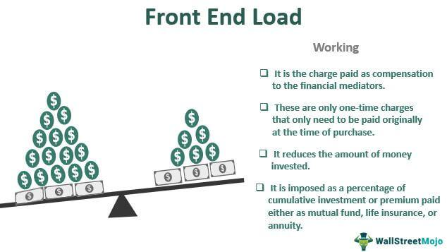

Supply chain optimization is essential for businesses aiming to enhance efficiency and achieve cost-effectiveness. At its core, it involves refining the coordination and movement of goods, services, and information from the point of origin to the final consumer. This process not only lowers operational costs but also boosts service quality and enhances product flow.

Load balancing is a crucial component within supply chain optimization, ensuring that workloads are evenly distributed across resources. This strategy prevents system overloads and maintains reliability by optimizing delivery schedules, reducing bottlenecks, and improving overall resource utilization. The seamless integration of automation and real-time data analytics into load balancing has revolutionized the way supply chains are managed.



The concept of 'level load' is prominently used in finance to describe a consistent fee structure applied throughout the lifetime of a financial product, such as mutual funds. This fee structure is designed to cover various costs including distribution, marketing, and advisory services. However, investors must understand its implications, as these fees can impact their overall returns over time.

In modern finance, algorithmic trading, commonly known as algo trading, has become increasingly significant. Utilizing pre-set criteria and live market data, algorithms conduct transactions with optimal speed and accuracy. This approach allows handling of large trade volumes efficiently and is increasingly integrated with artificial intelligence to improve market predictions and decision-making quality.

This article examines the interplay between supply chain optimization, load balancing, level loads, and algo trading, highlighting how these concepts can collectively transform both logistical operations and financial management strategies.

## Table of Contents

## Understanding Supply Chain Optimization

Supply chain optimization is the systematic approach to refining the operational processes within a supply chain to achieve higher efficiency and effectiveness. Crucially, the process seeks to minimize costs while enhancing the quality of services and facilitating the seamless flow of goods from suppliers to consumers.

Key objectives in supply chain optimization include reducing operational costs, which may encompass expenses related to production, transportation, and warehousing. An optimized supply chain can also significantly improve service quality. This improvement is achieved by minimizing lead times, enhancing product availability, and improving customer satisfaction rates. Moreover, optimizing the flow of goods ensures that products move swiftly and efficiently across the various nodes of the supply chain, thereby reducing delays and enhancing delivery reliability.

Several techniques are employed in supply chain optimization. Strategic sourcing involves selecting suppliers that provide the highest value and aligning procurement strategies with business objectives to enhance overall performance. Effective demand forecasting is another cornerstone technique, enabling businesses to predict future customer demand accurately and adjust their operations accordingly. This forecasting can leverage various methodologies, such as time series analysis, [machine learning](/wiki/machine-learning) models, or a combination of statistical techniques for enhanced accuracy.

Inventory management is another critical aspect of optimization. It encompasses determining the optimal order quantities and timing to minimize holding and shortage costs. One widely used model in this regard is the Economic Order Quantity (EOQ) model, which calculates the ideal order size to minimize total inventory costs. The EOQ formula is given by:

$$
\text{EOQ} = \sqrt{\frac{2DS}{H}}
$$

where $D$ is the demand rate, $S$ is the ordering cost per order, and $H$ is the holding cost per unit per period.

Logistics planning involves optimizing the transportation and handling of goods, focusing on route optimization, scheduling, and warehouse management. Advanced software solutions and technologies, including Geographic Information Systems (GIS) and Internet of Things (IoT) devices, can greatly enhance logistics operations by providing real-time data and insights.

By adopting these optimization techniques, businesses can enhance their supply chain efficiency, reduce costs, and improve service delivery, ultimately leading to a more competitive market position.

## The Role of Load Balancing

Load balancing is a critical technique designed to distribute workloads evenly across various resources. It aims to prevent resource overloads and enhance the reliability of systems through optimal resource utilization. By ensuring that no single component becomes a bottleneck, load balancing plays an important role in maintaining the efficiency and operational continuity of supply chains.

In the context of supply chains, load balancing can significantly optimize delivery schedules by evenly distributing tasks among available resources. This distribution helps minimize bottlenecks, ensuring a steady and efficient flow of goods from production to end consumers. The primary goal is to achieve a harmonious balance where resources are used optimally, reducing dead time and excess inventory, thereby improving overall productivity.

Technological advancements have paved the way for automated load balancing, a sophisticated process that integrates real-time data analytics. This innovation allows for dynamic adjustments based on current resource demand and availability. For instance, real-time data provided by the Internet of Things (IoT) and sensors within the supply chain can be processed to optimize the allocation of tasks. The integration of these technologies enables systems to detect and respond to changing conditions rapidly.

Automated load balancing can be visualized through algorithms that manage resource allocation. A simple Python example might involve distributing tasks based on current resource availability:

```python
import random

def assign_tasks(resources, tasks):
    task_distribution = {resource: [] for resource in resources}
    for task in tasks:
        selected_resource = min(resources, key=lambda r: len(task_distribution[r]))
        task_distribution[selected_resource].append(task)
    return task_distribution

resources = ['Warehouse A', 'Warehouse B', 'Warehouse C']
tasks = ['Task 1', 'Task 2', 'Task 3', 'Task 4', 'Task 5', 'Task 6']

distribution = assign_tasks(resources, tasks)
print(distribution)
```

In this code snippet, tasks are assigned to the resource currently handling the fewest tasks, ensuring load balance across the resources. Load balancing algorithms like this can be scaled up with more complex logic and real-time data inputs to manage a substantial number of tasks and resources in an actual supply chain scenario.

In conclusion, load balancing is a critical component for optimizing supply chain operations, enhancing resource utilization, and minimizing operational hiccups. As technology continues to evolve, the incorporation of real-time data and automation strategies will likely expand, providing even greater efficiencies and reliability within supply chain systems.

## Exploring Level Load in Financial Contexts

Level load refers to a specific fee structure predominantly used in the financial sector, especially with mutual funds. Unlike front-end loads that are charged at the time of purchase or back-end loads assessed when sold, level loads are continuous and applied annually as a percentage of the fund's average net assets. This fee is consistent over time, typically facilitating the coverage of various operational aspects such as distribution, marketing, and advisory services.

From an operational perspective, level loads are part of the fund's overall expense ratio and are deducted from the fund's assets, thereby reducing the investor's returns over time. The stability of these fees makes them preferable for investors seeking predictability in fee structures, as they eliminate the need to pay large commissions upfront or upon [exit](/wiki/exit-strategy). However, it is crucial for investors to be aware of these charges as they have a direct impact on the fund's net performance.

Mathematically, the impact of a level load fee can be represented by the reduction in the investor's return. If $r$ represents the gross return of the fund, and $l$ is the level load fee expressed as a percentage, the net return $R$ can be calculated as:

$$
R = r - l
$$

This model highlights the necessity for investors to consider such fees when evaluating mutual fund investments, as cumulative fees over an extended period can significantly erode potential earnings. For example, a 1% level load on a fund with an annual return of 5% effectively reduces the investor's return to 4%.

Understanding how level loads operate assists investors in making well-informed decisions about fund investments. By comparing the level load percentage with the fund's performance and potential benefits, investors can evaluate whether the operational services provided justify the fee and align with their investment strategy.

The consistency of level load fees provides transparency but requires careful evaluation within the broader context of total fund expenses. This understanding is essential for optimizing investment portfolios and achieving financial goals.

## Algorithmic Trading and Its Applications

Algorithmic trading, a cornerstone of modern financial markets, leverages algorithms to automate the decision-making process for executing trades. By utilizing algorithms, trading can be executed at optimal parameters, crucially enhancing the efficiency and speed of financial transactions. The primary benefits of [algorithmic trading](/wiki/algorithmic-trading) include improved accuracy, reduced transaction costs, and the capacity to handle large volumes of data with minimal human intervention.

The foundation of algorithmic trading lies in its ability to process market data and execute trades based on pre-set rules and criteria. These criteria are often derived from a variety of input sources, including historical data, market signals, and price trends. For example, a simple moving average crossover strategy could be implemented using Python as follows:

```python
import pandas as pd
import numpy as np

# Example data
data = pd.DataFrame({
    'price': [100, 101, 102, 103, 110, 108, 112, 115]
})

# Calculate moving averages
data['SMA_50'] = data['price'].rolling(window=3).mean()
data['SMA_100'] = data['price'].rolling(window=5).mean()

# Generate buy/sell signals
data['Signal'] = 0
data.loc[data['SMA_50'] > data['SMA_100'], 'Signal'] = 1  # Buy signal
data.loc[data['SMA_50'] < data['SMA_100'], 'Signal'] = -1  # Sell signal

print(data)
```

In recent years, algorithmic trading has increasingly been integrated with [artificial intelligence](/wiki/ai-artificial-intelligence) (AI) to further refine decision-making and predict market trends with greater accuracy. AI algorithms, such as machine learning models, can analyze vast amounts of market data to identify patterns and make predictions about future price movements. This capability allows traders to anticipate market shifts more effectively and execute trades with a higher probability of success.

The integration of AI in algorithmic trading also facilitates the development of adaptive trading strategies that can adjust to changing market conditions. For example, [reinforcement learning](/wiki/reinforcement-learning), a type of machine learning, can be applied to continuously improve trading strategies based on market feedback. Such strategies can dynamically balance between exploitation of known profitable strategies and exploration of new opportunities.

Despite its advantages, algorithmic trading faces challenges, particularly in terms of market impact and the potential for systemic risks due to sudden price movements driven by automated systems. To mitigate these risks, financial regulators increasingly scrutinize algorithmic trading practices to ensure market stability and fairness.

In summary, algorithmic trading epitomizes the intersection of technology and finance, offering unparalleled speed and precision in executing trades. Its ongoing evolution, particularly through AI integration, promises further advancements in the ability of traders to navigate complex markets effectively.

## Integration of Supply Chain Optimization and Algo Trading

The integration of supply chain optimization with algorithmic trading brings substantial advantages to modern business operations. By incorporating algorithmic strategies into supply chain management, businesses can significantly enhance decision-making and operational efficiency. Automated systems employ algorithms capable of processing vast datasets, enabling advanced forecasting and improved precision in operational activities.

The use of algorithms in supply chain optimization allows for more accurate demand forecasting and inventory management. For instance, machine learning models can predict future stock requirements by analyzing historical data trends and market indicators. A simple example of such a predictive model in Python could involve using libraries like scikit-learn to implement a regression algorithm:

```python
from sklearn.linear_model import LinearRegression
import numpy as np

# Sample data: Historical demand and influencing factors
X = np.array([[1, 2], [2, 3], [3, 5], [4, 7]])  # Historical factors
y = np.array([3, 5, 7, 10])  # Historical demand

# Create and train the model
model = LinearRegression()
model.fit(X, y)

# Predict future demand
future_factors = np.array([[5, 8]])
predicted_demand = model.predict(future_factors)
print("Predicted Demand:", predicted_demand)
```

Moreover, integrating algorithmic trading into supply chain operations enables businesses to swiftly adapt to market fluctuations and optimize resource allocations. Algorithms can analyze real-time data streams, flagging potential disruptions in supply chains, such as sudden shifts in consumer preferences or unexpected supply shortages. This capability ensures that businesses remain agile and can reallocate resources efficiently to minimize potential impacts.

The integration also supports high-frequency decision-making, where supply chain activities are adjusted dynamically based on market conditions. This is similar to high-frequency trading in finance, where algorithms execute trades in milliseconds based on market signals, thus achieving optimal pricing and timing.

Furthermore, algorithmic strategies enable businesses to optimize logistical elements, such as routing and transportation schedules. By leveraging algorithms, companies can reduce delivery times and costs, thus enhancing service quality with minimal resource expenditure. Programs that solve optimization problems, like the Traveling Salesman Problem, can be used to find efficient delivery routes:

```python
import itertools

def calculate_route_cost(route, distance_matrix):
    return sum(distance_matrix[route[i]][route[i + 1]] for i in range(len(route) - 1))

def find_optimal_route(cities, distance_matrix):
    min_cost = float('inf')
    optimal_route = []
    perms = itertools.permutations(cities)

    for perm in perms:
        current_cost = calculate_route_cost(perm, distance_matrix) + distance_matrix[perm[-1]][perm[0]]
        if current_cost < min_cost:
            min_cost = current_cost
            optimal_route = perm

    return optimal_route, min_cost

# Sample data
cities = [0, 1, 2, 3]
distance_matrix = [
    [0, 10, 15, 20],
    [10, 0, 35, 25],
    [15, 35, 0, 30],
    [20, 25, 30, 0]
]

optimal_route, min_cost = find_optimal_route(cities, distance_matrix)
print("Optimal Route:", optimal_route, "with cost:", min_cost)
```

By merging the powerful methodologies of supply chain optimization with algorithmic trading principles, businesses can enhance their competitive edge, reduce operational costs, and boost service quality, all while maintaining the flexibility needed to face future challenges. This fusion provides a formidable foundation for improving business resilience and aligns operational activities with strategic objectives.

## Benefits and Challenges

Optimizing supply chains and employing algorithmic trading present several benefits for businesses striving to maintain a competitive edge. One of the most significant advantages is cost reduction. By streamlining operations and enhancing resource allocation, companies can minimize waste and redundancies, thereby reducing operational expenditures. For example, algorithmic trading can execute trades at optimal prices due to its ability to process vast amounts of data rapidly, leading to reduced transaction costs and improved profit margins. Similarly, supply chain optimization techniques such as demand forecasting and inventory management help decrease holding costs and prevent stockouts or overstock situations.

Enhanced efficiency is another notable benefit. Automating processes through algorithms enables faster and more accurate decision-making, ensuring that goods and financial transactions move seamlessly through the system. This agility allows businesses to respond promptly to market trends and consumer demands. Moreover, the use of real-time data analytics in load balancing ensures that resources are utilized effectively, reducing bottlenecks and improving delivery schedules.

Improved competitiveness stems from the ability to offer better services and products at lower prices. Companies that adopt these strategies can outperform rivals by leveraging efficiency and cost-effectiveness. The utilization of advanced technologies also opens avenues for innovation, further setting businesses apart from competitors.

Despite these substantial benefits, challenges inevitably arise. A primary concern is data security. As companies increasingly rely on digital solutions, the risk of cyber threats escalates. Safeguarding sensitive information becomes paramount to maintaining trust and compliance with regulations such as the General Data Protection Regulation (GDPR).

Technology dependency is another challenge. Organizations become reliant on sophisticated systems that require constant updates and maintenance. Infrastructure upgrades are necessary to handle the growing volumes of data and to implement newer, more efficient algorithms. This ongoing need for technological evolution can strain resources and lead to significant capital expenditure.

Balancing the adoption of these technologies with regulatory compliance is crucial for successful implementation. Companies must navigate complex legal landscapes to ensure that their operations conform to national and international regulations. This requires robust compliance frameworks and often involves significant investment in legal and regulatory expertise to avoid penalties and legal setbacks.

Overall, while the integration of supply chain optimization and algorithmic trading offers substantial competitive advantages, businesses must address the associated challenges proactively to sustain success and foster growth.

## Conclusion

Supply chain optimization, facilitated by load balancing and advanced strategies like algorithmic trading, has the potential to significantly enhance business operations. These approaches address both the physical logistics and the financial frameworks within a company, ensuring that resources are used efficiently and costs are minimized. By distributing workloads evenly and strategically managing resources, businesses can avoid bottlenecks and maintain a more reliable supply chain. 

Additionally, integrating algorithmic trading approaches can refine decision-making processes and boost the precision of operations. Algorithmic trading leverages data-driven algorithms to optimize transaction parameters, providing businesses with the tools to swiftly navigate market changes and allocate resources efficiently. This dual approach of optimizing supply chains and applying algorithmic trading principles allows enterprises to streamline their operations comprehensively.

Understanding and applying concepts such as level load further complements this integration by maintaining consistent fee structures, which support clear financial planning and management. This uniformity in costs provides a stable financial backdrop for assessing investments and distributive strategies in supply chain management.

Future prospects in these domains largely depend on technological advancements. As technology evolves, it brings forth innovations that can further automate and optimize operations. Companies that adapt to these changes effectively can sustain a competitive edge, harnessing new solutions to continually improve their supply chain and trading efficiencies. This adaptability will be critical, as it empowers organizations to not just respond but anticipate shifts in both logistical and financial landscapes.

## References & Further Reading

[1]: Chopra, S., Meindl, P., & Kalra, D. V. (2013). ["Supply Chain Management: Strategy, Planning, and Operation."](https://books.google.com/books/about/Supply_Chain_Management_Strategy_Plannin.html?id=gPDQCQAAQBAJ) Pearson.

[2]: Agrawal, S., & Smith, S. A. (2009). "Optimal Inventory Policies for a Supply Chain or Inventory System with Stochastic Demand using Bayesian Information," European Journal of Operational Research, 198(1), 186-198.

[3]: Hull, J. C. (2018). ["Options, Futures, and Other Derivatives."](https://www.semanticscholar.org/paper/Options%2C-Futures%2C-and-Other-Derivatives-Hull/89bdee500c8623864fc9eb7a471546aa713acc44) Pearson.

[4]: Géczy, C. C., Minton, B. A., & Schrand, C. (2007). "Taking a View: Corporate Speculation, Governance, and Compensation," Journal of Finance, 62(5), 2405-2443.

[5]: Papon, Philippe. (2012). "Algorithmic Trading in Finance," [Encyclopedia of Complexity and Systems Science], Springer, 377-401.