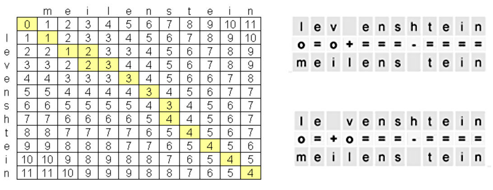

## Table of Contents

## What is Levenshtein Distance and how is it used in machine learning?

Levenshtein Distance, also known as edit distance, is a way to measure how different two strings are from each other. It counts the smallest number of single-character edits (like insertions, deletions, or substitutions) needed to change one string into another. For example, turning "cat" into "cut" requires just one substitution (a to u), so the Levenshtein Distance between "cat" and "cut" is 1. The formula for Levenshtein Distance between two strings, s1 and s2, can be expressed as $$ \text{lev}(s1, s2) $$, where the value represents the minimum number of edits needed.

In machine learning, Levenshtein Distance is useful for tasks like spell checking, where it helps find the closest correct word to a misspelled one. It's also used in natural language processing for tasks like text similarity analysis, where it helps understand how similar two pieces of text are. For example, in machine learning models that need to group similar text together, Levenshtein Distance can help by measuring how many edits are needed to turn one text into another, thus indicating their similarity. This simple yet powerful tool can be implemented in various programming languages, making it a versatile choice for many applications.

## Can you explain the basic algorithm for calculating Levenshtein Distance?

The basic algorithm for calculating Levenshtein Distance between two strings uses a dynamic programming approach. You start by creating a matrix where the rows represent the characters of the first string and the columns represent the characters of the second string. You initialize the first row and column of the matrix to represent the cost of transforming an empty string to the substring of the other string. For example, if you're comparing "kitten" and "sitting", the first row would be [0, 1, 2, 3, 4, 5, 6, 7] and the first column would be [0, 1, 2, 3, 4, 5, 6].

Then, you fill in the rest of the matrix by comparing each character of the two strings. For each cell, you look at the cell to the left, the cell above, and the cell diagonally above-left. You choose the minimum of these three values and, if the characters at the current position in both strings are different, you add 1 to that minimum. If the characters are the same, you just take the minimum without adding anything. The value in the bottom-right cell of the matrix is the Levenshtein Distance between the two strings. For "kitten" and "sitting", the final matrix would look like this, and the distance is 3:

```
   s i t t i n g
k 1 1 2 3 4 5 6 7
i 2 1 2 3 4 5 6 7
t 3 2 1 2 3 4 5 6
t 4 3 2 1 2 3 4 5
e 5 4 3 2 2 3 4 5
n 6 5 4 3 3 2 3 4
```

The Levenshtein Distance between "kitten" and "sitting" is calculated as $$ \text{lev}(\text{"kitten"}, \text{"sitting"}) = 3 $$.

## How does Levenshtein Distance help in text similarity analysis?

Levenshtein Distance is a useful tool for figuring out how similar two pieces of text are. It does this by counting the smallest number of changes, like adding, removing, or swapping letters, needed to turn one text into another. For example, if you want to see how close "cat" is to "cut", you only need to swap one letter, so the Levenshtein Distance is 1. This number helps us understand how different the texts are, and a smaller number means the texts are more similar.

In text similarity analysis, this distance can help group texts that are alike together. For instance, if you're looking at a bunch of short messages and want to find ones that are similar, you can use Levenshtein Distance to see which messages need the least changes to become the same. This is really helpful in tasks like finding similar search queries or matching user inputs to a database of known phrases. By using $$ \text{lev}(s1, s2) $$ to measure how many edits are needed, we can better understand and group similar texts.

## What are the practical applications of Levenshtein Distance in natural language processing?

Levenshtein Distance is very useful in natural language processing for tasks like spell checking. When someone types a word wrong, the computer can use Levenshtein Distance to find the correct word that is closest to the misspelled one. For example, if you type "recieve" instead of "receive," the computer can figure out that it only needs to swap one letter to fix it, so $$ \text{lev}(\text{"recieve"}, \text{"receive"}) = 1 $$. This helps the computer suggest the right word quickly and accurately.

Another important use of Levenshtein Distance is in text similarity analysis. It helps to group similar pieces of text together, which is useful for tasks like finding similar search queries or matching user inputs to a database. For instance, if you are searching for "[machine learning](/wiki/machine-learning)" but accidentally type "machin learning," the computer can use Levenshtein Distance to see that these are very similar, with just one letter difference, so $$ \text{lev}(\text{"machine learning"}, \text{"machin learning"}) = 1 $$. This makes it easier to find the right information even if the search terms are slightly off.

## How can Levenshtein Distance be used to improve spell checking algorithms?

Levenshtein Distance helps make spell checking better by finding the correct word that is closest to a misspelled one. It does this by counting the smallest number of changes, like adding, removing, or swapping letters, needed to turn the wrong word into the right one. For example, if someone types "recieve" instead of "receive," the computer can use Levenshtein Distance to see that it only needs to swap one letter to fix it, so $$ \text{lev}(\text{"recieve"}, \text{"receive"}) = 1 $$. This makes it quick and easy for the computer to suggest the right word to the user.

In a spell checking program, you can use Levenshtein Distance to compare the misspelled word with a list of correct words. The computer calculates the Levenshtein Distance between the misspelled word and each word in the list. It then picks the word with the smallest distance as the best suggestion. This way, even if someone makes a few mistakes while typing, the spell checker can still find the right word and help them fix their spelling.

## What are the computational complexities involved in calculating Levenshtein Distance?

The basic algorithm for calculating Levenshtein Distance uses dynamic programming, which means it builds up a solution by solving smaller parts of the problem first. This method creates a matrix where each cell represents the minimum number of edits needed to change a substring of the first string into a substring of the second string. The time and space complexity of this algorithm are both $$ O(m \times n) $$, where $$ m $$ and $$ n $$ are the lengths of the two strings being compared. This means that as the length of the strings increases, the time and space needed to compute the distance grow quadratically.

However, there are ways to make the algorithm more efficient. For example, if you only need to know the Levenshtein Distance and not the actual sequence of edits, you can use an algorithm that only keeps track of the last two rows of the matrix at any time. This reduces the space complexity to $$ O(\min(m, n)) $$, while the time complexity remains $$ O(m \times n) $$. There are also more advanced algorithms like the Hirschberg's algorithm that can further optimize the space used while still maintaining the time complexity.

## How does Levenshtein Distance differ from other edit distance metrics like Hamming Distance?

Levenshtein Distance and Hamming Distance are both used to measure how different two strings are, but they work a bit differently. Levenshtein Distance counts the smallest number of single-character edits (like adding, removing, or changing a letter) needed to turn one string into another. For example, if you want to change "cat" to "cut," you only need to swap one letter, so the Levenshtein Distance is 1, or $$ \text{lev}(\text{"cat"}, \text{"cut"}) = 1 $$. Hamming Distance, on the other hand, only counts the number of positions where the two strings are different, but it assumes that the strings are the same length. So, if you try to use Hamming Distance to compare "cat" and "cut," it would also be 1 because they differ in one position.

The main difference between the two is that Levenshtein Distance can handle strings of different lengths, while Hamming Distance cannot. This makes Levenshtein Distance more flexible and useful for a wider range of tasks, like spell checking where words might be longer or shorter than intended. Hamming Distance is simpler and faster to calculate, but it's only useful when you're comparing strings that are the same length, like in error detection in data transmission where each piece of data has a fixed length.

## Can you describe any optimizations or variations of the Levenshtein Distance algorithm?

There are ways to make the Levenshtein Distance algorithm faster and use less memory. One way is to only keep track of the last two rows of the matrix instead of the whole thing. This saves a lot of space because you don't need to store the entire matrix. The time it takes to calculate the distance is still the same, but now it uses less memory. This is good for big strings where saving space matters. The space complexity goes from $$ O(m \times n) $$ to $$ O(\min(m, n)) $$, where $$ m $$ and $$ n $$ are the lengths of the two strings.

Another way to optimize the Levenshtein Distance is to use Hirschberg's algorithm. This method splits the problem into smaller parts and solves them one by one. It helps to find the actual sequence of edits needed to change one string into another while using less memory. The time it takes to run is still the same, but it uses less space than the basic algorithm. This makes it useful when you need to know not just the distance, but also how to change one string into another.

There are also variations of the Levenshtein Distance that add different kinds of edits. For example, the Damerau-Levenshtein Distance adds the ability to swap two adjacent characters. This can be helpful for spell checking because people often swap letters by mistake. If you want to change "cat" to "act," the regular Levenshtein Distance would say it needs two changes (delete 'c', add 'a'), but the Damerau-Levenshtein Distance would say it only needs one swap (swap 'c' and 'a'), so $$ \text{lev}_{\text{Damerau}}(\text{"cat"}, \text{"act"}) = 1 $$. This makes the distance more accurate for some tasks.

## How can Levenshtein Distance be integrated into machine learning models for better performance?

Levenshtein Distance can be used in machine learning models to help with tasks like text similarity and spell checking. By calculating the Levenshtein Distance between two pieces of text, a model can understand how similar they are. For example, if a model needs to group similar texts together, it can use Levenshtein Distance to see how many changes are needed to turn one text into another. This helps the model decide which texts are alike, making its results more accurate. For instance, if the model is trying to match a user's search query to a database of known phrases, it can use $$ \text{lev}(s1, s2) $$ to find the closest match, even if the query has some typos.

Another way to use Levenshtein Distance in machine learning is in training models to better understand and predict text. By including Levenshtein Distance as a feature in the model's input, the model can learn to recognize patterns in text similarity. This can be especially useful in natural language processing tasks where understanding slight differences in text can improve performance. For example, a model trained on Levenshtein Distance can better handle misspelled words or variations in text, leading to more robust and accurate predictions. By integrating this simple yet powerful tool, machine learning models can perform better in tasks that involve comparing and understanding text.

## What are the limitations of using Levenshtein Distance in machine learning applications?

Levenshtein Distance is a helpful tool for comparing texts in machine learning, but it has some limits. One big limit is that it only looks at how many changes are needed to turn one text into another, not what the changes mean. For example, changing "cat" to "dog" takes three changes, so $$ \text{lev}(\text{"cat"}, \text{"dog"}) = 3 $$, but it doesn't know that "cat" and "dog" are both animals. This can make it hard for machine learning models to understand the real meaning behind the texts they are comparing.

Another limit is that Levenshtein Distance can be slow and use a lot of memory when working with long texts. The time and space it needs grow quickly as the texts get longer, which can be a problem for big datasets. There are ways to make it faster and use less memory, but they can be tricky to use and might not work for all tasks. So, while Levenshtein Distance is good for some things, it might not be the best choice for every machine learning task, especially when you need to understand the meaning of the text or work with very large amounts of data.

## How does Levenshtein Distance contribute to sequence alignment in bioinformatics?

Levenshtein Distance is really helpful in bioinformatics for something called sequence alignment. This is when scientists want to compare two DNA or protein sequences to see how similar they are. They use Levenshtein Distance to count the smallest number of changes, like adding, removing, or swapping letters, needed to turn one sequence into another. For example, if you want to compare two DNA sequences "AGCT" and "AGGT," you only need to swap one letter to make them the same, so the Levenshtein Distance is 1, or $$ \text{lev}(\text{"AGCT"}, \text{"AGGT"}) = 1 $$. This helps scientists understand how closely related different organisms might be.

However, Levenshtein Distance has some limits in bioinformatics. It only looks at how many changes are needed, not what those changes mean. For example, changing one letter in a DNA sequence might not be as important as changing another, but Levenshtein Distance treats all changes the same. Also, it can be slow and use a lot of memory when working with long sequences. Scientists often use more advanced methods that take into account the meaning of the changes and are faster for big sequences, but Levenshtein Distance is still a good starting point for understanding how similar sequences are.

## Can you discuss advanced uses of Levenshtein Distance in deep learning and neural networks?

Levenshtein Distance can be used in [deep learning](/wiki/deep-learning) to help neural networks understand and compare texts better. For example, in natural language processing tasks like text classification or sentiment analysis, Levenshtein Distance can be used as a feature to help the model see how similar different pieces of text are. By including $$ \text{lev}(s1, s2) $$ as part of the input, the [neural network](/wiki/neural-network) can learn to recognize patterns in text similarity, which can make its predictions more accurate. This is especially useful when dealing with typos or slight variations in text, as the model can better handle these differences and still understand the meaning behind the text.

Another advanced use of Levenshtein Distance in neural networks is in sequence-to-sequence models, like those used in machine translation or text generation. Here, Levenshtein Distance can help measure the quality of the generated output by comparing it to the expected result. For instance, if a model is translating a sentence from English to French, Levenshtein Distance can show how many changes are needed to turn the model's output into the correct translation. This helps in training the model to produce better results over time, as it can use the distance as a feedback mechanism to adjust its predictions and improve its performance.

## References & Further Reading

[1]: Jurafsky, D., & Martin, J. H. (2009). ["Speech and Language Processing."](https://www.researchgate.net/publication/200111340_Speech_and_Language_Processing_An_Introduction_to_Natural_Language_Processing_Computational_Linguistics_and_Speech_Recognition) Prentice Hall.

[2]: Lehvenstein, V. I. (1965). ["Binary codes capable of correcting deletions, insertions, and reversals."](https://www.scribd.com/document/105599835/Binary-codes-capable-of-correcting-deletions-insertions-and-reversals) Soviet Physics Doklady.

[3]: Wagner, R. A., & Fischer, M. J. (1974). ["The string-to-string correction problem."](https://dl.acm.org/doi/10.1145/321796.321811) Journal of the ACM.

[4]: Gusfield, D. (1997). ["Algorithms on Strings, Trees, and Sequences: Computer Science and Computational Biology."](https://doc.lagout.org/science/0_Computer%20Science/2_Algorithms/Algorithms%20on%20Strings%2C%20Trees%2C%20and%20Sequences%20%5BGusfield%201997-05-28%5D.pdf) Cambridge University Press.

[5]: Navarro, G. (2001). ["A guided tour to approximate string matching."](https://dl.acm.org/doi/10.1145/375360.375365) ACM Computing Surveys.

[6]: Lothaire, M. (2005). ["Applied Combinatorics on Words."](https://archive.org/details/appliedcombinato0000loth) Cambridge University Press.