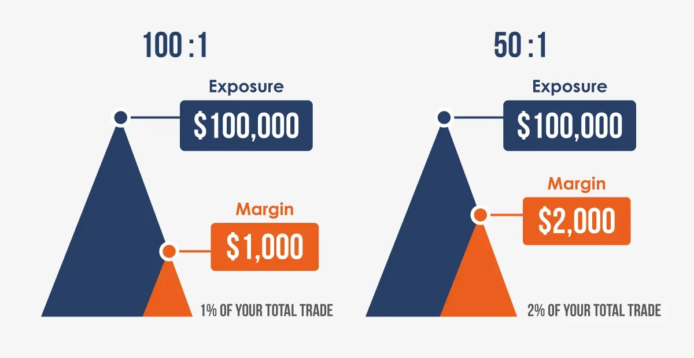

## Table of Contents

## What is leverage in the context of the foreign exchange market?

Leverage in the foreign exchange market, often called Forex, is a tool that lets traders control a large amount of money with a small amount of their own. Imagine you want to buy a house but don't have enough money. You can use a small part of your money as a down payment and borrow the rest. In Forex, this small part is called margin, and it allows you to trade bigger amounts than you could with just your own money.

Using leverage can make your profits bigger if the market moves in your favor. But, it's a double-edged sword because it can also make your losses bigger if the market goes against you. That's why it's important to understand how leverage works and to use it carefully. Always remember, while leverage can increase your potential rewards, it also increases the risks involved.

## How does leverage work in forex trading?

In forex trading, leverage lets you control a big amount of money with just a little bit of your own. It's like using a small key to open a big door. When you want to trade, you only need to put down a small part of the total amount you want to trade, and this is called the margin. For example, if you want to trade $100,000 but only have $1,000, with leverage, you can use that $1,000 as margin to control the $100,000 trade. The rest of the money is borrowed from your broker.

Leverage can make your profits bigger if the currency you're trading goes up in value. But, it can also make your losses bigger if the currency goes down. It's like riding a bike with a turbo booster; it can make you go faster, but if you crash, you'll crash harder. So, you need to be careful and understand how much risk you're taking on. It's important to use leverage wisely and not to risk more than you can afford to lose.

## What are the benefits of using leverage in forex trading?

Using leverage in forex trading can make your profits bigger. Imagine you have $1,000 and you use leverage to trade $100,000. If the currency you're trading goes up just a little bit, your profit can be much larger than if you were only trading with your $1,000. This means you can make more money with less of your own cash.

But, leverage also has another benefit: it lets you trade bigger amounts without needing a lot of money upfront. This means more people can start trading in the forex market, even if they don't have a lot of money to begin with. It opens up opportunities for smaller investors to participate in the market and potentially grow their investments.

## What are the risks associated with using leverage in forex trading?

Using leverage in forex trading can make your losses bigger if the market moves against you. Imagine you're using a small amount of your money to control a much larger trade. If the currency you're trading goes down in value, you could lose more than the money you put in as margin. This means you could end up owing money to your broker, which can be a scary situation.

Another risk is that leverage can make you feel overconfident. Because you can trade bigger amounts with less of your own money, you might start taking bigger risks than you should. This can lead to big losses if the market doesn't go the way you expect. It's important to use leverage carefully and not to risk more than you can afford to lose.

## How is leverage calculated in forex trading?

Leverage in forex trading is calculated by dividing the total value of the trade by the amount of money you need to put down, which is called the margin. For example, if you want to trade $100,000 and your broker requires a margin of $1,000, the leverage would be 100:1. This means you're using $1,000 to control a $100,000 trade.

Brokers often express leverage as a ratio, like 50:1 or 100:1. This ratio tells you how much bigger the trade is compared to your margin. If you have a leverage of 50:1, you can trade $50 for every $1 you put down as margin. It's important to understand this ratio because it directly affects how much you can gain or lose in your trades.

## What is the difference between leverage and margin in forex trading?

Leverage and margin are two important ideas in forex trading, but they're different. Leverage is like a tool that lets you control a big amount of money with just a little bit of your own. It's like using a small key to open a big door. When you use leverage, you can trade a lot more money than you actually have. For example, with a leverage of 100:1, you can trade $100,000 with just $1,000 of your own money.

Margin, on the other hand, is the small amount of money you need to put down to open a leveraged trade. It's like a down payment when you're buying a house. In the example above, the $1,000 you put down is the margin. The margin is what you use to "unlock" the leverage, allowing you to trade much larger amounts than you could with just your own money. So, while leverage is the ratio that lets you trade more, margin is the actual cash you need to start the trade.

## How do brokers determine the amount of leverage they offer to traders?

Brokers decide how much leverage to offer based on a few things. One big thing is the rules set by financial regulators in different countries. These rules are there to protect traders from taking too much risk. For example, in some places, brokers can only offer up to 30:1 leverage, while in others, they might be allowed to offer more. Brokers also look at how experienced a trader is. If you're new to trading, they might give you less leverage to help you learn without risking too much.

Another thing brokers think about is how much money a trader has in their account. If you have a lot of money, brokers might let you use more leverage because they think you can handle the risk better. They also consider the type of currency pair you want to trade. Some pairs are more stable, so brokers might offer more leverage for those. In the end, it's all about balancing the chance for traders to make big profits with the need to keep trading safe and under control.

## What are the typical leverage ratios offered by forex brokers?

Forex brokers usually offer leverage ratios that can range from as low as 1:1 up to 500:1 or even more in some cases. The most common leverage ratios you'll see are 50:1, 100:1, and 200:1. These numbers mean that for every dollar you put in, you can trade 50, 100, or 200 dollars worth of currency. For example, with a 100:1 leverage, you can trade $100,000 with just $1,000 of your own money.

The exact leverage ratio a broker offers can depend on a few things. One big thing is the rules set by the country's financial regulators. Some countries have strict rules that limit how much leverage brokers can offer, while others are more relaxed. Also, brokers might give different leverage ratios based on how much money you have in your account and how experienced you are as a trader. If you're new or have less money, they might offer you less leverage to keep things safer.

## How can traders manage the risks of high leverage in forex trading?

Managing the risks of high leverage in forex trading is important to keep your money safe. One way to do this is by using stop-loss orders. A stop-loss order is like a safety net that automatically closes your trade if the market moves against you too much. This can help limit your losses and keep them from getting too big. Another way to manage risk is by not using the maximum leverage your broker offers. Just because you can trade with a lot of leverage doesn't mean you should. Using less leverage can help you keep your losses smaller if the market goes the wrong way.

It's also a good idea to keep an eye on your account balance and the amount of money you have at risk. Make sure you only risk money you can afford to lose. This is called managing your risk exposure. You can also spread out your trades across different currency pairs, which is called diversification. This can help reduce the risk because if one trade goes bad, the others might still do well. Lastly, learning about the market and keeping up with news can help you make smarter trading decisions and avoid big surprises.

## What are the regulatory limits on leverage for retail forex traders?

Different countries have different rules about how much leverage retail forex traders can use. In the United States, the Commodity Futures Trading Commission (CFTC) and the National Futures Association (NFA) set a maximum leverage of 50:1 for major currency pairs and 20:1 for minor pairs. In the European Union, the European Securities and Markets Authority (ESMA) limits leverage to 30:1 for major pairs and goes down to as low as 2:1 for certain other assets. These rules are there to protect traders from taking too much risk and losing a lot of money.

In other places like Australia, the Australian Securities and Investments Commission (ASIC) used to allow up to 500:1 leverage, but they've tightened their rules to be more in line with global standards. Some countries, like Japan, have even stricter limits, with a maximum leverage of 25:1. These limits can change, so it's a good idea for traders to check the rules in their country and make sure they're trading within the allowed limits.

## How does leverage affect the potential profit and loss in a forex trade?

Leverage can make your profits bigger in forex trading. Imagine you use $1,000 to trade $100,000 because of leverage. If the currency you're trading goes up just a little bit, your profit can be much larger than if you were only trading with your $1,000. This is because you're controlling a bigger amount of money with just a small part of your own cash. So, even small changes in the currency's value can lead to big profits.

But, leverage can also make your losses bigger if the market moves against you. If the currency you're trading goes down, you could lose more than the $1,000 you put in as margin. This means you might end up owing money to your broker. It's like riding a bike with a turbo booster; it can make you go faster, but if you crash, you'll crash harder. So, it's important to use leverage carefully and not to risk more than you can afford to lose.

## What strategies can expert traders use to maximize the benefits of leverage while minimizing its risks?

Expert traders can use a few smart strategies to make the most out of leverage while keeping the risks under control. One strategy is to use stop-loss orders. These are like safety nets that automatically close a trade if it starts going the wrong way. This helps limit how much money you can lose. Another strategy is not to use the highest leverage available. Just because a broker lets you use a lot of leverage doesn't mean you should. Using less leverage can help keep your losses smaller if the market moves against you.

Another important strategy is to diversify your trades. Instead of putting all your money into one trade, spread it out across different currency pairs. This way, if one trade goes bad, the others might still do well, balancing out your losses. It's also crucial to keep learning and staying updated with market news. By understanding what's happening in the market, expert traders can make better decisions and avoid big surprises. Using these strategies together can help traders use leverage to their advantage while keeping their risks in check.

## What is Understanding Forex Market Leverage?

Leverage in the forex market is a powerful financial tool that allows traders to utilize borrowed capital to amplify their potential returns on investment. By taking advantage of leverage, traders can control larger trading positions than they could with their own capital, thus potentially enhancing their profits. However, this increased potential for profit comes with an equivalent potential for loss, making an understanding of leverage essential for anyone engaging in forex trading.

Leverage is expressed in ratios, such as 50:1, 100:1, or even 500:1. These ratios indicate how much larger the position size is compared to the trader's initial deposit. For example, a 50:1 leverage ratio means that for every dollar in the trader's account, they can control a position worth fifty dollars. Similarly, a 100:1 leverage implies that a trader can trade a hundred times the amount of their deposit. Leverage transforms small fluctuations in currency prices into larger profit or loss scenarios, magnifying the financial impact of trading decisions.

The utilization of leverage requires a margin, which acts as a good faith deposit that the trader must maintain to keep a leveraged position open. The margin is a fraction of the total trade size and represents the amount of the trader's own capital that is at risk. For instance, with a 100:1 leverage ratio, a trader would only need to provide 1% of the total trade value as their margin. This concept can be mathematically represented as:

$$
\text{Margin Requirement} = \frac{1}{\text{Leverage Ratio}}
$$

For a leverage ratio of 100:1:

$$
\text{Margin Requirement} = \frac{1}{100} = 0.01 \text{ or } 1\%
$$

Leverage, while offering significant opportunities for profit, also requires careful management. An adverse price movement can quickly erode the margin, potentially leading to a margin call from the broker, where the trader is required to deposit additional funds to maintain their open positions. Effective leverage management is critical, and traders must be astute in assessing their risk tolerance and financial capacity before engaging in high-leverage [forex](/wiki/forex-system) trading. Understanding how to appropriately apply leverage and maintain sufficient margins can be instrumental in managing risk and achieving success in the forex market.

## What are the types of leverage ratios?

Different brokers offer a range of leverage ratios, which directly influence the margin requirement for traders engaging in the forex market. Leverage ratios are expressed in forms such as 50:1, 100:1, or 200:1. These ratios indicate the level of control a trader has over positions relative to their actual capital. For instance, a leverage ratio of 100:1 implies that a trader can manage a position 100 times larger than their margin deposit. In this case, the trader is required to allocate only 1% of the total trade value as the margin.

To illustrate, consider a leverage ratio of 100:1. If a trader wishes to control a position worth $100,000, they would need a margin deposit of only $1,000. This calculation is straightforward: the required margin is the inverse of the leverage ratio:

$$
\text{Margin Requirement} = \left(\frac{1}{\text{Leverage Ratio}}\right) \times \text{Total Position Size}
$$

Using this formula, we find:

$$
\text{Margin Requirement} = \left(\frac{1}{100}\right) \times 100,000 = 1,000
$$

Higher leverage ratios provide the allure of significantly magnified profits because they allow traders to control larger positions with a relatively small initial capital outlay. However, this increased potential for profit comes with a corresponding increase in risk. A minor fluctuation in currency prices can lead to substantial losses, as leverage amplifies not only gains but also losses. Consequently, traders should exercise caution and consider their risk tolerance when engaging in leveraged trading.

## What are the risks of using leverage in Forex trading?

Leverage in forex trading can amplify both potential returns and potential losses. The central risk associated with leveraging is that losses can quickly surpass the initial investment, leaving traders in a vulnerable financial position. A trader utilizing leverage is effectively borrowing funds from a broker to increase market exposure. While this can potentially maximize gains, it also means that a slight unfavorable movement in currency prices can result in proportionally larger losses.

A critical risk of leveraging is the occurrence of margin calls. Margin calls are requests from brokers for additional capital to maintain an open position that has moved adversely. Brokers require a certain margin level to be maintained, which represents the trader’s equity as a percentage of the total position size. If price fluctuations cause this margin level to fall below the required percentage due to losses, the broker will issue a margin call. This necessitates traders to either deposit more funds or close their positions to limit further potential losses.

In mathematical terms, if $P_0$ is the initial position size and $L$ is the leverage ratio, the trader controls a position of size $L \times P_0$. In the event of an unfavorable market movement of $\Delta P$ in the currency pair:

$$
\text{Loss} = L \times \Delta P \times \text{Lot Size}
$$

Such losses can be substantially larger than what the trader can cover with their initial equity.

Beyond the financial risks, leverage can also have significant psychological effects. The potential for large, rapid gains or losses can induce stress and lead to impulsive decision-making, undermining rational trading strategies. This emotional pressure can often result in traders deviating from their planned risk management strategies, leading to even greater losses.

Effectively managing such risks involves combining technical understanding with emotional discipline. Traders should consistently monitor their leverages, employ stop-loss orders to limit potential downside, and avoid trading beyond their risk tolerance and financial capabilities. Understanding both the mechanical and psychological implications of leverage is essential for navigating the forex market successfully.

## References & Further Reading

[1]: ["Forex Trading: The Basics Explained in Simple Terms"](https://www.amazon.com/FOREX-TRADING-Explained-Beginners-Strategies/dp/1535198567) by Jim Brown

[2]: ["Understanding Forex Trading Leveraged Trading"](https://cfi.trade/en/educational-articles/trading-essentials/understanding-leverage-in-forex-trading) on BabyPips

[3]: Hull, J. C. (2018). ["Options, Futures, and Other Derivatives"](https://www.semanticscholar.org/paper/Options%2C-Futures%2C-and-Other-Derivatives-Hull/89bdee500c8623864fc9eb7a471546aa713acc44). Pearson.

[4]: Aldridge, I. (2013). ["High-Frequency Trading: A Practical Guide to Algorithmic Strategies and Trading Systems"](https://onlinelibrary.wiley.com/doi/pdf/10.1002/9781119203803.fmatter). Wiley.

[5]: ["Algorithmic Trading: Winning Strategies and Their Rationale"](https://www.amazon.com/Algorithmic-Trading-Winning-Strategies-Rationale-ebook/dp/B00CY5HC0U) by Ernie Chan