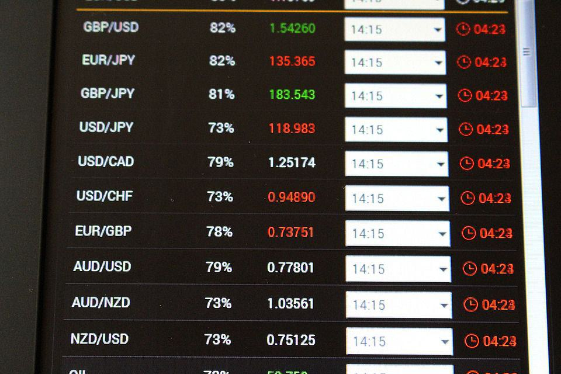

The foreign exchange market, commonly known as the forex market, stands as the largest financial marketplace globally, with a daily trading volume exceeding $5 trillion. This vast market operates as a hub for international currency trading, providing a platform where currencies are bought and sold against one another. It functions on a 24-hour basis, five days a week, accommodating the diverse needs of market participants across time zones worldwide.

A critical feature of forex trading is leverage, which enables traders to control large positions with a relatively modest capital outlay. Leverage is expressed as a ratio, for instance, 50:1 or 500:1, indicating the extent to which a trader can magnify their exposure in the market relative to their actual investment. While leverage can significantly amplify potential profits, it similarly increases the possibility of substantial losses, underscoring the importance of careful risk management.



This article aims to explore the nuances of leverage in the forex market, examine the impact and utility of algorithmic trading (algo trading) within this space, and provide strategies designed to mitigate the inherent risks associated with leveraged trading. Understanding these elements is crucial for navigating the forex market effectively and avoiding the common pitfalls that can lead to financial loss.

## Table of Contents

## Understanding Forex Market Leverage

Leverage in the forex market is a powerful financial tool that allows traders to utilize borrowed capital to amplify their potential returns on investment. By taking advantage of leverage, traders can control larger trading positions than they could with their own capital, thus potentially enhancing their profits. However, this increased potential for profit comes with an equivalent potential for loss, making an understanding of leverage essential for anyone engaging in forex trading.

Leverage is expressed in ratios, such as 50:1, 100:1, or even 500:1. These ratios indicate how much larger the position size is compared to the trader's initial deposit. For example, a 50:1 leverage ratio means that for every dollar in the trader's account, they can control a position worth fifty dollars. Similarly, a 100:1 leverage implies that a trader can trade a hundred times the amount of their deposit. Leverage transforms small fluctuations in currency prices into larger profit or loss scenarios, magnifying the financial impact of trading decisions.

The utilization of leverage requires a margin, which acts as a good faith deposit that the trader must maintain to keep a leveraged position open. The margin is a fraction of the total trade size and represents the amount of the trader's own capital that is at risk. For instance, with a 100:1 leverage ratio, a trader would only need to provide 1% of the total trade value as their margin. This concept can be mathematically represented as:

$$
\text{Margin Requirement} = \frac{1}{\text{Leverage Ratio}}
$$

For a leverage ratio of 100:1:

$$
\text{Margin Requirement} = \frac{1}{100} = 0.01 \text{ or } 1\%
$$

Leverage, while offering significant opportunities for profit, also requires careful management. An adverse price movement can quickly erode the margin, potentially leading to a margin call from the broker, where the trader is required to deposit additional funds to maintain their open positions. Effective leverage management is critical, and traders must be astute in assessing their risk tolerance and financial capacity before engaging in high-leverage [forex](/wiki/forex-system) trading. Understanding how to appropriately apply leverage and maintain sufficient margins can be instrumental in managing risk and achieving success in the forex market.

## Types of Leverage Ratios

Different brokers offer a range of leverage ratios, which directly influence the margin requirement for traders engaging in the forex market. Leverage ratios are expressed in forms such as 50:1, 100:1, or 200:1. These ratios indicate the level of control a trader has over positions relative to their actual capital. For instance, a leverage ratio of 100:1 implies that a trader can manage a position 100 times larger than their margin deposit. In this case, the trader is required to allocate only 1% of the total trade value as the margin.

To illustrate, consider a leverage ratio of 100:1. If a trader wishes to control a position worth $100,000, they would need a margin deposit of only $1,000. This calculation is straightforward: the required margin is the inverse of the leverage ratio:

$$
\text{Margin Requirement} = \left(\frac{1}{\text{Leverage Ratio}}\right) \times \text{Total Position Size}
$$

Using this formula, we find:

$$
\text{Margin Requirement} = \left(\frac{1}{100}\right) \times 100,000 = 1,000
$$

Higher leverage ratios provide the allure of significantly magnified profits because they allow traders to control larger positions with a relatively small initial capital outlay. However, this increased potential for profit comes with a corresponding increase in risk. A minor fluctuation in currency prices can lead to substantial losses, as leverage amplifies not only gains but also losses. Consequently, traders should exercise caution and consider their risk tolerance when engaging in leveraged trading.

## Leveraging Algorithmic Trading in Forex

Algorithmic trading, commonly referred to as algo trading, implies the use of computer algorithms to automate trading strategies in the forex market. These algorithms rely on pre-established criteria such as timing, price, and [volume](/wiki/volume-trading-strategy) to make trading decisions without human intervention. The high-speed nature of these algorithms allows them to analyze currency price movements at remarkable speeds, executing trades within milliseconds—a pace unattainable for human traders.

In forex trading, algo trading offers numerous advantages. Algorithms can process vast datasets, account for multiple variables simultaneously, and execute numerous trades quickly. This significant capability is due to their ability to evaluate historical and real-time data efficiently. By quickly identifying trading opportunities, algorithms can increase the potential for profit by responding to market conditions faster than manual trading.

To illustrate how algo trading might be implemented in practice, consider a simple Python [algorithmic trading](/wiki/algorithmic-trading) strategy using historical forex data:

```python
import pandas as pd
import numpy as np
from backtesting import Backtest, Strategy
from backtesting.lib import crossover
from backtesting.test import SMA, EURUSD

class SmaCross(Strategy):
    n1 = 10
    n2 = 20

    def init(self):
        self.sma1 = self.I(SMA, self.data.Close, self.n1)
        self.sma2 = self.I(SMA, self.data.Close, self.n2)

    def next(self):
        if crossover(self.sma1, self.sma2):
            self.buy()
        elif crossover(self.sma2, self.sma1):
            self.sell()

bt = Backtest(EURUSD, SmaCross, cash=10000, commission=.0002)
stats = bt.run()
bt.plot()
```

This basic strategy employs two simple moving averages (SMA)—one short-term and one long-term. The algorithm generates buy signals when the short-term SMA crosses above the long-term SMA, and sell signals when it crosses below. This logic exemplifies a fundamental principle of algo trading: leveraging historical data patterns to aid decision-making.

The implementation of algo trading in forex comes with challenges. Quality and precision of algorithms are crucial since inaccuracies can prompt substantial financial losses. Moreover, high-frequency trading may lead to concerns over market fairness and increased [volatility](/wiki/volatility-trading-strategies). Therefore, traders must carefully backtest strategies and continuously monitor and adjust their algorithms to align with current market conditions.

Overall, while algorithmic trading can enhance trading efficiency and potential returns, it requires comprehensive development, rigorous testing, and continuous oversight to manage inherent risks effectively.

## Risks of Leverage in Forex Trading

Leverage in forex trading can amplify both potential returns and potential losses. The central risk associated with leveraging is that losses can quickly surpass the initial investment, leaving traders in a vulnerable financial position. A trader utilizing leverage is effectively borrowing funds from a broker to increase market exposure. While this can potentially maximize gains, it also means that a slight unfavorable movement in currency prices can result in proportionally larger losses.

A critical risk of leveraging is the occurrence of margin calls. Margin calls are requests from brokers for additional capital to maintain an open position that has moved adversely. Brokers require a certain margin level to be maintained, which represents the trader’s equity as a percentage of the total position size. If price fluctuations cause this margin level to fall below the required percentage due to losses, the broker will issue a margin call. This necessitates traders to either deposit more funds or close their positions to limit further potential losses.

In mathematical terms, if $P_0$ is the initial position size and $L$ is the leverage ratio, the trader controls a position of size $L \times P_0$. In the event of an unfavorable market movement of $\Delta P$ in the currency pair:

$$
\text{Loss} = L \times \Delta P \times \text{Lot Size}
$$

Such losses can be substantially larger than what the trader can cover with their initial equity.

Beyond the financial risks, leverage can also have significant psychological effects. The potential for large, rapid gains or losses can induce stress and lead to impulsive decision-making, undermining rational trading strategies. This emotional pressure can often result in traders deviating from their planned risk management strategies, leading to even greater losses.

Effectively managing such risks involves combining technical understanding with emotional discipline. Traders should consistently monitor their leverages, employ stop-loss orders to limit potential downside, and avoid trading beyond their risk tolerance and financial capabilities. Understanding both the mechanical and psychological implications of leverage is essential for navigating the forex market successfully.

## Strategies to Mitigate Leverage Risk

Mitigating risk in leveraged forex trading is essential for protecting capital and ensuring long-term success. Various strategies can be adopted to manage the risks associated with high leverage. Here are some effective methods:

1. **Utilize Lower Leverage Ratios**: Opting for conservative leverage ratios, such as 10:1 or 20:1, can significantly reduce exposure to risk. By trading with lower leverage, traders limit the amplification of potential losses. For example, if a trader uses a 10:1 leverage on a $1,000 deposit, they can control a position size of $10,000. If the market moves adversely by 1%, the loss would be $100, instead of a larger loss that higher leverage could cause.

2. **Set Stop-Loss Orders**: Implementing stop-loss orders is critical in protecting against significant losses. A stop-loss order allows a trader to predefine an exit point for a losing position, automatically closing the trade when the market reaches a specified price. This mechanism prevents the trade from incurring further losses beyond a predetermined threshold. For instance:

   ```python
   def calculate_stop_loss(entry_price, risk_percentage, account_balance):
        risk_amount = account_balance * risk_percentage / 100
        stop_loss_price = entry_price - risk_amount
        return stop_loss_price

   entry_price = 1.1500
   risk_percentage = 2
   account_balance = 5000

   stop_loss_price = calculate_stop_loss(entry_price, risk_percentage, account_balance)
   print("Stop-Loss Price:", stop_loss_price)
   ```

3. **Diversify Trading Positions**: Concentrating investments in a single currency pair increases susceptibility to market volatility. Diversification across multiple currency pairs spreads risk and reduces the impact of adverse movements in any one currency. By carefully selecting trades that are not highly correlated, a trader can mitigate the effect of unexpected market shifts. For instance, combining a trade in EUR/USD with one in USD/JPY may offset risks inherent in one pair with gains or reduced losses in another.

By implementing these strategies, traders can better manage the complexities and risks of leveraged forex trading. Employing conservative leverage, setting stop-loss orders, and diversifying positions are crucial for safeguarding investments while still pursuing potential profits.

## Conclusion

Leverage in the forex market provides traders the capacity to achieve substantial profits by controlling larger positions than their initial capital would typically allow. However, this potential for profit comes with corresponding risks, particularly for those lacking experience. It is imperative for traders to recognize that while leverage can amplify gains, it can also result in equally significant losses. This dual-edge nature of leverage necessitates a high level of risk management and caution.

The integration of algorithmic trading (algo trading) into forex markets has revolutionized trading strategies by allowing for the rapid processing and execution of trades based on complex algorithms. Traders can capitalize on small price discrepancies that may exist fleetingly, thereby enhancing potential profitability. Yet, despite the advantages, algorithmic systems can introduce new risks, particularly those associated with system failures or improperly programmed algorithms. As such, traders should exercise due diligence in maintaining robust systems and continually monitoring algorithm performance to avoid unforeseen losses.

To effectively navigate the challenges posed by leveraged forex trading, a disciplined approach to risk management is essential. Employing strategies such as setting strict stop-loss orders can help limit potential losses, thereby mitigating the financial impact of adverse market movements. Additionally, educational resources and continuous learning are crucial for traders to understand market dynamics and refine their strategies.

Practicing on demo accounts provides an invaluable opportunity for traders to hone their skills without the pressure of financial loss. This practice environment allows traders to test strategies and leverage scenarios in real-time market conditions, effectively preparing them for live trading. Through effective risk management, education, and thorough practice, traders can better position themselves to harness the benefits of leveraged forex trading while safeguarding against its intrinsic risks.

## References & Further Reading

[1]: ["Forex Trading: The Basics Explained in Simple Terms"](https://www.amazon.com/FOREX-TRADING-Explained-Beginners-Strategies/dp/1535198567) by Jim Brown

[2]: ["Understanding Forex Trading Leveraged Trading"](https://cfi.trade/en/educational-articles/trading-essentials/understanding-leverage-in-forex-trading) on BabyPips

[3]: Hull, J. C. (2018). ["Options, Futures, and Other Derivatives"](https://www.semanticscholar.org/paper/Options%2C-Futures%2C-and-Other-Derivatives-Hull/89bdee500c8623864fc9eb7a471546aa713acc44). Pearson.

[4]: Aldridge, I. (2013). ["High-Frequency Trading: A Practical Guide to Algorithmic Strategies and Trading Systems"](https://onlinelibrary.wiley.com/doi/pdf/10.1002/9781119203803.fmatter). Wiley.

[5]: ["Algorithmic Trading: Winning Strategies and Their Rationale"](https://www.amazon.com/Algorithmic-Trading-Winning-Strategies-Rationale-ebook/dp/B00CY5HC0U) by Ernie Chan