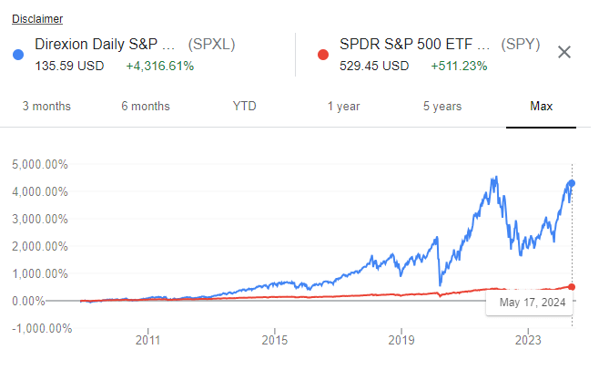

## Table of Contents

## What is leverage in the context of financial trading?

Leverage in financial trading is like borrowing money to invest more than you actually have. Imagine you want to buy a house but don't have enough cash. You can take a loan from the bank, buy the house, and if the house price goes up, you make a bigger profit because you used the bank's money. In trading, leverage works the same way. You borrow money from your broker to trade larger amounts of stocks, forex, or other assets. This can amplify your profits if the market moves in your favor.

However, leverage is a double-edged sword. Just as it can increase your profits, it can also increase your losses if the market goes against you. If the house price falls, you still owe the bank the loan, and you might lose more than your initial investment. That's why using leverage requires careful consideration and risk management. It's important to understand the potential risks and rewards before deciding to use leverage in your trading strategy.

## How does leverage affect the potential returns and risks in trading?

Leverage can make your trading profits bigger. Imagine you have $100 and you want to buy a stock. With leverage, you can borrow more money from your broker, say another $900, so you can buy $1000 worth of stock. If the stock price goes up by 10%, your profit is $100 instead of just $10 if you only used your own money. That's because you controlled a bigger amount with less of your own money. So, leverage lets you make more money from smaller price moves.

But leverage also makes your losses bigger if the stock price goes down. Using the same example, if the stock price drops by 10%, you lose $100 instead of just $10. And if the price drops more than your initial investment, you could lose even more than you put in because you still have to pay back the borrowed money. So, while leverage can boost your profits, it also increases the risk of bigger losses. It's like riding a bike with training wheels off - it can be exciting but also more dangerous if you fall.

## What is backtesting and why is it important for trading strategies?

Backtesting is like a practice run for trading strategies. It's when you take your trading plan and see how it would have worked in the past using old market data. Imagine you want to see if buying a stock when it goes up by 5% and selling it when it goes down by 3% is a good idea. You would use backtesting to check how this strategy would have done in the last few years.

Backtesting is important because it helps you understand if your trading strategy could make money or if it's too risky. It's like trying out a new recipe before serving it at a big dinner. By seeing how your strategy would have performed in the past, you can make changes to improve it before using real money. This can save you from losing money on a strategy that doesn't work well.

## How can leverage be incorporated into a backtesting model?

When you add leverage to a backtesting model, you're basically pretending to borrow money to trade more than you have. Let's say you have $1000 and you want to see how a strategy works with leverage. In your backtest, you can set it up so that you're using 2:1 leverage, meaning you're trading with $2000 even though you only have $1000. This lets you see how your strategy would do if you were using borrowed money to make bigger trades.

Adding leverage to backtesting is important because it shows you the real impact on your profits and losses. If your strategy makes money without leverage, it might make even more with it. But if it loses money, those losses could be much bigger with leverage. By testing with leverage, you can see if your strategy can handle the extra risk and still come out ahead. This helps you decide if using leverage in real trading is a good idea for your strategy.

## What are the common pitfalls of using leverage in backtesting?

One common pitfall of using leverage in backtesting is that it can make your results look too good. When you use leverage, even small gains can look big because you're trading with more money than you have. But this can trick you into thinking your strategy is better than it really is. In real trading, those small gains might not cover the costs of borrowing money, like interest rates or fees, which you might not include in your backtest.

Another pitfall is that backtesting with leverage might not show you the full risk. If your strategy loses money, the losses can be much bigger when you're using borrowed money. Your backtest might not fully account for things like margin calls, where you have to add more money to your account if your trades go bad. In real trading, these risks can lead to big losses or even wiping out your account, which might not be as clear in a backtest.

Overall, while backtesting with leverage can help you see how your strategy might work with borrowed money, it's important to be careful. Make sure you're including all the costs and risks in your backtest. Otherwise, you might be surprised by how different things can be when you start trading for real.

## How does the choice of leverage ratio impact backtesting results?

The choice of leverage ratio can really change how your backtesting results look. If you use a higher leverage ratio, like 10:1, it means you're borrowing a lot more money to trade. This can make your profits look bigger in your backtest because you're controlling a larger amount of money. But it can also make your losses look bigger if the market goes against you. So, a higher leverage ratio might make your strategy seem more successful than it really is, especially if you're not including all the costs of borrowing money, like interest rates or fees.

On the other hand, using a lower leverage ratio, like 2:1, will show more realistic results in your backtest. With less borrowed money, your profits and losses won't be as exaggerated. This can give you a better idea of how your strategy would actually perform in real trading, where you have to pay back the money you borrow. Choosing the right leverage ratio for your backtest is important because it helps you see the true potential and risks of your trading strategy, making it easier to decide if it's worth using leverage in real trading.

## What historical data should be considered when backtesting with leverage?

When you're backtesting a trading strategy with leverage, it's important to use a lot of historical data that covers different market conditions. You should look at data from times when the market was going up, going down, and staying the same. This helps you see how your strategy would work in all sorts of situations, not just when things are going well. Also, make sure the data goes back far enough, like several years, so you can see how your strategy would have done over time.

Another thing to think about is including data on costs like interest rates and fees that come with borrowing money for leverage. These costs can make a big difference in how much money you actually make or lose. If you don't include them in your backtest, you might think your strategy is better than it really is. So, use historical data that has all these details to get a true picture of how your strategy with leverage would perform in the real world.

## How can one adjust a trading strategy's leverage based on backtesting outcomes?

When you backtest your trading strategy with leverage, you can see how different amounts of borrowed money affect your profits and losses. If your backtest shows that using a lot of leverage makes your strategy too risky, with big losses when the market goes down, you might want to use less leverage. On the other hand, if your backtest shows that a little bit of leverage helps your strategy make more money without too much risk, you might decide to use that amount of leverage in your real trading.

It's also important to look at how your strategy performs over time and in different market conditions. If your backtest shows that your strategy works well with leverage during calm markets but falls apart during big market swings, you might want to adjust your leverage based on what the market is doing. This could mean using more leverage when things are stable and less when things get wild. By paying attention to these details in your backtest, you can make smarter choices about how much leverage to use in your real trading.

## What are the best practices for simulating leverage in backtesting software?

When you're using backtesting software to see how leverage would work with your trading strategy, it's important to make sure you're doing it right. Start by choosing the right amount of leverage to test. If you use too much, your results might look too good and not show the real risks. If you use too little, you might miss out on seeing how your strategy could do better with some borrowed money. Make sure to test different leverage ratios, like 2:1 or 5:1, to see how they change your profits and losses. This helps you find the sweet spot that makes your strategy work well without being too risky.

Also, make sure your backtesting software includes all the costs of using leverage, like interest rates and fees. These costs can eat into your profits, so if you don't include them, you might think your strategy is better than it really is. Use historical data that covers different market conditions, so you can see how your strategy would do in good times and bad times. By paying attention to these details, you can get a better idea of how leverage would really affect your trading strategy in the real world.

## How do regulatory constraints affect leverage in backtesting scenarios?

When you're using backtesting to see how leverage works with your trading strategy, you need to think about the rules that come from regulators. These rules can limit how much leverage you can use in real trading. For example, some countries have laws that say you can't borrow more than a certain amount of money to trade. If you don't include these limits in your backtest, you might think your strategy will work better than it really can. So, when you're setting up your backtest, make sure to follow the same rules that apply in real trading. This way, you'll get a more accurate picture of how your strategy would do.

Regulatory constraints can also change over time, so it's important to keep your backtesting up to date with the latest rules. If the rules change and you can use more or less leverage, you should run your backtest again to see how it affects your strategy. By doing this, you can make sure your trading plan stays realistic and follows the law. Ignoring these rules in your backtest could lead to surprises when you start trading for real, so always include them to get the best results.

## What advanced statistical methods can be used to analyze leverage effects in backtesting?

When you want to really understand how leverage affects your trading strategy in backtesting, you can use some fancy math tools. One of these is called Monte Carlo simulation. It's like playing out your strategy many times with different random market conditions to see how it would do on average. This helps you see if your strategy is good even when things don't go exactly as planned. Another tool is regression analysis, which looks at how different amounts of leverage change your profits and losses. It can show you if using more leverage makes your strategy riskier or if it helps you make more money.

Another useful method is Value at Risk (VaR), which tells you the worst loss you might expect over a certain time with a certain level of confidence. For example, if your VaR is $100 at 95% confidence over a day, it means there's a 5% chance you could lose more than $100 in a day. This can help you see how risky your strategy is with different levels of leverage. By using these advanced statistical methods, you can get a better idea of how leverage might help or hurt your trading strategy, making your backtesting more thorough and helping you make smarter choices when you start trading for real.

## How can machine learning enhance the backtesting of strategies with leverage?

Machine learning can make backtesting with leverage a lot better by finding patterns in the data that you might miss. It can look at tons of historical market data and figure out how different amounts of leverage affect your trading strategy. By using machine learning, you can see if using more leverage at certain times or in certain market conditions could help you make more money or if it's too risky. It's like having a smart friend who can spot things you wouldn't notice on your own, helping you adjust your strategy to make it work better.

Another way machine learning helps is by running many different scenarios quickly. It can test your strategy with different levels of leverage over and over again, showing you how it would do in all sorts of market situations. This means you can find the best amount of leverage to use without having to do all the work yourself. By using machine learning, you can make your backtesting more accurate and get a clearer picture of how leverage might affect your trading strategy in the real world.

## What is the role of leverage in algorithmic trading?

Leverage in [algorithmic trading](/wiki/algorithmic-trading) refers to the utilization of borrowed funds to increase the size of a position, thereby amplifying potential returns. This practice allows traders to control a larger position with the same initial capital, which can lead to increased profits if the market moves favorably. For instance, with a leverage ratio of 5:1, an initial investment of $10,000 can control $50,000 worth of assets. The formula to calculate the leverage ratio is:

$$
\text{Leverage Ratio} = \frac{\text{Total Position Size}}{\text{Equity}}
$$

In algorithmic trading, leveraging can significantly enhance profit potential due to the automated nature of trading strategies, which can execute high-frequency trades. However, it is crucial to recognize that leverage also proportionately increases potential risks and losses. A leveraged position can incur substantial losses if the market moves against the trader’s position, and in extremes, it could lead to a margin call, requiring the trader to provide additional funds to keep the position open.

Understanding and effectively managing leverage in algorithmic trading necessitates a comprehensive risk management strategy. This involves setting appropriate stop-loss orders, diversifying leveraged positions, and continuously monitoring market conditions to minimize potential adverse impacts. The key is to optimize the balance between potential reward and the elevated risks that come with leveraging, thereby enhancing the likelihood of sustained trading success.

## What is the Importance of Backtesting?

Backtesting is an essential component of algorithmic trading, enabling traders to evaluate the efficacy of their strategies by simulating trades using historical market data. This process helps quantify the potential performance of a strategy without the need to expose actual funds to market risks initially. By systematically replaying past market conditions, traders can observe how their strategies would have performed, providing insights into crucial aspects like profitability, drawdowns, and risk exposure.

One of the significant advantages of [backtesting](/wiki/backtesting) is its capacity to serve as a filtering mechanism for unproven strategies. Before deploying a trading algorithm in live markets, it is prudent to identify any weaknesses or inefficiencies that may not be obvious at first glance. Backtesting assists in uncovering these flaws, offering an opportunity to rectify them before they result in financial loss. For instance, a strategy that appears successful in a specific market condition may falter under different scenarios, and backtesting helps in revealing such vulnerabilities.

Incorporating leverage into backtesting extends the analysis by showcasing how a strategy might behave under varying degrees of borrowed capital. Leverage can magnify both potential gains and losses, making it critical to evaluate its impact rigorously. Through backtesting, traders can simulate the effects of leverage on returns and drawdowns, helping them assess whether their strategies are robust enough to handle leveraged positions. This simulation also aids in stress testing the strategy across a spectrum of market conditions, from bullish to bearish environments.

Mathematically, backtesting with leverage involves adapting the historical returns by a [factor](/wiki/factor-investing) that represents the leverage level. For example, if a strategy is backtested with a leverage factor $L$, the leveraged return $R_L$ for any time period $t$ can be calculated as:

$$
R_L(t) = L \cdot R(t)
$$

where $R(t)$ is the unleveraged return for the same period. By recalculating returns using this formula, traders can analyze how different leverage levels would influence the overall performance metrics, such as the Sharpe ratio or maximum drawdown.

Ultimately, effective backtesting provides traders with a detailed understanding of how their algorithms might perform when subjected to real-world conditions. Incorporating leverage into this process is instrumental in preparing for the dynamic nature of financial markets, ensuring that strategies are well-equipped to capitalize on opportunities while managing associated risks.

## How can we evaluate backtest performance with leverage?

Evaluating backtest performance with leverage requires a detailed analysis of key financial metrics to ensure that the trading strategy not only aims for higher returns but also maintains an acceptable risk profile. One of the primary metrics to consider is the Sharpe ratio, which is a measure of risk-adjusted return. It is calculated as follows:

$$
\text{Sharpe Ratio} = \frac{E[R] - R_f}{\sigma}
$$

where $E[R]$ is the expected return of the portfolio, $R_f$ is the risk-free rate, and $\sigma$ is the standard deviation of the portfolio's excess return. A higher Sharpe ratio indicates better risk-adjusted performance.

Another critical metric is the maximum drawdown, which measures the largest peak-to-trough decline in a portfolio’s value. It is expressed as a percentage of the peak analysis level, providing insight into the potential downside risk. A lower maximum drawdown is preferable as it indicates a strategy's resilience during market downturns.

Return on equity (ROE) is also significant when evaluating leverage performance. It calculates the profitability of a strategy in relation to the equity or capital used. High leverage can amplify both gains and losses, so tracking ROE helps ensure that the strategy remains profitable after accounting for borrowed capital.

To thoroughly assess a leverage-enhanced strategy, it is essential to compare it with baseline scenarios, where no leverage is applied. This comparison highlights the impact of leverage on both potential returns and associated risks. Such analysis is vital for understanding whether the added risk of leverage is justified by increased returns.

Additionally, factors like beta and correlation must be taken into account. Beta measures a strategy's sensitivity to market movements and is calculated as:

$$
\beta = \frac{\text{Cov}(R_s, R_m)}{\text{Var}(R_m)}
$$

where $R_s$ is the return of the strategy, and $R_m$ is the return of the market. A strategy with a beta greater than one suggests that it experiences greater fluctuations in comparison to market changes. Understanding beta helps in assessing the degree to which leverage exposes a strategy to market volatility.

Lastly, correlation evaluates how leveraged returns align with overall market movements. A high correlation may indicate that leveraged strategies do not significantly diversify from market risks, potentially reducing their effectiveness during volatile market phases.

Incorporating these metrics provides a comprehensive understanding of the potential benefits and risks associated with employing leverage in trading strategies, aiding in better risk management and strategy refinement.

## What are the challenges and pitfalls?

Overfitting is a common challenge in backtesting, particularly when leverage is involved. This occurs when a trading strategy is excessively tailored to historical data, capturing noise rather than meaningful patterns. Such strategies often showcase exceptional past performance but fail under new market conditions. To mitigate overfitting, it's essential to employ techniques like out-of-sample testing and cross-validation. Out-of-sample testing involves splitting the data into training and testing sets, ensuring that strategy evaluation occurs on unseen data. Cross-validation, on the other hand, partitions data into multiple subsets before iteratively training and testing the strategy, further enhancing its robustness.

Another significant consideration is the changing nature of market conditions. A strategy heavily reliant on leverage may exhibit remarkable historical returns, yet future markets can deviate considerably from historical patterns due to economic events, regulatory changes, or technological advancements. Traders must remain vigilant and ready to adjust strategies accordingly. Diversifying strategies and employing adaptive algorithms can help account for varying market conditions, thereby reducing reliance on static historical patterns.

Risk of over-leverage is a critical pitfall in backtesting. While leverage can magnify returns, it concurrently amplifies risks. Excessive use of leverage has the potential to incur substantial losses, especially during periods of extreme market volatility. Thus, maintaining an optimal balance between leverage and risk is paramount. This involves setting appropriate stop-loss limits and continually assessing the risk-reward ratio. The formula for calculating the leverage ratio is often used:

$$
\text{Leverage Ratio} = \frac{\text{Total Asset Value}}{\text{Equity}}
$$

A prudent approach is to set leverage limits based on the risk appetite and capital availability, avoiding scenarios where forced liquidation might occur due to inadequate margin coverage. Ultimately, careful planning and continuous monitoring are indispensable for effectively managing leverage-related risks in algorithmic trading.

## References & Further Reading

[1]: Bergstra, J., Bardenet, R., Bengio, Y., & Kégl, B. (2011). ["Algorithms for Hyper-Parameter Optimization."](https://dl.acm.org/doi/10.5555/2986459.2986743) Advances in Neural Information Processing Systems 24.

[2]: ["Advances in Financial Machine Learning"](https://www.amazon.com/Advances-Financial-Machine-Learning-Marcos/dp/1119482089) by Marcos Lopez de Prado

[3]: ["Evidence-Based Technical Analysis: Applying the Scientific Method and Statistical Inference to Trading Signals"](https://www.amazon.com/Evidence-Based-Technical-Analysis-Scientific-Statistical/dp/0470008741) by David Aronson

[4]: ["Machine Learning for Algorithmic Trading"](https://github.com/stefan-jansen/machine-learning-for-trading) by Stefan Jansen

[5]: ["Quantitative Trading: How to Build Your Own Algorithmic Trading Business"](https://books.google.com/books/about/Quantitative_Trading.html?id=j70yEAAAQBAJ) by Ernest P. Chan