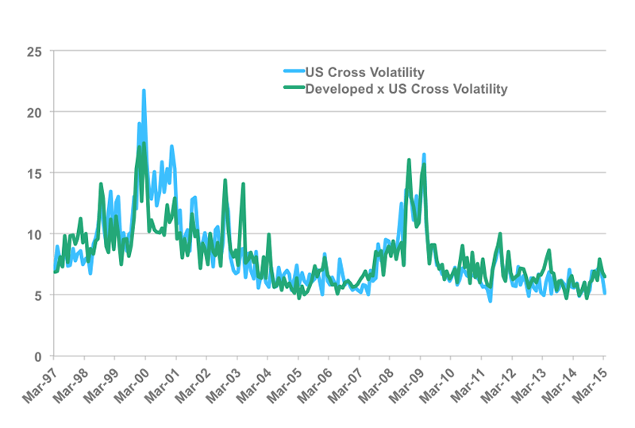

## Table of Contents

## What is leverage in the context of hedge funds?

Leverage in the context of hedge funds refers to using borrowed money to increase the potential return on an investment. Hedge funds often use leverage to amplify their buying power, allowing them to make larger investments than they could with their own capital alone. By borrowing funds, a hedge fund can take bigger positions in the market, which can lead to higher profits if the investments perform well.

However, leverage also increases risk. If the investments do not perform as expected, the losses can be magnified because the hedge fund still has to repay the borrowed money, plus interest. This can lead to significant financial strain or even the collapse of the hedge fund if the losses are too great. Therefore, while leverage can enhance returns, it requires careful management to balance the potential rewards against the increased risks.

## How is leverage typically measured in hedge funds?

Leverage in hedge funds is usually measured by something called the "leverage ratio." This ratio shows how much borrowed money the hedge fund is using compared to its own money. For example, if a hedge fund has $100 million of its own money and borrows another $300 million, the leverage ratio would be 4 to 1. This means for every dollar of the hedge fund's own money, it is using four dollars in total.

Another way to measure leverage is by looking at the "gross exposure" and "net exposure." Gross exposure is the total value of all the investments the hedge fund has, including both long and short positions. Net exposure, on the other hand, is the difference between the long and short positions. If a hedge fund has $500 million in long positions and $300 million in short positions, the gross exposure would be $800 million, and the net exposure would be $200 million. These measures help investors understand how much risk the hedge fund is taking on through leverage.

## What are the common sources of leverage for hedge funds?

Hedge funds get leverage from different places. One common source is borrowing money from banks. Banks give loans to hedge funds, and the funds use this money to buy more investments than they could with just their own money. Another source is using margin accounts with brokers. When hedge funds trade on margin, they can borrow money from the broker to buy securities, and they have to pay back the broker with interest.

Another way hedge funds get leverage is through derivatives like futures, options, and swaps. These financial instruments let hedge funds control big investments with a smaller amount of money. For example, buying a futures contract can give a hedge fund exposure to a large amount of an asset without having to pay the full price upfront. This can increase potential profits but also increases the risk if the market moves against them.

## What are the potential benefits of using leverage in hedge funds?

Using leverage in hedge funds can help them make more money. When a hedge fund uses borrowed money to invest, it can buy more assets than it could with just its own money. If these investments do well, the hedge fund can make bigger profits. For example, if a hedge fund uses leverage to double its investment size and the market goes up, the returns will be much higher than if it had only used its own money.

However, using leverage is not without risks. If the investments don't do well, the losses can be bigger too. The hedge fund still has to pay back the money it borrowed, plus interest. But if the market goes down, the hedge fund can lose more than it would have without using leverage. So, while leverage can lead to higher profits, it also means the hedge fund needs to be very careful about managing the risks.

## What are the risks associated with leverage in hedge funds?

Using leverage in hedge funds can be risky. When a hedge fund borrows money to invest, it can lose more than it started with if the investments go down. This is because the hedge fund still has to pay back the borrowed money, plus interest. If the market drops a lot, the losses can be big enough to hurt the hedge fund badly, or even make it go out of business.

Another risk is that leverage can make the hedge fund's performance more volatile. Small changes in the market can lead to big swings in the value of the hedge fund's investments because of the borrowed money. This can make it hard for the hedge fund to manage its investments and can lead to big losses if things don't go as planned.

## How does leverage impact the return on investment in hedge funds?

Leverage can make the returns on investment in hedge funds bigger. When a hedge fund uses borrowed money to invest, it can buy more assets than it could with just its own money. If these investments go up in value, the hedge fund can make a lot more money than if it had only used its own money. For example, if a hedge fund uses leverage to double its investment size and the market goes up, the returns will be much higher.

However, using leverage also means the hedge fund can lose more money if the investments go down. The hedge fund still has to pay back the borrowed money, plus interest. If the market drops a lot, the losses can be bigger than the hedge fund's own money. This can lead to big financial problems for the hedge fund, and in the worst case, it could even go out of business. So, while leverage can help make more money, it also makes the hedge fund's returns riskier.

## Can you explain the concept of margin calls in relation to hedge fund leverage?

A margin call happens when a hedge fund uses borrowed money to invest and the value of those investments goes down. The lender, usually a bank or a broker, might ask the hedge fund to put in more money or sell some of its investments to cover the loan. This is called a margin call because the hedge fund is using margin, which is borrowed money, to make its investments.

If the hedge fund can't meet the margin call, it might have to sell its investments quickly, even if the prices are low. This can make the losses even bigger and can cause big problems for the hedge fund. So, margin calls are a big risk when using leverage because they can force the hedge fund to take actions that might hurt its performance.

## How do hedge fund managers decide on the optimal level of leverage to use?

Hedge fund managers decide on the optimal level of leverage by looking at how much risk they are willing to take and how much return they want to make. They think about the market conditions and how their investments might do. If they think the market will go up, they might use more leverage to make bigger profits. But if they think the market is risky, they might use less leverage to keep their losses small.

They also look at how much money they have and how much they can borrow. They need to make sure they can pay back the borrowed money, even if their investments don't do well. So, they balance the chance to make more money with the risk of losing more. This helps them find the right amount of leverage that fits their goals and keeps their hedge fund safe.

## What regulatory constraints affect the use of leverage in hedge funds?

Hedge funds have to follow rules set by regulators about how much leverage they can use. In the United States, the Securities and Exchange Commission (SEC) and the Commodity Futures Trading Commission (CFTC) watch over hedge funds. They make rules to make sure hedge funds don't take too much risk with leverage. For example, the SEC might limit how much money hedge funds can borrow from banks or brokers. The CFTC might have rules about using derivatives, which are a way to get leverage.

These rules can be different in other countries too. In Europe, the European Securities and Markets Authority (ESMA) has its own rules. They might limit the amount of leverage hedge funds can use to keep the financial system safe. These regulations can make it harder for hedge funds to use as much leverage as they want, but they help protect investors and the economy from big problems if hedge funds lose a lot of money.

## How has the use of leverage in hedge funds evolved over the past decade?

Over the past decade, the use of leverage in hedge funds has changed a lot. After the 2008 financial crisis, regulators started making stricter rules to keep the financial system safe. This made hedge funds use less leverage than before. They had to be more careful about how much they borrowed because the rules were tougher. Also, many investors got scared after the crisis and wanted hedge funds to take less risk, so they pushed for lower levels of leverage.

But in recent years, as the economy got better and markets became more stable, some hedge funds started using more leverage again. They wanted to make bigger profits when the market was doing well. However, they still had to follow the rules and be careful about the risks. So, while some hedge funds increased their leverage, they did it in a way that tried to balance the chance of making more money with the risk of losing it.

## What are some notable examples of leverage use in hedge fund history?

One famous example of leverage use in hedge fund history is the story of Long-Term Capital Management (LTCM). In the late 1990s, LTCM used a lot of leverage to make big bets on the market. They borrowed a lot of money to buy investments, thinking they could make huge profits. But when the market went the wrong way, LTCM lost a lot of money very quickly. They almost went bankrupt, and it took a big effort from other banks and the government to save them. This showed how dangerous too much leverage can be.

Another example is the hedge fund Renaissance Technologies. They are known for using leverage in a smart way. Renaissance uses computers and math to find small changes in the market and make trades. They use leverage to make their trades bigger and make more money from these small changes. Unlike LTCM, Renaissance has been very successful and made a lot of money for their investors. This shows that leverage can work well if it is used carefully and with good strategies.

## How do advanced leverage strategies, such as synthetic leverage, work in hedge funds?

Synthetic leverage is a way for hedge funds to get more money to invest without actually borrowing cash. Instead of borrowing money from a bank, they use financial tools like derivatives to increase their exposure to the market. Derivatives are like bets on how an asset will do without actually owning it. For example, a hedge fund might use options or futures contracts to control a lot more of an asset than they could afford to buy outright. This lets them make bigger bets and possibly bigger profits, but it also means they can lose more if the market goes the wrong way.

Hedge funds use synthetic leverage because it can be cheaper and more flexible than traditional borrowing. It lets them take positions in the market that would be hard to do with just their own money. But it's also riskier because derivatives can be complicated and hard to understand. If the market moves against them, the losses can be big. So, hedge funds need to be very careful and have good strategies to manage the risks that come with synthetic leverage.

## What is the understanding of hedge funds and their use of leverage?

Hedge funds are specialized investment vehicles designed to generate high returns for their investors by deploying a diverse array of strategies. Unlike mutual funds, which are often restricted by regulatory requirements to invest primarily in stocks and bonds, hedge funds have more flexibility to engage in a wider range of investments and employ complex financial techniques. A defining characteristic of hedge funds is their ability to use leverage to enhance their investment capacity.

Leverage is a financial strategy that involves borrowing capital to increase the potential return of an investment. By using borrowed funds, hedge funds can amplify their buying power, allowing them to make larger investments than their equity alone would permit. For example, if a hedge fund has \$1 million in capital and borrows an additional \$4 million, its total investment capacity rises to \$5 million, potentially magnifying both gains and losses.

The formula for calculating leverage is:

$$
\text{Leverage Ratio} = \frac{\text{Total Investment}}{\text{Equity}}
$$

In the example above, the leverage ratio would be 5:1, indicating that for every dollar of equity, the fund is controlling five dollars of investment.

While leverage can dramatically increase the potential for high returns, it also poses significant risks. The use of borrowed money means that even small losses can be magnified, potentially resulting in substantial financial detriment. A highly leveraged [hedge fund](/wiki/hedge-fund-trading-strategies) faces the challenge of meeting interest and principal repayment obligations, even if its investments do not perform as expected.

Hedge fund managers carefully assess market conditions and investment opportunities to balance the potential rewards of leverage against the associated risks. Through sophisticated risk management techniques, they aim to optimize the use of leverage in pursuit of superior returns. Yet, the inherent [volatility](/wiki/volatility-trading-strategies) and unpredictability of financial markets mean that the outcomes of leveraged investments can be precarious.

The agility and diverse strategies of hedge funds, coupled with their tactical use of leverage, enable them to pursue market-beating returns. However, this also underscores the importance of meticulous management and regulatory oversight to mitigate the risks associated with their aggressive investment approach.

## References & Further Reading

[1]: ["Advances in Financial Machine Learning"](https://www.amazon.com/Advances-Financial-Machine-Learning-Marcos/dp/1119482089) by Marcos Lopez de Prado

[2]: Bergstra, J., Bardenet, R., Bengio, Y., & Kégl, B. (2011). ["Algorithms for Hyper-Parameter Optimization."](https://dl.acm.org/doi/10.5555/2986459.2986743) Advances in Neural Information Processing Systems 24.

[3]: ["Evidence-Based Technical Analysis: Applying the Scientific Method and Statistical Inference to Trading Signals"](https://www.amazon.com/Evidence-Based-Technical-Analysis-Scientific-Statistical/dp/0470008741) by David Aronson

[4]: ["Machine Learning for Algorithmic Trading"](https://github.com/stefan-jansen/machine-learning-for-trading) by Stefan Jansen

[5]: ["Quantitative Trading: How to Build Your Own Algorithmic Trading Business"](https://www.amazon.com/Quantitative-Trading-Build-Algorithmic-Business/dp/1119800064) by Ernest P. Chan