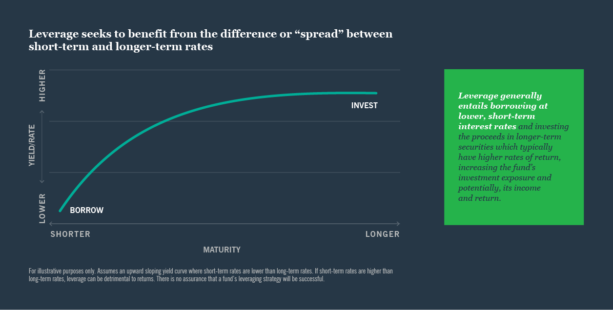

## Table of Contents

## What is leverage in the context of mutual funds?

Leverage in mutual funds means using borrowed money to invest. When a mutual fund uses leverage, it takes loans or uses other financial tools to buy more assets than it could with just the money from investors. This can potentially increase the returns for the investors because the fund can invest in more opportunities. However, it also increases the risk because if the investments don't perform well, the losses can be bigger due to the borrowed money that needs to be paid back.

Using leverage is like a double-edged sword. On one hand, if the investments do well, the profits can be higher because the fund has more money to work with. On the other hand, if the investments go down in value, the losses can be magnified, and the fund might struggle to pay back the borrowed money. This is why funds that use leverage are often considered riskier than those that don't. It's important for investors to understand this risk before putting their money into a leveraged mutual fund.

## How does leverage work in mutual funds?

Leverage in mutual funds means the fund borrows money to buy more investments than it could with just the money from its investors. Imagine you have $100 and you want to buy stocks. If you borrow another $100, you can now buy $200 worth of stocks. This is what a leveraged mutual fund does, but on a much bigger scale. The borrowed money can come from banks, other financial institutions, or through financial instruments like derivatives.

The idea behind using leverage is to increase the potential returns for the investors. If the stocks or other investments go up in value, the fund makes more money because it has more money invested. But, there's a catch. If the investments go down in value, the losses are also bigger because the fund has to pay back the borrowed money. So, while leverage can help the fund make more money when things go well, it can also lead to bigger losses if things go badly. This makes leveraged mutual funds riskier than funds that don't use borrowed money.

## What are the different types of leveraged mutual funds?

Leveraged mutual funds come in different types, but the main ones are leveraged equity funds and leveraged bond funds. Leveraged equity funds use borrowed money to invest in stocks. They aim to give higher returns than regular stock funds by investing more money in the market. On the other hand, leveraged bond funds use borrowed money to invest in bonds. These funds try to increase the income from bonds by using more money to buy them.

Another type of leveraged mutual fund is the inverse leveraged fund. These funds use borrowed money to bet against the market. If they think the market will go down, they can make money when it does. This is the opposite of regular funds, which aim to go up with the market. Inverse leveraged funds are very risky because they can lose a lot of money if the market goes up instead of down.

Lastly, there are leveraged ETFs (Exchange-Traded Funds), which are a bit different but still use leverage. These funds aim to give returns that are a multiple of the daily performance of an index, like the S&P 500. For example, a 2x leveraged ETF tries to give twice the daily return of the index. These funds are popular for short-term trading but can be very risky because their performance can be very different over longer periods.

## What are the potential benefits of using leverage in mutual funds?

Using leverage in mutual funds can help investors make more money. When a fund borrows money to invest, it can buy more stocks or bonds than it could with just the money from its investors. If these investments go up in value, the fund can make bigger profits. This means the investors might get higher returns than they would from a fund that doesn't use borrowed money. It's like using a magnifying glass to make the gains bigger.

However, using leverage can also lead to bigger losses if the investments don't do well. If the stocks or bonds go down in value, the fund still has to pay back the borrowed money. This can make the losses much larger than they would be without leverage. But, if used carefully, leverage can be a powerful tool to boost returns, especially in markets that are expected to grow. It's important for investors to understand both the potential rewards and the risks before investing in a leveraged mutual fund.

## What are the risks associated with leveraged mutual funds?

Using leverage in mutual funds can make the losses bigger if the investments don't do well. When a fund borrows money to invest, it has to pay back that money even if the investments go down in value. This means the losses can be much larger than they would be without borrowed money. For example, if the market goes down, a leveraged fund might lose more money than a regular fund because it has more money at risk.

Another risk is that leveraged mutual funds can be more volatile. This means the value of the fund can go up and down a lot more than a fund that doesn't use leverage. This can be stressful for investors and can make it hard to predict how much money they will have in the future. If the market goes through a rough time, the value of a leveraged fund can drop quickly, which can be scary for investors.

Lastly, using leverage can also lead to higher costs. Borrowing money isn't free; the fund has to pay interest on the loans it takes out. These costs can eat into the returns of the fund, making it harder to make a profit. If the investments don't perform well enough to cover these costs, the fund could end up losing money even if the market goes up a little bit.

## How does leverage affect the performance of a mutual fund?

Leverage can make a mutual fund's performance go up or down more than it would without borrowed money. When a fund uses leverage, it borrows money to invest in more stocks or bonds. If these investments do well and go up in value, the fund can make bigger profits. This means the investors might get higher returns because the fund has more money working for them. It's like using a magnifying glass to make the gains bigger.

However, leverage can also make the losses bigger if the investments don't do well. If the stocks or bonds go down in value, the fund still has to pay back the borrowed money. This can make the losses much larger than they would be without leverage. It's like using a magnifying glass to make the losses bigger too. So, while leverage can help the fund make more money when things go well, it can also lead to bigger losses if things go badly.

## Can you explain the concept of leverage ratio in mutual funds?

The leverage ratio in mutual funds tells you how much borrowed money the fund is using compared to the money it got from investors. Imagine you have $100 from investors and you borrow another $100. The leverage ratio would be 2:1 because you're using twice as much borrowed money as investor money. This ratio helps investors understand how much risk the fund is taking. A higher leverage ratio means more borrowed money and more risk, while a lower ratio means less borrowed money and less risk.

Using a higher leverage ratio can make the fund's performance go up or down more than it would without borrowed money. If the investments do well, the fund can make bigger profits because it has more money to work with. But if the investments go down in value, the losses can be bigger too because the fund still has to pay back the borrowed money. So, the leverage ratio is important for investors to know because it shows how much the fund is betting on its investments and how much risk it's taking.

## What regulatory considerations should be noted when investing in leveraged mutual funds?

When you invest in leveraged mutual funds, there are some rules and regulations you need to know about. In the United States, the Securities and Exchange Commission (SEC) keeps an eye on these funds to make sure they follow the rules. Leveraged mutual funds have to tell investors about the risks of using borrowed money in their documents. They also have to follow rules about how much they can borrow and what they can invest in. This is to protect investors and make sure the funds are being honest about their risks.

Another important thing to know is that some countries might have different rules for leveraged mutual funds. For example, in Europe, the European Securities and Markets Authority (ESMA) sets guidelines that these funds have to follow. These rules can affect how much a fund can borrow and what it has to tell investors. It's a good idea to check the rules in your country before you invest in a leveraged mutual fund, so you know what to expect and what the risks are.

## How do leveraged mutual funds compare to traditional mutual funds?

Leveraged mutual funds and traditional mutual funds are different in how they invest and how risky they are. Leveraged funds use borrowed money to buy more stocks or bonds than they could with just the money from investors. This can make the returns bigger if the investments do well, but it also makes the losses bigger if the investments go down. Traditional funds, on the other hand, only use the money from investors to buy stocks or bonds. They don't borrow money, so they are usually less risky because they don't have to pay back loans if the market goes down.

Another big difference is how much the value of the funds can go up and down. Leveraged funds can be more volatile, meaning their value can change a lot more than traditional funds. This is because they have more money at risk due to borrowing. Traditional funds are usually more stable because they don't use borrowed money. So, if you want to take more risk for the chance of higher returns, you might choose a leveraged fund. But if you want a safer investment, a traditional fund might be better for you.

## What strategies can be used to manage risk in leveraged mutual funds?

One way to manage risk in leveraged mutual funds is to keep a close eye on the market and be ready to make changes to your investments. Since these funds can go up and down a lot, it's a good idea to check how they're doing often. If you see the market starting to go down, you might want to sell some of your shares in the leveraged fund to avoid big losses. This is called active management, and it can help you protect your money when things get risky.

Another strategy is to not put all your money in one place. Instead of putting all your money into leveraged mutual funds, you can spread it out among different types of investments. This is called diversification. By having some money in safer investments like traditional mutual funds or bonds, you can balance out the risk from the leveraged funds. This way, if the leveraged funds lose money, you won't lose everything because your other investments might still be doing okay.

Lastly, setting clear goals and limits can help manage risk. Decide how much you're willing to lose before you start investing in leveraged mutual funds. If the fund starts to lose more money than you're comfortable with, you can sell your shares to stop the losses from getting bigger. This is called setting a stop-loss order. By having a plan and sticking to it, you can keep your investments under control and avoid big surprises.

## How can an investor determine if a leveraged mutual fund is suitable for their portfolio?

To figure out if a leveraged mutual fund is right for your portfolio, you need to think about how much risk you're okay with. Leveraged funds can make more money if things go well, but they can also lose more if things go badly. So, if you don't mind taking big risks for the chance of big rewards, a leveraged fund might be good for you. But if you want to keep your money safe and don't want to worry about big ups and downs, you might want to stick with regular funds that don't use borrowed money.

Another thing to consider is your investment goals and how long you plan to keep your money invested. Leveraged funds can be good for short-term goals if you think the market will go up quickly. But they can be risky for long-term goals because the market can go up and down a lot over time. It's also a good idea to look at the costs of the fund, like the fees and interest on borrowed money, because these can eat into your returns. Talking to a financial advisor can help you decide if a leveraged mutual fund fits with your overall plan and how much of your money you should put into it.

## What are some advanced techniques for using leverage in mutual fund investing?

One advanced technique for using leverage in mutual fund investing is called "pair trading." This involves using leverage to invest in two related stocks or funds at the same time, betting that one will go up more than the other. For example, if you think one tech company will do better than another, you can use borrowed money to buy shares in the one you think will do better and sell short the one you think will do worse. This way, you can make money from the difference in their performance. It's a bit like betting on a horse race, but with stocks. This technique can help you make money even if the overall market doesn't go up, but it's risky because if you're wrong about which stock will do better, you could lose a lot of money.

Another technique is using options and futures to add leverage to your mutual fund investments. Options give you the right to buy or sell a stock at a certain price in the future, and futures are agreements to buy or sell something at a set price on a specific date. By using these financial tools, you can control a lot more stocks or bonds with less money upfront. For example, instead of buying a lot of shares with borrowed money, you can buy options that let you buy those shares at a lower price later. This can make your potential profits bigger, but it also makes the potential losses bigger if the market doesn't go the way you expect. It's like using a lever to lift a heavy weight; it can help you lift more, but if you're not careful, you could drop it and get hurt.

## What are the investment strategies for mutual funds?

Investment strategies play a vital role in the management of mutual funds, influencing both the potential returns and the level of risk that investors may face. The choice of strategy can significantly affect the performance and resilience of a mutual fund. Key strategies include active management, passive management, and diversification, each of which aligns differently with investor goals and risk profiles.

Active management involves fund managers taking an assertive approach to investment, seeking to outperform a specific market index through careful selection and timing of securities. This strategy typically requires a deep understanding of market dynamics and can be resource-intensive, as it relies heavily on the expertise and judgment of fund managers. The primary goal is to generate alpha, which is the excess return of an investment relative to the return of a benchmark index.

$$
\alpha = R_i - (R_f + \beta \times (R_m - R_f))
$$

where $R_i$ is the return of the investment, $R_f$ is the risk-free rate, $\beta$ is the beta of the investment, and $R_m$ is the return of the market index.

On the other hand, passive management aims to replicate the performance of a market index, offering investors an approach that generally incurs lower fees due to less frequent trading and reduced research costs. This strategy is built on the efficient market hypothesis, which suggests that it is difficult to consistently outperform the market. Investors following passive management strategies typically invest in index funds or exchange-traded funds (ETFs), which track predefined indices and offer broad market exposure.

Portfolio diversification is another cornerstone strategy for minimizing unsystematic risk, which is the risk associated with individual investments. By spreading investments across various asset classes such as stocks, bonds, and real estate, investors can mitigate the impact of a poor-performing asset on their overall portfolio. Diversification is based on the notion that different asset classes will react differently to the same economic event, thereby smoothing potential losses.

Investors must carefully align their chosen strategies with their personal risk tolerance, investment objectives, and time horizons. For example, younger investors with longer time horizons might be more inclined to embrace the potential [volatility](/wiki/volatility-trading-strategies) of actively managed funds, while those nearing retirement might prefer the stability and lower costs associated with passive management and diversification.

In summary, selecting an appropriate investment strategy for mutual funds involves balancing potential returns against acceptable levels of risk, taking into account individual financial goals and market conditions. By understanding these strategies, investors can better navigate their investment choices and optimize their financial outcomes.

## References & Further Reading

- Bergstra, J., Bardenet, R., Bengio, Y., & Kégl, B. (2011). "Algorithms for Hyper-Parameter Optimization." Advances in Neural Information Processing Systems 24. This paper discusses methods for optimizing hyper-parameters in machine learning, which can enhance the performance of algorithmic trading models by fine-tuning parameters to adapt to varying market conditions.

- Sharpe, William F. "Capital Asset Prices: A Theory of Market Equilibrium Under Conditions of Risk." The Journal of Finance, vol. 19, no. 3, 1964, pp. 425–442. William Sharpe's Capital Asset Pricing Model (CAPM) is essential reading for understanding the theoretical framework for balancing risk and return, which underpins the development of various investment strategies, including algorithmic approaches.

- Marcos Lopez de Prado, "Advances in Financial Machine Learning." This book provides insights into how machine learning techniques are being applied to solve complex problems in finance, particularly in predictive modeling and strategy development in algorithmic trading.

- Stefan Jansen, "Machine Learning for Algorithmic Trading." This resource offers practical guidance on implementing machine learning algorithms in trading strategies, directly applicable to enhancing mutual fund management through data-driven decision-making.

- Ernest P. Chan, "Quantitative Trading: How to Build Your Own Algorithmic Trading Business." Chan's book delivers an in-depth look into the practical aspects of developing and operating an algorithmic trading business, offering valuable insights into strategy creation, backtesting, and execution crucial for integrating algorithmic trading with mutual funds.

