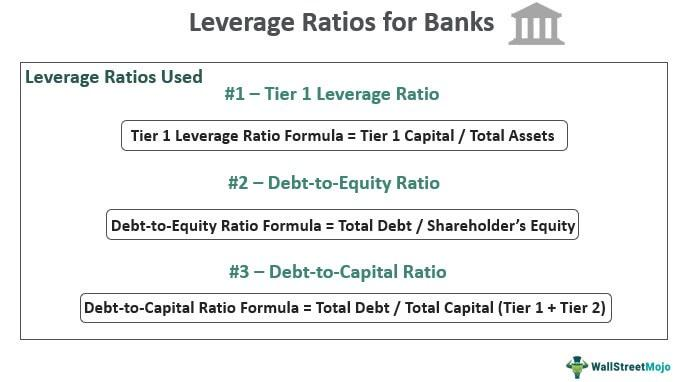

The world of finance is an intricate and multifaceted domain, characterized by a myriad of metrics that rigorously evaluate financial health and performance. Among the most pivotal of these metrics are the leverage ratios and Tier 1 Capital, which are especially significant in the banking sector. Leverage ratios provide a lens through which the debt levels of a financial institution or a corporation are assessed, serving as critical indicators of financial risk and stability. On the other hand, Tier 1 Capital represents the core capital of a bank, encompassing elements such as common equity, retained earnings, and reserves. This foundational capital serves as a buffer to absorb potential losses, thereby ensuring the bank's stability during turbulent financial periods.

In the rapidly evolving landscape of algorithmic trading, both leverage ratios and Tier 1 Capital assume crucial roles. Algorithmic trading, which involves executing trades at speeds and frequencies impractical for human traders, relies on data-driven models. These models frequently use financial metrics such as leverage ratios to optimize trading strategies, balance risk, and enhance potential returns. 



This article intends to provide a comprehensive overview of leverage ratios, Tier 1 Capital, and their integral role in the sphere of algorithmic trading. It will outline the methodologies used for calculating these financial measures, discuss their implications, and explore practical applications in real-world trading scenarios. By understanding the mechanisms and implications of these key financial indicators, stakeholders can make informed decisions, thereby contributing to financial stability and economic robustness.

## Table of Contents

## Understanding Leverage Ratio

Leverage ratio is an essential metric for evaluating a company's financial structure, focusing primarily on its debt levels. These ratios are useful for determining the financial risk and stability of an organization by analyzing the proportion of debt to equity or assets. Different types of leverage ratios provide various insights into a company's financial health.

The debt-to-equity ratio, one of the most common leverage ratios, is calculated by dividing total liabilities by shareholder equity:

$$
\text{Debt-to-Equity Ratio} = \frac{\text{Total Liabilities}}{\text{Shareholder Equity}}
$$

A high debt-to-equity ratio indicates that a company relies extensively on borrowing, which could imply higher financial risk. Conversely, a lower ratio suggests a more stable financial structure with less reliance on external debt.

Another leverage ratio is the debt ratio, which measures the proportion of a company's assets that are financed by debt. It can be calculated using the following formula:

$$
\text{Debt Ratio} = \frac{\text{Total Liabilities}}{\text{Total Assets}}
$$

A debt ratio greater than 1 indicates that a company has more debt than assets, which could be a signal of potential financial distress. On the other hand, a debt ratio less than 1 implies that a company has more assets than debt, signifying potentially lower financial risk.

The equity multiplier, another key leverage ratio, is used to assess a firm's financial leverage by comparing total assets to shareholder equity:

$$
\text{Equity Multiplier} = \frac{\text{Total Assets}}{\text{Shareholder Equity}}
$$

A higher equity multiplier indicates greater financial leverage, as the company uses debt extensively to finance its assets. This can amplify returns on equity but also increases risk.

In the banking industry, leverage ratios play a critical role in ensuring that banks maintain adequate capital buffers to avoid excessive risk-taking. Regulatory bodies use these ratios to ensure banks do not become overly reliant on borrowing, which could jeopardize their stability and the broader financial system's health. Effective leverage ratio management strengthens financial institutions by promoting resilience against economic fluctuations and potential financial crises.

## Tier 1 Capital and Its Importance

Tier 1 Capital represents the primary funding source for banks, critical in maintaining financial stability and confidence. It encompasses common equity, retained earnings, and certain reserves. This core capital category is the most reliable source to absorb unexpected losses, thus enabling banks to remain solvent during financial downturns. 

Common equity forms the largest part of Tier 1 Capital, representing ownership interests in a bank. Its primary components include common stock and additional paid-in capital, which are instrumental in raising funds from investors. Retained earnings, another significant constituent, are profits that a bank has reinvested in itself rather than distributing as dividends. Reserves, although smaller in percentage, act as cushions for specific identified risks.

The Tier 1 Capital ratio is a key indicator of a bank's financial robustness and its ability to endure economic stresses without requiring external support. It is calculated as follows:

$$
\text{Tier 1 Capital Ratio} = \frac{\text{Tier 1 Capital}}{\text{Risk-Weighted Assets}} \times 100\]

This ratio serves a dual purpose: it acts as a measure of bank stability while also serving as a metric for regulatory compliance. International banking regulations, particularly the Basel III framework, require banks to maintain a minimum Tier 1 Capital ratio to ensure that they are adequately capitalized relative to their risk exposure.

A high Tier 1 Capital ratio suggests that a bank has a solid financial base, capable of withstanding market fluctuations and sustaining operations without needing to liquidate assets hastily. This capacity to absorb potential losses reduces the risk of bank failure and protects depositors' funds, thereby promoting overall economic stability.

## The Role of Tier 1 Leverage Ratio

The Tier 1 Leverage Ratio is a critical measure in the assessment of a bank's financial durability, comparing the institution's Tier 1 Capital to its total exposure, including on- and off-balance sheet assets. Mathematically, it is expressed as:

$$
\text{Tier 1 Leverage Ratio} = \frac{\text{Tier 1 Capital}}{\text{Total Assets}}
$$

Tier 1 Capital is the core capital of a bank, primarily comprising common stock, retained earnings, and disclosed reserves. This ratio is contrasted against total assets, which encapsulate both the visible balance sheet items and exposures that are not immediately apparent, such as derivatives and non-consolidated entities.

Regulatory bodies mandate a minimum threshold for the Tier 1 Leverage Ratio to ensure banks maintain sufficient capital buffers, thereby reducing systemic risk. In practice, a Tier 1 Leverage Ratio above 5% is widely deemed as indicative of robust financial health. This benchmark serves as a critical safeguard by restraining banks from excessive risk-taking and over-leveraging, which could jeopardize their ability to absorb unexpected financial shocks.

This approach came into sharper focus following the financial crises of the late 2000s, prompting regulators to adopt stricter capital requirements. A higher Tier 1 Leverage Ratio doesn't just bolster an individual bank's resilience but also underpins the stability of the broader financial system by limiting the extent to which banks can magnify their exposure through leverage.

For regulators and financial analysts, monitoring this ratio assists in preemptive identification of institutions that may pose systemic risks. It guides supervisory actions and influences policy formulations aimed at curtailing financial excesses. Consequently, the Tier 1 Leverage Ratio is central to the legislative and prudential frameworks that strive to maintain the equilibrium of the banking sector.

## Algorithmic Trading and Financial Ratios

Algorithmic trading employs complex mathematical models and automated systems to execute trades at speeds and frequencies that are impossible for human traders. Central to these systems are financial ratios such as leverage ratios and Tier 1 Capital, which inform trading criteria and decision-making processes.

Leverage ratios, which describe the level of a company's debt relative to its assets or equity, are significant in [algorithmic trading](/wiki/algorithmic-trading). They help traders assess the financial leverage of a company, which is crucial for evaluating the potential risks and returns associated with holding its securities. For instance, the debt-to-equity ratio, calculated as:

$$
\text{Debt-to-Equity Ratio} = \frac{\text{Total Liabilities}}{\text{Shareholders' Equity}}
$$

provides insight into a company's financial leverage. A high ratio indicates more debt relative to equity, which may imply higher risk but potentially higher returns. Algorithms use this information to adjust trading strategies, balancing the risk/reward profile according to predefined criteria.

Tier 1 Capital, a core measure of a bank's financial strength, plays a critical role in algorithmic trading, especially when trading financial institutions' securities. Tier 1 Capital includes common equity, retained earnings, and certain reserves, serving as a buffer against financial stress. The assessment of a bank's Tier 1 Capital informs traders about its ability to absorb losses, an essential [factor](/wiki/factor-investing) when evaluating the stability and viability of investing in a bank's stocks or bonds.

The Tier 1 Leverage Ratio specifically compares a bank's Tier 1 Capital to its total assets, typically represented as:

$$
\text{Tier 1 Leverage Ratio} = \frac{\text{Tier 1 Capital}}{\text{Total Assets}}
$$

A higher ratio suggests that the bank is better capitalized and thus perceived as more stable, influencing algorithmic trading decisions. Algorithms might favor investments in banks with higher Tier 1 Leverage Ratios, interpreting them as safer options in uncertain markets.

Using financial ratios, algorithmic traders can refine strategies to optimize returns and manage risks effectively. By inputting leverage and capital adequacy data, algorithms can dynamically adjust trading actions, such as buying undervalued stocks of a well-capitalized bank or shorting overleveraged companies during market downturns. This data-driven approach allows traders to anticipate and react to market changes with precision, leveraging financial analysis to gain competitive advantages.

## Practical Implications and Examples

Calculating leverage ratios and Tier 1 Capital provides valuable insights for making financial decisions in banking and trading environments. By analyzing these calculations, one can assess the risk and stability of financial institutions and their compliance with regulatory standards.

### Calculation of Leverage Ratios

Leverage ratios are critical for assessing a company's financial risk. The debt-to-equity ratio, a common leverage ratio, is calculated as follows:

$$
\text{Debt-to-Equity Ratio} = \frac{\text{Total Debt}}{\text{Total Equity}}
$$

For instance, if a bank has a total debt of $\$200 \, \text{million}$ and total equity of $\$50 \, \text{million}$, the debt-to-equity ratio would be:

$$
\frac{\$200 \, \text{million}}{\$50 \, \text{million}} = 4.0
$$

This ratio indicates the bank relies on debt four times more than its equity, suggesting a high financial leverage and potential risk.

### Tier 1 Capital Calculation

Tier 1 Capital includes common equity, retained earnings, and certain reserves. Its calculation determines a bank's core capital ratio, providing insight into its ability to absorb losses. The formula for the Tier 1 Capital Ratio is:

$$
\text{Tier 1 Capital Ratio} = \frac{\text{Tier 1 Capital}}{\text{Risk-Weighted Assets}}
$$

Consider a bank with Tier 1 Capital of $\$30 \, \text{million}$ and risk-weighted assets of $\$200 \, \text{million}$:

$$
\frac{\$30 \, \text{million}}{\$200 \, \text{million}} = 0.15 \, \text{or} \, 15\%
$$

A Tier 1 Capital ratio of 15% indicates the bank is well-capitalized, able to withstand financial challenges.

### Application in Banking

In practical banking scenarios, these ratios guide regulatory compliance and risk management. For example, the Tier 1 Capital Ratio helps ensure a bank maintains a robust capital cushion, crucial for regulatory compliance under frameworks like Basel III, which advocates for a minimum Tier 1 Capital ratio.

### Application in Algorithmic Trading

In algorithmic trading, leveraging these financial metrics optimizes trading strategies. For instance, algorithms might automatically adjust position sizes based on the debt-to-equity ratios of targeted firms to balance risk. Consider a Python example where an algorithm calculates and uses these metrics:

```python
def calculate_debt_to_equity(total_debt, total_equity):
    return total_debt / total_equity

def calculate_position_size(capital, risk_per_trade, debt_to_equity_ratio):
    return capital * risk_per_trade / debt_to_equity_ratio

# Example usage
total_debt = 200_000_000
total_equity = 50_000_000
capital = 1_000_000
risk_per_trade = 0.02

debt_to_equity_ratio = calculate_debt_to_equity(total_debt, total_equity)
position_size = calculate_position_size(capital, risk_per_trade, debt_to_equity_ratio)

print("Debt-to-Equity Ratio:", debt_to_equity_ratio)
print("Position Size:", position_size)
```

This algorithm calculates the debt-to-equity ratio and adjusts position sizes based on calculated financial risk, thus optimizing trading strategies by aligning them with institutional financial health.

Understanding these metrics' practical applications allows financial professionals to make informed decisions, contributing to individual and economic stability.

## Conclusion

Leverage ratio and Tier 1 Capital are fundamental elements of financial analysis, playing vital roles in assessing the financial stability and risk profile of banking institutions. These metrics not only highlight a bank's ability to withstand economic turbulence by ensuring sufficient capital reserves but also serve as critical determinants in algorithmic trading strategies. By incorporating leverage ratios and Tier 1 Capital into trading algorithms, traders are equipped to optimize investment strategies, balance risk, and enhance returns, which is essential in navigating the complex financial markets.

Understanding these financial metrics allows stakeholders to make informed decisions that promote economic stability. By ensuring that banks hold an adequate buffer of capital, these measures mitigate the risk of insolvency and reduce the likelihood of financial crises. In algorithmic trading, these metrics serve as foundational inputs for developing strategies that can predict market shifts and adapt to dynamic conditions effectively, thereby managing risks inherent to high-frequency trading environments.

Integrating knowledge of leverage ratios and Tier 1 Capital into financial practices thus allows stakeholders to act responsibly. This informed approach not only supports the health of individual banks but also contributes positively to the broader economic landscape, fostering an environment where informed, strategic decision-making leads to sustained growth and resilience across financial sectors. This underscores the significance of these metrics in crafting policies and strategies that align with both micro and macroeconomic goals.

## References & Further Reading

[1]: Basel Committee on Banking Supervision. (2010). [Basel III: A global regulatory framework for more resilient banks and banking systems.](https://www.bis.org/publ/bcbs189_dec2010.htm) Bank for International Settlements.

[2]: ["Understanding Bank Risk through Leverage Ratios"](https://www.analystinterview.com/article/leverage-ratio-in-the-banking-sector) by Ratnovski, Lev. (International Monetary Fund Working Paper, 2013).

[3]: ["Financial Ratios and Their Impact on Algorithmic Trading Performance"](https://www.sciencedirect.com/science/article/pii/S0275531920304050) (Neurocomputing Journal, 2015) by M. de Prado et al.

[4]: ["Risk Management and Financial Institutions"](https://people.duke.edu/~rampini/papers/financialinstitutions.pdf) by John Hull

[5]: ["Algorithmic Trading and DMA: An Introduction to Direct Access Trading Strategies"](https://www.amazon.com/Algorithmic-Trading-DMA-introduction-strategies/dp/0956399207) by Barry Johnson

[6]: ["Leverage and Risk in Investment Banking"](https://www.moneyandbanking.com/commentary/2016/5/2/leverage-and-risk) (The Journal of Finance, 2012) by K. John & E. Ofek.