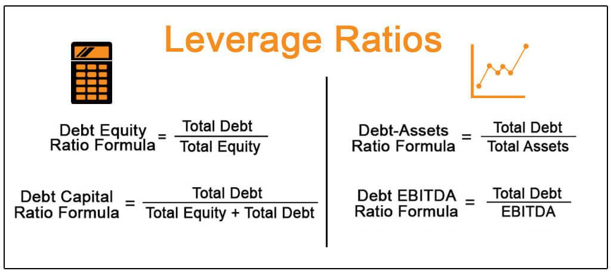

## Table of Contents

## What is a leverage ratio?

A leverage ratio is a way to measure how much debt a company uses to run its business compared to its own money. It's like looking at how much a company borrows versus how much it owns. This helps people understand if a company is taking too many risks by borrowing a lot of money.

If a company has a high leverage ratio, it means it's using a lot of debt. This can be risky because the company has to pay back the debt, and if it can't, it might get into trouble. On the other hand, a low leverage ratio means the company is using less debt and more of its own money, which is usually safer but might mean it's not growing as fast as it could.

## Why is the leverage ratio important in finance?

The leverage ratio is important in finance because it helps people see how much a company is relying on borrowed money to do its business. When a company borrows money, it can use that money to grow faster or invest in new projects. But, if it borrows too much, it might have trouble paying back the money, especially if things don't go as planned. So, by looking at the leverage ratio, investors and lenders can figure out if a company is taking on too much risk.

Also, the leverage ratio can tell us about a company's financial health. If a company has a low leverage ratio, it means it's not borrowing a lot and is using more of its own money. This can be a good sign because it shows the company is not too risky. But, if the leverage ratio is high, it might mean the company is in a risky spot. It's like walking a tightrope; a little bit of debt can help a company grow, but too much can make it fall.

## What are the different types of leverage ratios?

There are several types of leverage ratios, and each one tells us something different about a company's use of debt. One common type is the debt-to-equity ratio. This ratio compares the money a company owes (debt) to the money it has from its owners (equity). It's like looking at how much a company borrows versus how much it owns. If the debt-to-equity ratio is high, it means the company is using a lot of borrowed money, which can be risky.

Another type is the debt ratio, which shows how much of a company's total assets are funded by debt. It's calculated by dividing total debt by total assets. A high debt ratio means a big part of the company's stuff is paid for with borrowed money, which can also be risky. The equity ratio is the opposite; it shows how much of the company's assets are paid for with the owners' money. A high equity ratio means the company is using more of its own money, which is usually safer.

The last type is the interest coverage ratio. This ratio tells us if a company can pay the interest on its debt with its earnings before interest and taxes (EBIT). It's like checking if a company's income is enough to cover the cost of borrowing. A high interest coverage ratio means the company can easily pay its interest, which is a good sign. But if it's low, it might struggle to pay back what it owes.

## How do you calculate the debt-to-equity ratio?

The debt-to-equity ratio is a way to see how much a company is using borrowed money compared to its own money. You can figure it out by dividing the company's total debt by its total equity. Total debt is all the money the company owes, like loans or bonds. Total equity is the money that the owners have put into the company, plus any profits that have been kept in the business.

For example, if a company has $100,000 in debt and $50,000 in equity, the debt-to-equity ratio would be $100,000 divided by $50,000, which equals 2. This means the company has twice as much debt as equity. A higher number means the company is using more borrowed money, which can be risky. A lower number means it's using more of its own money, which is usually safer.

## What is the formula for the debt-to-capital ratio?

The debt-to-capital ratio is a way to see how much a company uses borrowed money compared to all the money it uses to run its business. You can find it by dividing the company's total debt by the total capital. Total capital is the sum of total debt and total equity. Total debt is all the money the company owes, like loans or bonds. Total equity is the money that the owners have put into the company, plus any profits that have been kept in the business.

For example, if a company has $100,000 in debt and $50,000 in equity, the total capital would be $150,000. To find the debt-to-capital ratio, you would divide the total debt ($100,000) by the total capital ($150,000), which equals about 0.67 or 67%. This means that 67% of the company's capital comes from debt. A higher percentage means the company is using more borrowed money, which can be riskier. A lower percentage means it's using more of its own money, which is usually safer.

## How can the interest coverage ratio be used to assess leverage?

The interest coverage ratio is a way to see if a company can pay the interest on its debt with the money it earns before paying taxes and interest. It's like checking if a company's income is enough to cover the cost of borrowing. You find this ratio by dividing the company's earnings before interest and taxes (EBIT) by the interest expenses it has to pay. If the ratio is high, it means the company can easily pay its interest, which is a good sign. But if it's low, it might struggle to pay back what it owes.

This ratio is important because it helps people understand how much risk a company is taking with its debt. If a company has a high interest coverage ratio, it means it's not too risky because it can easily pay its interest. This is a good sign for investors and lenders. But if the ratio is low, it means the company might have trouble paying its interest, which can be a red flag. It shows that the company might be using too much debt, making it a riskier investment.

## What does a high leverage ratio indicate about a company?

A high leverage ratio means a company is using a lot of borrowed money to run its business. It's like the company is taking a big loan to do more things, like buying new stuff or starting new projects. When a company borrows a lot, it can grow faster because it has more money to use. But, it's also riskier because the company has to pay back all that money, and if it can't, it might get into trouble.

If a company has a high leverage ratio, it might be a sign that it's trying to grow quickly. This can be good if everything goes well, but it's also a warning sign. If the company's plans don't work out, or if it has a hard time making money, it might struggle to pay back its debts. So, a high leverage ratio can make investors and lenders worried because it shows the company might be taking on too much risk.

## How do leverage ratios vary across different industries?

Leverage ratios can be very different from one industry to another because each industry has its own way of doing business. For example, industries like utilities and telecoms often have high leverage ratios. These companies need a lot of money to build things like power plants or phone networks, so they borrow a lot. It's normal for them to have high debt because they can usually pay it back with the money they make from their services.

On the other hand, industries like technology or software might have lower leverage ratios. These companies often don't need as much money to start up or grow, so they don't borrow as much. They might use their own money or money from investors instead of taking out big loans. This makes their leverage ratios lower, which can be safer but might also mean they grow more slowly.

## What are the potential risks associated with high leverage?

When a company has high leverage, it means it's using a lot of borrowed money. This can be risky because the company has to pay back all that money, plus interest. If the company can't make enough money to cover its debt payments, it might get into big trouble. It could even go bankrupt if it can't pay back what it owes. This risk is even bigger if the economy takes a downturn or if the company faces unexpected problems, because it might not have enough money coming in to keep up with its debt.

Also, high leverage can make it harder for a company to get more loans in the future. Lenders might see the company as too risky and decide not to lend it more money. This can limit the company's ability to grow or handle emergencies. Plus, if the company's profits are not high enough to cover the interest on its debt, it might have to cut back on other important things, like investing in new projects or paying its workers well. All these problems show why high leverage can be a dangerous thing for a company.

## How can a company optimize its leverage ratio?

A company can optimize its leverage ratio by finding a good balance between using borrowed money and its own money. If a company has too much debt, it can try to pay some of it off by using its profits or by selling things it doesn't need anymore. This can lower the leverage ratio and make the company less risky. Another way is to bring in more money from investors, which increases the company's equity and helps lower the debt-to-equity ratio.

It's also important for a company to think carefully about taking on new debt. Before borrowing more money, the company should check if it can really pay it back. This means looking at how much money it makes and how much it spends. If a company can grow without borrowing too much, it can keep its leverage ratio at a healthy level. By doing these things, a company can make sure it's using the right amount of debt to grow, without taking too many risks.

## What impact does leverage have on a company's return on equity?

When a company uses leverage, it can affect its return on equity (ROE). ROE is a way to see how well a company is using the money that its owners put into it. If a company borrows money and uses it to make more money than it costs to borrow, the ROE can go up. This is because the company is using other people's money to make profits, which can make the owners' money work harder. But, if the company doesn't make enough money to cover the cost of borrowing, the ROE can go down because the company is losing money on the debt.

Leverage can be a double-edged sword. On one hand, it can help a company grow faster and increase its ROE if everything goes well. On the other hand, if the company can't pay back its debts, it can hurt the ROE and even put the company at risk of going bankrupt. So, it's important for a company to use the right amount of leverage. If it uses too much, it can be risky. If it uses too little, it might not grow as fast as it could. Finding the right balance is key to making the most of leverage and keeping the ROE healthy.

## How do regulatory requirements affect leverage ratios in financial institutions?

Regulatory requirements can have a big impact on how much debt financial institutions, like banks, can take on. These rules are made to keep the financial system safe and to stop banks from taking too many risks. For example, regulators might set a rule that says banks can't have more than a certain amount of debt compared to their own money. This is called a leverage ratio limit. If a bank has too much debt, it might have to get more money from its owners or pay off some of its debt to meet these rules.

These rules can make banks more careful about how much they borrow. If a bank knows it has to follow these limits, it might choose to grow more slowly and use less debt. This can be good for the bank's safety, but it might also mean the bank can't grow as fast as it wants. So, regulatory requirements help keep banks stable, but they can also limit how much they can do with borrowed money.

## What are Leverage Ratios and How Do We Understand Them?

A leverage ratio is a vital financial metric that evaluates a company's debt level relative to its assets or equity, playing a significant role in assessing its financial stability. It essentially gauges how much a company relies on debt to finance its operations. The most commonly used leverage ratios include the debt-to-equity (D/E) ratio, equity multiplier, and debt-to-capitalization ratio.

The debt-to-equity (D/E) ratio compares the total liabilities of a company to its shareholders' equity. This ratio provides insights into the firm's reliance on debt financing vis-à-vis its equity. A high D/E ratio suggests that a company might be heavily reliant on borrowing, which can signal potential risks if the company faces cash flow issues. The formula for the D/E ratio is expressed as:

$$
\text{Debt-to-Equity Ratio (D/E)} = \frac{\text{Total Liabilities}}{\text{Shareholders' Equity}}
$$

Another important metric is the equity multiplier, which indicates how much a company relies on debt to finance its assets. It is calculated by dividing total assets by total equity, offering a sense of the financial leverage employed by the company. The equity multiplier is represented as:

$$
\text{Equity Multiplier} = \frac{\text{Total Assets}}{\text{Total Equity}}
$$

The debt-to-capitalization ratio is another critical measure, assessing the proportion of a company's total capital structure that is composed of debt. This ratio helps in understanding the degree of financial leverage and is particularly useful for evaluating a company's long-term solvency and risk exposure. It is calculated as follows:

$$
\text{Debt-to-Capitalization Ratio} = \frac{\text{Total Debt}}{\text{Total Debt} + \text{Shareholders' Equity}}
$$

Leverage ratios are crucial in measuring risk levels, indicating how easily a company can meet its financial obligations and navigate potential financial instability. They provide valuable insight into a company's financial health, which is essential for both investors and analysts in making informed decisions.

## How do you calculate leverage ratios?

Calculating leverage ratios is a straightforward process that involves analyzing a company's financial statements, specifically focusing on key components such as liabilities, assets, and equity. These calculations play a critical role in assessing a company's financial health and are frequently used by analysts to make comparisons between companies operating within the same industry.

The debt-to-equity (D/E) ratio, a fundamental measure, is computed by dividing a company's total liabilities by its shareholders’ equity. This ratio is a pivotal indicator of the extent to which a company is financing its operations through debt versus wholly-owned funds. Mathematically, it is expressed as:

$$
\text{Debt-to-Equity Ratio} = \frac{\text{Total Liabilities}}{\text{Shareholders' Equity}}
$$

Another important measure is the equity multiplier, which evaluates a company's use of debt to finance its assets. It is calculated by dividing total assets by total equity, providing insight into the proportion of a company’s assets financed by equity as opposed to debt:

$$
\text{Equity Multiplier} = \frac{\text{Total Assets}}{\text{Total Equity}}
$$

Additionally, the debt-to-capitalization ratio provides a comprehensive glance at a firm’s capital structure by assessing the proportion of debt in its total capitalization. Such a calculation is integral in determining the risk and financial leverage of a company:

$$
\text{Debt-to-Capitalization Ratio} = \frac{\text{Total Debt}}{\text{Total Debt} + \text{Shareholders' Equity}}
$$

These ratios collectively provide powerful tools for evaluating financial risk and stability. Properly utilizing these calculations allows analysts to gain insight into a company's operational efficiency and financial strategy, equipping them with the data necessary to make informed investment decisions. Python, with its robust libraries such as pandas and NumPy, can be used to automate these calculations from financial statements, aiding in efficient large-scale analysis.

## References & Further Reading

1. **Investopedia - Technical Guides on Leverage Ratios**  
   Investopedia offers comprehensive technical guides on various financial metrics, including leverage ratios, that help investors and analysts understand their practical application in assessing a company's financial health. These guides provide a valuable resource for breaking down complex financial concepts into understandable terms. [Access Investopedia's resources here](https://www.investopedia.com/).

2. **Adam Hayes, Ph.D., CFA - Insights on Financial Leverage**  
   Adam Hayes provides in-depth analyses on financial leverage, elucidating how leverage ratios can influence a firm's financial strategy and risk management. His insights are particularly helpful for understanding the broader implications of leverage in corporate finance. [Explore insights from Adam Hayes on Investopedia](https://www.investopedia.com/adam-hayes-5112911).

3. **'The Cost of Capital', Modigliani & Miller - Foundational Concepts in Finance**  
   The work of Modigliani and Miller on the cost of capital is foundational in finance, providing key principles regarding capital structure and its impact on a company's valuation and financial strategy. Their theories underpin much of modern financial analysis, particularly in the context of leverage and capital structure. [Read more about Modigliani & Miller's theories](https://en.wikipedia.org/wiki/Modigliani%E2%80%93Miller_theorem).

4. **Damodaran, A. (2012). 'Investment Valuation' - Tools for Evaluating Financial Assets**  
   Aswath Damodaran's "Investment Valuation" offers a thorough framework for evaluating financial assets, including the use of leverage ratios in assessing a company's value and risk profile. This book is an essential resource for anyone looking to get a deeper grasp of financial valuation techniques. [Find more by Aswath Damodaran](http://pages.stern.nyu.edu/~adamodar/).

5. **Python for Finance: Fundamental Techniques for Financial Analysis**  
   Michael Bowles' "Python for Finance" provides practical insights into the application of Python programming in financial analysis, including the calculation and application of leverage ratios in trading algorithms. This book is ideal for financial analysts seeking to integrate quantitative methods into their trading strategies. [Learn more about Python for finance](https://www.oreilly.com/library/view/python-for-finance/9781492024330/).

