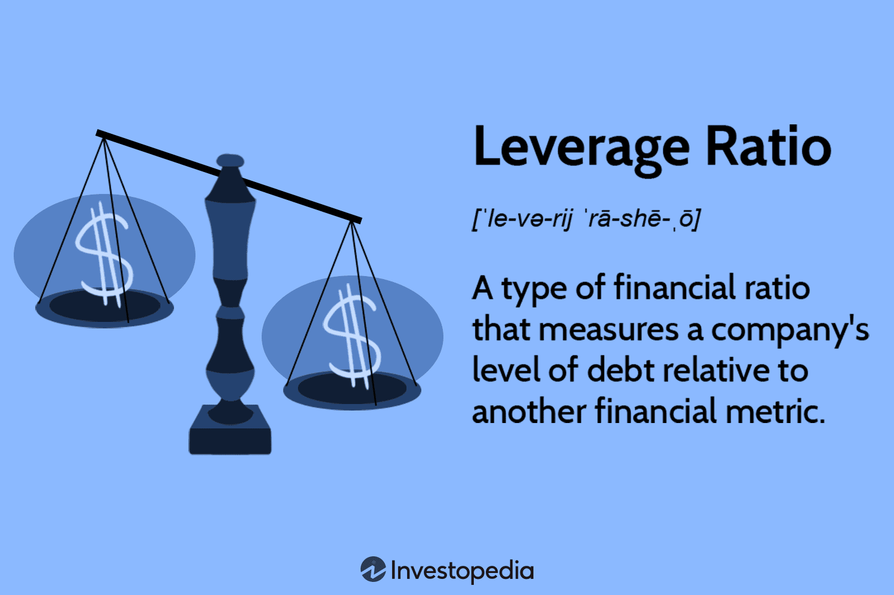

## Table of Contents

## What is a leverage ratio in the context of banking and finance?

A leverage ratio in banking and finance is a measure that shows how much debt a bank or financial institution uses compared to its equity. It's like a seesaw where debt is on one side and equity on the other. The ratio helps to understand how much the bank relies on borrowed money to operate and grow. A higher leverage ratio means the bank is using more debt, which can be riskier because it has to pay back more money.

Regulators and investors look at the leverage ratio to see if a bank is taking on too much risk. If a bank has a high leverage ratio, it might struggle if its investments don't perform well, because it has to pay back a lot of debt. On the other hand, a lower leverage ratio means the bank is using less debt and might be safer, but it might also grow more slowly because it's not borrowing as much to invest. So, finding the right balance is important for banks.

## Why are leverage ratios important for bank lending?

Leverage ratios are important for bank lending because they show how much risk a bank is taking. When a bank lends money, it's using some of its own money and some borrowed money. The leverage ratio tells us how much of the bank's money is borrowed. If the ratio is high, it means the bank is using a lot of borrowed money to make loans. This can be risky because if borrowers can't pay back their loans, the bank might struggle to pay back its own debts.

Regulators and investors use leverage ratios to keep an eye on banks. They want to make sure banks aren't taking too many risks with their lending. If a bank's leverage ratio is too high, regulators might step in to make the bank safer. This helps protect the bank and the whole financial system. So, leverage ratios help everyone understand how safe a bank's lending practices are.

## How do leverage ratios affect investment regulation?

Leverage ratios play a big role in how regulators keep an eye on banks and other financial institutions. When a bank has a high leverage ratio, it means they're using a lot of borrowed money to make investments. This can be risky because if their investments don't do well, they might not be able to pay back what they owe. Regulators use leverage ratios to make sure banks aren't taking too many risks. If a bank's leverage ratio is too high, regulators might tell them to cut back on borrowing or hold more money in reserve to be safer.

This helps keep the whole financial system stable. If banks are too risky, it could cause big problems not just for them, but for everyone who uses banks. By keeping an eye on leverage ratios, regulators can step in early to prevent these problems. This way, they can protect people's money and make sure the economy stays strong. So, leverage ratios are a key tool for making sure banks invest wisely and safely.

## What are the common types of leverage ratios used in banking?

In banking, there are several common types of leverage ratios that help understand how much a bank is relying on borrowed money. One of the most widely used is the Debt-to-Equity Ratio. This ratio compares the total amount of debt a bank has to the amount of equity it holds. A higher ratio means the bank is using more debt compared to its own money, which can be riskier. Another common ratio is the Tier 1 Leverage Ratio, which looks at a bank's core capital (like common stock and retained earnings) compared to its total assets. This helps regulators see if a bank has enough strong capital to support its operations.

Another important leverage ratio is the Debt-to-Asset Ratio, which shows how much of a bank's assets are financed by debt. If this ratio is high, it means a big part of the bank's assets are paid for with borrowed money, which could be risky if the bank's investments don't perform well. Lastly, there's the Equity Multiplier, which is calculated by dividing total assets by total equity. This ratio tells us how much a bank's assets are leveraged by its equity. All these ratios help banks, regulators, and investors understand the financial health and risk level of a bank.

## How is the debt-to-equity ratio calculated and used in banking?

The debt-to-equity ratio is calculated by dividing a bank's total debt by its total equity. Total debt includes things like loans the bank has taken and bonds it has issued. Total equity is the money that belongs to the bank's shareholders, which includes money from selling stocks and the bank's profits that it has kept. If a bank has $200 million in debt and $100 million in equity, its debt-to-equity ratio would be 2. This means the bank is using twice as much borrowed money as its own money.

In banking, the debt-to-equity ratio is used to understand how much risk a bank is taking. A higher ratio means the bank is using a lot of borrowed money to do its business. This can be risky because if the bank's investments don't do well, it might struggle to pay back its debts. Regulators and investors look at this ratio to see if a bank is too risky. If the ratio is too high, they might ask the bank to use less debt or hold more money in reserve to be safer. This helps keep the bank and the whole financial system stable.

## What role does the tier 1 leverage ratio play in bank regulation?

The Tier 1 leverage ratio is a key measure that regulators use to check how safe a bank is. It compares the bank's core capital, which includes things like common stock and retained earnings, to its total assets. This ratio helps regulators see if a bank has enough strong money to support all its operations. If the ratio is high, it means the bank is using a lot of its own money rather than borrowed money, which is safer.

Regulators set rules about what the Tier 1 leverage ratio should be to make sure banks aren't taking too many risks. If a bank's ratio is too low, it might mean the bank is using too much borrowed money, which can be risky. By keeping an eye on this ratio, regulators can step in and tell banks to hold more of their own money or cut back on borrowing. This helps keep the bank and the whole financial system stable and protects people's money.

## How do regulatory bodies set leverage ratio requirements?

Regulatory bodies set leverage ratio requirements to make sure banks aren't taking too many risks. They look at how much debt a bank is using compared to its own money. If a bank uses too much debt, it can be risky because it might struggle to pay back what it owes if things go wrong. So, regulators set a minimum leverage ratio that banks must meet. This minimum is like a safety rule that helps keep banks stable and protects the whole financial system.

To set these requirements, regulators think about what's happening in the economy and how risky things are at the time. They might change the minimum leverage ratio if they think banks need to be safer or if they want to help banks grow. Regulators also look at what other countries are doing so that their banks can compete fairly. By setting these rules, regulators help make sure banks are using the right amount of their own money and borrowed money, which keeps everyone's money safe.

## What are the implications of high leverage ratios for banks?

When a bank has a high leverage ratio, it means they are using a lot of borrowed money to do their business. This can be risky because if the bank's investments don't do well, it might have a hard time paying back all the money it owes. If many people or businesses can't pay back their loans, the bank could lose a lot of money. This could make the bank unstable and might even lead to it failing. High leverage ratios can also make it harder for a bank to get more money when it needs it, because other banks or investors might see it as too risky to lend to them.

Regulators and investors watch leverage ratios closely because they want to make sure banks are safe. If a bank's leverage ratio is too high, regulators might step in and tell the bank to use less borrowed money or hold more of its own money in reserve. This helps keep the bank and the whole financial system stable. For investors, a high leverage ratio might make them worried about the bank's future, so they might not want to invest in it. So, a high leverage ratio can affect how people see the bank and how it can grow and operate in the future.

## How have leverage ratio requirements evolved post-financial crisis?

After the big financial crisis in 2008, people realized that some banks were using too much borrowed money, which made them risky. So, the people in charge of making rules for banks, called regulators, started to change the rules about how much debt banks could use. They made new rules to make sure banks had to keep their leverage ratios at safer levels. This meant banks had to use less borrowed money and more of their own money to do business.

These new rules were put in place by groups like the Basel Committee on Banking Supervision. They created something called the Basel III framework, which set a minimum Tier 1 leverage ratio that banks had to follow. The idea was to make banks stronger and less likely to fail if things went wrong. Over time, these rules have been checked and sometimes changed to make sure they keep working well. Banks now have to be more careful about how much they borrow, which helps keep the whole financial system safer for everyone.

## Can you explain the Basel III leverage ratio framework?

The Basel III leverage ratio framework is a set of rules made to keep banks safe after the big financial crisis in 2008. It's like a safety net that stops banks from borrowing too much money. The main part of this framework is the Tier 1 leverage ratio, which looks at how much of a bank's own money, like common stock and profits they've kept, they use compared to all their assets. Regulators decided that banks should have at least a 3% Tier 1 leverage ratio. This means for every $100 in assets, a bank should have at least $3 of its own money. This rule helps make sure banks have enough strong money to keep going even if things go wrong.

The Basel III framework also makes banks report their leverage ratios regularly so that regulators can keep an eye on them. If a bank's ratio is too low, regulators might tell them to use less borrowed money or hold more of their own money. This helps keep banks stable and protects the whole financial system. Over time, the rules have been checked and sometimes changed to make sure they keep working well. The goal is always to make sure banks are using the right mix of their own money and borrowed money, so they can grow but also stay safe.

## What are the challenges banks face in managing their leverage ratios?

Managing leverage ratios can be tough for banks. One big challenge is balancing growth with safety. Banks want to grow and make more money, but using too much borrowed money can be risky. If they borrow a lot, their leverage ratio goes up, and regulators might get worried. This means banks have to be careful about how much they borrow. They need to find the right mix so they can grow without taking too many risks.

Another challenge is dealing with changing rules. After the big financial crisis, regulators started making new rules like the Basel III framework. These rules can change over time, and banks have to keep up with them. Sometimes, the rules might get stricter, which means banks have to hold more of their own money and borrow less. This can be hard because it might slow down their growth. Banks have to keep an eye on these rules and adjust how they do business to stay in line with them.

## How do leverage ratios impact a bank's risk management strategies?

Leverage ratios are important for banks because they show how much risk the bank is taking. When a bank has a high leverage ratio, it means they are using a lot of borrowed money. This can be risky because if the bank's investments don't do well, they might struggle to pay back what they owe. So, banks need to be careful about how much they borrow. They have to think about how to keep their leverage ratio at a safe level while still trying to grow and make money. This means they need to have good risk management strategies to make sure they are not taking too many risks.

To manage their leverage ratios, banks use different strategies. They might decide to borrow less money or hold more of their own money in reserve. This can help lower their leverage ratio and make them safer. Banks also have to keep an eye on the rules set by regulators, like the Basel III framework, which tell them what their leverage ratio should be. If the rules change, banks need to adjust their strategies to stay in line with them. By managing their leverage ratios well, banks can protect themselves and keep the whole financial system stable.

## What is the Role of Leverage Ratios in Banking?

Leverage ratios serve as fundamental metrics in the banking sector, enabling regulators to monitor and limit the levels of risk taken by financial institutions. In essence, a leverage ratio quantifies the amount of a bank's capital relative to its total assets, establishing a safeguard against excessive borrowing and speculative activities. The primary aim of implementing these ratios is to bolster the stability of the financial system and to prevent banks from engaging in overly risky financial behavior that could lead to insolvency or systemic crises.

$$
\text{Leverage Ratio} = \frac{\text{Tier 1 Capital}}{\text{Total Assets}}
$$

Tier 1 Capital generally includes core capital, which consists of common equity, disclosed reserves, and certain regulatory adjustments, while total assets represent all assets a bank holds, both on and off the balance sheet.

The importance of leverage ratios became particularly pronounced following the 2008 financial crisis, a period marked by widespread instability stemming from high leverage and poor risk management practices within banks. As a consequence, international regulatory frameworks such as the Basel III accord were introduced, emphasizing stricter leverage ratio requirements to promote financial resilience. Basel III, formulated by the Basel Committee on Banking Supervision, established a minimum leverage ratio of 3% for participating banks, a standard that compels banks to maintain Tier 1 capital at a level no less than 3% of their total exposure.

These stricter post-crisis leverage ratios have significantly enhanced the resilience of banks. By capping the extent to which banks can leverage their capital base, regulatory authorities aim to ensure that institutions remain robust in the face of adverse financial conditions, thereby reducing the likelihood of future crises. Enhanced leverage ratios ensure that banks have sufficient capital buffers to absorb unexpected losses, provide continued service to customers during tumultuous times, and maintain systemic stability.

In summary, leverage ratios play a crucial role in shaping the financial health and stability of banking institutions. Through carefully calibrated regulatory standards, these ratios guide banks towards prudent risk management and sustainable financial practices, ultimately contributing to a more secure and resilient global financial system.

## How do bank lending practices influence economic impacts?

Bank lending serves as a cornerstone for economic growth by providing necessary capital to both businesses and consumers. When banks lend funds to businesses, it allows those enterprises to invest in new projects, technologies, and workforce expansion, thus stimulating economic productivity. Consumers, on the other hand, use borrowed funds to purchase goods and services, driving demand in the economy.

Leverage ratios play a critical role in determining the extent to which banks can engage in lending activities. A leverage ratio is defined as the ratio of a bank's Tier 1 capital to its total exposure (which includes both on-balance sheet assets and off-balance sheet commitments). The formula for the leverage ratio is:

$$
\text{Leverage Ratio} = \frac{\text{Tier 1 Capital}}{\text{Total Exposure}}
$$

Regulators impose minimum leverage ratios to ensure that banks maintain a balance between their capital and exposure, thereby mitigating the risk of insolvency during financial downturns. After the 2008 financial crisis, stricter leverage ratio requirements have been implemented globally, aiming to bolster the resilience of financial institutions.

However, these tighter regulations can also have the unintended effect of curbing bank lending. When leverage ratios are restricted, banks may limit their lending activities to maintain compliance with regulatory requirements. This reduction in lending capacity can, in turn, constrain economic growth, as businesses and consumers face difficulties in accessing the capital needed for spending and investment.

The relationship between leverage ratios and economic activity highlights the delicate balance regulators must maintain. While safeguarding financial stability is crucial, excessive constraints on bank lending can adversely affect economic expansion. Consequently, regulators and policymakers continuously assess these dynamics to foster an environment that supports both economic growth and financial stability.

## References & Further Reading

[1]: Basel Committee on Banking Supervision. (2011). ["Basel III: A Global Regulatory Framework for More Resilient Banks and Banking Systems."](https://www.bis.org/publ/bcbs189.htm) Bank for International Settlements.

[2]: ["The Dodd-Frank Act: A Cheat Sheet."](https://www.riskdata.com/wp-content/uploads/The-Dodd-Frank-Act_Morrison-Foerster.pdf) Shearman & Sterling LLP.

[3]: Hull, J. (2018). ["Options, Futures, and Other Derivatives."](https://www.amazon.com/Options-Futures-Other-Derivatives-9th/dp/0133456315) Pearson, 10th Edition.

[4]: SEC. ("Insider Trading."](https://www.secform4.com/) U.S. Securities and Exchange Commission.

[5]: Hasbrouck, J. (2007). ["Empirical Market Microstructure: The Institutions, Economics, and Econometrics of Securities Trading."](https://academic.oup.com/book/52241) Oxford University Press.

[6]: Markowitz, H. (1952). ["Portfolio Selection."](https://onlinelibrary.wiley.com/doi/abs/10.1111/j.1540-6261.1952.tb01525.x) The Journal of Finance, 7(1), 77-91.

[7]: MacKenzie, D. (2006). ["An Engine, Not a Camera: How Financial Models Shape Markets."](https://academic.oup.com/mit-press-scholarship-online/book/20588) MIT Press.