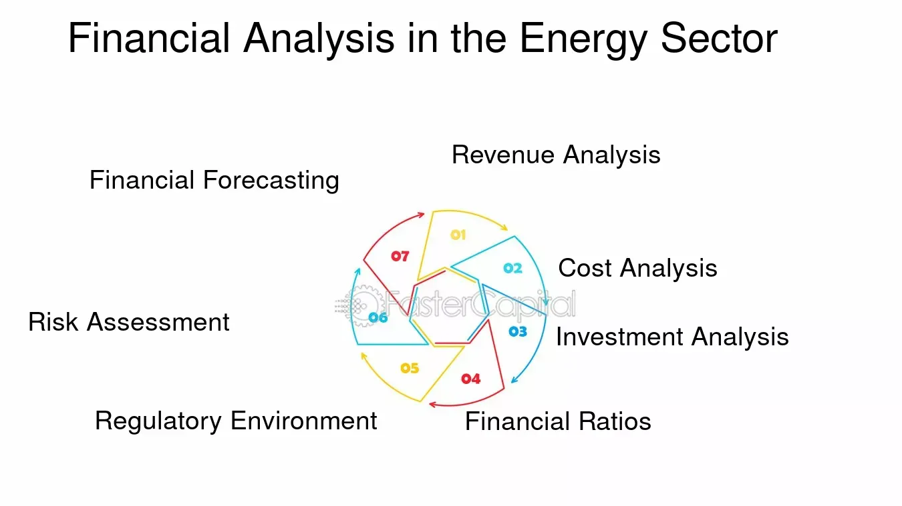

## Table of Contents

## What are leverage ratios and why are they important in financial analysis?

Leverage ratios are financial metrics that show how much a company relies on debt to finance its operations. They compare the company's debt levels to its equity or assets, giving an idea of how the company is structured financially. Common leverage ratios include the debt-to-equity ratio, which compares a company's total debt to its total equity, and the debt-to-assets ratio, which compares total debt to total assets.

These ratios are important in financial analysis because they help assess the risk associated with a company's financial structure. A high leverage ratio means a company has a lot of debt compared to its equity or assets, which can be risky because it has to pay back more money. If a company can't pay its debts, it might face financial trouble or even go bankrupt. On the other hand, using debt can also help a company grow faster if it uses the borrowed money wisely. So, analysts look at leverage ratios to understand a company's financial health and its ability to handle its debts.

## How do leverage ratios specifically apply to the energy sector?

In the energy sector, leverage ratios are really important because this industry often needs a lot of money to build things like oil rigs, pipelines, and power plants. These projects can cost billions of dollars, so energy companies often borrow money to pay for them. The debt-to-equity ratio and debt-to-assets ratio help show how much of this money comes from loans versus the company's own money. If a company in the energy sector has a high leverage ratio, it means it's using a lot of borrowed money, which can be risky if the price of oil or gas goes down and the company can't pay back its loans.

Energy companies also have to think about how stable their income is when looking at leverage ratios. For example, renewable energy companies might have more predictable income because they often have long-term contracts. This can make it safer for them to have higher leverage ratios. On the other hand, companies that rely on oil and gas prices might be more cautious about taking on debt because their income can change a lot if prices go up or down. So, leverage ratios help investors and analysts understand how risky it is to invest in different energy companies based on how they manage their debt.

## What are the most common leverage ratios used in evaluating energy companies?

The most common leverage ratios used in evaluating energy companies are the debt-to-equity ratio and the debt-to-assets ratio. The debt-to-equity ratio compares a company's total debt to its total equity. This shows how much the company relies on borrowed money compared to money from its owners or shareholders. A high debt-to-equity ratio means the company is using a lot of debt, which can be risky but also might help the company grow if it uses the money well.

The debt-to-assets ratio compares a company's total debt to its total assets. This ratio shows what part of the company's assets are financed by debt. A high debt-to-assets ratio means that a big part of what the company owns is paid for with borrowed money. This can be important for energy companies because they often need to spend a lot of money on things like oil rigs and power plants, so they need to manage their debt carefully to stay financially healthy.

## Can you explain how to calculate the Debt-to-Equity ratio for an energy firm?

To calculate the Debt-to-Equity ratio for an energy firm, you need to know two things: the total debt and the total equity of the company. Total debt includes all the money the company owes, like loans and bonds. Total equity is the value of the company that belongs to the shareholders, which you can find by subtracting the company's total liabilities from its total assets. Once you have these numbers, you divide the total debt by the total equity. The formula looks like this: Debt-to-Equity Ratio = Total Debt / Total Equity.

For example, if an energy firm has a total debt of $500 million and total equity of $1 billion, you would calculate the Debt-to-Equity ratio as follows: $500 million divided by $1 billion, which equals 0.5. This means the company has half as much debt as it has equity. A lower ratio like this might suggest the company is less risky because it's not relying as much on borrowed money. But, what's considered a good or bad ratio can depend on the specific situation of the energy firm and how it compares to other companies in the industry.

## What does a high Debt-to-Asset ratio indicate about an energy company's financial health?

A high Debt-to-Asset ratio in an energy company means that a big part of what the company owns is paid for with borrowed money. This can be risky because if the company can't pay back its loans, it might have financial problems or even go bankrupt. Energy companies often need a lot of money to build things like oil rigs and power plants, so they sometimes have to borrow a lot. But if they can't make enough money from their business to pay back the loans, especially if the price of oil or gas goes down, they can get into trouble.

On the other hand, a high Debt-to-Asset ratio isn't always bad. If the energy company uses the borrowed money wisely to grow its business and make more money, it can be a good thing. For example, if they build a new power plant that makes them a lot of money, the debt can help them grow faster. But it's important for the company to manage its debt well and make sure it can pay it back, especially in the energy sector where prices can change a lot.

## How does the Interest Coverage Ratio help in assessing the risk of energy sector investments?

The Interest Coverage Ratio is a way to see if an energy company can pay the interest on its loans with the money it makes. It's important because energy companies often borrow a lot of money to build things like oil rigs and power plants. To find the Interest Coverage Ratio, you divide the company's earnings before interest and taxes (EBIT) by the interest it has to pay on its debt. If the ratio is high, it means the company makes enough money to easily pay its interest, which is good. If it's low, the company might struggle to pay its interest, which can be risky.

In the energy sector, where prices for oil and gas can go up and down a lot, the Interest Coverage Ratio helps investors understand how safe their investment might be. If an energy company has a low Interest Coverage Ratio, it means it might have trouble paying its debts if prices drop. This could make the company less attractive to investors because it's riskier. On the other hand, a high Interest Coverage Ratio shows that the company can handle its debt well, even if prices change, making it a safer investment. So, this ratio is a key tool for figuring out how much risk there is in investing in energy companies.

## What role do leverage ratios play in the decision-making process of energy sector investors?

Leverage ratios help energy sector investors figure out how much risk they are taking when they put their money into a company. These ratios, like the debt-to-equity ratio and the debt-to-assets ratio, show how much of the company's money comes from loans. If a company has a high leverage ratio, it means it owes a lot of money. This can be risky because if the price of energy goes down, the company might struggle to pay back its loans. Investors use these ratios to decide if the company is too risky or if it's a safe place to put their money.

The Interest Coverage Ratio is another important tool for investors. It tells them if the company makes enough money to pay the interest on its loans. In the energy sector, where prices can change a lot, this ratio is really useful. A high Interest Coverage Ratio means the company can handle its debt well, even if prices drop. A low ratio means it might have trouble paying its interest, which is a red flag for investors. By looking at these leverage ratios, investors can make smarter choices about where to invest their money in the energy sector.

## How have leverage ratios in the energy sector evolved over the past decade, and what factors have influenced these changes?

Over the past decade, leverage ratios in the energy sector have seen significant changes, influenced by fluctuating oil and gas prices, shifts in global energy demand, and the push towards sustainable energy sources. During periods of high oil prices, many energy companies took on more debt to fund expansion projects, leading to higher leverage ratios. However, when oil prices crashed, particularly around 2014-2016 and again in 2020 due to the global economic impact of the COVID-19 pandemic, many companies found themselves struggling to service their debt, resulting in a push to reduce leverage ratios. This led to a wave of bankruptcies, mergers, and restructurings as companies tried to manage their debt levels more conservatively.

The move towards renewable energy has also played a role in shaping leverage ratios in the energy sector. Traditional oil and gas companies have faced pressure to diversify into cleaner energy sources, which often require substantial upfront investments. This has led to varied approaches to debt management, with some companies increasing their leverage to fund these new ventures, while others have been more cautious, focusing on reducing debt to maintain financial stability. Additionally, regulatory changes and investor demands for more sustainable practices have further influenced how energy firms approach their capital structure, leading to a more nuanced understanding and application of leverage ratios over the past decade.

## What are the industry benchmarks for leverage ratios in different segments of the energy sector (e.g., oil & gas, renewable energy)?

In the oil and gas segment of the energy sector, leverage ratios like the debt-to-equity ratio and debt-to-assets ratio can vary a lot. A common benchmark for the debt-to-equity ratio in this segment is around 1 to 2, meaning for every dollar of equity, companies have between $1 and $2 of debt. This higher leverage is often because oil and gas companies need a lot of money to explore and produce oil and gas. But, when oil prices drop, these companies can struggle to pay back their debt, so they might try to lower their leverage ratios to be safer. A debt-to-assets ratio in this segment might be around 0.4 to 0.6, showing that 40% to 60% of their assets are financed by debt.

In the renewable energy segment, the benchmarks for leverage ratios are usually a bit different. Renewable energy companies often have long-term contracts that make their income more predictable, so they might be comfortable with higher leverage ratios. A typical debt-to-equity ratio in this segment might be around 1.5 to 3, meaning for every dollar of equity, they have $1.50 to $3 of debt. This higher ratio is because renewable projects like wind farms or solar plants need a lot of money upfront, but the steady income from contracts can help them pay back the debt. The debt-to-assets ratio in renewable energy might be around 0.5 to 0.7, showing that 50% to 70% of their assets are financed by debt.

## How can leverage ratios be used to compare the financial stability of traditional energy companies versus renewable energy firms?

Leverage ratios help us see how much debt a company has compared to its own money or assets. When we compare traditional energy companies, like those in oil and gas, to renewable energy firms, we can use these ratios to understand their financial stability. Traditional energy companies often have higher debt-to-equity ratios, around 1 to 2, because they need a lot of money to explore and produce oil and gas. This can make them riskier, especially if oil prices drop and they can't pay back their loans. On the other hand, renewable energy firms might have debt-to-equity ratios of 1.5 to 3, but their income is often more predictable because of long-term contracts, which can make them less risky even with higher debt.

Looking at the debt-to-assets ratio can also tell us a lot. Traditional energy companies might have a debt-to-assets ratio of 0.4 to 0.6, meaning a big part of what they own is paid for with borrowed money. If oil prices fall, this can be a problem because they might not make enough money to pay back their debt. Renewable energy firms, however, might have a debt-to-assets ratio of 0.5 to 0.7. Even though this is higher, their steady income from contracts can help them manage their debt better. So, while both types of companies use debt, renewable energy firms might be seen as more financially stable because their income is more predictable.

## What are the limitations of using leverage ratios alone when evaluating the energy sector, and what other financial metrics should be considered?

Using just leverage ratios to evaluate energy companies can miss the bigger picture. These ratios tell us about debt but don't show if a company makes enough money to pay its bills or how well it's doing overall. For example, a high debt-to-equity ratio might make a company look risky, but if it's making a lot of money from its projects, it might not be a problem. Also, leverage ratios don't show how the energy market is doing or if there are new laws that could affect the company. So, looking only at leverage ratios can make us miss important details about a company's health.

To get a fuller picture, we should look at other financial metrics too. The Interest Coverage Ratio is important because it shows if a company can pay the interest on its loans with the money it makes. The Return on Equity (ROE) tells us how well the company is using the money from its shareholders to make more money. And the Cash Flow from Operations shows if the company is bringing in enough cash to run its business and pay its debts. By looking at these metrics along with leverage ratios, we can better understand if an energy company is financially stable and a good investment.

## How do geopolitical factors and regulatory changes impact the interpretation of leverage ratios in the energy sector?

Geopolitical factors and regulatory changes can really change how we look at leverage ratios in the energy sector. When there's a lot of tension between countries or if there's a war, it can mess with oil and gas prices. If prices go up, energy companies might take on more debt because they think they can make more money. But if prices go down because of these tensions, companies with a lot of debt might have a hard time paying it back. So, when we see a company's leverage ratios, we need to think about what's going on in the world that could affect their business.

Regulatory changes also make a big difference. Governments can change laws about how much pollution is allowed or how much companies have to pay to use certain energy sources. If new rules make it more expensive to use oil and gas, companies might have to borrow more money to switch to cleaner energy. But if they can't pay back that debt because the new projects don't make enough money, it can be risky. So, when we look at leverage ratios, we also need to consider if there are any new laws that could make it harder or easier for the company to handle its debt.

## What are the key leverage ratios in energy firms?

Leverage ratios are essential metrics for evaluating the financial stability and risk profile of energy firms, which often operate with significant capital expenses and debt. Among these ratios, Debt-to-EBITDA, Interest Coverage Ratio, Debt-to-Capital Ratio, and Debt-to-Equity Ratio are particularly important.

**Debt-to-EBITDA:** This ratio measures the number of years it would take a company to pay off its debt assuming the company’s EBITDA (Earnings Before Interest, Taxes, Depreciation, and Amortization) remains constant. It is calculated as:

$$
\text{Debt-to-EBITDA} = \frac{\text{Total Debt}}{\text{EBITDA}}
$$

This ratio is especially pertinent for energy firms with substantial capital expenditures, as it provides insight into the burden of debt relative to the company's operational profitability. A higher ratio suggests greater financial risk, as it implies longer durations to repay the debt with current earnings.

**Interest Coverage Ratio:** This ratio evaluates a firm’s capacity to meet its interest payment obligations, which is a critical indicator of its ability to service debt. It is computed as:

$$
\text{Interest Coverage Ratio} = \frac{\text{EBIT}}{\text{Interest Expense}}
$$

Where EBIT stands for Earnings Before Interest and Taxes. A higher interest coverage ratio indicates more robust fiscal health, signifying the firm's comfort in covering its interest expenses, thus implying lower default risk.

**Debt-to-Capital Ratio:** This ratio measures the proportion of a company's capital that is financed by debt, offering insights into financial risk. It is calculated by:

$$
\text{Debt-to-Capital Ratio} = \frac{\text{Total Debt}}{\text{Total Debt} + \text{Shareholders' Equity}}
$$

A lower debt-to-capital ratio is generally preferable as it suggests a larger proportion of the firm's capital is not burdened by debt, thereby reducing financial risk and enhancing stability.

**Debt-to-Equity Ratio:** This ratio reveals the relationship between borrowed funds and shareholders' equity, illustrating how leveraged a company is:

$$
\text{Debt-to-Equity Ratio} = \frac{\text{Total Debt}}{\text{Shareholders' Equity}}
$$

A higher debt-to-equity ratio indicates greater leverage and can signal potential financial instability, as it shows reliance on borrowed funds compared to equity financing.

In summary, these leverage ratios provide comprehensive insights into the debt management capabilities and financial risk inherent in energy firms. They are indispensable in evaluating financial stability, guiding investment decisions, and formulating effective trading strategies.

## References & Further Reading

[1]: Bodie, Z., Kane, A., & Marcus, A. J. (2013). ["Investments"](https://books.google.com/books/about/EBOOK_Investments_Global_edition.html?id=BMsvEAAAQBAJ) (10th ed.). McGraw-Hill Education.

[2]: Brealey, R. A., Myers, S. C., & Allen, F. (2019). ["Principles of Corporate Finance"](https://www.mheducation.com/highered/product/Principles-of-Corporate-Finance-Brealey.html) (13th ed.). McGraw-Hill Education.

[3]: Damodaran, A. (2012). ["Investment Valuation: Tools and Techniques for Determining the Value of any Asset"](https://books.google.com/books/about/Investment_Valuation.html?id=5SRHAAAAQBAJ) (3rd ed.). Wiley.

[4]: Fabozzi, F. J., & Peterson Drake, P. (2009). ["Finance: Capital Markets, Financial Management, and Investment Management"](https://books.google.com/books/about/Finance.html?id=mUBsAwAAQBAJ). Wiley.

[5]: Hull, J. C. (2018). ["Options, Futures, and Other Derivatives"](https://www.semanticscholar.org/paper/Options%2C-Futures%2C-and-Other-Derivatives-Hull/89bdee500c8623864fc9eb7a471546aa713acc44) (9th ed.). Pearson.

[6]: Lopez de Prado, M. (2018). ["Advances in Financial Machine Learning"](https://www.amazon.com/Advances-Financial-Machine-Learning-Marcos/dp/1119482089). Wiley.

[7]: Markowitz, H. (1952). ["Portfolio Selection"](https://onlinelibrary.wiley.com/doi/abs/10.1111/j.1540-6261.1952.tb01525.x). The Journal of Finance, 7(1), 77-91.

[8]: Rosenberg, B., & Houglet, J. (1974). ["Error Rates in CRSP and Compustat Data Sets and Their Implications"](https://www.semanticscholar.org/paper/Error-Rates-in-CRSP-and-Compustat-Data-Bases-and-Rosenberg.-Houglet/02f7c1a7f683e6709ce9569553d9f817d2e7eb39). Journal of Finance, 29(1), 131-146.

[9]: Zacks, L. (2011). ["The Handbook of Equity Market Anomalies: Translating Market Inefficiencies into Effective Investment Strategies"](https://onlinelibrary.wiley.com/doi/book/10.1002/9781119200697). Wiley.