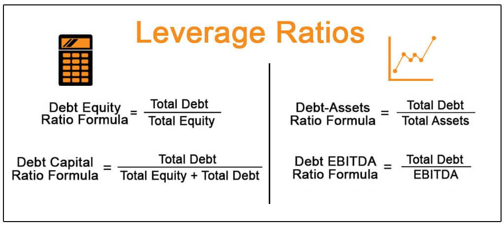

The energy sector stands as a cornerstone of global economics, primarily because of its critical role in powering industries, households, and transportation across the globe. The capital-intensive nature of the energy industry means that firms operate on substantial financial frameworks often characterized by high leverage. Understanding the financial health of these energy companies is essential, as their operations typically involve significant debt obligations relative to their equity, which can impact their financial stability and investment potential.

Leverage ratios serve as pivotal metrics in evaluating the financial structure and risk profiles of energy companies. These ratios offer insights into how a company finances its operations through a mix of debt and equity and provide an assessment of financial stability and risk exposure. High leverage can amplify both the returns and risks faced by a company, making the understanding of leverage ratios crucial for making informed investment and trading decisions.



In this article, we explore the essential leverage ratios used in assessing the financial health of energy firms, with a focus on their use in algorithmic trading. Algorithmic trading, a method of executing pre-programmed trading instructions accounting for variables such as time, price, and volume, leverages these financial metrics to enhance decision-making processes. By examining how these ratios are calculated, their importance, and their application in trading strategies, we highlight their integral role in modern financial analysis.

The discussion will encompass how leverage ratios, such as Debt-to-EBITDA, Interest Coverage Ratio, Debt-to-Capital Ratio, and Debt-to-Equity Ratio, are employed to gauge the financial robustness and risk levels of energy firms. These ratios provide a framework for traders and investors to assess a company's capacity to meet its debt obligations, its capital structure, and the balance between borrowed funds and shareholder equity, all critical for developing and optimizing trading strategies. As these tools become more ingrained in trading algorithms, their significance in financial markets continues to expand, reflecting the evolving landscape of strategic trading decisions.

## Table of Contents

## Understanding Leverage Ratios

Leverage ratios are essential metrics that offer valuable insights into a company's financial structure by assessing the balance between debt and equity financing. These ratios are critical in evaluating a company's financial stability and risk profile, significantly influencing investment decisions and trading strategies.

1. **Definition and Importance**: At its core, a leverage ratio is used to measure a company’s indebtedness relative to its equity or assets. This ratio provides a quick glimpse into how much of a company’s operations are financed through debt versus strictly internal funds or equity. By doing so, leverage ratios help investors, analysts, and financial managers understand the potential risks associated with the company's debt obligations. High leverage implies that a company might face difficulties meeting its financial obligations if market conditions worsen or if there are significant changes in interest rates.

2. **Types of Leverage Ratios**: There are several leverage ratios, each revealing different aspects of a company's debt management capabilities. Here are a few critical ones:
   - **Debt-to-Equity Ratio**: This ratio illustrates the relative proportion of shareholders' equity and debt used to finance the company’s assets. Calculated as $\frac{\text{Total Debt}}{\text{Total Equity}}$, it indicates how leveraged a firm is in terms of using its own capital versus borrowed funds. A higher ratio suggests greater financial risk and potential volatility in earnings.
   - **Debt-to-Assets Ratio**: This reflects the proportion of a company’s assets that are financed by debt, calculated as $\frac{\text{Total Debt}}{\text{Total Assets}}$. A higher ratio indicates a greater reliance on debt for asset financing, signaling higher risk.
   - **Debt-to-Capital Ratio**: This measures the proportion of the firm’s total capital that is provided by debt. It is computed as $\frac{\text{Total Debt}}{\text{Total Debt + Total Equity}}$. This ratio helps investors understand the financial risk and stability of a company by showing how much financial leverage exists in the company’s capital structure. 

3. **Financial Stability and Risk**: Leverage ratios offer critical perspectives regarding the financial stability of a company. For instance, a company with a high debt-to-equity ratio may have steady cash flows to cover its debt, but such leverage could also predict instability if the economic environment becomes less favorable. Conversely, a low leverage ratio may suggest a conservative debt management strategy, reduced risk, and potentially more stable earnings.

Understanding these ratios is crucial for assessing a company's ability to manage its debt and responding proactively to changes in its financial environment. Effective leverage management can enhance a company’s financial health, improve its credit ratings, and facilitate access to capital for growth and expansion. Therefore, leverage ratios not only inform stakeholders about a company's current financial standing but also shape strategic financial planning and investment decisions.

## Key Leverage Ratios in Energy Firms

Leverage ratios are essential metrics for evaluating the financial stability and risk profile of energy firms, which often operate with significant capital expenses and debt. Among these ratios, Debt-to-EBITDA, Interest Coverage Ratio, Debt-to-Capital Ratio, and Debt-to-Equity Ratio are particularly important.

**Debt-to-EBITDA:** This ratio measures the number of years it would take a company to pay off its debt assuming the company’s EBITDA (Earnings Before Interest, Taxes, Depreciation, and Amortization) remains constant. It is calculated as:

$$
\text{Debt-to-EBITDA} = \frac{\text{Total Debt}}{\text{EBITDA}}
$$

This ratio is especially pertinent for energy firms with substantial capital expenditures, as it provides insight into the burden of debt relative to the company's operational profitability. A higher ratio suggests greater financial risk, as it implies longer durations to repay the debt with current earnings.

**Interest Coverage Ratio:** This ratio evaluates a firm’s capacity to meet its interest payment obligations, which is a critical indicator of its ability to service debt. It is computed as:

$$
\text{Interest Coverage Ratio} = \frac{\text{EBIT}}{\text{Interest Expense}}
$$

Where EBIT stands for Earnings Before Interest and Taxes. A higher interest coverage ratio indicates more robust fiscal health, signifying the firm's comfort in covering its interest expenses, thus implying lower default risk.

**Debt-to-Capital Ratio:** This ratio measures the proportion of a company's capital that is financed by debt, offering insights into financial risk. It is calculated by:

$$
\text{Debt-to-Capital Ratio} = \frac{\text{Total Debt}}{\text{Total Debt} + \text{Shareholders' Equity}}
$$

A lower debt-to-capital ratio is generally preferable as it suggests a larger proportion of the firm's capital is not burdened by debt, thereby reducing financial risk and enhancing stability.

**Debt-to-Equity Ratio:** This ratio reveals the relationship between borrowed funds and shareholders' equity, illustrating how leveraged a company is:

$$
\text{Debt-to-Equity Ratio} = \frac{\text{Total Debt}}{\text{Shareholders' Equity}}
$$

A higher debt-to-equity ratio indicates greater leverage and can signal potential financial instability, as it shows reliance on borrowed funds compared to equity financing.

In summary, these leverage ratios provide comprehensive insights into the debt management capabilities and financial risk inherent in energy firms. They are indispensable in evaluating financial stability, guiding investment decisions, and formulating effective trading strategies.

## Algorithmic Trading and Financial Evaluation

Algorithmic trading leverages quantitative models to make data-driven investment decisions and plays a vital role in modern financial markets, including the energy sector. Understanding the financial health of potential investments is essential within this framework, as it directly impacts the risk and return profiles of trading strategies. Critical to this evaluation is the use of leverage ratios, which measure a company's indebtedness relative to its financial metrics, providing a snapshot of its overall financial stability and risk.

Leverage ratios are vital in developing automated trading algorithms, as they enable the assessment and comparison of risk profiles among different energy firms. For instance, a firm's high Debt-to-EBITDA ratio may signal potential financial distress, deterring [algorithmic trading](/wiki/algorithmic-trading) systems from engaging with its securities. Conversely, firms exhibiting lower leverage ratios may be deemed more financially robust, attracting algorithmic investments due to perceived stability and lower risk.

High-frequency trading models, characterized by rapid execution of trades, frequently incorporate leverage ratios as part of their screening processes. These models can efficiently parse through vast quantities of financial data to identify securities of firms with favorable leverage metrics. This helps in constructing portfolios that align with predefined risk appetites and trading strategies, ensuring that positions are concentrated in companies with sustainable capital structures.

The integration of leverage ratios into algorithmic trading can be illustrated through pseudocode or Python scripts, exemplifying how these financial metrics are calculated and used in trading algorithms. For instance:

```python
def debt_to_ebitda(debt, ebitda):
    return debt / ebitda

def interest_coverage_ratio(ebit, interest_expense):
    return ebit / interest_expense

# Example usage
companies = [
    {"name": "Company A", "debt": 5000, "ebitda": 1200, "ebit": 1500, "interest_expense": 200},
    {"name": "Company B", "debt": 7000, "ebitda": 2500, "ebit": 3000, "interest_expense": 350}
]

for company in companies:
    dte = debt_to_ebitda(company['debt'], company['ebitda'])
    icr = interest_coverage_ratio(company['ebit'], company['interest_expense'])
    print(f"{company['name']}: Debt-to-EBITDA = {dte}, Interest Coverage Ratio = {icr}")
```

In this way, algorithmic trading systems can dynamically adjust to market conditions by re-evaluating leverage ratios, allowing for the continuous optimization of trading strategies. This approach is pivotal in effectively managing portfolios and ensuring resilience against financial instability within traded energy firms. As financial technologies continue to advance, the integration of leverage evaluations in algorithmic models will remain a cornerstone of strategic financial analysis and trading.

## Practical Applications of Leverage Ratios

Leverage ratios are integral in refining trading strategies by facilitating quantitative evaluations of potential risks and returns. When it comes to [backtesting](/wiki/backtesting) trading algorithms, these ratios provide critical insights into the financial stability of firms, enabling traders to simulate how strategies would perform under varying market conditions. Evaluating historical financial data through leverage ratios assists in identifying patterns and predicting future market behaviors.

For risk management, leverage ratios significantly support the dynamic adjustment of position sizes and leverage levels. By analyzing real-time data, traders can optimize risk exposure according to fluctuating market dynamics. This agile approach allows traders to maintain a balanced portfolio by strategically altering their positions based on current leverage indicators, ensuring that they remain within acceptable risk thresholds.

Stress testing strategies involve applying leverage ratios to extreme market scenarios, providing insights into a firm's financial resilience and identifying potential vulnerabilities. This process uses hypothetical adverse conditions to assess the stability of trading strategies. For instance, simulating scenarios with extreme leverage levels can reveal weaknesses in a firm's ability to manage debt obligations during financial downturns, thereby guiding the enhancement of risk mitigation techniques.

Overall, leverage ratios are not merely static metrics. They are powerful tools that, when applied strategically, can enhance the robustness and resilience of algorithmic trading strategies in the energy sector and beyond.

## Case Studies and Notable Firms

Jane Street and Citadel Securities are two prominent firms deeply engaged in algorithmic and high-frequency trading, relying heavily on leverage risk assessments to inform their trading strategies.

Jane Street is a global proprietary trading firm known for its quantitative and systematic trading methodologies. The firm leverages advanced mathematical models and technology-driven strategies to conduct high-frequency trading across various asset classes. By incorporating leverage ratios such as Debt-to-EBITDA and Interest Coverage Ratio into their decision-making processes, Jane Street effectively manages risk and maximizes trading opportunities. These ratios assist the firm in evaluating the financial health and resilience of potential investments, ensuring that they maintain a balanced risk profile while exploiting market inefficiencies.

Citadel Securities is another leading market maker and trading company that utilizes leverage ratios in its high-frequency trading operations. The firm is renowned for its sophisticated data analytics and computing capabilities that drive its trading algorithms. By integrating leverage metrics such as the Debt-to-Capital Ratio and Debt-to-Equity Ratio, Citadel Securities can appraise the financial stability of energy firms and other entities. These assessments allow the firm to optimize its trading models by aligning them with the risk appetites dictated by current market conditions and firm-specific financial data.

The reliance on leverage analysis within these firms underscores the role such metrics play in enabling strategic decision-making. Both Jane Street and Citadel Securities demonstrate how leveraging detailed financial assessments, including leverage ratios, contributes to maintaining competitive advantages in high-frequency trading. These assessments not only provide insights into the financial health of target investments but also inform the development and refinement of trading algorithms, which must adapt to ever-changing market dynamics.

In summary, the case studies of Jane Street and Citadel Securities illustrate the significant impact of leverage ratios on the formulation and execution of high-frequency trading strategies. They highlight how critical the integration of financial health analysis is to maintaining robust trading operations and achieving sustainable profitability in the competitive landscape of algorithmic trading.

## Conclusion

Leverage ratios are indispensable for both financial evaluation and algorithmic trading within the energy sector. They provide a quantifiable measure of a firm's financial leverage, fundamentally impacting investment strategies and decision-making processes. By accurately reflecting a company's debt management capabilities, these ratios directly influence the assessment of financial health and guide risk management strategies that are crucial for successful trading operations. 

In algorithmic trading, the use of leverage ratios allows for the development of sophisticated models that can identify and exploit market opportunities by analyzing and comparing the financial health of energy firms. These models rely heavily on precise and timely financial data to optimize trading strategies, manage risks, and enhance returns. For instance, leverage ratios like Debt-to-EBITDA and Debt-to-Equity are critical in determining a firm's capacity to handle its debt relative to earnings and equity, which directly impacts the development and execution of trading algorithms.

As financial markets continue to evolve, the significance of leverage ratios will only increase. The ongoing advancements in data analytics and [machine learning](/wiki/machine-learning) further enable traders to integrate complex data sets and leverage ratios into automated trading systems. This technological evolution ensures that leverage ratios remain a key component in strategic trading decisions, helping traders and firms adapt to ever-changing market dynamics and maintain competitive advantages in the energy sector.

## References & Further Reading

[1]: Bodie, Z., Kane, A., & Marcus, A. J. (2013). ["Investments"](https://books.google.com/books/about/EBOOK_Investments_Global_edition.html?id=BMsvEAAAQBAJ) (10th ed.). McGraw-Hill Education.

[2]: Brealey, R. A., Myers, S. C., & Allen, F. (2019). ["Principles of Corporate Finance"](https://www.mheducation.com/highered/product/Principles-of-Corporate-Finance-Brealey.html) (13th ed.). McGraw-Hill Education.

[3]: Damodaran, A. (2012). ["Investment Valuation: Tools and Techniques for Determining the Value of any Asset"](https://books.google.com/books/about/Investment_Valuation.html?id=5SRHAAAAQBAJ) (3rd ed.). Wiley.

[4]: Fabozzi, F. J., & Peterson Drake, P. (2009). ["Finance: Capital Markets, Financial Management, and Investment Management"](https://books.google.com/books/about/Finance.html?id=mUBsAwAAQBAJ). Wiley.

[5]: Hull, J. C. (2018). ["Options, Futures, and Other Derivatives"](https://www.semanticscholar.org/paper/Options%2C-Futures%2C-and-Other-Derivatives-Hull/89bdee500c8623864fc9eb7a471546aa713acc44) (9th ed.). Pearson.

[6]: Lopez de Prado, M. (2018). ["Advances in Financial Machine Learning"](https://www.amazon.com/Advances-Financial-Machine-Learning-Marcos/dp/1119482089). Wiley.

[7]: Markowitz, H. (1952). ["Portfolio Selection"](https://onlinelibrary.wiley.com/doi/abs/10.1111/j.1540-6261.1952.tb01525.x). The Journal of Finance, 7(1), 77-91.

[8]: Rosenberg, B., & Houglet, J. (1974). ["Error Rates in CRSP and Compustat Data Sets and Their Implications"](https://www.semanticscholar.org/paper/Error-Rates-in-CRSP-and-Compustat-Data-Bases-and-Rosenberg.-Houglet/02f7c1a7f683e6709ce9569553d9f817d2e7eb39). Journal of Finance, 29(1), 131-146.

[9]: Zacks, L. (2011). ["The Handbook of Equity Market Anomalies: Translating Market Inefficiencies into Effective Investment Strategies"](https://onlinelibrary.wiley.com/doi/book/10.1002/9781119200697). Wiley.