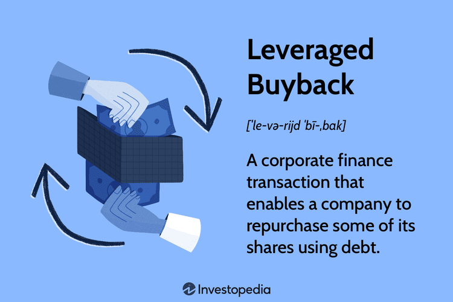

## Table of Contents

## What is a leveraged buyback?

A leveraged buyback is when a company borrows money to buy back its own shares from the stock market. This means the company uses debt, like loans or bonds, to get the cash it needs instead of using its own money. The goal is often to increase the value of the remaining shares by reducing the total number of shares available. This can make the company look more profitable on a per-share basis because the same amount of profit is spread over fewer shares.

However, using debt to buy back shares can be risky. If the company can't pay back the loans, it might face financial trouble. Also, if the stock price doesn't go up as expected, the buyback might not help the shareholders as much as hoped. Companies need to be careful and think about the risks before deciding to do a leveraged buyback.

## How does a leveraged buyback differ from a regular stock buyback?

A regular stock buyback is when a company uses its own money, like cash from profits, to buy back its shares from the stock market. This means the company is spending its own money to reduce the number of shares out there. By doing this, the company hopes to make the value of the remaining shares go up because there are fewer shares to split the profits among.

A leveraged buyback, on the other hand, is when a company borrows money to buy back its shares instead of using its own cash. This means the company takes on debt, like loans or bonds, to get the money it needs. While the goal is the same—to increase the value of the remaining shares by reducing their number—the risk is higher because the company now has to pay back the borrowed money. If the company can't do that, it might face financial problems.

## What are the main reasons a company might choose to execute a leveraged buyback?

A company might choose to do a leveraged buyback to make their remaining shares more valuable. When a company buys back its shares, it reduces the total number of shares out there. This means the same amount of profit is split among fewer shares, which can make each share worth more. If the company believes its shares are undervalued, it might think that using borrowed money to buy them back is a good investment. This way, they hope the value of the remaining shares will go up more than the cost of the debt they took on.

Another reason is to show confidence to investors. When a company borrows money to buy back its shares, it sends a strong message that the company's leaders believe in its future. This can make investors feel more confident and might even attract more investment. However, this strategy comes with risks because the company has to pay back the borrowed money. If the company can't do that, or if the stock price doesn't go up as expected, the company could face financial trouble.

## What are the potential benefits of a leveraged buyback for a company?

A leveraged buyback can help make a company's shares more valuable. When a company buys back its shares, it reduces the total number of shares out there. This means the same amount of profit is shared among fewer shares, which can make each share worth more. If the company thinks its shares are not valued enough, it might see borrowing money to buy them back as a good investment. The goal is for the value of the remaining shares to go up more than the cost of the debt.

Another benefit is that a leveraged buyback can show investors that the company's leaders believe in its future. When a company borrows money to buy back its shares, it sends a strong message of confidence. This can make investors feel more secure about the company and might even attract more investment. By showing they are willing to take on debt to buy back shares, the company can boost its image and potentially improve its stock price.

## What risks are associated with leveraged buybacks?

One big risk with leveraged buybacks is that the company takes on more debt. When a company borrows money to buy back its shares, it has to pay back that money later. If the company's business doesn't do well, it might not have enough money to pay back the loans. This can lead to financial trouble and could even push the company into bankruptcy if things get really bad.

Another risk is that the stock price might not go up like the company hopes. If the stock price doesn't increase enough to cover the cost of the debt, the buyback won't help the shareholders as much as planned. This can make investors lose confidence in the company, which might cause the stock price to drop even more. So, if the company's leaders guess wrong about the stock price, a leveraged buyback can end up hurting the company instead of helping it.

## How does a leveraged buyback impact a company's financial statements?

When a company does a leveraged buyback, it borrows money to buy back its own shares. This means the company's debt goes up on its balance sheet. The borrowed money shows up as a liability, which is money the company owes. At the same time, the company's cash goes down because it uses the borrowed money to buy back the shares. The number of shares also goes down, which can make the company's earnings per share look better because the same amount of profit is now spread over fewer shares.

The income statement might not show immediate changes, but the interest on the borrowed money will show up as an expense. This can make the company's net income go down because it has to pay more in interest. On the cash flow statement, the money spent on buying back shares will show up as a use of cash in the financing activities section. But, the money borrowed will show up as a source of cash in the same section. So, while the company's cash might not change right away, its overall financial health can be affected by the increased debt and the ongoing interest payments.

## What role do debt markets play in facilitating a leveraged buyback?

Debt markets are really important for a company that wants to do a leveraged buyback. When a company decides to buy back its shares using borrowed money, it needs to find lenders willing to give them that money. The debt markets are where the company can borrow this money by issuing bonds or taking out loans. Lenders, like banks or investors, look at the company's financial health to decide if they should lend the money. If the company looks strong and able to pay back the debt, lenders are more likely to say yes.

Once the company gets the money from the debt markets, it can use it to buy back its shares. This means the company now has more debt on its [books](/wiki/algo-trading-books), but fewer shares out there. The debt markets play a big role because without them, the company wouldn't be able to borrow the money needed for the buyback. But, it's a two-way street. The company needs to keep a good relationship with the debt markets because if it can't pay back the money, it could face big problems. So, the debt markets help make leveraged buybacks possible, but they also add risk to the company's financial situation.

## Can you explain the process of executing a leveraged buyback?

When a company wants to do a leveraged buyback, it first goes to the debt markets to borrow money. This could be through issuing bonds or taking out loans. The company needs to convince lenders, like banks or investors, that it's a good bet. The lenders will look at the company's financial health to see if it can pay back the money later. If the lenders agree, the company gets the cash it needs to buy back its shares.

Once the company has the borrowed money, it uses it to buy back its own shares from the stock market. This means the company's debt goes up, but the number of shares goes down. The goal is to make the value of the remaining shares go up because there are fewer shares to split the profits among. But, the company now has to pay back the borrowed money, plus interest. This can make things risky if the company's business doesn't do well, because it still has to find a way to pay back the debt.

## How do leveraged buybacks affect a company's stock price and shareholder value?

When a company does a leveraged buyback, it borrows money to buy back its own shares. This can make the stock price go up because there are fewer shares out there. When there are fewer shares, the same amount of profit is shared among them, which can make each share worth more. This means the earnings per share can look better, and investors might think the company is doing well. If investors believe in the company's future, they might buy more shares, pushing the stock price up even more.

But, there are risks too. The company now has more debt because it borrowed money to buy back the shares. If the company can't pay back this debt, or if the stock price doesn't go up as expected, it could be in trouble. The interest on the debt also has to be paid, which can eat into the company's profits. If investors start to worry about the company's ability to handle its debt, they might sell their shares, which can make the stock price go down. So, while a leveraged buyback can boost the stock price and shareholder value in the short term, it comes with risks that could hurt the company and its shareholders in the long run.

## What are some real-world examples of successful leveraged buybacks?

One example of a successful leveraged buyback is when IBM did it in the early 2010s. IBM borrowed money to buy back its own shares because it thought its stock was not valued enough. By doing this, IBM made its earnings per share look better because there were fewer shares to split the profits among. This helped boost IBM's stock price and showed investors that the company believed in its future. The buyback worked out well for IBM because its stock price went up, and it was able to pay back the debt without any big problems.

Another example is when Apple did a leveraged buyback in 2013. Apple borrowed money at a low [interest rate](/wiki/interest-rate-trading-strategies) to buy back its shares. This was a smart move because Apple's stock price kept going up, and the company was able to pay back the debt easily. The buyback made Apple's shares more valuable and showed investors that the company was confident in its future. Apple's successful buyback helped make its shareholders happy and showed that using debt to buy back shares can work out if the company is doing well.

## How do regulatory environments influence the feasibility of leveraged buybacks?

The rules and laws set by governments and financial watchdogs can make it easier or harder for a company to do a leveraged buyback. If the rules are strict, it might be tough for a company to borrow the money it needs. For example, some countries have limits on how much debt a company can take on. If a company already has a lot of debt, it might not be allowed to borrow more to buy back its shares. Also, if the rules say that companies have to tell everyone a lot about their plans, it might make the buyback less of a surprise, which can affect how well it works.

On the other hand, if the rules are more relaxed, it can be easier for a company to do a leveraged buyback. In places where it's easy to borrow money and there are fewer rules about how much debt a company can have, companies might find it simpler to go ahead with a buyback. But, even with fewer rules, companies still need to be careful. They have to make sure they can pay back the money they borrow, or they could get into trouble. So, the regulatory environment plays a big role in deciding if a leveraged buyback is a good idea for a company.

## What advanced financial strategies can be employed to optimize the outcomes of a leveraged buyback?

One advanced financial strategy to optimize a leveraged buyback is to use interest rate swaps. When a company borrows money to buy back its shares, it might have to pay a lot of interest if the interest rates go up. By using an interest rate swap, the company can trade its variable interest rate for a fixed one. This means the company knows exactly how much it will have to pay in interest, which can make planning easier and reduce the risk of the buyback. If the company can lock in a low fixed rate, it can save money on interest and make the buyback more profitable.

Another strategy is to time the buyback with the company's cash flow cycles. If a company knows when it will have more cash coming in, it can plan the buyback to happen during those times. This can help the company pay back the borrowed money more easily. For example, if a company expects a big profit at the end of the year, it might borrow money to buy back shares just before that time. This way, the company can use the extra profit to pay down the debt quickly, reducing the risk and making the buyback more successful. By being smart about when to do the buyback, the company can make the most of its financial situation.

## What is Understanding Leveraged Buybacks?

A leveraged buyback is a strategic approach in corporate finance where a firm repurchases its own shares using borrowed funds. This tactic serves multiple purposes: it reduces the number of outstanding shares, thus increasing the proportional ownership and value for remaining shareholders. By reducing share count, companies can boost their earnings per share (EPS), a key financial metric often linked to stock price performance. Enhanced EPS can lead to a more favorable perception of the company's financial health and growth prospects.

Leveraged buybacks also serve as a defensive mechanism against hostile takeovers. By increasing debt on their balance sheets, companies can make themselves less attractive targets for acquisition. This increased leverage means potential acquirers would face a higher risk and reduced cash flows, making an acquisition less appealing or feasible.

The distinction between leveraged buybacks and leveraged buyouts is crucial. In a leveraged buyback, the company buys back its own shares and takes on debt to finance this repurchase. In contrast, a leveraged buyout (LBO) involves an external party, often a private equity firm, acquiring a company (or a large stake in it) using a significant amount of borrowed money. While both involve leveraging, the direction and control differ—buybacks are internally initiated by the company, whereas buyouts are external acquisitions aimed at gaining control.

The mathematical underpinning of the EPS increase due to a buyback can be illustrated as follows:

$$
\text{EPS after buyback} = \frac{\text{Net Income}}{\text{Total Shares Outstanding after Buyback}}
$$

Where the reduction in shares outstanding results in a higher EPS, assuming net income remains constant or grows. The strategy, while potentially beneficial, comes with increased financial risk due to higher debt obligations, making it imperative for companies to evaluate the long-term impact on corporate finance stability.

## What are the financial returns and benefits?

Leveraged buybacks, a financial strategy wherein a company repurchases its outstanding shares using borrowed funds, can significantly affect financial returns. The primary financial metric influenced by this approach is the earnings per share (EPS), calculated as:

$$
\text{EPS} = \frac{\text{Net Income}}{\text{Number of Outstanding Shares}}
$$

By reducing the number of shares through buybacks, the company can effectively increase its EPS, assuming net income remains constant. This can lead to a perceived financial improvement, which often results in a higher stock price. Market participants may interpret the buyback as a signal of management’s confidence in the company’s future earnings potential, thus driving up the stock's value.

Moreover, management may employ leveraged buybacks to align executive compensation with shareholder interests, especially when compensation packages are tied to EPS metrics. However, it's crucial to note that while financial engineering can enhance reported metrics, it doesn't necessarily translate to an increase in the company's fundamental value or operational efficiency. The actual business operations and value creation may remain unchanged despite improvements in EPS.

Historically, the outcomes of leveraged buybacks have been mixed. While some companies experience enhanced stock performance post-buyback, others may face challenges such as deteriorating credit ratings due to the increased debt burden. This financial instability can pose risks if the company encounters difficulties in servicing its debt, especially during economic downturns or periods of reduced cash flow.

Companies must carefully evaluate the trade-offs associated with leveraged buybacks, balancing short-term financial gains against long-term financial health and stability. As such, the strategic use of leveraged buybacks requires a nuanced understanding of both the potential benefits and the inherent risks.

## References & Further Reading

[1]: ["The New Corporate Governance in Theory and Practice"](https://academic.oup.com/book/2129) by Stephen Bainbridge

[2]: Perello, J., & Masoliver, J. (2002). ["Random Diffusion Model for Stock Returns: Application to Transaction Data."](https://www.semanticscholar.org/paper/First-passage-and-escape-problems-in-the-Feller-Masoliver-Perell%C3%B3/c49191fe7fe5dfcb70ee2bc73409570085ee86c3) Physica A: Statistical Mechanics and its Applications.

[3]: [Jensen, M.C. (1986). "Agency Costs of Free Cash Flow, Corporate Finance, and Takeovers."](https://www.jstor.org/stable/1818789) American Economic Review.

[4]: ["Leveraged Buyouts: Motives and Sources of Value"](https://www.researchgate.net/publication/317943083_Leveraged_Buyouts_Motives_and_Sources_of_Value) by Yakov Amihud & Garry W. Melnick

[5]: [Massa, M., & Zhang, L. (2008). "The Effects of Leveraged Buybacks: Evidence from Disentangling Debt Stock and Flow."](https://www.sciopen.com/article/10.26599/BDMA.2024.9020035) Journal of Financial Economics. 

[6]: ["Algorithmic and High-Frequency Trading"](https://assets.cambridge.org/97811070/91146/frontmatter/9781107091146_frontmatter.pdf) by Álvaro Cartea, Sebastian Jaimungal, and José Penalva

[7]: ["The Impact of Dodd-Frank on Financial Stability and Economic Growth"](https://www.researchgate.net/publication/318048349_The_Impact_of_the_Dodd-Frank_Act_on_Financial_Stability_and_Economic_Growth) edited by Leah A. Harris