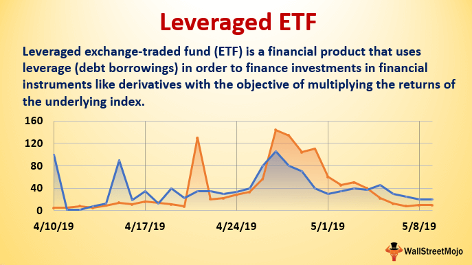

## Table of Contents

## What is a leveraged ETF?

A leveraged ETF, or exchange-traded fund, is a type of investment that aims to give you bigger returns than a normal investment. It does this by using borrowed money to invest more than the amount you put in. For example, if you invest $100 in a regular ETF and it goes up by 1%, you make $1. But if you invest in a leveraged ETF that aims to give you 2 times the return, you could make $2 on that same $1 increase.

However, leveraged ETFs can be risky. Because they use borrowed money, if the market goes down, your losses can be bigger too. If the same ETF that gives you 2 times the return goes down by 1%, you would lose $2 instead of just $1. This means you need to be careful and understand the market well before investing in leveraged ETFs.

## How do leveraged ETFs aim to achieve their returns?

Leveraged ETFs try to achieve their returns by using a financial tool called derivatives. Derivatives are like bets on how a stock or an index will perform. By using these bets, the ETF can control a bigger amount of money than what investors actually put in. This means if the stock or index goes up, the ETF can make more money for its investors. But if it goes down, the losses can be bigger too.

To make these bets, leveraged ETFs often use something called futures contracts or options. These are agreements to buy or sell an asset at a set price in the future. By carefully choosing these contracts, the [ETF](/wiki/etf-trading-strategies) can try to get the returns it promises, like 2 times or 3 times the daily performance of an index. It's a bit like using a lever to lift a heavy weight – you can move more with less effort, but if you're not careful, things can go wrong quickly.

## What are the common leverage ratios used in ETFs?

Leveraged ETFs usually come with different levels of leverage. The most common ones are 2 times (2x) and 3 times (3x) the daily performance of an index or stock. This means if the index goes up by 1%, a 2x ETF tries to go up by 2%, and a 3x ETF tries to go up by 3%.

There are also inverse leveraged ETFs. These work the opposite way. A 2x inverse ETF tries to go down by 2% when the index goes up by 1%, and a 3x inverse ETF tries to go down by 3%. These are used by investors who think the market will go down, and they want to make money from that drop.

## How do daily rebalancing and compounding affect leveraged ETF returns?

Daily rebalancing and compounding can make leveraged ETFs behave in ways you might not expect. When an ETF says it gives you 2 times or 3 times the return of an index, it's trying to do that every day. But because the market moves every day, the ETF has to adjust its bets to keep up with this goal. This is called rebalancing. If the market goes up and down a lot, this daily rebalancing can make the ETF's performance over time different from what you might think.

Compounding adds another layer to this. If the market goes up one day and down the next, the effects of the daily changes can build up over time. This means that over a longer period, like a week or a month, the returns of a leveraged ETF might not be exactly 2 or 3 times the index's return. Sometimes, it can be more, and sometimes less. It's important to understand this if you're thinking about investing in leveraged ETFs, because the ups and downs can lead to bigger losses or gains than you planned for.

## What is the difference between a leveraged ETF and a traditional ETF?

A leveraged ETF and a traditional ETF are different in how they aim to make money for you. A traditional ETF tries to match the performance of an index, like the S&P 500, by holding the same stocks in the same amounts. If the index goes up by 1%, the traditional ETF should go up by about 1% too. It's like a mirror of the index. On the other hand, a leveraged ETF uses borrowed money and financial tools called derivatives to try to give you bigger returns. If it's a 2x leveraged ETF, it aims to go up by 2% when the index goes up by 1%. But this also means it can go down by 2% if the index goes down by 1%.

Because of this, leveraged ETFs can be riskier than traditional ETFs. They have to adjust their bets every day to keep up with their goals, which can lead to unexpected results over time. This daily adjustment, called rebalancing, along with the effect of compounding, can make the returns of a leveraged ETF different from what you might expect over longer periods. Traditional ETFs don't have these issues because they just aim to follow the index without using borrowed money or extra financial tools. So, while leveraged ETFs can offer bigger gains, they also come with the chance of bigger losses, making them more suited for experienced investors who understand the risks.

## Can you explain the concept of decay in leveraged ETFs?

Decay in leveraged ETFs is when the value of the ETF goes down over time, even if the index it's based on stays the same or goes up a little. This happens because of the way leveraged ETFs work. They use borrowed money and special financial tools to try to give you bigger returns every day. But because they have to adjust their bets every day to keep up with their goals, small ups and downs in the market can add up and make the ETF lose value over time.

Think of it like this: if the market goes up one day and down the next, the leveraged ETF has to change its bets to match these daily changes. Over time, these daily adjustments can make the ETF's value go down, even if the overall market doesn't change much. This is called decay, and it's something to watch out for if you're thinking about investing in leveraged ETFs. It's why these ETFs are usually better for short-term trading rather than holding onto them for a long time.

## How do market volatility and trends impact the performance of leveraged ETFs?

Market [volatility](/wiki/volatility-trading-strategies) can really affect how well leveraged ETFs do. When the market goes up and down a lot, leveraged ETFs have to adjust their bets every day to keep up with their goals. This daily adjustment, called rebalancing, can make the ETF lose value over time, especially if the market is very jumpy. This is called decay, and it's why leveraged ETFs might not be the best choice if you want to keep your money in them for a long time. If the market is calm and doesn't move much, the decay might not be as bad, but it's still something to think about.

Trends in the market also play a big role. If the market keeps going up or down in a steady way, a leveraged ETF can do well. For example, if you have a 2x leveraged ETF and the market goes up by 1% every day for a week, your ETF could go up by more than 2% over that week because of compounding. But if the market goes up one day and down the next, the ETF might not do as well as you hoped. It's all about how steady the market is. If you're thinking about investing in a leveraged ETF, it's important to look at the market's trend and how much it's moving around.

## What are the risks associated with investing in leveraged ETFs?

Investing in leveraged ETFs can be risky because they use borrowed money to try to give you bigger returns. If the market goes down, the losses can be bigger too. For example, if you have a 2x leveraged ETF and the market drops by 1%, your ETF could drop by 2%. This means you could lose money faster than with a regular ETF. Also, leveraged ETFs have to adjust their bets every day to keep up with their goals, and this can lead to something called decay. Decay is when the value of the ETF goes down over time, even if the market stays the same or goes up a little. This makes leveraged ETFs riskier, especially if you plan to keep them for a long time.

Another risk is that leveraged ETFs can be affected a lot by how much the market moves around, which is called volatility. If the market goes up and down a lot, the daily adjustments the ETF has to make can make its value go down over time. This means that even if you think the market will go up, a lot of ups and downs can still hurt your investment. Also, if the market trend changes a lot, it can be hard to predict how your leveraged ETF will do. For example, if the market goes up one day and down the next, your ETF might not do as well as you hoped. So, it's important to understand these risks and maybe talk to a financial advisor before you decide to invest in leveraged ETFs.

## How can an investor use leveraged ETFs in their portfolio?

An investor can use leveraged ETFs in their portfolio to try to make more money from the market's ups and downs. If you think the market is going to go up, you might buy a 2x or 3x leveraged ETF. This means if the market goes up by 1%, your ETF could go up by 2% or 3%. But remember, if the market goes down, your losses could be bigger too. So, leveraged ETFs are often used for short-term trades, not for keeping them in your portfolio for a long time.

It's important to be careful when using leveraged ETFs. They can be risky because they use borrowed money to try to give you bigger returns. If the market is very jumpy, going up and down a lot, your ETF might lose value over time even if the market stays the same. This is called decay. Also, if you're wrong about which way the market is going, you could lose money faster than with a regular ETF. So, it's a good idea to only use a small part of your portfolio for leveraged ETFs and to understand the risks before you start.

## What are some strategies for mitigating the risks of leveraged ETFs?

One way to lower the risks of leveraged ETFs is to only use them for short periods of time. Because these ETFs have to adjust their bets every day, they can lose value over time even if the market stays the same. This is called decay. If you buy and sell them quickly, you might avoid some of this decay. It's also a good idea to keep an eye on the market and be ready to sell if things start to go the wrong way. That way, you can try to limit your losses if the market goes down.

Another strategy is to only use a small part of your money for leveraged ETFs. Since they can be risky, putting all your money into them is not a good idea. By only using a small amount, you can still try to make more money from the market's ups and downs without risking too much. It's also smart to mix leveraged ETFs with other kinds of investments, like regular ETFs or stocks, to spread out your risk. Talking to a financial advisor can also help you understand the risks better and make a plan that works for you.

## How do you analyze the historical performance of a leveraged ETF?

To analyze the historical performance of a leveraged ETF, you need to look at how it has done over time compared to the index it's based on. You can find this information on financial websites or through investment platforms. Start by looking at the ETF's daily returns and see how they match up with the index's daily returns. Remember, a 2x leveraged ETF should aim to give you twice the daily return of the index, and a 3x ETF should aim for three times. But because of daily adjustments and market ups and downs, the actual returns over longer periods might be different.

It's also important to look at how much the ETF's value has changed over time, not just the daily returns. This can show you if the ETF has been affected by decay, which is when the value goes down even if the market stays the same. You can do this by looking at the ETF's performance over weeks, months, or even years. Comparing this to the index's performance over the same time can help you see if the ETF has done what it promised or if it has lost value because of the way it works. This kind of analysis can help you decide if a leveraged ETF is right for your investment goals.

## What advanced metrics should be considered when evaluating the potential returns of a leveraged ETF?

When you're looking at the potential returns of a leveraged ETF, you should think about something called beta. Beta tells you how much the ETF moves compared to the market. For a leveraged ETF, the beta should be higher than 1. If it's a 2x leveraged ETF, the beta should be around 2, and for a 3x leveraged ETF, it should be around 3. But because of daily adjustments and market ups and downs, the actual beta might be different over time. So, it's good to check the historical beta to see if it matches what the ETF promises.

Another important thing to look at is the standard deviation. This tells you how much the ETF's returns jump around. If the standard deviation is high, it means the ETF's returns can be all over the place, which can be risky. You should also think about the tracking error, which is how well the ETF follows the index it's based on. A high tracking error means the ETF isn't doing a good job of matching the index's returns, which can affect your potential returns. By looking at these advanced metrics, you can get a better idea of what to expect from a leveraged ETF.

## References & Further Reading

[1]: Bergstra, J., Bardenet, R., Bengio, Y., & Kégl, B. (2011). ["Algorithms for Hyper-Parameter Optimization."](https://papers.nips.cc/paper/4443-algorithms-for-hyper-parameter-optimization) Advances in Neural Information Processing Systems 24.

[2]: ["Advances in Financial Machine Learning"](https://www.amazon.com/Advances-Financial-Machine-Learning-Marcos/dp/1119482089) by Marcos Lopez de Prado

[3]: ["Evidence-Based Technical Analysis: Applying the Scientific Method and Statistical Inference to Trading Signals"](https://www.amazon.com/Evidence-Based-Technical-Analysis-Scientific-Statistical/dp/0470008741) by David Aronson

[4]: ["Machine Learning for Algorithmic Trading"](https://github.com/stefan-jansen/machine-learning-for-trading) by Stefan Jansen

[5]: ["Quantitative Trading: How to Build Your Own Algorithmic Trading Business"](https://www.amazon.com/Quantitative-Trading-Build-Algorithmic-Business/dp/1119800064) by Ernest P. Chan 

[6]: Charupat, N., & Miu, P. (2011). ["The Pricing and Performance of Leveraged Exchange-Traded Funds."](https://www.sciencedirect.com/science/article/pii/S0378426610003444) Journal of Banking & Finance, 35(6), 1526-1549.

[7]: Avellaneda, M., & Zhang, S. (2010). ["Path-Dependence of Leveraged ETF Returns."](https://math.nyu.edu/~avellane/SIAMLETFS.pdf.pdf) SIAM Journal on Financial Mathematics, 1(1), 586-603.

[8]: Agapova, A. (2011). ["Conventional Mutual Index Funds versus Exchange Traded Funds."](https://www.sciencedirect.com/science/article/pii/S138641811000042X) Journal of Financial Markets, 14(2), 323-343. 

[9]: Luenberger, D. G. (2013). ["Investment Science."](https://www.amazon.com/Investment-Science-David-G-Luenberger/dp/0199740089) Oxford University Press.