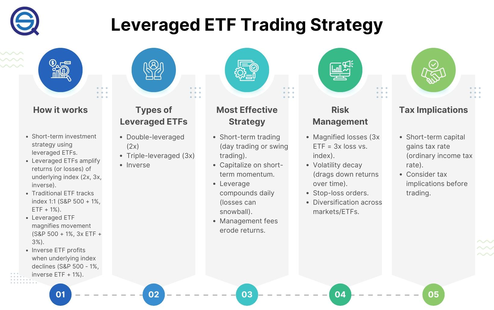

## Table of Contents

## What is a leveraged ETF?

A leveraged ETF, or Exchange-Traded Fund, is a type of investment that aims to give you bigger returns than normal ETFs. It does this by using borrowed money or financial tricks to increase the amount it can invest. For example, if a normal ETF goes up by 1%, a leveraged ETF might go up by 2% or 3%. But, this also means it can lose more money if the market goes down.

Because leveraged ETFs use borrowed money, they are riskier than regular ETFs. They are meant for short-term trading, not for keeping for a long time. If you hold onto a leveraged ETF for too long, the daily ups and downs can make your investment worth less over time. So, it's important to understand these risks before you decide to invest in a leveraged ETF.

## How do leveraged ETFs work?

Leveraged ETFs work by using borrowed money or financial strategies to try to make bigger returns than normal ETFs. They aim to give you two or three times the daily performance of an index or asset. For example, if the index goes up by 1%, a 2x leveraged ETF tries to go up by 2%, and a 3x leveraged ETF tries to go up by 3%. They do this by using things like futures contracts, options, and swaps to increase their exposure to the market.

But, because they use borrowed money, leveraged ETFs are riskier. If the market goes down, these ETFs can lose more money than normal ETFs. They are designed for short-term trading, not for holding onto for a long time. If you keep a leveraged [ETF](/wiki/etf-trading-strategies) for a long time, the daily ups and downs can make your investment worth less over time. So, it's important to know these risks and to watch your investment closely if you decide to use leveraged ETFs.

## What are the benefits of trading leveraged ETFs?

Trading leveraged ETFs can give you the chance to make more money in a short time. If you think a market or an index will go up or down a lot, a leveraged ETF can help you make bigger gains than a regular ETF. For example, if you believe a stock index will go up by 1%, a 2x leveraged ETF could help you make a 2% gain. This can be very attractive if you are good at predicting short-term market moves.

However, it's important to know that leveraged ETFs can also help you make money if you think the market will go down. Some leveraged ETFs are designed to give you the opposite performance of an index, which means they can go up when the market goes down. This can be a good way to protect your money or even make money during times when the market is not doing well. But, because these ETFs use borrowed money, they are riskier and not meant for long-term investing.

## What are the risks associated with leveraged ETFs?

Leveraged ETFs can be risky because they use borrowed money to try to make bigger returns. If the market goes down, these ETFs can lose more money than regular ETFs. For example, if the market drops by 1%, a 2x leveraged ETF could lose 2%. This means you could lose a lot of money quickly if the market moves against you. Because of this, leveraged ETFs are not good for people who don't like taking big risks with their money.

Another risk is that leveraged ETFs are meant for short-term trading, not for holding onto for a long time. If you keep a leveraged ETF for a long time, the daily ups and downs of the market can make your investment worth less over time. This is called [volatility](/wiki/volatility-trading-strategies) decay. It means that even if the market goes up over time, the daily changes can still make your leveraged ETF lose value. So, it's important to watch your investment closely and know when to buy and sell if you decide to trade leveraged ETFs.

## How can a beginner start trading leveraged ETFs?

If you're a beginner and want to start trading leveraged ETFs, the first thing you need to do is learn about them. Leveraged ETFs use borrowed money to try to make bigger returns than normal ETFs. They can be good for short-term trading, but they are also riskier. You should read about how they work, the risks they come with, and how they can affect your money. It's a good idea to start with some research and maybe even talk to a financial advisor to make sure you understand what you're getting into.

Once you feel ready, you can start trading leveraged ETFs. You'll need to open a brokerage account if you don't already have one. Many online brokers let you trade ETFs, including leveraged ones. After you open your account, you can search for the leveraged ETFs you want to trade. Remember, these ETFs are meant for short-term trading, so you should keep an eye on the market and be ready to buy and sell quickly. It's important to start small and only use money you can afford to lose, because leveraged ETFs can be risky.

## What is the difference between 2x and 3x leveraged ETFs?

The main difference between 2x and 3x leveraged ETFs is how much they try to make compared to the market. A 2x leveraged ETF aims to give you twice the daily performance of an index or asset. For example, if the index goes up by 1%, a 2x ETF tries to go up by 2%. On the other hand, a 3x leveraged ETF aims to give you three times the daily performance. So, if the index goes up by 1%, a 3x ETF tries to go up by 3%.

Because 3x leveraged ETFs try to make more money, they are also riskier than 2x ETFs. If the market goes down, a 3x ETF can lose more money than a 2x ETF. For example, if the index drops by 1%, a 2x ETF could lose 2%, but a 3x ETF could lose 3%. This means that 3x ETFs can be more rewarding but also more dangerous. Both types of ETFs are meant for short-term trading, but you need to be extra careful with 3x ETFs because they can make your money go up or down very quickly.

## How do daily rebalancing and compounding affect leveraged ETF returns?

Daily rebalancing and compounding can have a big impact on the returns of leveraged ETFs. These ETFs aim to give you a certain multiple of the daily performance of an index or asset. To do this, they need to rebalance their holdings every day. This means they adjust their investments to make sure they stay on track to give you the right multiple of the market's daily move. But, this daily rebalancing can lead to something called volatility decay, which can hurt your returns over time, especially if the market goes up and down a lot.

Compounding also plays a role in how leveraged ETFs perform. Because these ETFs are designed to match the daily performance of the market, the effects of their gains and losses compound daily. This means that if the market goes up and down a lot, the compounding effect can make the value of your leveraged ETF go down over time, even if the market ends up higher than where it started. This is why leveraged ETFs are better for short-term trading and not for holding onto for a long time.

## What are some common strategies for trading leveraged ETFs?

One common strategy for trading leveraged ETFs is called [day trading](/wiki/day-trading-spy). This means you buy and sell the ETFs within the same day to take advantage of small changes in the market. Because leveraged ETFs can make bigger gains or losses than regular ETFs, day traders use them to try to make more money from short-term market moves. It's important to watch the market closely and be ready to act quickly, because leveraged ETFs can be risky if the market goes against you.

Another strategy is called swing trading. This involves holding onto the ETFs for a few days or weeks to take advantage of bigger market moves. Swing traders try to predict when the market will go up or down and use leveraged ETFs to make more money from these moves. But, because leveraged ETFs are affected by daily rebalancing and compounding, it's important not to hold them for too long. You need to keep an eye on your investment and be ready to sell if the market starts to go the wrong way.

A third strategy is using leveraged ETFs to hedge other investments. This means you use them to protect your money if you think the market will go down. Some leveraged ETFs are designed to go up when the market goes down, so you can use these to balance out losses in other parts of your portfolio. This can be a good way to manage risk, but it's still important to understand the risks of leveraged ETFs and to use them carefully.

## How can leverage ETFs be used for hedging?

Leveraged ETFs can be used for hedging to protect your money when you think the market might go down. Some leveraged ETFs are made to go up when the market goes down. This means if you have other investments that could lose money if the market falls, you can buy these inverse leveraged ETFs to balance out those losses. For example, if you own stocks and you think the stock market will drop, you can buy an inverse leveraged ETF that tracks the stock market. If the market does go down, the ETF will go up, which can help cover the losses from your stocks.

However, using leveraged ETFs for hedging can be tricky because they are risky. They use borrowed money to try to make bigger gains or losses, so if the market moves differently than you expect, you could lose more money than you planned. It's important to watch the market closely and be ready to sell your leveraged ETFs if things start to go the wrong way. Also, because these ETFs are meant for short-term trading, you should not hold onto them for too long. Hedging with leveraged ETFs can be a good way to manage risk, but you need to understand the risks and use them carefully.

## What are the tax implications of trading leveraged ETFs?

Trading leveraged ETFs can have special tax rules that you need to know about. When you buy and sell these ETFs, you might have to pay taxes on any money you make. If you hold onto a leveraged ETF for less than a year before you sell it, any profit you make is called a short-term capital gain. The government taxes these gains at the same rate as your regular income, which can be higher than the tax rate for long-term gains. But, because leveraged ETFs are meant for short-term trading, most people don't hold them for a year or more.

Another thing to think about is that leveraged ETFs can create something called wash sales. A wash sale happens if you sell a losing investment and then buy the same or a similar investment within 30 days. If this happens, you can't use the loss to lower your taxes right away. Instead, you have to add the loss to the cost of the new investment. This can make your taxes more complicated. So, if you trade leveraged ETFs a lot, you should keep track of your trades and maybe talk to a tax advisor to make sure you're doing everything right.

## How do market conditions influence the performance of leveraged ETFs?

Market conditions can really change how well leveraged ETFs do. These ETFs try to give you a bigger version of the market's daily moves, so if the market goes up a lot, a leveraged ETF can make you more money. But if the market goes down a lot, you can lose more money too. For example, if the market is going up and down a lot every day, a leveraged ETF can lose value over time because of something called volatility decay. This means that even if the market ends up higher than where it started, the daily ups and downs can still make your ETF worth less.

Also, if the market stays the same or moves slowly, leveraged ETFs might not do as well as you hope. They are made to make big gains from big market moves, so if the market is not moving much, you might not see the big returns you were expecting. And because these ETFs use borrowed money, any small change in the market can make a big difference in what you make or lose. So, it's really important to watch the market and understand how it's doing before you decide to trade leveraged ETFs.

## What advanced techniques can be used to optimize a leveraged ETF trading strategy?

One advanced technique to optimize a leveraged ETF trading strategy is using technical analysis. This means looking at charts and using tools like moving averages, the Relative Strength Index (RSI), and Bollinger Bands to find the best times to buy and sell. By studying these patterns, you can try to predict when the market will go up or down and use leveraged ETFs to make bigger gains from these moves. It's important to keep learning and testing different technical indicators to see what works best for you.

Another technique is using a stop-loss order. This is a way to limit how much money you can lose on a trade. When you set a stop-loss order, you tell your broker to sell your ETF if it drops to a certain price. This can help you avoid big losses if the market moves against you. But, because leveraged ETFs can go down quickly, you need to set your stop-loss carefully. It's a good idea to think about how much risk you're okay with and set your stop-loss at a level that makes sense for you.

Lastly, you can use a strategy called pairs trading. This means you buy one leveraged ETF and sell another one that is related to it but moves in the opposite way. For example, you might buy a leveraged ETF that goes up when the market goes up and sell one that goes up when the market goes down. By doing this, you can try to make money no matter which way the market moves. But, this strategy can be hard to do right, so it's important to keep learning and practice a lot to get better at it.

## What are the key aspects of risk management in leveraged ETF trading?

Leveraged Exchange-Traded Funds (ETFs) come with amplified risks that stem primarily from their structure, which uses financial derivatives and debt to magnify the returns of an underlying index. This magnification works both ways, meaning that while gains can be significant, losses are also proportionately larger. A crucial aspect of managing leveraged ETF trading involves understanding and mitigating these amplified risks, often caused by market volatility.

Firstly, it's important to note the inherent risks of leveraged ETFs due to their daily reset feature. Leveraged ETFs seek to achieve their stated multiple of the index's daily performance. As a result, these instruments can suffer from volatility decay, where the ETF's performance can diverge from the target multiple over time, especially during periods of high volatility (Avellaneda and Zhang, 2010).

### Strategies for Investment Protection

To safeguard investments in leveraged ETFs, one can employ several strategies, including stop-loss orders and portfolio diversification. 

**Stop-Loss Orders:** A stop-loss order is an automatic trading mechanism that triggers a sale of an ETF when its price falls to a predetermined level. This strategy helps limit potential losses in declining markets. For example, if an investor sets a stop-loss order at a 10% drop from the purchase price, the ETF will automatically be sold once this threshold is reached, preventing further losses.

**Portfolio Diversification:** Diversification involves spreading investments across various asset classes to reduce exposure to any single investment's volatility. By including uncorrelated assets or non-leveraged instruments, investors can diminish the overall risk of their portfolio. Diversification does not eliminate risk entirely but helps manage it effectively by reducing the impact of a volatile leveraged ETF's poor performance on the total portfolio.

### Impact of Market Conditions

The performance of leveraged ETFs is heavily influenced by prevailing market conditions. During stable and trending markets, these ETFs can potentially offer high returns due to their amplified exposure. However, during volatile or sideways markets, the daily reset function can lead to significant value erosion. 

For instance, if the underlying index experiences a series of alternating gains and losses, a leveraged ETF may incur a net loss even if the index ends up at the same level it started. Understanding beta slippage—where the compounding effect of daily returns leads to a difference between expected and actual ETF performance—is crucial for leveraged ETF investors. Formulaically, this can be expressed as:

$$
R_{\text{portfolio}} = (1+\text{daily return}_1) \times (1+\text{daily return}_2) \times \ldots \times (1+\text{daily return}_n) - 1
$$

This formula highlights the compounding effect leveraged ETFs face over time. When combined with volatility, leveraged ETFs can underperform the expected results based on the underlying index's trajectory.

To summarize, while leveraged ETFs can offer substantial returns, they come with significant risks, primarily due to market volatility and the structural idiosyncrasies of these financial instruments. Effective risk management strategies such as stop-loss orders and diversification, combined with a deep understanding of market conditions, are essential for investors seeking to incorporate leveraged ETFs into their trading strategies responsibly.

## References & Further Reading

[1]: Avellaneda, M., & Zhang, S. (2010). ["Path-Dependence of Leveraged ETF Returns."](https://math.nyu.edu/~avellane/SIAMLETFS.pdf.pdf) SIAM Journal on Financial Mathematics.

[2]: ["Algorithmic Trading: Winning Strategies and Their Rationale"](https://www.wiley.com/en-us/Algorithmic+Trading%3A+Winning+Strategies+and+Their+Rationale-p-9781118460146) by Ernest P. Chan

[3]: ["Backtesting Strategies: How to Conduct Correct Backtests and Avoid Backtest Overfitting"](https://gocharting.com/blog/backtesting-trading/) by Michael Harris

[4]: Giese, G. (2020). ["Leveraged ETPs: Mechanics and Impact on the Market."](https://papers.ssrn.com/sol3/papers.cfm?abstract_id=1510344) Credit Suisse Research Institute.

[5]: ["Handbook of Exchange-Traded Funds"](https://www.morningstar.com/funds/what-is-an-etf-morningstars-etf-guide) by David J. Abner