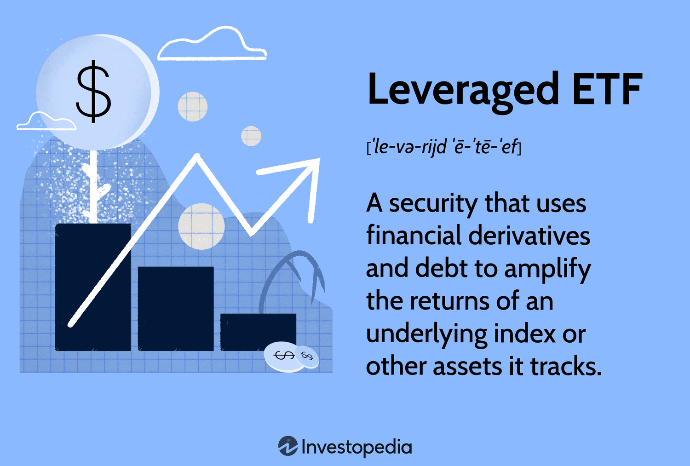

## Table of Contents

## What are leveraged ETFs?

Leveraged ETFs are a type of exchange-traded fund that aims to give you bigger returns by using borrowed money or financial tricks. They try to make your investment grow faster than normal ETFs by aiming for two or three times the daily performance of an index, like the S&P 500. So, if the index goes up by 1%, a 2x leveraged ETF would try to go up by 2%.

But, these ETFs can be risky. Because they use borrowed money, if the market goes down, your losses can be bigger too. Also, they are designed to meet their goals daily, so over longer periods, their performance might not match the index as well as you might expect. It's important to understand these risks before you decide to invest in leveraged ETFs.

## How do leveraged ETFs work?

Leveraged ETFs work by using borrowed money or financial tricks to try to give you bigger returns. They aim to make your investment grow faster than normal ETFs by trying to match two or three times the daily performance of an index, like the S&P 500. So, if the index goes up by 1%, a 2x leveraged ETF would try to go up by 2%. They do this by using things like futures contracts, options, and swaps to increase their exposure to the market.

But, these ETFs can be risky. Because they use borrowed money, if the market goes down, your losses can be bigger too. Also, they are designed to meet their goals daily, which means over longer periods, their performance might not match the index as well as you might expect. This is because the daily resetting of the leverage can lead to something called "[volatility](/wiki/volatility-trading-strategies) decay," where the [ETF](/wiki/etf-trading-strategies)'s value can drop more than the index it's tracking, especially in choppy markets. It's important to understand these risks before you decide to invest in leveraged ETFs.

## What is the difference between 2x and 3x leveraged ETFs?

The main difference between 2x and 3x leveraged ETFs is how much they try to multiply the daily performance of an index. A 2x leveraged ETF aims to give you twice the daily return of the index it follows. So, if the index goes up by 1%, the ETF tries to go up by 2%. On the other hand, a 3x leveraged ETF aims to give you three times the daily return. If the index goes up by 1%, the 3x ETF tries to go up by 3%.

Both types of ETFs use borrowed money or financial tricks to achieve these higher returns. However, this also means they can be riskier. If the market goes down, a 2x ETF could lose twice as much, and a 3x ETF could lose three times as much. Because they reset their leverage daily, over time, the effects of these daily adjustments can lead to bigger losses in a volatile market, and this effect is even stronger with 3x ETFs compared to 2x ETFs.

## What are the potential benefits of investing in leveraged ETFs?

Investing in leveraged ETFs can offer the chance to make more money quickly. If you think the market or a specific index is going to go up, a leveraged ETF can help you earn more than a regular ETF. For example, if the S&P 500 goes up by 1% in a day, a 2x leveraged ETF tracking it would aim to go up by 2%. This can be really helpful if you want to take advantage of short-term market moves and have a higher chance of big gains.

Another benefit is that leveraged ETFs can be a good way to diversify your investments. They let you bet on different parts of the market or different countries without having to buy a lot of different stocks or funds. This can help spread out your risk and potentially increase your overall returns. However, it's important to remember that while they can increase your potential gains, they can also increase your potential losses, so you need to be careful and understand the risks.

## What are the risks associated with leveraged ETFs?

Leveraged ETFs can be risky because they use borrowed money or financial tricks to try to give you bigger returns. If the market goes down, your losses can be bigger too. For example, if you have a 2x leveraged ETF and the market drops by 1%, your ETF could drop by 2%. This means you could lose money faster than with a regular ETF. Also, if the market is going up and down a lot, the daily resetting of the leverage can make your losses even bigger over time. This is called "volatility decay," and it can hurt your investment a lot, especially if you hold the ETF for a long time.

Another risk is that leveraged ETFs are designed to meet their goals daily. This means they might not match the performance of the index they follow over longer periods. If you plan to hold onto the ETF for weeks or months, the returns might not be what you expect. This can be confusing and disappointing if you're not ready for it. So, it's really important to understand these risks and think about how long you plan to keep the ETF before you decide to invest in one.

## How does daily rebalancing affect leveraged ETFs?

Daily rebalancing is when a leveraged ETF adjusts its investments every day to keep its leverage at the right level. This means if you have a 2x leveraged ETF, it will try to make sure it's always aiming for twice the daily return of the index it follows. But this daily adjustment can cause problems, especially if the market goes up and down a lot. When the market is volatile, the ETF might not perform as well as you expect over time because it's always trying to reset to the same level of leverage.

This daily resetting can lead to something called "volatility decay." It means that even if the market stays the same over a few days, the ETF can lose value. For example, if the market goes up one day and down the next, the ETF might lose more than it gains because it's always trying to get back to the same level of leverage. This can be a big problem if you plan to hold the ETF for a long time, because the losses can add up. So, it's important to understand how daily rebalancing works and think about how long you want to keep the ETF before you invest.

## Can you explain the concept of decay in leveraged ETFs?

Decay in leveraged ETFs is when the value of the ETF goes down over time, even if the market stays the same. This happens because these ETFs use borrowed money or financial tricks to try to give you bigger returns. They aim to match two or three times the daily performance of an index, like the S&P 500. But they have to adjust their investments every day to keep this level of leverage, and this daily resetting can cause problems.

When the market goes up and down a lot, this daily resetting can lead to something called "volatility decay." It means that even if the market goes up one day and down the next, the ETF might lose more than it gains. This is because it's always trying to get back to the same level of leverage. Over time, these small losses can add up and make the ETF worth less than you might expect. So, if you plan to hold onto a leveraged ETF for a long time, you need to be careful because decay can hurt your investment.

## What are some common strategies for trading leveraged ETFs?

One common strategy for trading leveraged ETFs is to use them for short-term trades. Since these ETFs are designed to meet their goals daily, they can be good for taking advantage of quick market moves. If you think the market or a specific index will go up in the next few days, you might buy a 2x or 3x leveraged ETF to try to make more money. But you need to be ready to sell the ETF quickly if the market doesn't go the way you expect, because the risks can be high.

Another strategy is to use leveraged ETFs to hedge your other investments. If you have a lot of money in stocks and you're worried the market might go down, you could buy a leveraged ETF that goes up when the market goes down. This can help protect your money if the market drops. But you need to be careful because if the market goes up instead, the leveraged ETF could lose a lot of value and hurt your overall investment.

A third strategy is to use leveraged ETFs for sector or country bets. If you think a certain part of the market, like technology or healthcare, will do well, you can buy a leveraged ETF that focuses on that sector. Or if you think a country's market will do better than others, you can buy a leveraged ETF that follows that country's index. This can help you make more money if your guess is right, but it's also riskier because if you're wrong, you could lose more money than with a regular ETF.

## How do leveraged ETFs perform over long periods compared to their underlying index?

Leveraged ETFs can perform very differently from their underlying index over long periods. This is because they are designed to meet their goals every day, not over weeks or months. If you hold a leveraged ETF for a long time, you might not get the returns you expect. This is because of something called "volatility decay." It happens when the market goes up and down a lot, and the ETF has to reset its leverage every day. Over time, these daily adjustments can make the ETF lose more value than the index it's trying to follow.

For example, if the market goes up one day and down the next, a leveraged ETF might lose more than it gains. This can add up over time and make the ETF worth less than the index. So, if you plan to keep a leveraged ETF for a long time, you need to be careful. It's not like a regular ETF, where the value usually follows the index more closely over time. With leveraged ETFs, the longer you hold them, the more they can be affected by volatility decay, and the bigger the difference can be between the ETF's performance and the index's performance.

## What impact does market volatility have on leveraged ETFs?

Market volatility can really affect leveraged ETFs. These ETFs use borrowed money or financial tricks to try to give you bigger returns. They aim to match two or three times the daily performance of an index, like the S&P 500. But when the market goes up and down a lot, it can make the ETF lose value over time. This is because the ETF has to adjust its investments every day to keep the same level of leverage. If the market is going up one day and down the next, the ETF might lose more than it gains because it's always trying to reset to the same level of leverage.

This daily resetting can lead to something called "volatility decay." It means that even if the market stays the same over a few days, the ETF can lose value. For example, if the market goes up one day and down the next, the ETF might lose more than it gains. Over time, these small losses can add up and make the ETF worth less than you might expect. So, if you plan to hold onto a leveraged ETF for a long time, you need to be careful because market volatility can hurt your investment.

## How should one consider the tax implications of trading leveraged ETFs?

When you trade leveraged ETFs, you need to think about taxes. These ETFs can create a lot of short-term capital gains because they are designed for short-term trading. Short-term gains are taxed at a higher rate than long-term gains. If you buy and sell a leveraged ETF within a year, any profit you make is a short-term gain and will be taxed as regular income. This can be a lot higher than the tax rate for long-term gains, which you get if you hold an investment for more than a year.

Also, leveraged ETFs often have to do a lot of trading to keep their leverage right. This can lead to something called capital gains distributions. Even if you don't sell your ETF, the fund might have to pay out these gains to you, and you'll have to pay taxes on them. So, it's important to know about these tax rules before you start trading leveraged ETFs. It can affect how much money you keep at the end of the day.

## What are some advanced techniques for managing risk with leveraged ETFs?

One advanced way to manage risk with leveraged ETFs is to use stop-loss orders. This means you set a price at which you will automatically sell the ETF if it drops to that level. This can help you limit your losses if the market goes down a lot. Another technique is to use a strategy called "hedging." You can buy a leveraged ETF that goes up when the market goes down. This can help protect your other investments if the market drops. But you need to be careful because if the market goes up instead, the hedging ETF could lose a lot of value and hurt your overall investment.

Another way to manage risk is to use a strategy called "position sizing." This means you only invest a small part of your money in leveraged ETFs. By not putting all your money into these risky investments, you can limit how much you could lose. You can also use "diversification" to spread your risk. Instead of putting all your money into one leveraged ETF, you can invest in different leveraged ETFs that follow different parts of the market or different countries. This can help you make more money if some of your guesses are right, but it can also help protect you if some of them are wrong.

## Are Leveraged ETFs Effective as Short-Term Trading Instruments?

Leveraged exchange-traded funds (ETFs) are typically favored by day traders due to their capacity to amplify returns over a short time horizon. The primary appeal of these financial instruments lies in their ability to provide magnified exposure to the daily returns of an underlying index, achieved through the strategic use of derivatives and debt. This characteristic makes them particularly attractive for speculation on indices or targeted assets.

One critical aspect of leveraged ETFs is their structural design, which includes a daily reset mechanism. This reset ensures that the leverage [factor](/wiki/factor-investing), such as 2x or 3x, is applied to the fund's performance daily. The equation for a leveraged ETF's return $R_t$ on day $t$ can be expressed as:

$$
R_t = L \times R_{\text{index},t}
$$

where $L$ is the leverage factor and $R_{\text{index},t}$ represents the daily return of the underlying index. While this design enables leveraged ETFs to achieve their magnified returns for each trading session, it also results in a phenomenon known as volatility decay. Volatility decay occurs because the compounding of daily returns can lead to significant divergence from the underlying index's cumulative performance over time, especially in volatile markets.

Due to this daily resetting structure and the potential for volatility decay, leveraged ETFs are deemed unsuitable for long-term investment strategies. Long-term holding may result in performance that significantly deviates from the intended leverage factor, potentially leading to substantial losses.

To maximize returns within the constraints of daily trading, traders frequently employ [algorithmic trading](/wiki/algorithmic-trading) tools. These tools leverage advanced data analytics and automated trading strategies to exploit market inefficiencies effectively. By doing so, traders can both capitalize on short-term market movements and implement timely trades with precision.

Algorithmic trading systems can harness vast amounts of market data in real-time, allowing traders to execute operations faster and often more efficiently than manual trading. These systems are particularly adept at handling the rapid decision-making and execution required when dealing with leveraged ETFs, where price movements can be swift and substantial.

In conclusion, leveraged ETFs serve as powerful short-term trading instruments, ideally suited to active day traders who can navigate their complexities. The integration of algorithmic trading tools further enhances the ability of traders to capture opportunities presented by these volatile but potentially rewarding financial products.

## References & Further Reading

[1]: Bergstra, J., Bardenet, R., Bengio, Y., & Kégl, B. (2011). ["Algorithms for Hyper-Parameter Optimization."](https://papers.nips.cc/paper/4443-algorithms-for-hyper-parameter-optimization) Advances in Neural Information Processing Systems 24.

[2]: ["Advances in Financial Machine Learning"](https://www.amazon.com/Advances-Financial-Machine-Learning-Marcos/dp/1119482089) by Marcos Lopez de Prado

[3]: ["Evidence-Based Technical Analysis: Applying the Scientific Method and Statistical Inference to Trading Signals"](https://www.amazon.com/Evidence-Based-Technical-Analysis-Scientific-Statistical/dp/0470008741) by David Aronson

[4]: ["Machine Learning for Algorithmic Trading"](https://github.com/PacktPublishing/Machine-Learning-for-Algorithmic-Trading-Second-Edition) by Stefan Jansen

[5]: ["Quantitative Trading: How to Build Your Own Algorithmic Trading Business"](https://books.google.com/books/about/Quantitative_Trading.html?id=j70yEAAAQBAJ) by Ernest P. Chan