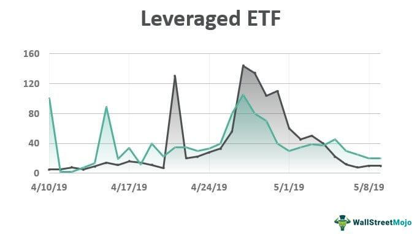

The banking sector plays a crucial role in the global economy by managing deposits, extending credit, and investing in various financial assets. Its operations facilitate economic growth and stability by providing the necessary funds for businesses and individuals' financial activities. In recent years, financial instruments like leveraged exchange-traded funds (ETFs) have gained popularity as they offer investors an opportunity to amplify their exposure to certain market sectors, including banking. 

Leveraged ETFs are structured to achieve a multiple of the daily returns of their benchmark indices, utilizing financial derivatives and debt to enhance potential returns. The attraction of these funds lies in their ability to offer heightened profit potential, appealing to investors seeking substantial returns from sectoral movements. However, the increased return potential comes hand-in-hand with elevated risk, as the leverage can magnify both gains and losses experienced by these financial instruments.



The relationship between the banking sector, leveraged ETFs, and algorithmic trading strategies is becoming increasingly significant as technology permeates financial markets. Algorithmic trading uses sophisticated software to facilitate the automation of investment decisions and trade executions. These algorithms can be particularly beneficial in managing leveraged ETFs by optimizing entry and exit points, adjusting risk exposure, and executing trades with precision amidst volatile market conditions. 

This article will further explore the intricate dynamics between these entities, providing insights into how investors can navigate the complex landscape of the banking sector and its associated investment opportunities. As the financial markets continue to evolve, the integration of technology is likely to expand, offering new possibilities for investors in the banking sector. An understanding of these elements will enable informed decision-making, balancing potential rewards with inherent risks.

## Table of Contents

## Understanding Leveraged ETFs

Leveraged Exchange-Traded Funds (ETFs) are sophisticated investment vehicles intended to magnify the returns of an underlying index. This amplification is achieved by using a combination of financial derivatives, such as futures and options, along with borrowing capital, commonly referred to as leverage. The design of these funds is to achieve a multiple of the daily performance of the target index, commonly 2x or 3x. For example, if an underlying index increases by 1% on a given day, a 2x leveraged ETF based on that index aims to deliver a 2% return (ignoring fees and expenses).

The mechanism by which leveraged ETFs operate involves maintaining a constant leverage ratio, which requires daily portfolio rebalancing. This process ensures that the leverage factor remains consistent as the market moves. For example, if the goal is to maintain a 2:1 leverage, the fund will adjust its holdings each day to ensure that for every dollar of net assets, two dollars are effectively invested in the market index.

Consider the formula for daily return $R_{\text{[ETF](/wiki/etf-trading-strategies)}} = L \times R_{\text{Index}}$, where $R_{\text{ETF}}$ is the return on the leveraged ETF, $L$ is the leverage [factor](/wiki/factor-investing) (e.g., 2 for a 2x ETF), and $R_{\text{Index}}$ is the return of the underlying index. This simple proportional equation highlights the direct relationship between the index performance and the ETF return, scaled by the leverage factor.

However, the promise of higher returns comes with proportionally higher risks. The leverage that enhances profits when the market moves favorably also amplifies losses when the market direction is unfavorable. For example, a 2% decline in the index would result in a 4% loss for a 2x leveraged ETF, all other factors being equal. This characteristic necessitates careful consideration and monitoring by investors.

One of the critical considerations when investing in leveraged ETFs is the impact of [volatility](/wiki/volatility-trading-strategies) on returns over multiple days. Due to the compounding of returns, the performance of leveraged ETFs can diverge significantly from the expected multiple of the index performance over longer periods, known as "volatility decay" or "beta drift." This effect is particularly pronounced in highly volatile markets, where frequent rebalancing can erode the value of the ETF more rapidly than anticipated. Hence, leveraged ETFs are generally recommended for short-term strategies rather than long-term investment holding.

In conclusion, while leveraged ETFs provide a powerful tool for investors seeking to amplify their exposure to specific indices, they require a clear understanding of their workings and inherent risks. Their daily reset mechanism, reliance on derivatives, and volatility impact necessitate active management and are often best suited for experienced investors.

## Leveraged ETFs in the Banking Sector

Leveraged Exchange-Traded Funds (ETFs) that focus on the banking sector have gained traction among investors seeking amplified exposure to financial markets. Among these, the ProShares Ultra Financials (UYG) and Direxion Daily Financial Bull and Bear 3X Shares (FAS and FAZ) are noteworthy. These financial products utilize leverage to magnify the performance of their respective underlying indices, thereby catering to investors with a higher risk tolerance. 

UYG is designed to achieve double the daily performance of the Dow Jones U.S. Financials Index. This leverage is accomplished through financial derivatives and debt, positioning UYG as a suitable vehicle for traders looking to capitalize on bullish sentiment in the banking sector. The holdings of UYG typically include major financial entities, contributing to its correlation with sector-specific shifts.

On the other hand, FAS seeks to replicate three times the daily performance of a similar financial index, making it one of the most aggressive leveraged ETFs available. Conversely, the companion FAZ provides the inverse, allowing investors to profit from negative movements by inversely tripling the performance of the same index. This duality enables traders to employ diverse strategies depending on market conditions.

Both UYG and FAS typically hold positions in significant financial institutions such as Berkshire Hathaway and JPMorgan Chase, which are influential players in the banking landscape. Their performance can serve as indicators of the broader financial sector's health and trends. It is essential to recognize that while leveraged ETFs can offer substantial gains, they also [carry](/wiki/carry-trading) a heightened risk of significant losses, necessitating rigorous market monitoring and management strategies.

To facilitate an understanding of daily performance leveraging in ETFs, consider a simplified example: If the Dow Jones U.S. Financials Index rises by 1% on a given day, UYG aims to increase by approximately 2%, whereas FAS would target an increment of 3%. Conversely, if the index falls, UYG and FAS could experience magnified losses proportional to their leverage ratios. This inherent volatility characteristic requires investors to have a thorough grasp of risk management techniques when engaging with leveraged financial products.

## Algorithmic Trading in Leveraged ETFs

Algorithmic trading, often referred to as algo trading, leverages computational power to execute trades based on predetermined criteria, thus automating the decision-making process within financial markets. This approach is particularly valuable in the context of leveraged ETFs, which are known for their heightened volatility and the complexity associated with their usage of financial derivatives and debt.

The primary advantage of using algorithms with leveraged ETFs is the enhancement of precision and timing in trade execution. Automated systems can continuously analyze market data in real time, identifying optimal entry and [exit](/wiki/exit-strategy) points while minimizing human emotional bias. This is critical in markets where prices can fluctuate rapidly, and where split-second decisions may significantly impact profitability.

To manage the risks associated with the high volatility of leveraged ETFs, sophisticated algorithms incorporate risk management techniques such as stop-loss orders and hedging strategies. Additionally, algorithms can be programmed to dynamically adjust exposure levels, scaling back investments when volatility exceeds predefined thresholds, or increasing positions when market conditions are favorable.

A fundamental component of [algorithmic trading](/wiki/algorithmic-trading) with leveraged ETFs is [backtesting](/wiki/backtesting), which involves applying trading strategies to historical data to gauge their efficacy before actual deployment. This is implemented using programming languages such as Python, which offers libraries like Pandas for data manipulation and [backtrader](/wiki/backtrader) for strategy testing.

```python
import pandas as pd
import backtrader as bt

class Strategy(bt.Strategy):
    def __init__(self):
        self.sma = bt.indicators.SimpleMovingAverage(self.data.close, period=15)

    def next(self):
        if self.sma > self.data.close:
            self.buy(size=100)
        elif self.sma < self.data.close:
            self.sell(size=100)

data = bt.feeds.YahooFinanceData(dataname='UYG', fromdate=pd.Timestamp('2020-01-01'), todate=pd.Timestamp('2021-01-01'))
cerebro = bt.Cerebro()
cerebro.addstrategy(Strategy)
cerebro.adddata(data)
cerebro.run()
```

Incorporating [machine learning](/wiki/machine-learning) techniques into algorithmic models can further enhance prediction accuracy and adaptability to market changes. Machine learning models can analyze complex patterns and interactions within data that traditional models might overlook, providing a competitive edge in executing leveraged ETF strategies.

Through the integration of algorithmic trading, investors can efficiently navigate the complexities and rapid fluctuations characteristic of leveraged ETFs, optimizing their investment outcomes while inherently managing associated risks. As computational technology continues to evolve, the sophistication and efficacy of algorithms in handling such financial instruments will likely progress, offering refined tools for investors.

## Risks and Considerations

Leveraged ETFs, by design, aim to provide amplified returns through the use of financial derivatives and borrowings. However, these financial instruments present significant risks that require prudent management. One of the primary concerns is the phenomenon known as volatility drag. Volatility drag occurs because leveraged ETFs seek to replicate a multiple of an index's daily performance. This implies that large fluctuations in the underlying index can lead to disproportionate variations in the ETF's returns, especially over longer holding periods. Consequently, the geometric average return over time often falls short of the arithmetic average. For example, if an index fluctuates up and down but ends where it started, a leveraged ETF does not necessarily do the same due to this drag effect.

Given these characteristics, leveraged ETFs are primarily tailored for short-term holding periods where rapid movements in the underlying index can be tracked more accurately. Their complexity, primarily due to the use of derivatives and shorting strategies, makes them more suitable for experienced investors. These investors can actively manage and monitor their portfolios, adjusting their positions as market conditions change.

Retail investors, on the other hand, often lack the sophisticated tools and experience necessary to track such volatile investments accurately. As a result, there is a substantial risk of loss if these instruments are held without careful consideration of market conditions and the investor's own risk tolerance. Before investing in leveraged ETFs, retail investors should assess their financial goals and approach these instruments with caution. This often involves understanding the nuances of portfolio management and volatility dynamics.

In conclusion, while leveraged ETFs offer enhanced profit potential, they demand meticulous risk management and are best suited for investors who can dedicate time and resources to monitoring their investments closely. Novice investors should consider the fundamental risks associated with these financial products and may benefit from consulting financial advisors before engaging with leveraged ETFs.

## The Future of Banking Sector Investments

As financial markets evolve, the role of leveraged Exchange-Traded Funds (ETFs) and algorithmic trading in the banking sector is poised to expand significantly. Leveraged ETFs, which aim to multiply the daily returns of financial indices, offer investors amplified exposure to sectoral movements. This makes them attractive tools for those seeking heightened returns in the banking sector. Simultaneously, algorithmic trading technologies continue to progress, offering enhanced capabilities to navigate the complexities and inherent risks associated with leveraged ETFs.

Advancements in financial technology are a major driver behind this expansion. As these technologies become more sophisticated, investors are presented with innovative strategies for maximizing exposure and managing risks. For instance, quantitative models and machine learning algorithms are increasingly being employed to exploit market inefficiencies and optimize trading strategies. This automation and precision in trading can be crucial in managing the high volatility and risk profiles typical of leveraged ETFs.

A key element in navigating the future of banking sector investments involves understanding the intricate dynamics of leveraged ETFs and algorithmic trading. The complex nature of these financial instruments requires a deep grasp of their mechanics and potential impacts. Leveraged ETFs are highly susceptible to volatility drag—a phenomenon where the return of leveraged ETFs generally underperforms in highly volatile markets due to the daily reset nature of the products. Therefore, employing strategies that can efficiently manage and predict market volatility is of paramount importance.

Python, a preferred programming language in financial modeling and algorithmic trading, can be used to model and backtest trading strategies for leveraging financial instruments such as ETFs. Here is a basic example of a Python function to calculate potential returns of a leveraged ETF given a certain multiplier and daily index returns:

```python
import numpy as np

def leveraged_etf_returns(daily_returns, leverage):
    """
    Calculate the cumulative returns of a leveraged ETF.

    :param daily_returns: A list or array of daily return percentages (e.g., [0.01, -0.02...])
    :param leverage: The leverage factor (e.g., 2 for 2x leveraged ETF)
    :return: Cumulative return of the leveraged ETF
    """
    # Compute the daily leveraged returns
    leveraged_daily_returns = leverage * np.array(daily_returns)

    # Calculate cumulative returns
    cumulative_return = np.prod(1 + leveraged_daily_returns) - 1

    return cumulative_return

# Example usage
daily_index_returns = [0.01, -0.02, 0.015, -0.005]  # Example daily index returns
leverage_factor = 2  # 2x leverage
print(leveraged_etf_returns(daily_index_returns, leverage_factor))
```

This simple script illustrates how leveraging can multiply both gains and losses, reinforcing the need for investors to understand their risk tolerance thoroughly. Such computational tools aid in developing strategies that simultaneously enhance returns while guarding against the intrinsic risks of highly leveraged products.

As investments in the banking sector advance, investors are strongly encouraged to stay informed about the evolving landscape of financial technologies and products. By doing so, they can make well-informed decisions, optimizing their investment strategies in accordance with their financial objectives and market conditions.

## Conclusion

Leveraged Exchange-Traded Funds (ETFs) offer investors a distinctive avenue to amplify their exposure to the banking sector. These financial instruments harness derivatives and debt to achieve multiplied returns based on the underlying index. However, this amplified potential is accompanied by increased risk levels, demanding a strategic approach to management. The incorporation of algorithmic trading plays a crucial role in this context, enhancing the precision and efficiency of investment strategies. Algorithms enable systematic entry and exit point optimization, risk management, and trade execution, crucial in the volatile landscapes of leveraged ETFs.

Investors considering leveraged ETFs must rigorously evaluate their investment objectives and risk appetite. Given the complexity and heightened risk, these investment vehicles are better suited for those with substantial market experience and the capacity to actively monitor their portfolios. Professional financial advice is often advantageous to navigate the intricate nuances of these instruments, ensuring that investment strategies align with individual financial goals and risk tolerance levels. By understanding and strategically managing these factors, investors can potentially harness the rewarding opportunities presented by leveraged ETFs in the banking sector.

## References & Further Reading

[1]: ["Leveraged Exchange-Traded Funds (ETFs): An Overview"](https://www.investopedia.com/terms/l/leveraged-etf.asp) - U.S. Securities and Exchange Commission

[2]: Gartland, D., & Baldwin, K. (2020). ["Understanding Leveraged and Inverse ETFs"](https://www.etf.com/sections/features/guide-leveraged-and-inverse-etfs) - Financial Industry Regulatory Authority (FINRA)

[3]: ["Dynamic Rebalancing and the Volatility Drain in Leveraged ETFs"](http://rcea.org/wp-content/uploads/2019/08/Kout.pdf) - CFA Institute

[4]: Sinclair, E. (2011). ["Volatility Trading, Second Edition"](https://onlinelibrary.wiley.com/doi/book/10.1002/9781118662724) - Wiley Finance

[5]: Aldridge, I. (2013). ["High-Frequency Trading: A Practical Guide to Algorithmic Strategies and Trading Systems"](https://www.wiley.com/en-us/High+Frequency+Trading%3A+A+Practical+Guide+to+Algorithmic+Strategies+and+Trading+Systems-p-9780470579770) - Wiley Trading

[6]: ["Quantifying the Impact of Leveraged and Inverse ETFs"](https://papers.ssrn.com/sol3/papers.cfm?abstract_id=1716999) - The Journal of Index Investing

[7]: Kissell, R. (2014). ["The Science of Algorithmic Trading and Portfolio Management"](https://www.sciencedirect.com/book/9780124016897/the-science-of-algorithmic-trading-and-portfolio-management) - Academic Press