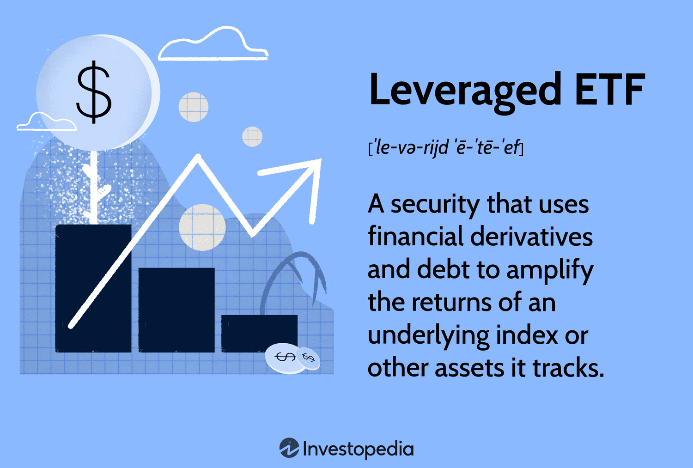

## Table of Contents

## What are ETFs and how do they work?

ETFs, or Exchange-Traded Funds, are a type of investment that works a lot like a mutual fund but trades on a stock exchange, just like a stock. They are designed to track the performance of a specific index, like the S&P 500, a commodity, bonds, or a basket of assets. When you buy shares of an ETF, you're buying a small piece of all the investments within that fund. This makes it easy for you to diversify your investments without having to buy each asset individually.

ETFs are popular because they offer a lot of benefits. They usually have lower fees than mutual funds, and you can buy and sell them throughout the trading day at market prices, unlike mutual funds which are only traded at the end of the day. This flexibility makes it easier for investors to react quickly to market changes. Plus, because ETFs are traded on an exchange, you can use different trading strategies, like buying on margin or selling short, which you can't do with mutual funds.

## What are leveraged ETFs and how do they differ from traditional ETFs?

Leveraged ETFs are a type of ETF that aim to give you bigger returns by using borrowed money or financial derivatives. They try to make your investment grow faster than a normal ETF by aiming for two or three times the daily performance of the index they track. So, if the index goes up by 1%, a 2x leveraged ETF tries to go up by 2%, and a 3x leveraged ETF tries to go up by 3%. But remember, this can also make your losses bigger if the market goes down.

The main difference between leveraged ETFs and traditional ETFs is how they try to achieve their returns. Traditional ETFs just follow the performance of their index without using extra borrowing or derivatives. They aim to match the index's performance over time. Leveraged ETFs, on the other hand, use complex financial tools to try to amplify the daily performance of the index. This makes them riskier and more suited for short-term trading rather than long-term investing.

## What is the banking sector and why might someone want to invest in it?

The banking sector includes all the banks and financial institutions that help people and businesses manage their money. This sector is really important because it helps the economy grow by lending money, managing savings, and providing other financial services. Banks make money from the difference between what they pay for deposits and what they earn from loans, as well as from fees for services like credit cards and investment advice.

Someone might want to invest in the banking sector because it can be a stable and profitable part of the economy. Banks often pay dividends, which means they give some of their profits back to investors regularly. This can provide a steady income stream. Also, as the economy grows, banks usually do well because more people and businesses need loans and other financial services. But, like any investment, it's important to understand that the banking sector can also face risks, like economic downturns or changes in interest rates, so it's good to do your research before investing.

## How do leveraged ETFs track the performance of the banking sector?

Leveraged ETFs that focus on the banking sector try to give investors bigger returns by using borrowed money or financial tools called derivatives. These ETFs aim to make your investment grow faster than normal ETFs by trying to match two or three times the daily performance of a banking index. So, if the banking index goes up by 1%, a 2x leveraged [ETF](/wiki/etf-trading-strategies) tries to go up by 2%, and a 3x leveraged ETF tries to go up by 3%. But, this can also make your losses bigger if the banking sector goes down.

These ETFs work by using complex financial strategies to amplify the daily changes in the banking index. They don't just hold bank stocks; they use things like futures contracts and swaps to try to get the extra returns. Because they focus on daily performance, leveraged ETFs are usually better for short-term trading rather than long-term investing. It's important for investors to understand that these ETFs can be very risky and might not be the best choice for everyone.

## What are some popular leveraged ETFs that focus on the banking sector?

Some popular leveraged ETFs that focus on the banking sector are the Direxion Daily Financial Bull 3X Shares (FAS) and the Direxion Daily Financial Bear 3X Shares (FAZ). FAS tries to give you three times the daily performance of the Russell 1000 Financial Services Index. This means if the index goes up by 1%, FAS tries to go up by 3%. FAZ does the opposite; it tries to give you three times the inverse daily performance of the same index. So, if the index goes down by 1%, FAZ tries to go up by 3%.

These ETFs are popular because they let investors make big moves in the banking sector with less money. But they are also very risky. Because they focus on daily performance, they can be good for short-term trading but not so good for long-term investing. If you're thinking about investing in these ETFs, it's important to understand how they work and to be ready for big ups and downs.

## What are the risks associated with investing in leveraged ETFs?

Investing in leveraged ETFs can be risky because they use borrowed money or financial tools to try to make bigger returns. This means they can also make your losses bigger if the market goes down. If you're not careful, you could lose a lot of money quickly. These ETFs aim to match two or three times the daily performance of an index, so small changes in the market can lead to big changes in the value of your investment.

Another risk is that leveraged ETFs are designed for short-term trading, not long-term investing. Because they focus on daily performance, holding them for a long time can lead to results that are very different from what you expect. Over time, the effects of daily rebalancing and compounding can make your returns much smaller or even turn them into losses. So, if you're thinking about investing in leveraged ETFs, it's important to understand these risks and be ready for the ups and downs that come with them.

## How does leverage amplify gains and losses in leveraged ETFs?

Leverage in ETFs means using borrowed money or financial tools to try to make bigger returns. When you invest in a leveraged ETF, it tries to give you two or three times the daily performance of an index. So, if the index goes up by 1%, a 2x leveraged ETF tries to go up by 2%, and a 3x leveraged ETF tries to go up by 3%. This can make your investment grow a lot faster than a normal ETF. But, the same thing happens if the market goes down. If the index drops by 1%, a 2x leveraged ETF tries to drop by 2%, and a 3x leveraged ETF tries to drop by 3%. This means you could lose a lot of money quickly if the market doesn't go the way you expect.

Because leveraged ETFs focus on daily performance, they are meant for short-term trading, not long-term investing. Over time, the effects of daily rebalancing and compounding can make your returns much smaller or even turn them into losses. This is because the ETF has to adjust its investments every day to keep up with the leverage. So, if you hold a leveraged ETF for a long time, the ups and downs can add up and make your investment worth a lot less than you thought. It's important to understand these risks before you decide to invest in leveraged ETFs.

## What are the costs and fees associated with leveraged ETFs in the banking sector?

Leveraged ETFs in the banking sector, like any other ETFs, come with costs and fees that investors need to be aware of. The main fee is called the expense ratio, which is a yearly fee that covers the costs of managing the ETF. For leveraged ETFs, this fee is usually higher than for regular ETFs because they use more complex strategies to try to give you bigger returns. The expense ratio can be around 1% to 1.5% of your investment each year, but it can be even higher for some leveraged ETFs.

Another cost to think about is the impact of trading. Because leveraged ETFs use borrowed money or financial tools to try to make bigger returns, they have to trade a lot to keep up with the leverage. This can lead to extra costs like trading fees and the bid-ask spread, which is the difference between the price you buy and sell the ETF. These costs can add up, especially if you're trading a lot. So, when you're thinking about investing in leveraged ETFs in the banking sector, it's important to consider these costs and fees and how they might affect your returns.

## How can one assess the performance of leveraged ETFs tracking the banking sector?

To assess the performance of leveraged ETFs that track the banking sector, you need to look at how well they match the daily performance of the banking index they follow. These ETFs try to give you two or three times the daily performance of the index. So, you can check their daily returns and see if they are doing what they say they will do. For example, if the banking index goes up by 1%, a 2x leveraged ETF should go up by about 2%, and a 3x leveraged ETF should go up by about 3%. You can find this information on financial websites or in the ETF's daily reports.

It's also important to look at the ETF's performance over time, even though they are meant for short-term trading. Because they focus on daily performance, holding them for a long time can lead to results that are very different from what you expect. The effects of daily rebalancing and compounding can make your returns much smaller or even turn them into losses. So, you should compare the ETF's long-term performance to the banking index and see how they match up. Remember to also think about the costs and fees, like the expense ratio and trading costs, because they can affect your returns too.

## What strategies should be considered when investing in leveraged ETFs in the banking sector?

When investing in leveraged ETFs in the banking sector, it's important to think about your goals and how long you want to keep the investment. These ETFs are meant for short-term trading, not long-term holding. They try to give you two or three times the daily performance of the banking index, so they can be good if you want to make a quick move in the market. But, because they focus on daily performance, holding them for a long time can lead to results that are different from what you expect. So, it's best to use them for short periods, like a few days or weeks, and not as a long-term investment.

Another thing to think about is the risks and costs. Leveraged ETFs use borrowed money or financial tools to try to make bigger returns, but this can also make your losses bigger if the market goes down. You could lose a lot of money quickly if the market doesn't go the way you expect. Also, these ETFs have higher fees than regular ETFs, like the expense ratio and trading costs. These costs can add up and affect your returns. So, before you invest, make sure you understand these risks and costs and have a plan for how you will manage them.

## How do market conditions affect the performance of leveraged ETFs in the banking sector?

Market conditions play a big role in how well leveraged ETFs in the banking sector do. When the market is going up, these ETFs can make your investment grow a lot faster because they try to give you two or three times the daily performance of the banking index. So, if the banking sector is doing well, you could see big gains. But, if the market is going down, these ETFs can make your losses bigger too. Because they use borrowed money or financial tools to try to make bigger returns, a small drop in the market can lead to a big drop in the value of your investment.

Because leveraged ETFs focus on daily performance, they are meant for short-term trading, not long-term holding. If you keep them for a long time, the ups and downs of the market can add up and make your returns much smaller or even turn them into losses. This is because the ETFs have to adjust their investments every day to keep up with the leverage. So, if the market is very up and down, it can be even riskier to hold these ETFs for a long time. It's important to keep an eye on market conditions and be ready to make quick moves if you're investing in leveraged ETFs in the banking sector.

## What are the tax implications of trading leveraged ETFs focused on the banking sector?

Trading leveraged ETFs in the banking sector can have some tax effects you need to know about. When you sell these ETFs and make a profit, you have to pay capital gains tax. If you hold the ETF for less than a year, it's called a short-term capital gain, and you pay tax on it at your regular income tax rate. If you hold it for more than a year, it's a long-term capital gain, and the tax rate is usually lower. Because leveraged ETFs are meant for short-term trading, you're more likely to have short-term capital gains, which means you might pay more in taxes.

Another thing to think about is that leveraged ETFs can give you dividends. These dividends are usually taxed as ordinary income, which can be at a higher rate than long-term capital gains. Also, if you trade a lot, you might have to pay more in taxes because you're making more short-term gains. So, when you're thinking about trading leveraged ETFs in the banking sector, it's good to think about how these taxes might affect your returns. It's always a good idea to talk to a tax advisor to understand how these rules apply to you.

## References & Further Reading

[1]: ["Leveraged Exchange-Traded Funds (ETFs): An Overview"](https://www.investopedia.com/terms/l/leveraged-etf.asp) - U.S. Securities and Exchange Commission

[2]: Gartland, D., & Baldwin, K. (2020). ["Understanding Leveraged and Inverse ETFs"](https://www.etf.com/sections/features/guide-leveraged-and-inverse-etfs) - Financial Industry Regulatory Authority (FINRA)

[3]: ["Dynamic Rebalancing and the Volatility Drain in Leveraged ETFs"](http://rcea.org/wp-content/uploads/2019/08/Kout.pdf) - CFA Institute

[4]: Sinclair, E. (2011). ["Volatility Trading, Second Edition"](https://onlinelibrary.wiley.com/doi/book/10.1002/9781118662724) - Wiley Finance

[5]: Aldridge, I. (2013). ["High-Frequency Trading: A Practical Guide to Algorithmic Strategies and Trading Systems"](https://www.wiley.com/en-us/High+Frequency+Trading%3A+A+Practical+Guide+to+Algorithmic+Strategies+and+Trading+Systems-p-9780470579770) - Wiley Trading

[6]: ["Quantifying the Impact of Leveraged and Inverse ETFs"](https://papers.ssrn.com/sol3/papers.cfm?abstract_id=1716999) - The Journal of Index Investing

[7]: Kissell, R. (2014). ["The Science of Algorithmic Trading and Portfolio Management"](https://www.sciencedirect.com/book/9780124016897/the-science-of-algorithmic-trading-and-portfolio-management) - Academic Press