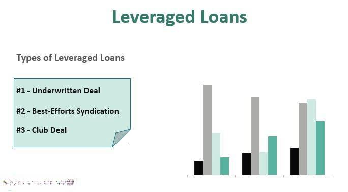

The world of financial indices is diverse and complex, providing investors and financial professionals with essential tools to evaluate markets and make informed decisions. Among these indices, the Leveraged Loan Index (LLI) stands out as a significant marker for tracking the performance of institutional leveraged loans. Leveraged loans are instrumental in financial markets, frequently employed as a funding mechanism in leveraged buyouts and high-yield investment scenarios. Leveraged loans offer an attractive funding option for companies with non-investment-grade credit ratings by enabling access to capital at competitive borrowing costs.

Leveraged Loan Indices serve as benchmarks for the performance of these loans, with indices like the S&P/LSTA U.S. Leveraged Loan 100 Index being recognized for including the largest and most liquid institutions in the loan universe. Such indices are essential in transparently reflecting market conditions and credit risk, offering a comprehensive overview of this segment of the financial market. Their significance extends beyond mere tracking, playing a crucial role in algorithmic trading strategies where they inform and optimize trading performance.



Algorithmic trading leverages the systematic nature and data-driven insights provided by indices like the LLI to execute trades based on predefined criteria effectively. These indices are pivotal in guiding risk management, enabling traders to adjust for interest rate fluctuations and credit risk exposure. As a result, Leveraged Loan Indices have become integral components of modern financial markets, influencing both investment decisions and the development of innovative trading algorithms. This article will explore these intricacies, examining both the broad influence of the Leveraged Loan Index and the algorithmic trading strategies that capitalize on its insights.

## Table of Contents

## Understanding the Leveraged Loan Index (LLI)

A Leveraged Loan Index (LLI) is a pivotal tool for monitoring the performance of institutional leveraged loans, providing investors with a comprehensive overview of market dynamics. The most distinguished of these indices is the S&P/LSTA U.S. Leveraged Loan 100 Index. This index encapsulates the 100 largest and most liquid loans, serving as a critical benchmark for financial analysis. Leveraged loans, by nature, are senior secured debt obligations that are rated below investment grade, placing them within the high-yield 'junk' bond market. These loans often feature floating interest rates and are typically enlisted to finance mergers, acquisitions, and significant capital expenditure projects, underscoring their importance in corporate finance.

The calculation of the Leveraged Loan Index involves a market-weighted methodology that considers various factors to assess the performance and risk associated with these loans. The indices weigh the loans predominately based on prevailing market conditions, which include interest rates and credit risk specific to each loan. The weighting process ensures that the largest and most liquid loans have more influence on the index's overall performance, reflecting the availability and risk associated with the loans to investors.

One key parameter in the functioning of the LLI is its adaptability to fluctuating market scenarios. For instance, changes in interest rates directly influence the floating nature of leveraged loan rates, which, in turn, affects the index value. Additionally, credit risk, inherent in these high-yield investments, is constantly evaluated to recalibrate the index composition. The assessment of default probabilities, liquidity conditions, and economic indicators plays into calculating these indices, providing a transparent benchmark for market participants. The methodology ensures that the index remains representative of the overall health and trajectory of the leveraged loan market, proving instrumental for consistent evaluation and strategic investment decision-making.

In practice, leveraging the data encapsulated within the LLI allows stakeholders to better gauge market movement tendencies, manage risks, and capitalize on potential investment opportunities inherent in high-yield credit markets. Understanding the integral components and methodologies behind the Leveraged Loan Index is critical in forming the basis for sound financial analysis and leveraging these insights for effective portfolio management.

## Functioning of the Leveraged Loan Index

Leveraged loans are structured primarily through a process known as syndication, where a group of lenders comes together to provide a loan to a single borrower. This approach helps mitigate credit risk by distributing it across multiple participants. Syndication is crucial in the leveraged loan market, as it allows for larger loan amounts than what a single lender might be willing to assume alone.

Indexes such as the S&P/LSTA U.S. Leveraged Loan 100 Index play an essential role in tracking the performance of these loans. These indices focus on several key metrics, including loan prices, market size, and default rates, to provide a comprehensive overview of the leveraged loan market. The price of a loan in this context refers to its market value, which can fluctuate based on various factors, including borrower creditworthiness, [interest rate](/wiki/interest-rate-trading-strategies) changes, and broader economic conditions.

Moreover, loan indices are recalibrated regularly, often semi-annually. This periodic recalibration ensures that the index reflects the most current market data and trends, allowing investors and financial professionals to make decisions based on up-to-date information. This is particularly important given the dynamic nature of leveraged loans, which can be affected by rapid changes in market conditions.

Leveraged loan indices serve as a crucial benchmark for market assessment. Unlike more traditional financial instruments, leveraged loans are relatively less liquid and more complex, making direct price discovery challenging. Indices provide a solution to this problem by offering an aggregated, market-weighted view of loan performance. This aggregated data helps investors gauge overall market health and assess individual loan performance relative to the wider market.

In summary, the functioning of the Leveraged Loan Index involves syndication, periodic index recalibration, and comprehensive market assessment through key metrics. These facets collectively offer financial participants valuable insights into the complex and less liquid leveraged loan market.

## Role of Leveraged Loan Indices in Algorithmic Trading

Algorithmic trading, a sophisticated mechanism in the modern financial landscape, benefits notably from the application of leveraged loan indices like the Leveraged Loan Index (LLI). These indices serve as crucial tools in risk management by providing vital data that aids in the adjustment of trading strategies according to credit risk exposure and interest rate fluctuations. Leveraged loans, which generally feature floating interest rates, are particularly sensitive to changes in benchmark interest rates. By utilizing the data from leveraged loan indices, algorithmic traders can calibrate their models to mitigate risks associated with these fluctuations.

Investors often employ leveraged loan indices in constructing passive investment vehicles such as Exchange-Traded Funds (ETFs). These indices help in replicating the performance of market-weighted loans, thus providing investors with a vehicle that tracks a diversified set of leveraged loans. This structured approach allows for a balanced exposure to the loan market while maintaining a focus on [liquidity](/wiki/liquidity-risk-premium) and risk management.

In the domain of automated trading strategies, leveraged loan indices play a pivotal role. They offer foundational data that informs the development of predictive models and trading algorithms. These models often rely on historical and real-time data insights provided by indices to anticipate market movements and execute trades effectively. For example, Python can be used to develop algorithms that take advantage of such data. Consider the following simplified script in Python for processing index data to drive trading decisions:

```python
import pandas as pd
import numpy as np

# Load leveraged loan index data
data = pd.read_csv('lli_data.csv')

# Calculate rolling statistics for risk analysis
data['Moving_Avg'] = data['Loan_Price'].rolling(window=30).mean()
data['Price_Variance'] = data['Loan_Price'].rolling(window=30).var()

# Algorithm to decide on trading action based on index trends
def trading_signal(row):
    if row['Loan_Price'] > row['Moving_Avg']:
        return "Buy"
    elif row['Loan_Price'] < row['Moving_Avg']:
        return "Sell"
    else:
        return "Hold"

data['Signal'] = data.apply(trading_signal, axis=1)

# Print the signals
print(data[['Close', 'Signal']])
```

This script demonstrates the basic principles of using historical price data to generate buy, sell, or hold signals based on the market trends captured by a leveraged loan index. By continuously integrating such algorithms with real-time data, traders can optimize their portfolios while minimizing exposure to inherent risks.

In summary, leveraged loan indices like the LLI are indispensable in [algorithmic trading](/wiki/algorithmic-trading). They provide comprehensive insights that guide the formulation of risk-sensitive, data-driven investment strategies. As the financial markets continue to evolve, leveraging such indices will become increasingly vital for investors aiming to navigate the complexities of leveraged loan markets effectively.

## Challenges and Considerations in LLI and Algo Trading

Leveraging Leveraged Loan Indices (LLIs) in algorithmic trading offers several advantages, yet it also presents notable challenges and considerations. Among these, liquidity risk is a primary concern. Leveraged loans, by nature, are less liquid compared to traditional bonds and equities. This reduced liquidity can create issues in trade execution, affecting the ability to enter and [exit](/wiki/exit-strategy) positions efficiently. The illiquidity is largely due to the complex structuring of syndicated loans and the limited secondary market activity.

Credit risk also remains a significant consideration for investors utilizing LLIs in their trading strategies. Leveraged loans are typically rated below investment grade, categorizing them within the high-yield, or "junk," bond market. This implies a higher susceptibility to default, which can destabilize markets and adversely impact the performance of portfolios heavily invested in these instruments. To mitigate this risk, it is critical to integrate robust credit risk assessment frameworks and continuously monitor the creditworthiness of borrowers via credit default swap (CDS) spreads or other credit metrics.

Interest rate risk plays a crucial role despite the floating interest rate characteristic of leveraged loans, which are ostensibly less sensitive to interest rate movements. The floating rate structure usually pegs the loan's interest payments to a benchmark such as LIBOR or SOFR. However, fluctuations in these benchmarks can lead to [volatility](/wiki/volatility-trading-strategies) in returns. In periods of rapidly changing interest rates, this can result in unpredictable shifts in income from leveraged loan investments, necessitating dynamic adjustments in algorithmic models to manage exposure.

Furthermore, the complexity inherent in the structure of leveraged loans demands a profound understanding and strategic acumen. Leveraged loans often entail intricate covenants, varied interest rate resets, and bespoke terms tailored to each borrower's circumstances. Given this complexity, developing efficacious algorithmic strategies requires advanced analytical techniques and strategic foresight. Traditional valuation models may not suffice, and quantitative models incorporating [machine learning](/wiki/machine-learning) can potentially provide a more nuanced approach to forecasting loan performance.

Addressing these challenges involves not only leveraging advanced technology and analytics but also implementing rigorous risk management protocols. Successful integration of LLIs in algorithmic trading could hinge on the ability to balance these risks against potential rewards, thereby maximizing the utility of these indices in achieving superior trading performance.

## Conclusion

The Leveraged Loan Index (LLI) is an invaluable tool for investors and financial analysts, offering a comprehensive perspective on leveraged loan markets. By tracking market-weighted performance, the LLI provides insights that are critical for understanding and managing the nuanced dynamics of leveraged loans, which are integral to substantial financial activities such as mergers and acquisitions.

In the sphere of algorithmic trading, LLIs enhance trading strategies by supplying essential performance metrics and risk insights. They allow algorithm-driven models to align trading strategies with current market trends, taking into account fluctuating interest rates and credit risks associated with leveraged loans. This real-time data incorporation aids in optimizing decision-making processes and fostering more efficient trading outcomes.

A thorough understanding and effective utilization of LLIs can lead to informed investment decisions, optimizing returns even amidst volatile economic landscapes. Given the complexity and high-yield nature of leveraged loans, leveraging LLIs enables investors to mitigate risks and enhance return potentials. This becomes particularly crucial when navigating market uncertainties and making decisions that hinge on precise credit risk and interest rate evaluations.

Looking ahead, future advancements in algorithmic trading are poised to further integrate such indices. As investment strategies increasingly incorporate advanced technologies and data analytics, the role of LLIs will likely expand, underscoring their importance in shaping financial market operations. Continuous refinement of these indices will offer more granular insights, promoting not only improved trading strategies but also stability and resilience in financial markets. This ongoing evolution highlights the significant impact and enduring relevance of LLIs in contemporary and future finance.

## References & Further Reading

[1]: ["Leveraged Loans: A Practical Guide to Structuring and Closing Leveraged Buyouts"](https://pitchbook.com/leveraged-commentary-data/leveraged-loan-primer) by William M. Dix

[2]: ["The S&P/LSTA Leveraged Loan Index"](https://www.lsta.org/content/morningstar-lsta-leveraged-loan-index-analysis-sept-2024/) Methodology by S&P Global

[3]: ["Credit Risk Management for Leveraged Loans"](https://kpmg.com/us/en/articles/2023/focus-on-leveraged-lending-risks.html) by Risk.net

[4]: ["Leveraged Loan Primer"](https://pitchbook.com/leveraged-commentary-data/leveraged-loan-primer) by S&P Global Market Intelligence

[5]: ["Algorithmic Trading and DMA: An Introduction to Direct Access Trading Strategies"](https://www.amazon.com/Algorithmic-Trading-DMA-introduction-strategies/dp/0956399207) by Barry Johnson