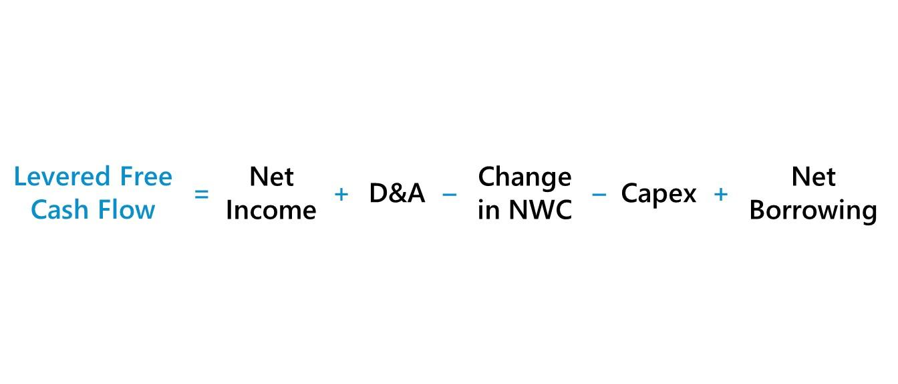

## Table of Contents

## What is Levered Free Cash Flow (LFCF)?

Levered Free Cash Flow (LFCF) is the amount of cash a company has left after paying all its expenses, taxes, and debt payments. It shows how much money the company can use for other things like paying dividends to shareholders, buying back its own stock, or investing in new projects. LFCF is important because it gives a clear picture of the company's financial health and its ability to generate cash after meeting all its obligations.

To calculate LFCF, you start with the company's operating cash flow, which is the cash generated from its normal business activities. Then, you subtract the capital expenditures, which are the costs of maintaining or expanding the business, like buying new equipment or building new facilities. Finally, you subtract the mandatory debt payments, which are the interest and principal payments on the company's loans. What's left is the Levered Free Cash Flow, which tells you how much cash the company has available for discretionary uses.

## How is Levered Free Cash Flow calculated?

Levered Free Cash Flow (LFCF) is calculated by starting with the company's operating cash flow. Operating cash flow is the money the company makes from its regular business activities, like selling products or services. From this amount, you subtract the capital expenditures. Capital expenditures are the costs the company has to pay for things like new equipment or building projects that help the business grow or keep running smoothly.

Next, you need to subtract the mandatory debt payments from the result of the first step. Mandatory debt payments include the interest and principal the company must pay on its loans. After subtracting these payments, what you have left is the Levered Free Cash Flow. This is the money the company can use freely, for things like paying dividends to shareholders, buying back its own stock, or investing in new opportunities.

## What is the difference between Levered and Unlevered Free Cash Flow?

Levered Free Cash Flow (LFCF) and Unlevered Free Cash Flow (UFCF) are two ways to measure the cash a company has left over after paying its bills. LFCF is the cash a company has after paying all its expenses, taxes, and debt payments. It shows how much money the company can use for things like paying dividends to shareholders or investing in new projects. LFCF is important because it gives a clear picture of the company's financial health after meeting all its obligations, including debt.

On the other hand, Unlevered Free Cash Flow (UFCF) is the cash a company has before paying its debt payments. It's calculated by taking the operating cash flow and subtracting capital expenditures, but not the debt payments. UFCF shows how much cash the business can generate from its operations, regardless of how it's financed. This makes UFCF useful for comparing the performance of different companies, even if they have different levels of debt.

## Why is Levered Free Cash Flow important for investors?

Levered Free Cash Flow (LFCF) is important for investors because it shows how much money a company has left after paying all its bills, including debt payments. This tells investors how much cash the company can use for things like paying dividends or buying back its own stock. If a company has a high LFCF, it means it's doing well financially and can give more money back to its shareholders.

Investors also use LFCF to see if a company can grow without needing to borrow more money. A company with a good amount of LFCF can invest in new projects or expand its business using its own cash, which is a sign of financial strength. This makes the company less risky and more attractive to investors who want to put their money in a stable and growing business.

## How can LFCF be used to assess a company's financial health?

Levered Free Cash Flow (LFCF) helps investors understand a company's financial health by showing how much cash it has left after paying all its bills, including debt payments. This tells you if the company is making enough money to cover its costs and still have some left over. If a company has a high LFCF, it means it's doing well financially and can use that extra cash to pay dividends to shareholders, buy back its own stock, or invest in new projects. This makes the company look strong and healthy.

On the other hand, if a company's LFCF is low or negative, it might be struggling to make ends meet. A low LFCF could mean the company is spending too much on its debt payments or not making enough money from its business. This can be a warning sign for investors that the company might be risky. By looking at LFCF, investors can get a clear picture of whether a company is financially healthy or if it might have problems down the road.

## What are the typical uses of Levered Free Cash Flow by a company?

Levered Free Cash Flow (LFCF) is the money a company has left after paying all its bills, including debt payments. Companies can use this extra cash in different ways. One common use is paying dividends to shareholders. When a company gives dividends, it's sharing its profits with the people who own its stock. This can make shareholders happy and might make them want to keep their investment in the company.

Another way companies use LFCF is to buy back their own stock. When a company buys back its stock, it's taking shares out of the market, which can make the remaining shares more valuable. This is good for shareholders because their shares might be worth more money. Also, companies can use LFCF to invest in new projects or expand their business. If a company sees a chance to grow or start something new, having extra cash from LFCF can help them do it without needing to borrow more money.

## Can you provide an example of how to calculate LFCF using real company data?

Let's use a simple example with made-up numbers to show how to calculate Levered Free Cash Flow (LFCF) for a company. Imagine a company called "TechCo" that has an operating cash flow of $500 million. This is the money TechCo makes from selling its products and services. TechCo also spent $100 million on capital expenditures, which are things like buying new computers and building new offices. Finally, TechCo has to pay $50 million in debt payments, which are the interest and principal on its loans.

To find TechCo's LFCF, we start with the operating cash flow of $500 million. Then, we subtract the capital expenditures of $100 million, which leaves us with $400 million. Next, we subtract the debt payments of $50 million from that $400 million. After doing the math, we find that TechCo's Levered Free Cash Flow is $350 million. This means TechCo has $350 million left over after paying all its bills, which it can use for things like paying dividends to shareholders or investing in new projects.

## What are the limitations of using Levered Free Cash Flow as a financial metric?

Using Levered Free Cash Flow (LFCF) as a financial metric has some limitations. One big limitation is that LFCF can change a lot from year to year. This can make it hard for investors to see if a company is doing well over time. For example, if a company spends a lot of money on new equipment one year, its LFCF might go down, but that doesn't mean the company is in trouble. It just means they're investing in their future. Also, LFCF depends on how much debt a company has. If a company borrows a lot of money, its debt payments will go up, which can make its LFCF look lower, even if the company is making good money from its business.

Another limitation is that LFCF doesn't tell the whole story about a company's financial health. It only shows the cash left after paying bills, but it doesn't say anything about other important things like how much the company owes or how well it's managing its money. For example, a company might have a high LFCF but still have a lot of debt, which could be risky. Investors need to look at other financial metrics too, like debt levels and profitability, to get a complete picture of a company's financial situation.

## How does debt affect Levered Free Cash Flow?

Debt has a big impact on Levered Free Cash Flow (LFCF). LFCF is the money a company has left after paying all its bills, including debt payments. If a company has a lot of debt, it has to pay more in interest and principal, which means less money is left over as LFCF. So, if a company borrows more money, its debt payments go up, and its LFCF goes down. This can make the company look less financially healthy, even if it's making good money from its business.

On the other hand, if a company pays off its debt, its debt payments go down, and more money is left as LFCF. This can make the company look stronger financially because it has more cash to use for things like paying dividends or investing in new projects. So, the amount of debt a company has directly affects its LFCF, making it an important thing for investors to think about when looking at a company's financial health.

## How can changes in LFCF over time be interpreted?

Changes in Levered Free Cash Flow (LFCF) over time can tell you a lot about how a company is doing. If LFCF is going up, it usually means the company is doing better. It might be making more money from its business, or it might be paying less in debt payments. This is good news because it means the company has more cash to use for things like paying dividends to shareholders or investing in new projects. But if LFCF is going down, it could mean the company is spending more money on things like new equipment, or it might be paying more in debt payments. This could be a sign that the company is facing some challenges.

It's important to look at why LFCF is changing. Sometimes, a drop in LFCF might not be a bad thing. For example, if a company is investing a lot of money in new projects, its LFCF might go down for a while, but this could help the company grow in the future. On the other hand, if LFCF is going down because the company is struggling to make money or has to pay more in debt, that could be a warning sign. So, when you see changes in LFCF, it's a good idea to look at other financial information too, to get a full picture of what's going on with the company.

## What role does Levered Free Cash Flow play in valuation models like DCF?

Levered Free Cash Flow (LFCF) is important in valuation models like the Discounted Cash Flow (DCF) method because it helps figure out how much a company is worth. In a DCF model, you predict how much cash the company will make in the future, and then you figure out what those future cash flows are worth today. LFCF is used in this model because it shows the cash the company has left after paying all its bills, including debt payments. This is the money the company can use to pay dividends or invest in new projects, so it's a good way to see how much value the company can create for its shareholders.

When using LFCF in a DCF model, you need to think about how much debt the company has. If the company has a lot of debt, its LFCF will be lower because it has to pay more in debt payments. This can make the company look less valuable in the DCF model. But if the company pays off its debt, its LFCF will go up, and the company might look more valuable. So, LFCF helps investors understand not just how much cash a company is making, but also how its debt affects its overall value.

## How do industry-specific factors influence the interpretation of LFCF?

Industry-specific factors can change how we look at a company's Levered Free Cash Flow (LFCF). Different industries have different ways of making money and spending it. For example, tech companies might spend a lot on research and development, which can make their LFCF look lower, but that's normal for their industry. On the other hand, a utility company might have high capital expenditures because they need to build and maintain big infrastructure, like power plants. So, when looking at LFCF, it's important to know what's normal for the industry the company is in.

Also, some industries have different debt levels, which can affect LFCF. Companies in industries like real estate or telecom might have a lot of debt because they need to borrow money to buy property or build networks. This means their LFCF might be lower because they have to pay more in debt payments. But that doesn't necessarily mean they're in trouble; it's just how their industry works. So, when using LFCF to judge a company's financial health, it's helpful to compare it with other companies in the same industry to get a fair picture.

## What is Levered Free Cash Flow (LFCF)?

Levered Free Cash Flow (LFCF) is a financial metric that quantifies the cash a company has available after meeting its financial obligations, such as interest payments and repayment of debts. Unlike Unlevered Free Cash Flow (UFCF), which does not take debt repayments and interest into account, LFCF provides a more precise measure of what is actually available to equity shareholders once all mandatory financial commitments are addressed. 

The formula to calculate LFCF is:

$$
\text{LFCF} = \text{EBITDA} - \Delta \text{NWC} - \text{CapEx} - D
$$

Where:
- **EBITDA** is Earnings Before Interest, Taxes, Depreciation, and Amortization, representing the company's profitability from its core operations.
- **ΔNWC** represents the change in Net Working Capital, which shows the difference between current assets and current liabilities over a period.
- **CapEx** is Capital Expenditures, which reflect the funds used by a company to acquire, upgrade, and maintain physical assets like property, industrial buildings, or equipment.
- **D** stands for Mandatory Debt Payments, encompassing both the principal and interest portions of debt repayments. 

This metric is significant for investors as it sheds light on a company's capability to fund growth initiatives, pay dividends to shareholders, or repurchase stock without compromising its financial stability. Essentially, LFCF indicates financial flexibility and the potential for value distribution to equity holders after settling obligatory financial commitments.

## What is the Formula and Calculation of Levered Free Cash Flow?

Levered Free Cash Flow (LFCF) is calculated using the formula:

$$
\text{LFCF} = \text{EBITDA} - \Delta \text{NWC} - \text{CapEx} - D
$$

Here's a breakdown of each component in this equation:

- **EBITDA (Earnings Before Interest, Taxes, Depreciation, and Amortization):** This is a measure of a company's overall financial performance and is used as an alternative to net income in some circumstances. It provides an overview of a company’s profitability from operations, excluding the effects of capital structure, taxes, and non-cash accounting items such as depreciation and amortization.

- **ΔNWC (Change in Net Working Capital):** Net Working Capital is calculated as current assets minus current liabilities. The change in net working capital ($\Delta \text{NWC}$) reflects the changes in the operating liquidity level from one period to the next. An increase in NWC is considered an outflow of cash because more capital is tied up in day-to-day operations, while a decrease signifies a cash inflow.

- **CapEx (Capital Expenditures):** These are funds used by a company to acquire, upgrade, and maintain physical assets such as property, industrial buildings, or equipment. It is essential for growth and maintaining operational efficiency, but represents a cash outflow that reduces LFCF.

- **D (Mandatory Debt Payments):** These are obligatory payments a company must make to service its debt, including principal and interest repayments. It is a critical factor in determining the LFCF, as these payments must be made before equity holders can access any cash.

The correct calculation of LFCF is vital since it provides insight into the free cash available to the company after satisfying all its financial obligations. This metric allows investors and stakeholders to assess the financial health and flexibility of a company, its ability to reinvest in growth, and its capability to return value to shareholders through dividends and stock buybacks.

## What are the differences between Levered and Unlevered Free Cash Flow?

Levered Free Cash Flow (LFCF) and Unlevered Free Cash Flow (UFCF) are key financial metrics that provide insights into different aspects of a company's financial health. Understanding the distinction between these two is crucial for investors and financial analysts.

LFCF is the cash flow available to equity shareholders after the company satisfies all its financial obligations, such as interest and mandatory debt repayments. It reflects the actual cash that can be distributed to shareholders or reinvested in the company's growth. The LFCF formula can be expressed as:

$$
\text{LFCF} = \text{EBITDA} - \Delta \text{NWC} - \text{CapEx} - \text{D}
$$

where $\text{EBITDA}$ is Earnings Before Interest, Taxes, Depreciation, and Amortization, $\Delta \text{NWC}$ is the change in Net Working Capital, $\text{CapEx}$ represents Capital Expenditures, and $\text{D}$ stands for Debt Payments.

On the other hand, UFCF measures the cash flow generated by the business before any payments to financial stakeholders, like debt investors and equity holders. This metric considers the cash available to all stakeholders and is used to evaluate the company’s capability to pay dividends, buy back stock, or reinvest in itself independently of its capital structure. UFCF is calculated as follows:

$$
\text{UFCF} = \text{EBIT} \times (1 - \text{Tax Rate}) + \text{Depreciation} + \text{Amortization} - \Delta \text{NWC} - \text{CapEx}
$$

The primary distinction lies in the scope of financial obligations considered. While LFCF is beneficial for equity investors who need to understand the cash available post-debt settlement, UFCF provides a broader view of a company's cash flow irrespective of its financing choices.

Both metrics complement each other in assessing a company's intrinsic value and financial health. Analysts often rely on UFCF when performing discounted cash flow analysis to value a company since it illustrates the operational cash flows generated irrespective of the financial structure. In contrast, LFCF aids in understanding the net cash flows remaining after fulfilling debt obligations, which is paramount for equity investors focused on dividend yield or reinvestment potential.

In summary, discerning the nuances between LFCF and UFCF equips investors with a comprehensive perspective on a company's cash flow dynamics, fostering more informed investment decisions.

## References & Further Reading

[1]: Palepu, K. G., Healy, P. M., & Bernard, V. L. (2019). "Business Analysis and Valuation: Using Financial Statements." Cengage Learning.

[2]: Tjia, J. (2009). "Building Financial Models." McGraw-Hill.

[3]: ["The Intelligent Investor: The Definitive Book on Value Investing"](https://www.amazon.com/Intelligent-Investor-3rd-Ed/dp/0063356724) by Benjamin Graham

[4]: Damodaran, A. (2012). "Investment Valuation: Tools and Techniques for Determining the Value of any Asset." Wiley Finance.

[5]: ["Valuation: Measuring and Managing the Value of Companies"](https://www.amazon.com/Valuation-Measuring-Managing-Companies-Finance/dp/1119610885) by McKinsey & Company