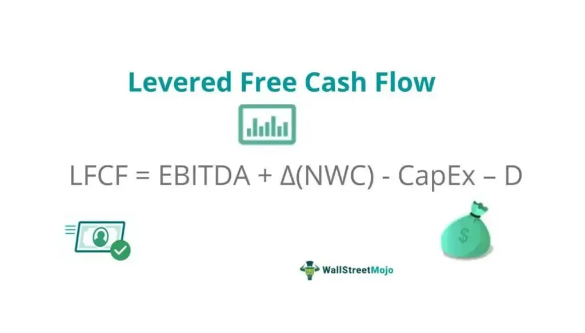

In the dynamic world of finance and investment, understanding key financial metrics is essential for making informed decisions. Levered Free Cash Flow (LFCF) is one such metric, widely utilized in assessing a company's financial health and its capacity to meet financial obligations. LFCF represents the cash available after a company has met its financial commitments, such as interest payments and debt amortization. This metric provides insights into the money that equity shareholders can potentially receive, making it a vital indicator of financial stability and resilience.

This article explores the concept of LFCF, its calculation, and its relevance in algorithmic trading. By examining the nuances of LFCF, we can appreciate its significance in evaluating a company's ability to invest in growth opportunities, distribute dividends, or repurchase stock. Additionally, we will differentiate between Levered Free Cash Flow and Unlevered Free Cash Flow (UFCF) to understand their distinct roles. UFCF measures the cash available before financial obligations are met, offering a broader view of a company's cash-generating potential.



By the end, you'll grasp how LFCF can influence investment strategies and decision-making in algorithmic trading. With the increasing reliance on data-driven trading strategies, LFCF's role as a financial metric becomes even more crucial. Understanding how it impacts stock performance predictions can enhance the precision of trading algorithms and optimize investment outcomes.

## Table of Contents

## What is Levered Free Cash Flow (LFCF)?

Levered Free Cash Flow (LFCF) is a financial metric that quantifies the cash a company has available after meeting its financial obligations, such as interest payments and repayment of debts. Unlike Unlevered Free Cash Flow (UFCF), which does not take debt repayments and interest into account, LFCF provides a more precise measure of what is actually available to equity shareholders once all mandatory financial commitments are addressed. 

The formula to calculate LFCF is:

$$
\text{LFCF} = \text{EBITDA} - \Delta \text{NWC} - \text{CapEx} - D
$$

Where:
- **EBITDA** is Earnings Before Interest, Taxes, Depreciation, and Amortization, representing the company's profitability from its core operations.
- **ΔNWC** represents the change in Net Working Capital, which shows the difference between current assets and current liabilities over a period.
- **CapEx** is Capital Expenditures, which reflect the funds used by a company to acquire, upgrade, and maintain physical assets like property, industrial buildings, or equipment.
- **D** stands for Mandatory Debt Payments, encompassing both the principal and interest portions of debt repayments. 

This metric is significant for investors as it sheds light on a company's capability to fund growth initiatives, pay dividends to shareholders, or repurchase stock without compromising its financial stability. Essentially, LFCF indicates financial flexibility and the potential for value distribution to equity holders after settling obligatory financial commitments.

## Formula and Calculation of Levered Free Cash Flow

Levered Free Cash Flow (LFCF) is calculated using the formula:

$$
\text{LFCF} = \text{EBITDA} - \Delta \text{NWC} - \text{CapEx} - D
$$

Here's a breakdown of each component in this equation:

- **EBITDA (Earnings Before Interest, Taxes, Depreciation, and Amortization):** This is a measure of a company's overall financial performance and is used as an alternative to net income in some circumstances. It provides an overview of a company’s profitability from operations, excluding the effects of capital structure, taxes, and non-cash accounting items such as depreciation and amortization.

- **ΔNWC (Change in Net Working Capital):** Net Working Capital is calculated as current assets minus current liabilities. The change in net working capital ($\Delta \text{NWC}$) reflects the changes in the operating liquidity level from one period to the next. An increase in NWC is considered an outflow of cash because more capital is tied up in day-to-day operations, while a decrease signifies a cash inflow.

- **CapEx (Capital Expenditures):** These are funds used by a company to acquire, upgrade, and maintain physical assets such as property, industrial buildings, or equipment. It is essential for growth and maintaining operational efficiency, but represents a cash outflow that reduces LFCF.

- **D (Mandatory Debt Payments):** These are obligatory payments a company must make to service its debt, including principal and interest repayments. It is a critical factor in determining the LFCF, as these payments must be made before equity holders can access any cash.

The correct calculation of LFCF is vital since it provides insight into the free cash available to the company after satisfying all its financial obligations. This metric allows investors and stakeholders to assess the financial health and flexibility of a company, its ability to reinvest in growth, and its capability to return value to shareholders through dividends and stock buybacks.

## Importance of Levered Free Cash Flow in Business

Levered Free Cash Flow (LFCF) is a key indicator of a company's financial flexibility and overall financial health. This metric provides insight into the amount of cash available after a business has met its financial obligations, such as interest payments and debt repayments. 

A high LFCF suggests that a company has more funds available for seizing growth opportunities, potentially indicating lower credit risk. This financial cushion allows businesses to confidently explore various strategic initiatives, such as mergers and acquisitions, research and development, and expansion into new markets. Furthermore, companies with a robust LFCF are often in a stronger position to offer dividends, undertake stock buybacks, or reinvest in their operations, recognizing these opportunities as pathways to enhance shareholder value.

On the other hand, a low LFCF can signal potential financial difficulties. Such a situation might suggest that a company lacks the financial flexibility needed to support its growth ambitions or sustain its operational activities without additional funding. Investors typically view a low LFCF as a red flag, warranting a cautious approach due to the heightened risk of financial instability.

The strategic importance of LFCF extends to how companies plan their capital allocation. A consistent evaluation of LFCF helps businesses determine the best [course](/wiki/best-algorithmic-trading-courses) for deploying their resources—whether to return capital to shareholders or to reinvest in projects that could promise higher future returns. Consequently, monitoring this metric is vital for both preserving financial stability and fostering long-term growth prospects.

## LFCF in Algorithmic Trading

Algorithmic trading, a technique that uses automated pre-programmed trading instructions, frequently harnesses financial data to improve trading efficiency and outcomes. Among the metrics employed in these algorithms, Levered Free Cash Flow (LFCF) emerges as a significant indicator due to its reflection of a company's financial health post-debt obligations.

Traders integrate LFCF into trading algorithms to predict stock performance based on a company's ability to generate cash after fulfilling financial commitments. By analyzing LFCF, traders can infer a company's operational efficiency and financial stability, both crucial for predicting stock price movements. For instance, a consistently high LFCF could suggest that a company is well-positioned to fund expansion, pay dividends, and reduce leverage, potentially leading to upward stock price [momentum](/wiki/momentum).

Incorporating LFCF into these algorithms not only refines trading strategies but also enhances investment returns by providing a clearer picture of a company's profitability potential. An algorithm might base its buy or sell decisions on LFCF trends, identifying companies with improving cash flow as potential buy targets due to their capacity to generate shareholder value.

Python, a favored language for [algorithmic trading](/wiki/algorithmic-trading), allows for the efficient analysis of LFCF using libraries like Pandas and NumPy. For example:

```python
import pandas as pd

# Sample data
data = {
    'EBITDA': [1000, 1100, 1200],
    'NetWorkingCapital': [200, 240, 280],
    'CapEx': [300, 320, 330],
    'DebtPayments': [100, 110, 120],
}

df = pd.DataFrame(data)

# Calculate LFCF
df['LFCF'] = df['EBITDA'] - (df['NetWorkingCapital'].diff().fillna(0)) - df['CapEx'] - df['DebtPayments']

print(df)
```

The calculated LFCF can then be used to identify trends that suggest changes in a company’s growth potential or financial health, influencing trading algorithms to make informed investment decisions. Consequently, by evaluating LFCF trends algorithmically, traders assess both the profitability prospects and investment risks associated with a company, aligning their strategies with evolving financial landscapes.

## Comparing Levered and Unlevered Free Cash Flow

Levered Free Cash Flow (LFCF) and Unlevered Free Cash Flow (UFCF) are key financial metrics that provide insights into different aspects of a company's financial health. Understanding the distinction between these two is crucial for investors and financial analysts.

LFCF is the cash flow available to equity shareholders after the company satisfies all its financial obligations, such as interest and mandatory debt repayments. It reflects the actual cash that can be distributed to shareholders or reinvested in the company's growth. The LFCF formula can be expressed as:

$$
\text{LFCF} = \text{EBITDA} - \Delta \text{NWC} - \text{CapEx} - \text{D}
$$

where $\text{EBITDA}$ is Earnings Before Interest, Taxes, Depreciation, and Amortization, $\Delta \text{NWC}$ is the change in Net Working Capital, $\text{CapEx}$ represents Capital Expenditures, and $\text{D}$ stands for Debt Payments.

On the other hand, UFCF measures the cash flow generated by the business before any payments to financial stakeholders, like debt investors and equity holders. This metric considers the cash available to all stakeholders and is used to evaluate the company’s capability to pay dividends, buy back stock, or reinvest in itself independently of its capital structure. UFCF is calculated as follows:

$$
\text{UFCF} = \text{EBIT} \times (1 - \text{Tax Rate}) + \text{Depreciation} + \text{Amortization} - \Delta \text{NWC} - \text{CapEx}
$$

The primary distinction lies in the scope of financial obligations considered. While LFCF is beneficial for equity investors who need to understand the cash available post-debt settlement, UFCF provides a broader view of a company's cash flow irrespective of its financing choices.

Both metrics complement each other in assessing a company's intrinsic value and financial health. Analysts often rely on UFCF when performing discounted cash flow analysis to value a company since it illustrates the operational cash flows generated irrespective of the financial structure. In contrast, LFCF aids in understanding the net cash flows remaining after fulfilling debt obligations, which is paramount for equity investors focused on dividend yield or reinvestment potential.

In summary, discerning the nuances between LFCF and UFCF equips investors with a comprehensive perspective on a company's cash flow dynamics, fostering more informed investment decisions.

## Conclusion

Levered Free Cash Flow (LFCF) is a crucial metric in assessing a company's financial health and strategic potential. Its detailed calculation and analysis are invaluable for both investors and algorithmic traders aiming to make optimized financial decisions. By focusing on the actual cash available after a company has met its financial obligations, LFCF offers insights into the company's financial flexibility and its capability to pursue growth opportunities, distribute dividends, or initiate stock buybacks.

For individual and institutional investors alike, understanding and leveraging LFCF is key to evaluating potential investment opportunities and assessing associated risk profiles. The metric serves as a reliable indicator of the company's ability to generate shareholder value, as it reflects the funds that are truly available to equity holders after covering necessary debts.

As algorithmic trading continues to develop, incorporating metrics like LFCF into trading strategies is becoming increasingly significant. Trading algorithms that integrate LFCF data can enhance their predictive capability regarding stock performance and overall financial health, thereby improving the precision and outcomes of investment strategies. Metrics such as LFCF allow traders and algorithms to evaluate financial trends effectively, helping forecast profitability and assess risk, thus becoming indispensable tools in modern investment approaches.

## References & Further Reading

[1]: Palepu, K. G., Healy, P. M., & Bernard, V. L. (2019). "Business Analysis and Valuation: Using Financial Statements." Cengage Learning.

[2]: Tjia, J. (2009). "Building Financial Models." McGraw-Hill.

[3]: ["The Intelligent Investor: The Definitive Book on Value Investing"](https://www.amazon.com/Intelligent-Investor-3rd-Ed/dp/0063356724) by Benjamin Graham

[4]: Damodaran, A. (2012). "Investment Valuation: Tools and Techniques for Determining the Value of any Asset." Wiley Finance.

[5]: ["Valuation: Measuring and Managing the Value of Companies"](https://www.amazon.com/Valuation-Measuring-Managing-Companies-Finance/dp/1119610885) by McKinsey & Company