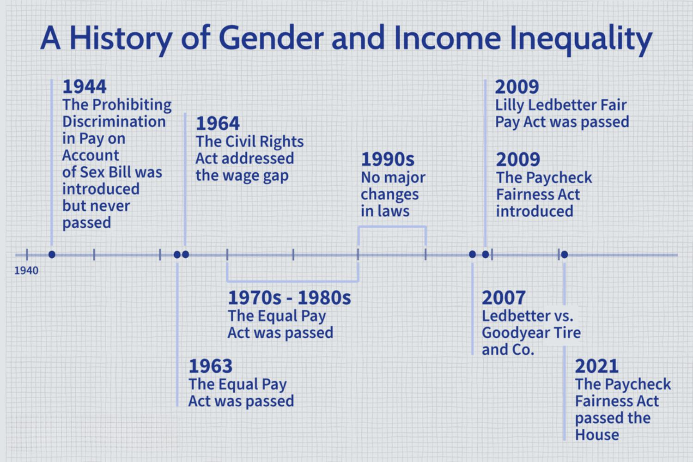

Wage disparities and employment inequality significantly impact LGBTQ+ individuals, reflecting a broader, entrenched pattern of social and economic inequity. Despite considerable progress in social acceptance and legal protections, these disparities persist, affecting various aspects of life for many in the LGBTQ+ community. The persistence of income inequality among LGBTQ+ individuals can be seen as part of a larger framework of systemic inequities that also affect other marginalized groups. These disparities manifest in multiple ways, from wage gaps to limited career advancement opportunities, often driven by discrimination and bias in workplace environments.

Interestingly, algorithmic trading, an area of focus within the financial markets, operates on a different plane. Characterized by its reliance on mathematical models and algorithms devoid of human judgment, this form of trading presents a contrast against human-driven biases that infiltrate many other sectors. While these algorithms function without overt prejudice, it prompts a discussion about designing systems in other areas that minimize human bias, potentially offering a roadmap to more equitable outcomes in varied industries.



This article aims to question the mechanisms of workplace discrimination, explore their ramifications on LGBTQ+ income inequality, and consider possible strategies for reducing these disparities. By analyzing these complex interactions, the article seeks to contribute to a critical dialogue about the need for equitable employment practices and systems that respect diversity and inclusivity.

## Table of Contents

## Understanding Wage Disparities and Employment Inequality

Wage disparities and employment inequality are significant social and economic issues, particularly affecting marginalized communities, such as LGBTQ+ individuals. These disparities refer to the unequal treatment or outcomes in wages and employment opportunities experienced by different groups, often due to systemic biases and discrimination. In the context of the LGBTQ+ community, these disparities are underscored by a range of factors, including societal norms, legally structured inequities, and individual prejudices.

Wage disparities and employment inequality are quantified through various methods. One common approach is examining the median wage gap, which compares the median earnings of marginalized groups with those of their cisgender, heterosexual counterparts. Economists and social scientists also use regression analysis to control for variables such as education, experience, and job type to identify unexplained portions of wage gaps, often attributing these to discrimination or bias.

The systemic roots of economic inequities affecting LGBTQ+ individuals are multifaceted. Historically, legal and cultural prejudices have contributed to restricted access to education and job opportunities for LGBTQ+ people. This is coupled with implicit biases in hiring and promotion processes, often favoring heterosexual and cisgender individuals. Additionally, socioeconomic disadvantages, such as family rejection and homelessness, disproportionately impact LGBTQ+ youth, creating barriers to acquiring the education and skills necessary for economic advancement.

A common myth surrounding wage gaps is the belief that they are entirely the result of individual choices or meritocratic processes. However, empirical studies demonstrate that discrimination plays a significant role. For instance, controlled experiments have shown less favorable outcomes for job applicants with signals identifying them as LGBTQ+, indicating bias beyond performance metrics. Furthermore, such narratives often disregard the complexity of lived experiences, where LGBTQ+ individuals may face unique challenges, such as the decision to conceal their identities at work to avoid discrimination, which can limit networking and advancement opportunities.

Scientific research continually underscores the existence and persistence of these inequities, despite progressive changes in social attitudes and legal protections. Addressing these issues requires recognizing the underlying systemic discrimination and biases, advocating for policy changes, and fostering inclusive workplace cultures.

## The LGBTQ+ Pay Gap: Current Statistics and Analysis

The LGBTQ+ pay gap remains a critical issue in understanding broader economic and social inequities. Recent studies illustrate notable disparities in earnings among LGBTQ+ individuals compared to their heterosexual counterparts. According to the Williams Institute's analysis, gay and bisexual men earn 10-32% less than similarly qualified heterosexual men, while lesbians and bisexual women may earn more than their heterosexual female peers but still less than all male counterparts (Badgett et al., 2020).

These [statistics](/wiki/bayesian-statistics) underscore substantial economic and social implications. The economic disadvantage experienced by LGBTQ+ individuals can contribute to a cycle of poverty, limiting access to resources like healthcare, education, and housing. Socially, the pay gap reinforces stigmatization and discrimination, perpetuating the marginalization of LGBTQ+ communities. Furthermore, organizations that fail to address these inequities risk decreased employee satisfaction and retention, ultimately impacting productivity and innovation.

Several factors perpetuate the LGBTQ+ pay gap. Educational and occupational choices are often shaped by societal expectations and discrimination. For example, LGBTQ+ individuals may choose specific fields perceived as more inclusive, potentially leading to lower-paying job sectors. Discrimination and bias in hiring, promotions, and salaries further exacerbate these disparities. Additionally, the absence of discrimination protections in certain jurisdictions and sectors may discourage LGBTQ+ candidates from fully participating in the workforce.

The effects of the pay gap are not uniform across the LGBTQ+ community, as intersecting factors such as race, gender identity, and education level play significant roles. Studies indicate that LGBTQ+ people of color experience even greater disparities due to compounded discrimination. Transgender individuals, particularly transgender women of color, face unemployment rates three times higher than the national average and are more vulnerable to homelessness and poverty (James et al., 2016). Educational disparities also persist, as LGBTQ+ youth often encounter barriers to completing their education, limiting their career opportunities and contributing to wage gaps.

Addressing these economic discrepancies necessitates a multifaceted approach, including implementing inclusive practices and enhancing data collection to better understand intersectional wage gaps. By recognizing and dismantling discriminatory structures, society can move towards ensuring equity for all workers, regardless of sexual orientation, gender identity, race, or other identifiers.

## Barriers to Equal Pay: Discrimination and Workplace Challenges

LGBTQ+ individuals encounter myriad forms of discrimination in workplaces, which significantly affect their pay and career advancement opportunities. These discriminatory practices range from overt biases to subtle microaggressions and structural inequalities. Despite advancements in social inclusion, many workplaces still harbor environments where LGBTQ+ employees face challenges that contribute to wage disparities and hinder professional growth.

One notable [factor](/wiki/factor-investing) influencing LGBTQ+ employees' career trajectories is the decision to be 'out' or closeted at work. Being openly LGBTQ+ can sometimes lead to discrimination in hiring practices, promotions, or salary decisions. Research indicates that employees who are 'out' may experience differential treatment or workplace harassment, impacting their job satisfaction and career progression. Conversely, choosing to remain closeted can also have repercussions, such as an increased emotional burden and the constant fear of being discovered, which may affect overall productivity and work engagement.

Regional and sectoral differences play a crucial role in workplace equality for LGBTQ+ individuals. In regions where LGBTQ+ rights are less protected, and societal acceptance is lower, wage disparities tend to be more pronounced. Certain industries are more progressive and inclusive than others, affecting the extent of wage equality experienced by LGBTQ+ employees. For instance, sectors like technology and media are often more open, whereas industries such as construction or manufacturing might present additional challenges for LGBTQ+ workers in terms of acceptance and equal pay.

Furthermore, everyday workplace interactions often involve microaggressions, stereotypes, and biases that create an unwelcoming atmosphere for LGBTQ+ individuals. Microaggressions include subtle, sometimes unintentional, slights or comments that undermine one's identity or capabilities. These can accumulate over time, leading to a hostile work environment that affects mental health and job performance. Stereotypes about LGBTQ+ individuals may influence colleagues' perceptions, resulting in assumptions about their interests, abilities, or reliability that are not based on merit or performance.

To mitigate these challenges, organizations must foster an inclusive culture that actively prevents discrimination and supports LGBTQ+ employees. Implementing comprehensive nondiscrimination policies, sensitivity training, and support networks can help create a more equitable workplace. Recognition of the multifaceted barriers faced by LGBTQ+ individuals is essential in addressing wage disparities and ensuring that all employees have equal opportunities for success and advancement.

## Progress and Setbacks in Addressing the Pay Gap

Recent progress in addressing the pay gap for LGBTQ+ individuals has been largely driven by legal frameworks and policy reforms aimed at reducing discrimination in workplaces. Key milestones include court rulings and equality acts designed to offer protection to LGBTQ+ workers and promote fair compensation practices.

In the United States, the Supreme Court's decision in Bostock v. Clayton County (2020) marked a significant advancement by ruling that discrimination based on sexual orientation or gender identity falls under "sex" discrimination, as prohibited by Title VII of the Civil Rights Act of 1964. This landmark ruling provides an important legal precedent to challenge discriminatory practices across workplaces.

Internationally, the European Union has made strides with its LGBTIQ Equality Strategy 2020-2025, which outlines measures aimed at promoting equality and addressing discrimination in member states. In particular, countries like Germany and the Netherlands have enacted laws mandating equal pay for work of equal value while incorporating specific protections for LGBTQ+ individuals.

Despite these advancements, several setbacks continue to hinder progress toward equal pay for LGBTQ+ workers. One major challenge is the inconsistent implementation and enforcement of existing laws. Disparities in protections across regions and within various sectors can result in a patchwork of enforcement, diminishing the effectiveness of legal strides. Furthermore, socioeconomic and cultural biases persist, contributing to discrimination that remains difficult to legislate against.

Notably, data collection on LGBTQ+ pay disparities is often limited, impacting the ability to monitor progress and enforce regulations effectively. Comprehensive, disaggregated data are crucial to understanding the nuances of pay inequality, yet many countries still fall short in tracking such information.

Some nations stand out as potential models for progress due to their comprehensive approaches. For instance, Canada has been recognized for its inclusive workplace policies and robust legal protections specified in the Canadian Human Rights Act. Additionally, New Zealand's amendments to the Equal Pay Act have broadened the scope of gender discrimination to include sexual orientation and gender identity, setting a precedent for legislative innovation.

Moving forward, the challenge lies in harmonizing legal protections and ensuring that policy frameworks are fully implemented to close the pay gap for LGBTQ+ workers globally. Continuous efforts towards policy refinement, effective law enforcement, and comprehensive data collection are essential components to achieving genuine equality in the workplace.

## Algorithmic Trading: A Parallel in the Financial Sector

Algorithmic trading is a sophisticated method of executing orders using pre-programmed and automated instructions that account for variables such as timing, price, and order size. Leveraging mathematical models and complex algorithms, these systems can make swift trading decisions that humans simply cannot execute manually. The relevance of [algorithmic trading](/wiki/algorithmic-trading) in modern financial markets is underscored by its capacity to handle large volumes of transactions at speeds and efficiencies unattainable by human traders, significantly impacting [liquidity](/wiki/liquidity-risk-premium) and price discovery processes.

An essential feature of algorithmic trading systems is their ability to operate without the prejudices inherent in human decision-making, contrasting sharply with wage inequality driven by human biases and discrimination. By functioning on the basis of quantitative data and logical frameworks, algorithmic trading presents a model of decision-making that is free from racial, gender, or social biases. However, the notion of a purely unbiased system is somewhat idealistic, as algorithms themselves may inherit biases from the datasets they are trained on or the assumptions underlying their models.

Despite their objectivity in theory, algorithmic trading systems can exhibit ethical concerns and hidden biases. For instance, if the data used to train these algorithms reflect existing market prejudices or anomalies, the resulting decisions may perpetuate or even exacerbate those biases. Furthermore, high-frequency trading, often executed by algorithms, can contribute to market [volatility](/wiki/volatility-trading-strategies) and present systemic risks. Thus, while these systems may offer a level of impartiality in execution, careful consideration must be given to the ethical design and deployment of these technologies.

The principles of algorithmic trading provide intriguing insights into fostering more objective and equitable systems beyond financial markets. By emphasizing transparency in rule-making and accountability in outcomes, sectors grappling with bias, such as employment, can learn from the algorithmic approach to improve fairness. For instance, implementing transparent pay structures or designing recruitment algorithms that minimize biased decision matrices could reflect the logic of algorithmic trading. 

A hypothetical example in Python illustrating a simple algorithmic trading decision might look like this:

```python
def trading_decision(market_data, threshold=0.05):
    # Example: buy if the market data indicates a price drop greater than the threshold
    price_change = (market_data['current_price'] - market_data['previous_price']) / market_data['previous_price']
    if price_change <= -threshold:
        return "buy"
    elif price_change >= threshold:
        return "sell"
    else:
        return "hold"
```

This code uses systematic decision rules to mitigate emotional and subjective decision-making. Similar principles could be applied to algorithms in other domains to promote unbiased outcomes, ensuring that data sets are representative and free from historical biases in their application. In conclusion, while algorithmic trading provides a compelling contrast to human-driven inequalities, both fields must continue addressing the potential for embedded biases to create genuinely equitable systems.

## Strategies for Reducing Wage Inequality

Addressing wage inequality for LGBTQ+ employees requires deliberate strategies and actions by both businesses and policymakers. These strategies not only aim to rectify existing disparities but also foster an inclusive workplace culture conducive to career growth and equitable compensation.

### Inclusive Workplace Policies

Inclusive workplace policies are vital for establishing environments that support diversity and equality. Companies can implement anti-discrimination policies explicitly protecting against bias based on sexual orientation, gender identity, and expression. Comprehensive non-discrimination policies can reduce instances of workplace discrimination, thereby promoting equality in pay and career advancement opportunities.

Furthermore, supporting employee resource groups (ERGs) for LGBTQ+ workers can help build community and provide platforms for discussing workplace challenges and advocating for equitable policies. Offering benefits such as healthcare coverage for same-sex partners and inclusive family leave policies can also signal a commitment to equality, positively affecting the morale and productivity of LGBTQ+ employees.

### Transparency in Pay Structures

Pay transparency is crucial in identifying and addressing wage gaps. By openly sharing salary ranges and criteria for pay increases and promotions, companies can reduce the possibility of bias in compensation decisions. Transparent pay structures hold employers accountable and encourage a merit-based system of evaluation.

Research supports the effectiveness of pay transparency. A study published in the *Harvard Business Review* indicates that clear communication about compensation practices can diminish pay disparities and enhance trust between employees and employers.

### Education and Training

Education and training are fundamental to empowering LGBTQ+ individuals to access and excel in high-paying careers. Businesses can support this by offering professional development programs targeted at LGBTQ+ employees. These programs could cover leadership skills, technical competencies, and networking opportunities, thereby preparing these individuals for advancement.

Furthermore, partnerships between companies and educational institutions can create pipelines for LGBTQ+ individuals into lucrative fields, particularly in STEM (Science, Technology, Engineering, and Mathematics), where diversity often lags. Scholarships, internships, and mentorship programs aimed at LGBTQ+ students can dismantle barriers to entry and promote long-term equality in wages.

### Implementation of Best Practices

To successfully implement these strategies, companies might consider establishing diversity and inclusion oversight committees to monitor progress and ensure accountability. Regular audits and impact assessments can help measure the effectiveness of policies and practices, allowing for adjustments as needed to meet equity goals.

By adopting these strategies, businesses and policymakers can make significant strides toward reducing wage inequality and creating an equitable work environment for LGBTQ+ employees. Through collective efforts, the broader aim of societal equity can become a reality over time.

## Conclusion

LGBTQ+ individuals continue to face significant wage disparities and employment inequalities, which are intricately connected with broader systemic inequities. These disparities manifest in reduced income levels, limited career advancement opportunities, and increased vulnerability to economic instability. The persistence of such inequality highlights the urgent need for comprehensive strategies that address both overt and subtle forms of discrimination in the workplace.

Future progress towards income equality for LGBTQ+ individuals hinges on several societal shifts. An important aspect is the implementation of inclusive policies that foster diversity and equity in all areas of employment. Legal frameworks must be strengthened and enforced to protect LGBTQ+ workers from discrimination, ensuring that their rights are upheld and respected. Efforts to confront and dismantle societal norms that perpetuate these disparities are also vital for creating a more inclusive society.

Ongoing dialogue and research are crucial to understanding and addressing intersectional wage disparities. By examining how factors such as race, gender identity, and socioeconomic status intersect with sexual orientation, stakeholders can develop more effective strategies to mitigate these entrenched inequities. Research initiatives should be supported to gather comprehensive data that informs policy decisions and organizational practices.

Stakeholders at all levels, including government bodies, corporations, and civil society organizations, must actively engage in efforts to close the LGBTQ+ pay gap. This involves not only adopting policies that promote transparency and accountability in pay structures but also creating educational and training opportunities to empower LGBTQ+ individuals to pursue high-paying careers. Collaborative efforts can drive meaningful change, ensuring that wage inequalities are progressively reduced and ultimately eliminated.

Addressing these complex issues requires a multifaceted approach and a commitment to change from all sectors of society. By working together, it is possible to build a future where income equality for LGBTQ+ communities is not just an aspiration but a reality.

## References & Further Reading

[1]: Badgett, M. V. L., Durso, L. E., Kastanis, A., & Mallory, C. (2013). ["New Patterns of Poverty in the Lesbian, Gay, and Bisexual Community."](https://williamsinstitute.law.ucla.edu/wp-content/uploads/Impact-LGBT-Support-Workplace-May-2013.pdf) The Williams Institute, UCLA School of Law.

[2]: James, S. E., Herman, J. L., Rankin, S., Keisling, M., Mottet, L., & Anafi, M. (2016). ["The Report of the 2015 U.S. Transgender Survey."](https://transequality.org/sites/default/files/docs/usts/USTS-Full-Report-Dec17.pdf) National Center for Transgender Equality.

[3]: Bostock v. Clayton County, 590 U.S. ___ (2020). ["Supreme Court of the United States decision."](https://supreme.justia.com/cases/federal/us/590/17-1618/)

[4]: European Commission. (2020). ["Union of Equality: LGBTIQ Equality Strategy 2020-2025."](https://commission.europa.eu/strategy-and-policy/policies/justice-and-fundamental-rights/combatting-discrimination/lesbian-gay-bi-trans-and-intersex-equality/lgbtiq-equality-strategy-2020-2025_en)

[5]: The Harvard Business Review. ("The Transparency Trap"). Harvard Business Review. 

[6]: "2022 LGBTQ+ Pay Gap Report," LinkedIn Economic Graph. [Accessed Online](https://www.linkedin.com/in/vanessabrieva)

[7]: Jansen, Stefan. (2020). ["Machine Learning for Algorithmic Trading: Predictive models to extract signals from market and alternative data for systematic trading strategies with Python."](https://www.amazon.com/Machine-Learning-Algorithmic-Trading-alternative/dp/1839217715) Packt Publishing.