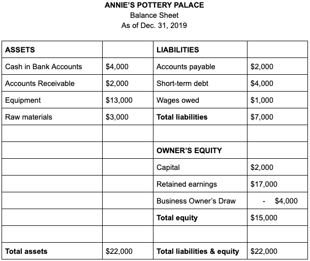

In the modern financial ecosystem, the interplay between financial responsibilities, accounting obligations, liabilities, and algorithmic trading is more significant than ever. The rapid advancement of technology and the increasingly complex global market dynamics have transformed the landscape, making these elements integral to efficient financial management and strategic planning. Financial responsibilities, along with accounting obligations, form the cornerstone of sound financial practices, ensuring that businesses and individuals manage their resources efficiently and maintain transparency and compliance with regulatory standards.

Liabilities represent essential aspects that influence a company's financial position, determining its stability and liquidity. These financial obligations must be carefully managed to ensure sustainable operations and minimize risks. The rise of algorithmic trading has introduced both opportunities and challenges, reshaping the way trades are executed in the financial markets. This form of trading utilizes sophisticated algorithms to perform high-speed transactions, enhancing liquidity and reducing costs but requiring robust risk management due to increased market volatility.



Understanding these components is crucial for businesses, investors, and financial professionals as they navigate the complexities of today’s financial landscape. This article aims to provide an in-depth analysis of these concepts, exploring how they interrelate and impact financial decisions. By examining the influence of algorithmic trading on financial responsibilities and liabilities, we aim to highlight both the opportunities it presents and the challenges it poses. This comprehensive examination will offer insights into managing financial trust effectively within this evolving environment, ensuring compliance, strategic advantage, and sustained business success.

## Table of Contents

## Financial Responsibilities and Accounting Obligations

Financial responsibilities are fundamental to effective financial management, requiring businesses and individuals to strategically allocate resources, manage debts, and invest wisely. Key responsibilities include budgeting, monitoring cash flows, and ensuring that financial commitments, such as loan repayments and operational expenses, are met promptly. Proper management of these responsibilities contributes to the stability and growth of an entity, fostering long-term profitability and sustainability.

Accounting obligations are integral to maintaining transparency and accountability within an organization. They involve the systematic recording, analyzing, and reporting of financial transactions in accordance with established accounting standards, such as Generally Accepted Accounting Principles (GAAP) or International Financial Reporting Standards (IFRS). These principles ensure that financial statements provide an accurate and fair view of a company's financial position, performance, and cash flows, facilitating informed decision-making by stakeholders, including investors, creditors, and regulatory bodies.

Compliance with accounting obligations involves several critical tasks, including the preparation of balance sheets, income statements, and cash flow statements. Businesses must also adhere to specific deadlines for financial reporting to meet the requirements set by regulatory authorities. Inaccurate or delayed reporting can lead to legal penalties, financial losses, and reputational damage, underscoring the importance of rigorous adherence to accounting principles.

The reliability of financial data is paramount, and businesses often implement robust internal controls to safeguard against errors and fraud. These controls might include segregation of duties, regular audits, and the use of advanced accounting software. Such measures increase the accuracy of financial reporting and decrease the likelihood of fiscal mismanagement, enhancing stakeholder confidence.

The integration of technology in accounting practices is increasingly prevalent. Automated accounting systems streamline the process of data entry, reconciliation, and reporting, reducing manual errors and improving efficiency. Emerging technologies like blockchain and [artificial intelligence](/wiki/ai-artificial-intelligence) are further reshaping accounting by introducing greater transparency, security, and predictive analytics capabilities.

Effective management of financial responsibilities and accounting obligations is crucial for compliance with regulatory standards. Regulatory bodies like the Securities and Exchange Commission (SEC) and the Financial Accounting Standards Board (FASB) set the framework within which these practices are mandated. Adhering to these guidelines is not only a legal requirement but also vital for maintaining the trust of investors and other financial stakeholders.

In summary, financial responsibilities and accounting obligations form the backbone of sound financial management. They enable businesses to make informed decisions, optimize resource allocation, and comply with regulatory standards, all of which are essential for ensuring financial health and fostering sustainable growth.

## Understanding Liabilities

Liabilities are crucial components of a company's balance sheet and represent its financial obligations to external parties. These obligations can significantly impact the company's financial position, influencing both its [liquidity](/wiki/liquidity-risk-premium) and overall valuation.

Liabilities are typically classified into two categories:

1. **Current Liabilities**: These are obligations that a company expects to settle within a year. They include accounts payable, short-term loans, and other accrued expenses. Current liabilities are important indicators of a company's short-term financial health as they are directly related to its liquidity. A company with high current liabilities compared to its current assets may struggle to fulfill its short-term obligations, potentially resulting in financial distress.

2. **Long-Term Liabilities**: These are obligations payable over a period longer than one year. Common examples include bonds payable, long-term loans, and lease obligations. Long-term liabilities are crucial for understanding a company's long-term financial commitments and its ability to manage these over time. They can impact a company's valuation because they represent future outflows of cash that need to be accounted for in any financial analysis.

Understanding liabilities is essential for evaluating a company's financial stability and risk profile. For instance, a high level of long-term liabilities can indicate that a company relies heavily on debt financing, which can pose risks if the company fails to generate adequate cash flow to meet its debt obligations. Conversely, low levels of liabilities may suggest a conservative approach to financing, potentially limiting growth opportunities.

The relationship between liabilities and liquidity is captured by several financial ratios, such as the current ratio and the quick ratio. These provide insights into a company's ability to meet its short-term liabilities with its short-term assets:

- **Current Ratio** = $\frac{\text{Current Assets}}{\text{Current Liabilities}}$

- **Quick Ratio** = $\frac{\text{Current Assets} - \text{Inventories}}{\text{Current Liabilities}}$

Both ratios help investors and analysts assess the sufficiency of a company's liquid assets to cover its immediate obligations.

Financial liabilities also play a role in a company's overall valuation. For example, when valuing a company using the discounted cash flow (DCF) method, liabilities are deducted from the enterprise value to arrive at the equity value. This process underscores the importance of liabilities in determining the value distributed to shareholders after settling all debts.

In the context of financial analysis, understanding a company's liabilities is not limited to merely recognizing them on the balance sheet. It requires a comprehensive assessment of the obligations' terms, interest rates, and possible covenants, which can influence the company's operational decisions and future financial strategies.

In summary, liabilities significantly affect a company's financial position, liquidity, and valuation. A thorough understanding enables stakeholders to assess financial stability, manage risk effectively, and make informed investment decisions.

## The Rise of Algorithmic Trading

Algorithmic trading refers to the use of computational algorithms to automate trading processes, executing orders at speeds and frequencies that are beyond the capacity of human traders. This approach leverages mathematical models and statistical analysis to determine the timing, pricing, and quantity of trades, ultimately enhancing decision-making in financial markets.

One of the primary advantages of [algorithmic trading](/wiki/algorithmic-trading) is increased liquidity. By deploying automated systems capable of processing large volumes of transactions quickly, market participants can ensure that buy and sell orders are matched efficiently, reducing the spread between bid and ask prices. This heightened liquidity facilitates smoother market operations and provides opportunities for traders to execute positions at desired prices.

Algorithmic trading also reduces transaction costs. Traditional trading processes involve manual order entry and decision-making that can be sluggish and error-prone. Algorithms, however, swiftly analyze market conditions and execute trades with minimal human intervention, cutting down on costs associated with human resources and potential trading inefficiencies. These systems can optimize order placement by deciding whether to aggregate orders or split them into smaller units based on prevailing market conditions.

Improved trading efficiency is another hallmark of algorithmic trading. Algorithms operate with a precision and consistency that human traders may struggle to maintain, leveraging data-driven strategies to capitalize on short-lived market opportunities. They can rapidly react to market indicators and trends, ensuring traders do not miss out on profitable ventures. Here's a basic example of how a trading algorithm might be set up in Python:

```python
def simple_moving_average_strategy(prices, window_size):
    moving_average = []
    for i in range(len(prices) - window_size + 1):
        window = prices[i:i + window_size]
        moving_average.append(sum(window) / window_size)
    return moving_average

# Sample data: historical prices
prices = [100, 102, 101, 104, 107, 105, 108, 111, 109, 110]
window_size = 3

sma = simple_moving_average_strategy(prices, window_size)
print(sma)
```

While algorithmic trading offers significant benefits, it also presents challenges, particularly in terms of market [volatility](/wiki/volatility-trading-strategies). The speed and [volume](/wiki/volume-trading-strategy) at which trades are executed can cause rapid price fluctuations, potentially leading to increased market turbulence. Moreover, erroneous algorithms or flawed strategies can exacerbate volatility and result in substantial financial losses.

The necessity for stringent risk management protocols cannot be overstated. Firms engaged in algorithmic trading must implement robust risk management frameworks to monitor algorithm performance and ensure compliance with market regulations. Real-time data feeds, back-testing of trading algorithms, and continual optimization are critical components of effective risk management practices.

As algorithmic trading continues to evolve, it is reshaping the financial markets by democratizing access to advanced trading strategies previously available only to institutional investors. Retail investors are increasingly leveraging algorithmic platforms, contributing to market diversity and complexity. However, the ongoing transformation requires traders and investors to remain vigilant, adapting to new technologies and regulatory developments to harness the full potential of algorithmic trading without succumbing to its associated risks.

## Financial Liabilities and Algorithmic Trading: An Interconnected Relationship

Algorithmic trading has become a significant force within financial markets, influencing a company's financial liabilities through its ability to swiftly alter market conditions and risk profiles. By automating trading decisions, algorithmic systems can lead to rapid changes in asset prices, impacting the valuation of a company’s liabilities. The ability to accurately price these liabilities becomes paramount as market conditions fluctuate dynamically.

To manage financial liabilities under the influence of algorithmic trading, businesses must adopt robust risk management strategies. This involves employing predictive analytics and [machine learning](/wiki/machine-learning) techniques to anticipate market movements and adjust positions accordingly. For example, predictive models can be employed to forecast market volatility, allowing companies to hedge their liabilities effectively.

Understanding the regulatory frameworks governing algorithmic trading is crucial for financial reporting and compliance. The Markets in Financial Instruments Directive II (MiFID II) in Europe and the Securities and Exchange Commission (SEC) regulations in the United States require stringent controls over algorithmic trading processes to ensure market integrity and transparency. Businesses must implement compliance measures that not only monitor the performance of algorithmic strategies but also document their operations to satisfy regulatory requirements.

The impact of algorithmic trading on financial liabilities highlights the importance of maintaining an optimal balance between exploiting the efficiencies of automated trading and managing the associated risks. This requires ongoing adjustments to a company's financial strategies, including liquidity management and debt scheduling, to accommodate changes in trading environments. Companies must also remain vigilant about the potential for market disruptions caused by algorithmic trading errors or systemic risks, which can exacerbate financial liabilities.

In conclusion, the interplay between financial liabilities and algorithmic trading is complex, necessitating a comprehensive understanding of both market dynamics and regulatory obligations. By leveraging advanced technologies and adhering to sound financial practices, businesses can effectively manage liabilities in the face of rapidly evolving trading systems and achieve sustainable financial operations.

## Conclusion

The integration of financial responsibilities, accounting obligations, liabilities, and algorithmic trading poses significant opportunities and challenges in today's complex financial landscape. Understanding each element and their interconnections enables businesses and investors to navigate financial risks more effectively, thereby maximizing market opportunities.

Financial responsibilities are integral to sound management practices. Effective management of these responsibilities is essential for maintaining stability and fostering growth. Accounting obligations, which include maintaining transparency and adhering to regulatory standards, serve as a fundamental aspect of financial integrity. By meeting these obligations, entities can ensure they are making well-informed decisions that align with legal and ethical standards.

Liabilities, whether current or long-term, are key indicators of a company’s financial health. Accurately assessing liabilities enables a clearer understanding of a company’s liquidity and risk profile, critical for valuation and strategic planning. Algorithmic trading, with its ability to execute trades at unprecedented speed, offers enhanced liquidity and reduced transaction costs. However, this technological advancement also introduces heightened market volatility and necessitates robust risk management frameworks.

Continuous learning and adaptability to regulatory changes are critical as technology continues to evolve. The dynamic nature of financial regulations, especially concerning algorithmic trading, requires vigilance and proactive adjustments to strategies. Staying compliant and informed about regulatory standards ensures that businesses and investors can leverage financial innovations while mitigating potential risks.

In conclusion, by comprehensively understanding financial responsibilities, accounting obligations, liabilities, and algorithmic trading, stakeholders can better position themselves to thrive in the financial landscape. Achieving strategic goals involves balancing these complexities and remaining responsive to technological and regulatory changes. As the financial environment continues to evolve, staying informed and compliant becomes paramount in capitalizing on opportunities and ensuring sustainable operations.

## References & Further Reading

[1]: Bergstra, J., Bardenet, R., Bengio, Y., & Kégl, B. (2011). ["Algorithms for Hyper-Parameter Optimization."](https://papers.nips.cc/paper/4443-algorithms-for-hyper-parameter-optimization) Advances in Neural Information Processing Systems 24.

[2]: ["Advances in Financial Machine Learning"](https://www.amazon.com/Advances-Financial-Machine-Learning-Marcos/dp/1119482089) by Marcos Lopez de Prado

[3]: ["Evidence-Based Technical Analysis: Applying the Scientific Method and Statistical Inference to Trading Signals"](https://www.wiley.com/en-us/Evidence+Based+Technical+Analysis%3A+Applying+the+Scientific+Method+and+Statistical+Inference+to+Trading+Signals-p-9780470008744) by David Aronson

[4]: ["Machine Learning for Algorithmic Trading"](https://github.com/PacktPublishing/Machine-Learning-for-Algorithmic-Trading-Second-Edition) by Stefan Jansen

[5]: ["Quantitative Trading: How to Build Your Own Algorithmic Trading Business"](https://books.google.com/books/about/Quantitative_Trading.html?id=j70yEAAAQBAJ) by Ernest P. Chan