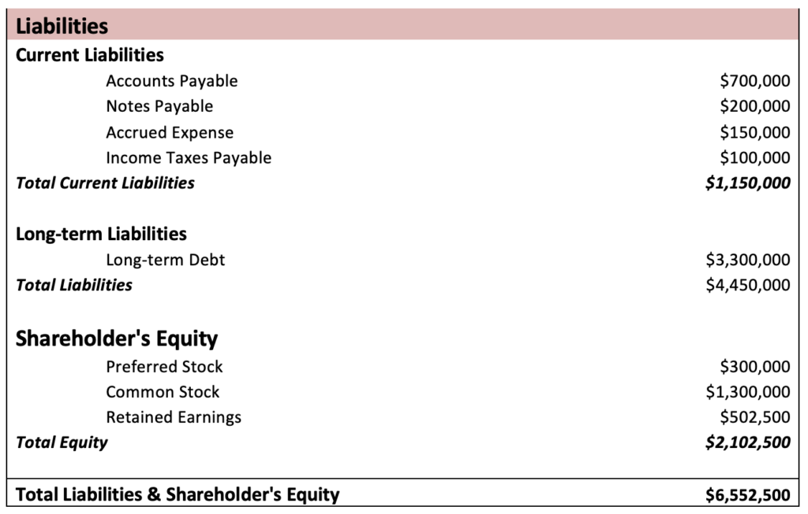

## Table of Contents

## What is a balance sheet?

A balance sheet is a financial statement that shows what a company owns and what it owes at a specific time. It's like a snapshot of the company's financial health. The balance sheet has two main parts: assets, which are things the company owns like money, buildings, and equipment; and liabilities, which are debts the company needs to pay, like loans or bills.

The balance sheet also includes something called equity, which is the difference between the company's assets and liabilities. Equity represents the owner's share in the business. The basic idea behind a balance sheet is that the total value of the assets must equal the total of liabilities plus equity. This is why it's called a balance sheet – because it balances out. By looking at a balance sheet, people can see if a company is doing well financially or if it might be struggling.

## What are liabilities?

Liabilities are all the debts that a company has to pay. Think of them as the opposite of assets. If assets are what a company owns, liabilities are what a company owes. This can include things like loans from a bank, money owed to suppliers for goods or services, or salaries that need to be paid to employees. Even taxes that the company hasn't paid yet count as liabilities.

Liabilities are important because they show how much money a company needs to pay back in the future. They are listed on the balance sheet, which helps people see the financial health of the company. If a company has a lot of liabilities compared to its assets, it might be in a risky situation. But if it has more assets than liabilities, it's generally seen as financially stable. Keeping track of liabilities helps a company plan and manage its money wisely.

## How are liabilities categorized on a balance sheet?

Liabilities on a balance sheet are split into two main groups: current liabilities and long-term liabilities. Current liabilities are debts that a company needs to pay within one year. This can include things like bills from suppliers, short-term loans, and salaries that need to be paid soon. These are important because they show how much money the company needs to find quickly to keep running smoothly.

Long-term liabilities, on the other hand, are debts that the company doesn't have to pay back within the next year. These can include long-term loans, like a mortgage on a building, or bonds that the company issued to raise money. These liabilities help show the bigger picture of the company's financial commitments over a longer period. By looking at both current and long-term liabilities, people can understand how the company is managing its debts over time.

## What is the difference between current and non-current liabilities?

Current liabilities are debts that a company needs to pay within one year. These include things like bills from suppliers that need to be paid soon, short-term loans, and salaries that the company owes to its employees. Current liabilities are important because they show how much money the company needs to find quickly to keep running smoothly. If a company has a lot of current liabilities, it might need to be careful about how it manages its cash flow.

Non-current liabilities, also known as long-term liabilities, are debts that the company doesn't have to pay back within the next year. These can include long-term loans, like a mortgage on a building, or bonds that the company issued to raise money. Non-current liabilities help show the bigger picture of the company's financial commitments over a longer period. By looking at both current and non-current liabilities, people can understand how the company is managing its debts over time and whether it has a solid plan for the future.

## Can you provide examples of current liabilities?

Current liabilities are the debts a company needs to pay within a year. One common example is accounts payable, which is money the company owes to suppliers for goods or services it has already received. For instance, if a company bought materials on credit, it would list this as an account payable until it pays the supplier.

Another example of a current liability is short-term loans. These are loans that a company must pay back within a year. A business might take out a short-term loan to cover temporary expenses, like buying inventory or paying for unexpected costs. The loan becomes a current liability because it needs to be paid back soon.

Salaries and wages payable are also current liabilities. This is the money a company owes to its employees for work they have already done but haven't been paid for yet. If a company pays its employees at the end of the month, any unpaid wages at the time of the balance sheet become a current liability.

## Can you provide examples of non-current liabilities?

Non-current liabilities are debts that a company does not have to pay back within a year. One example is a long-term loan, like a mortgage on a building. If a company buys a new office or factory, it might take out a mortgage that it will pay back over many years. This mortgage is a non-current liability because it will take a long time to pay off.

Another example of a non-current liability is bonds that a company issues. When a company needs to raise a lot of money, it might sell bonds to investors. These bonds promise to pay back the money over a long period, often many years. The money the company owes on these bonds is a non-current liability because it won't be paid back quickly.

A third example is deferred tax liabilities. Sometimes, a company can delay paying some of its taxes until later. These delayed taxes become a non-current liability because the company will eventually have to pay them, but not right away. This helps the company manage its money better over time.

## How do liabilities affect a company's financial health?

Liabilities can have a big impact on a company's financial health. If a company has a lot of liabilities, especially current liabilities that need to be paid soon, it might struggle to find enough money to pay them. This can make it hard for the company to keep running smoothly. For example, if a company owes a lot of money to suppliers or has big short-term loans, it might need to use all its cash just to pay these debts. This could mean the company has less money to spend on growing the business or even paying its employees.

On the other hand, if a company manages its liabilities well, it can be in a strong financial position. Having some liabilities, like long-term loans, can actually help a company grow if the money is used wisely. For example, a company might take out a long-term loan to buy a new factory, which could help it make more products and earn more money in the future. The key is to balance the liabilities with the company's assets and income, so it can pay its debts without running into trouble. By keeping an eye on both current and non-current liabilities, a company can plan for the future and stay financially healthy.

## What is the importance of accurately reporting liabilities?

Accurately reporting liabilities is very important for a company. It helps everyone who looks at the company's financial statements, like investors, lenders, and even the company's own managers, to understand the true financial situation. If liabilities are not reported correctly, it can make the company look healthier or riskier than it really is. This can lead to bad decisions, like giving the company more money when it can't pay it back, or not giving it money when it actually needs it.

When liabilities are reported accurately, it also helps the company plan better. Knowing exactly what the company owes and when it needs to pay it helps managers make smart choices about spending and saving. It also builds trust with people outside the company. If investors and lenders see that the company always reports its liabilities honestly, they are more likely to trust the company and do business with it. This can help the company get the money it needs to grow and succeed.

## How do changes in liabilities impact the balance sheet?

When liabilities change, it affects the balance sheet because the balance sheet shows what a company owes. If a company takes on more debt, like a new loan, the liabilities go up. This means the total on the liabilities side of the balance sheet gets bigger. To keep the balance sheet balanced, the other side, which is assets and equity, must also change. Usually, the company might use the new loan to buy something, so assets go up too. Or, if the company doesn't use the money to buy anything, the equity might go down because the company is now worth less since it has more debt.

On the other hand, if a company pays off some of its debt, the liabilities go down. This means the total on the liabilities side of the balance sheet gets smaller. To keep everything balanced, either the assets or the equity must change. If the company used cash to pay off the debt, the assets would go down because the company has less cash. If the company didn't use cash but still paid off the debt, maybe by selling something, then the equity might go up because the company is now worth more since it has less debt.

## What are contingent liabilities and how are they treated on a balance sheet?

Contingent liabilities are possible debts that a company might have to pay in the future, but it's not certain yet. They depend on something happening first, like losing a lawsuit or having to pay a warranty claim. Because it's not sure if these debts will actually happen, they don't show up on the main part of the balance sheet with other liabilities. Instead, companies mention them in the notes to the financial statements, so people know about these possible risks.

If it becomes more likely that a contingent liability will turn into a real debt, the company might need to put it on the balance sheet. For example, if a court rules against the company in a lawsuit, the company would then have to record the amount it owes as a liability. This helps keep the financial statements honest and clear, so everyone knows what the company might have to pay in the future.

## How do companies manage and reduce their liabilities?

Companies manage and reduce their liabilities by carefully planning how they use their money. They might pay off debts quickly if they have extra cash, or they might choose to pay off the debts that have the highest interest rates first. This helps them save money in the long run. They can also try to negotiate better terms with their lenders, like asking for lower interest rates or longer time to pay back the loans. Another way to manage liabilities is by selling off assets that they don't need anymore. This gives them more cash to pay down their debts.

Sometimes, companies can reduce their liabilities by finding new ways to make money. For example, they might start new projects or expand their business to bring in more income. This extra money can then be used to pay off debts faster. Companies also keep a close eye on their spending, making sure they are not taking on new debts unless they really need to. By being smart about how they manage their money, companies can keep their liabilities under control and stay financially healthy.

## What advanced accounting principles apply to the treatment of complex liabilities?

When dealing with complex liabilities, companies use advanced accounting principles to make sure their financial statements are accurate and clear. One important principle is fair value accounting. This means that companies need to estimate what their liabilities are worth in today's market, not just what they were worth when the debt was first taken on. For example, if a company has a long-term loan, they might need to adjust its value on the balance sheet if interest rates change. This helps give a more realistic picture of the company's financial health.

Another principle is the use of provisions and accruals. Provisions are set aside for expected future costs, like fixing a product under warranty or cleaning up an old factory site. Accruals are expenses that the company knows it will have to pay, but hasn't paid yet, like employee bonuses at the end of the year. These principles help companies prepare for future costs and make sure their liabilities are reported correctly. By using these advanced accounting methods, companies can better manage their complex liabilities and give a clearer picture of their financial situation to investors and other stakeholders.

## What are the interconnections between liabilities and algorithmic trading?

Liabilities play a significant role in influencing a company's stock price, which can, in turn, affect [algorithmic trading](/wiki/algorithmic-trading) models. When analyzing a company's financial health, liabilities are crucial components that are directly linked to the risk and valuation assessments carried out by trading algorithms. One of the primary financial ratios that involve liabilities is the debt-to-equity ratio, defined as:

$$
\text{Debt-to-Equity Ratio} = \frac{\text{Total Liabilities}}{\text{Shareholders' Equity}}
$$

This ratio provides insight into the company's financial leverage and risk level. A higher debt-to-equity ratio suggests that a company is more leveraged, implying higher financial risk. Algorithmic trading models may incorporate the debt-to-equity ratio to evaluate company health and predict stock price movements. A sudden change in this ratio could signal a shift in risk profile, prompting an algorithm to adjust its trading strategy accordingly.

The impact of liabilities on market behavior extends beyond individual ratios. Algorithmic trading strategies can benefit from understanding how liabilities affect overall market sentiment and behavior. For instance, an increase in a company's liabilities might trigger bearish sentiment, leading to a potential stock price decline. Algorithms equipped with predictive tools can anticipate such movements, enabling traders to optimize entry and [exit](/wiki/exit-strategy) points.

Risk management is a vital aspect of algorithmic trading, which can be enhanced by integrating liability forecasts. By incorporating predictive models that estimate future changes in a company's liabilities, algorithms can adjust their risk parameters to safeguard against potential adverse effects. For instance, Python libraries like Scikit-learn or TensorFlow can be employed to develop [machine learning](/wiki/machine-learning) models that forecast liabilities based on historical financial data and market conditions. Here's a simple example using Python for forecasting liabilities using linear regression:

```python
import numpy as np
from sklearn.model_selection import train_test_split
from sklearn.linear_model import LinearRegression

# Sample data: historical liabilities and market indicators
X = np.array([[100], [150], [200], [250], [300]])  # Market indicators
y = np.array([120, 180, 220, 260, 320])  # Historical liabilities

# Splitting data into training and testing sets
X_train, X_test, y_train, y_test = train_test_split(X, y, test_size=0.2, random_state=42)

# Creating and fitting the linear regression model
model = LinearRegression()
model.fit(X_train, y_train)

# Predict future liabilities
predicted_liabilities = model.predict(X_test)
print("Predicted Liabilities:", predicted_liabilities)
```

The dynamic nature of liabilities necessitates continual updates and evaluations in algorithmic models to maintain competitiveness. Market conditions and the financial status of companies are ever-changing, impacting liabilities and, consequently, stock prices. Trading algorithms must accommodate real-time data to refine strategies promptly. Integrating data feeds and continuously [backtesting](/wiki/backtesting) algorithmic models can ensure robustness against liability-related anomalies and improve adaptive trading responses.

In conclusion, recognizing the interplay between liabilities and algorithmic trading enriches trading strategies by offering a deeper comprehension of market mechanisms and risk factors, providing traders with a competitive advantage.

## References & Further Reading

[1]: Bergstra, J., Bardenet, R., Bengio, Y., & Kégl, B. (2011). ["Algorithms for Hyper-Parameter Optimization."](https://dl.acm.org/doi/10.5555/2986459.2986743) Advances in Neural Information Processing Systems 24.

[2]: ["Advances in Financial Machine Learning"](https://www.amazon.com/Advances-Financial-Machine-Learning-Marcos/dp/1119482089) by Marcos Lopez de Prado

[3]: ["Evidence-Based Technical Analysis: Applying the Scientific Method and Statistical Inference to Trading Signals"](https://www.amazon.com/Evidence-Based-Technical-Analysis-Scientific-Statistical/dp/0470008741) by David Aronson

[4]: ["Machine Learning for Algorithmic Trading"](https://github.com/stefan-jansen/machine-learning-for-trading) by Stefan Jansen

[5]: ["Quantitative Trading: How to Build Your Own Algorithmic Trading Business"](https://www.amazon.com/Quantitative-Trading-Build-Algorithmic-Business/dp/1119800064) by Ernest P. Chan