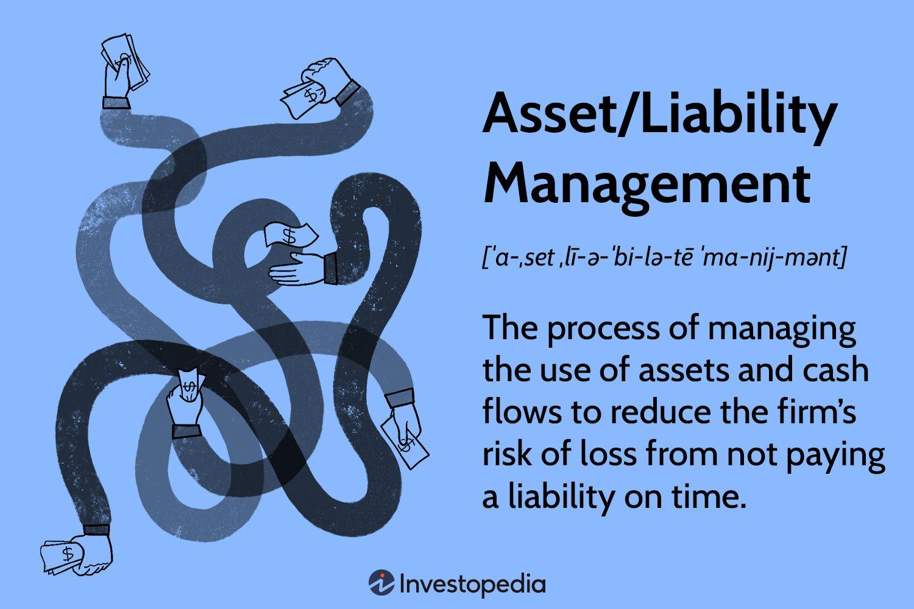

## Table of Contents

## What is liability management?

Liability management is about handling and controlling the debts and obligations a company has. It involves making smart choices about how to use borrowed money and when to pay it back. Companies do this to keep their financial health strong and to make sure they can meet their financial responsibilities without running into trouble.

A big part of liability management is looking at the company's loans, bonds, and other debts to see if they can be paid off in a way that saves money or reduces risk. This might mean paying off some debts early, refinancing to get a lower interest rate, or changing the timing of when debts are due. By managing liabilities well, a company can improve its cash flow, lower its costs, and be better prepared for future financial challenges.

## Why is liability management important for businesses?

Liability management is very important for businesses because it helps them stay financially healthy. By managing their debts and obligations carefully, businesses can make sure they have enough money to pay what they owe on time. This is important because if a business can't pay its debts, it might have to close down or go bankrupt. Good liability management also helps a business use its money more efficiently, so it can invest in growing the company or improving its products and services.

Another reason liability management is important is that it can save businesses money. By looking at all their debts and figuring out the best way to pay them off, a business might be able to get lower interest rates or pay off expensive debts first. This can reduce the total amount of money the business has to pay over time. Also, if a business manages its liabilities well, it can build a good reputation with lenders and investors, which can make it easier to get loans or attract investment in the future.

## What are the different types of liabilities a business might have?

A business can have different types of liabilities. One type is current liabilities, which are debts that need to be paid within a year. These can include things like money owed to suppliers, short-term loans, and wages that need to be paid to employees. Another type is long-term liabilities, which are debts that don't need to be paid for more than a year. These can include long-term loans, mortgages, and bonds that the business has issued.

There are also other types of liabilities that a business might have. Contingent liabilities are possible debts that might happen if certain events occur, like a lawsuit that the business might lose. Another type is operational liabilities, which come from the day-to-day running of the business, like taxes owed or utility bills. Each type of liability needs to be managed carefully to keep the business financially healthy.

## How can a business identify its liabilities?

A business can identify its liabilities by looking at its financial records and statements. This means going through documents like the balance sheet, which shows all the money the business owes at a certain time. The balance sheet lists current liabilities, like money owed to suppliers or short-term loans, and long-term liabilities, like mortgages or bonds. By carefully reviewing these documents, a business can see all its debts and obligations clearly.

Another way to identify liabilities is by keeping track of the business's day-to-day operations. This includes looking at invoices and bills that need to be paid, as well as any contracts or agreements that outline future payments. For example, a business might have a lease agreement for its office space, which is a liability because it needs to make regular rent payments. Also, talking to accountants or financial advisors can help a business spot any liabilities that might not be obvious, like contingent liabilities from potential lawsuits or tax obligations.

By combining these approaches, a business can get a complete picture of all its liabilities. This helps the business plan how to manage and pay off these debts, making sure it stays financially healthy and can keep running smoothly.

## What are some basic strategies for managing liabilities?

One basic strategy for managing liabilities is to prioritize paying off high-interest debts first. This means if a business has different loans, it should focus on the ones that cost the most in interest. By paying these off quickly, the business can save money over time because it won't have to pay as much interest. Another part of this strategy is to try to pay more than the minimum amount due on debts whenever possible. This can help reduce the total amount of debt faster and lower the overall interest costs.

Another strategy is to look for ways to refinance or restructure existing debts. This means a business might be able to get a new loan with a lower [interest rate](/wiki/interest-rate-trading-strategies) to pay off an old loan. This can make the debt cheaper to manage. Also, a business can talk to its lenders about changing the terms of its loans, like extending the time it has to pay them back. This can help the business manage its cash flow better and make sure it can meet its obligations without running into trouble.

A third strategy is to keep a close eye on the business's cash flow. This means making sure the business always has enough money coming in to cover its debts. To do this, a business can create a budget and stick to it, making sure it doesn't spend more than it earns. It can also try to increase its income by finding new customers or selling more to existing ones. By managing its cash flow well, a business can make sure it always has the money it needs to pay its liabilities on time.

## How does liability management affect a company's financial health?

Liability management is really important for a company's financial health. It helps the company make sure it can pay its debts on time. When a company manages its liabilities well, it can avoid problems like not having enough money to pay what it owes. This keeps the company from getting into financial trouble or even going bankrupt. By paying attention to its debts, a company can also save money by paying off expensive debts first or getting better deals on loans.

Good liability management also helps a company use its money more wisely. When a company knows exactly what it owes and when it needs to pay, it can plan better. This means it can put money into growing the business or improving its products and services instead of just paying off debts. Also, when a company manages its liabilities well, it can build a good reputation with banks and investors. This can make it easier for the company to get loans or attract investment in the future, which helps keep the company strong and healthy financially.

## What role does debt restructuring play in liability management?

Debt restructuring is a key part of liability management. It means changing the terms of a company's debts to make them easier to handle. A company might do this if it's having trouble paying what it owes. By talking to its lenders, a company can get a new agreement that might lower the interest rate on its loans, give it more time to pay, or even reduce the total amount it owes. This can help the company avoid financial trouble and keep running smoothly.

When a company restructures its debt, it can improve its cash flow. This means it has more money coming in than going out, which is important for staying financially healthy. By managing its liabilities this way, a company can focus on growing its business instead of just worrying about paying off debts. Debt restructuring can also help a company keep a good relationship with its lenders, which can be important for getting loans in the future.

## How can liability management strategies vary between industries?

Liability management strategies can be different depending on what kind of business a company is in. For example, in the manufacturing industry, companies often have a lot of money tied up in equipment and inventory. They might focus on managing their long-term debts, like loans for machinery, to make sure they can keep producing goods without running into money problems. They might also try to get good deals on these loans to save money over time.

In the retail industry, businesses might have more short-term liabilities, like money they owe to suppliers for the products they sell. They need to manage their cash flow carefully to make sure they can pay these bills on time. Retail companies might also use strategies like negotiating better payment terms with suppliers or using short-term loans to cover their costs until they can sell their products and get paid.

In the tech industry, companies might have different kinds of liabilities, like debts from raising money to develop new products or services. They might focus on managing these debts in a way that lets them keep investing in innovation. Tech companies might also use strategies like issuing bonds or getting venture capital to manage their liabilities and keep growing. Each industry has its own challenges and needs, so the way they manage their liabilities can be quite different.

## What are advanced techniques for optimizing liability portfolios?

One advanced technique for optimizing liability portfolios is using financial derivatives. These are special financial tools that can help a company manage the risk of its debts. For example, a company might use interest rate swaps to change a variable interest rate loan into a fixed rate loan. This can protect the company from sudden changes in interest rates, making it easier to plan and budget for the future. Another way to use derivatives is through options and futures, which can help a company lock in prices or rates for things it needs to buy or sell, reducing the risk of unexpected costs.

Another technique is to use advanced data analytics and modeling. By collecting and analyzing a lot of financial data, a company can create models that predict how its debts will behave under different scenarios. This can help the company make smarter decisions about when to pay off debts, how to refinance, or even which new debts to take on. For example, a company might use these models to figure out the best time to issue new bonds or to pay off existing loans early, saving money and reducing risk. By using these advanced techniques, a company can manage its liabilities more effectively and keep its financial health strong.

## How do regulatory environments impact liability management practices?

Regulatory environments can have a big impact on how a company manages its liabilities. Different countries and industries have their own rules about how companies can borrow money, how they have to report their debts, and what they need to do to stay in line with the law. For example, some places might have strict rules about how much debt a company can have, or they might require companies to keep certain financial ratios to make sure they can pay back what they owe. These rules can affect how a company decides to structure its debts and what strategies it uses to manage them.

Because of these rules, companies need to be careful and make sure they are following the law when they manage their liabilities. They might need to work with lawyers or financial experts to understand the regulations and make sure they are doing everything right. If a company doesn't follow the rules, it could face fines or other penalties, which could make its financial situation worse. So, understanding and working within the regulatory environment is a key part of good liability management.

## What are the risks associated with poor liability management?

Poor liability management can lead to big problems for a business. If a company doesn't keep track of its debts and pay them on time, it might run out of money. This can make it hard to pay employees, buy supplies, or keep the business running. If the company can't pay its debts, it might have to close down or go bankrupt. This is really bad because it means the business has to stop, and people might lose their jobs.

Another risk is that poor liability management can make it hard for a business to get loans in the future. If a company doesn't pay its debts on time, lenders might not trust it anymore. This can make it difficult to borrow money when the business needs it. Also, if a company has too much debt, it might have to pay a lot of interest, which can eat into its profits. This can make it harder for the business to grow and be successful.

## How can technology and data analytics enhance liability management strategies?

Technology and data analytics can really help businesses manage their debts better. By using special software and tools, companies can keep track of all their debts in one place. This makes it easier to see what they owe and when they need to pay. Data analytics can also help businesses predict how their debts will change in the future. By looking at past data and using computer models, a company can plan ahead and make smart choices about paying off debts or getting new loans.

Using technology also means businesses can do things faster and with fewer mistakes. For example, automated systems can send reminders about when debts are due, so the company doesn't forget to pay on time. Data analytics can also find patterns in how the company uses its money, helping it to see where it might be able to save money or pay off debts more quickly. By using these tools, a company can manage its liabilities more effectively and keep its financial health strong.

## References & Further Reading

[1]: Bergstra, J., Bardenet, R., Bengio, Y., & Kégl, B. (2011). ["Algorithms for Hyper-Parameter Optimization."](https://dl.acm.org/doi/10.5555/2986459.2986743) Advances in Neural Information Processing Systems 24.

[2]: ["Advances in Financial Machine Learning"](https://www.amazon.com/Advances-Financial-Machine-Learning-Marcos/dp/1119482089) by Marcos Lopez de Prado

[3]: ["Evidence-Based Technical Analysis: Applying the Scientific Method and Statistical Inference to Trading Signals"](https://www.amazon.com/Evidence-Based-Technical-Analysis-Scientific-Statistical/dp/0470008741) by David Aronson

[4]: ["Machine Learning for Algorithmic Trading"](https://github.com/stefan-jansen/machine-learning-for-trading) by Stefan Jansen

[5]: ["Quantitative Trading: How to Build Your Own Algorithmic Trading Business"](https://www.amazon.com/Quantitative-Trading-Build-Algorithmic-Business/dp/1119800064) by Ernest P. Chan