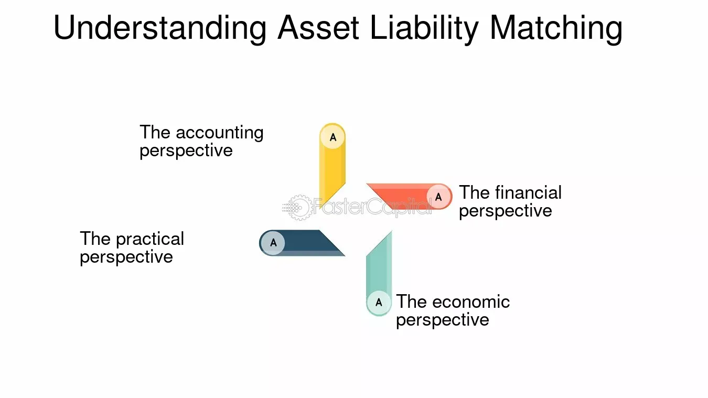

## Table of Contents

## What is liability matching?

Liability matching is a strategy used by companies and investors to make sure they have enough money to pay their future bills and debts. It involves investing in assets that will provide cash at the same time the liabilities are due. For example, if a company knows it has to pay a big bill in five years, it might invest in a bond that matures in five years. This way, when the bill is due, the company can use the money from the bond to pay it.

This strategy is important because it helps reduce the risk of not having enough money when bills are due. It's like planning ahead to make sure you can cover your expenses. Many pension funds and insurance companies use liability matching to make sure they can pay their future obligations to their clients. By carefully matching their investments to their liabilities, they can better manage their financial health and avoid potential problems.

## Why is liability matching important for financial planning?

Liability matching is important for financial planning because it helps make sure that you have enough money to pay your bills when they are due. It's like planning ahead so you don't run out of money at the wrong time. For example, if you know you have to pay for a big expense in the future, like a car loan or a house down payment, you can invest in something that will give you the money right when you need it. This way, you can avoid the stress and problems that come from not having enough money when you need it.

This strategy is especially useful for big organizations like pension funds and insurance companies. These organizations have to pay out money to their clients at specific times in the future, and they need to make sure they have the funds ready. By using liability matching, they can invest in assets that will mature at the same time their payments are due. This helps them manage their money better and keep their clients happy. It's all about being prepared and making sure the money is there when it's needed.

## Can you explain the basic mechanism of liability matching?

Liability matching works by making sure that the money you get from your investments comes in at the same time you need to pay your bills. Imagine you know you have to pay a big bill in three years. You could buy a bond that will give you money back in three years. When the bond matures and gives you your money, you can use it to pay that bill. This way, you don't have to worry about where the money will come from when the bill is due.

This strategy is important because it helps you plan ahead and avoid running out of money at the wrong time. For example, if you're saving for your child's college education, you might invest in a savings plan that matures when your child is ready to go to college. By matching the time when you get money from your investments with the time you need to pay for things, you can make sure you have enough money when you need it. It's all about being prepared and making smart choices with your money.

## What are the key components involved in liability matching?

Liability matching involves a few key components that help make sure you have enough money when you need it. The first component is knowing when your bills or debts are due. This means you need to have a clear understanding of your future financial obligations. For example, if you have a loan payment due in five years, you need to know that exact date. The second component is choosing the right investments. These investments should give you money back at the same time your bills are due. For instance, you might buy a bond that matures in five years to match that loan payment.

The third component is timing. It's important to make sure that the money from your investments comes in at the right time. If your investment matures too early, you might have to find another place to keep the money until you need it, which could mean losing some of it to fees or inflation. If it matures too late, you might not have the money when you need it. The fourth component is risk management. Even though you're trying to match your liabilities, there's always some risk involved. You need to think about what might go wrong and have a backup plan. By carefully managing these components, you can make sure you're ready to pay your bills when they come due.

## How does liability matching differ from asset-liability management?

Liability matching and asset-liability management are both strategies to make sure you have enough money to pay your bills, but they work a bit differently. Liability matching is all about making sure the money you get from your investments comes in at the same time you need to pay your bills. For example, if you know you have to pay a big bill in three years, you might buy a bond that gives you money back in three years. This way, when the bill is due, you have the money ready to pay it. It's like planning ahead to make sure you don't run out of money at the wrong time.

Asset-liability management, on the other hand, looks at the bigger picture. It's not just about matching the timing of your investments and bills, but also about managing the overall risk and balance between your assets and liabilities. This means thinking about how changes in interest rates, inflation, or the economy might affect your money. For example, a bank might use asset-liability management to make sure it has enough money to cover all its loans and deposits, even if interest rates go up or down. It's a more complex strategy that involves a lot of planning and adjusting to make sure everything stays in balance.

## What are some common strategies used in liability matching?

One common strategy in liability matching is using bonds that mature at the same time as your bills are due. For example, if you know you have to pay a big bill in five years, you might buy a bond that will give you your money back in five years. This way, when the bill comes, you have the money ready to pay it. Another strategy is using a ladder approach, where you buy several bonds that mature at different times. This can help you spread out when you get your money back, so you can cover smaller bills at different times.

Another strategy is using insurance products, like annuities, to match your liabilities. Annuities can be set up to give you a regular income starting at a specific time in the future, which can be useful if you have ongoing bills like a mortgage or retirement expenses. Some people also use savings accounts or certificates of deposit (CDs) that mature at the same time as their liabilities. These are safer investments, but they might not grow your money as much as bonds or other investments. By choosing the right mix of these strategies, you can make sure you have enough money when you need it.

## Can you provide an example of liability matching in practice?

Imagine a family knows they have to pay for their child's college tuition in 10 years. They decide to use liability matching to make sure they have enough money when the time comes. They find a bond that will give them their money back in exactly 10 years. They buy this bond with the amount they need for the tuition. When the bond matures in 10 years, they can use the money to pay for their child's college without worrying about where the money will come from.

This example shows how liability matching can help people plan ahead. By choosing an investment that matures at the same time as a big expense, like college tuition, the family can feel more secure. They know exactly where the money is coming from and when it will be available. This strategy helps them avoid the stress of trying to come up with a large amount of money at the last minute.

## What are the potential risks associated with liability matching?

One risk of liability matching is that the investments might not perform as expected. For example, if you buy a bond to match a future bill, the bond might default or the company issuing it might go bankrupt. This means you might not get your money back when you need it. Another risk is that interest rates might change. If rates go up after you buy your bond, you might miss out on better returns from other investments. This can make it harder to cover your bills if your investment doesn't grow as much as you hoped.

Another risk is timing. Even if you pick an investment that matures at the right time, there's always a chance that something unexpected happens. For example, if you need the money a bit earlier than planned, you might have to sell your investment early and lose money. Also, if you're using a ladder approach with several investments, it can be hard to match everything perfectly. If one investment doesn't work out, it might throw off your whole plan. So, while liability matching can help you plan ahead, it's important to be ready for things that might go wrong.

## How do interest rate changes impact liability matching strategies?

Interest rate changes can really affect liability matching strategies. If interest rates go up after you buy a bond to match a future bill, you might miss out on better returns from other investments. This means your money might not grow as much as you hoped, and it could be harder to cover your bills. On the other hand, if interest rates go down, the bond you bought might be worth more than when you bought it, which is good. But it also means that if you need to borrow money later, it might be cheaper, so you might not need as much from your investments.

To deal with these changes, people using liability matching need to be ready to adjust their plans. They might need to buy different kinds of investments or change how much they invest. For example, if interest rates are expected to go up, they might choose shorter-term bonds so they can reinvest at higher rates sooner. If rates are expected to go down, they might lock in longer-term bonds to keep the higher rate. It's all about staying flexible and keeping an eye on what's happening with interest rates to make sure their money is there when they need it.

## What role does duration matching play in liability matching?

Duration matching is a way to make sure that the time it takes for your investments to pay off matches the time when you need to pay your bills. It's like setting a timer on your investments so they give you money back at the right time. For example, if you know you have to pay a big bill in five years, you might choose an investment that lasts exactly five years. This way, when the bill comes, your investment will be ready to give you the money you need.

Duration matching helps reduce the risk that comes from changes in interest rates. If interest rates go up or down, it can change how much your investments are worth. By matching the duration of your investments to when your bills are due, you can make sure that changes in interest rates don't mess up your plans too much. It's all about planning ahead and making sure your money is there when you need it, even if things like interest rates change.

## How can liability matching be optimized for pension funds?

Pension funds use liability matching to make sure they have enough money to pay their members' pensions when they are due. They do this by investing in things like bonds that will give them money back at the same time they need to pay out pensions. For example, if a pension fund knows it has to pay pensions to a group of people in 10 years, it might buy bonds that will mature in 10 years. This way, when the pensions are due, the fund can use the money from the bonds to pay them. It's important for pension funds to plan ahead like this so they don't run out of money when their members need it.

To optimize liability matching for pension funds, they need to think about things like interest rates and how long their investments will last. If interest rates change, it can affect how much money the fund gets from its investments. So, the fund might use a strategy called duration matching, where they make sure the length of their investments matches when the pensions are due. This helps them handle changes in interest rates better. Also, pension funds might use a mix of different investments, like bonds and other safe options, to make sure they have enough money no matter what happens. By planning carefully and using these strategies, pension funds can make sure they can pay their members' pensions on time.

## What advanced techniques are used to enhance the effectiveness of liability matching?

One advanced technique used to enhance the effectiveness of liability matching is called cash flow matching. This involves carefully choosing investments that will give you money back at the same times you need to pay your bills. For example, if a pension fund knows it has to pay pensions to a group of people at different times, it can buy bonds that mature at those exact times. This way, the fund can make sure it has enough money to cover each payment without worrying about selling investments early or waiting for them to mature.

Another technique is using derivatives, like interest rate swaps or options, to manage the risks that come from changes in interest rates. If interest rates go up or down, it can affect how much money you get from your investments. By using derivatives, you can protect yourself from these changes and make sure your investments still give you the money you need when your bills are due. These advanced techniques help make liability matching more effective by reducing risks and making sure the money is there when you need it.

## What is the Role of Liability Matching in Financial Strategy?

Liability matching is a fundamental component in shaping a robust financial strategy, particularly for entities with long-term obligations. At its core, liability matching involves aligning investment strategies with anticipated financial commitments. This approach is crucial in ensuring that sufficient funds are available to meet future liabilities, thereby minimizing financial risk.

In financial management, liability matching is paramount for pension funds and insurance companies. These organizations have clear, long-term obligations that require them to make scheduled payments over time. For example, a pension fund must ensure it has enough assets to meet the future pension payments of its beneficiaries. Similarly, an insurance company must be ready to fulfill claims against the policies it underwrites.

By aligning investments with these obligations, organizations can mitigate the risks associated with market [volatility](/wiki/volatility-trading-strategies), [interest rate](/wiki/interest-rate-trading-strategies) fluctuations, and other economic variables. The fundamental idea is to structure a portfolio in a way that the cash inflows from investments coincide with the cash outflows required to meet liabilities, thus ensuring [liquidity](/wiki/liquidity-risk-premium) and financial stability.

The process of liability matching often involves the use of financial instruments such as bonds. For instance, duration matching is a common technique where the duration of assets is matched with the duration of liabilities. This technique effectively insulates the portfolio from interest rate changes. The formula for duration matching is given by:

$$
\text{Duration of assets} = \text{Duration of liabilities}
$$

By using such techniques, organizations can mitigate the impact of interest rate movements on their portfolios.

In practical applications, liability-driven investment (LDI) strategies are employed. These strategies often use derivative instruments such as interest rate swaps and futures to hedge against interest rate risks. According to a study by the CFA Institute, LDI helps in achieving a better alignment of assets and liabilities, leading to improved funding status and reduced risk of shortfall (CFA Institute, Liability-Driven Investment Strategies).

While liability matching offers significant risk mitigation benefits, it also requires careful planning and expertise. The identification of liabilities and accurate forecasting of cash flows are essential steps in this process. Furthermore, the ability to adapt liability matching strategies to changing market conditions is imperative for sustained financial health.

In conclusion, liability matching is an indispensable element of financial strategy, offering a structured approach to meet financial commitments with reduced risk. Its importance to pension funds, insurers, and similar entities cannot be overstated, making it a critical consideration for effective investment management.

## References & Further Reading

[1]: CFA Institute. ["Liability-Driven Investment Strategies."](https://blogs.cfainstitute.org/investor/2017/11/21/beyond-modern-portfolio-theory-liability-driven-investment-strategies/) CFA Institute.

[2]: Markowitz, H. (1952). ["Portfolio Selection."](https://onlinelibrary.wiley.com/doi/abs/10.1111/j.1540-6261.1952.tb01525.x) The Journal of Finance, 7(1), 77-91.

[3]: Lopez de Prado, M. (2018). ["Advances in Financial Machine Learning."](https://www.amazon.com/Advances-Financial-Machine-Learning-Marcos/dp/1119482089) Wiley.

[4]: Chan, E. P. (2008). ["Quantitative Trading: How to Build Your Own Algorithmic Trading Business."](https://github.com/egorpe/EPChan-QuantitativeTrading/blob/master/example7_6.m) Wiley.

[5]: Patel, S. A., & Jansen, S. (2018). ["Machine Learning for Algorithmic Trading."](https://scholar.google.com/citations?user=dRKfiYQAAAAJ&hl=en) Packt Publishing.

[6]: Aronson, D. R. (2006). ["Evidence-Based Technical Analysis: Applying the Scientific Method and Statistical Inference to Trading Signals."](https://www.amazon.com/Evidence-Based-Technical-Analysis-Scientific-Statistical/dp/0470008741) Wiley.