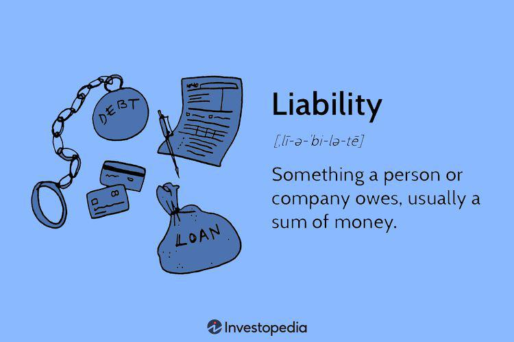

In the rapidly evolving world of finance, risk management has emerged as a vital component of any comprehensive financial strategy. The dynamic nature of financial markets demands that organizations not only focus on maximizing returns but also managing and mitigating risks effectively. This article examines the intricate relationship between risk management, financial strategy, liability swaps, and algorithmic trading—a confluence that offers new avenues for optimizing financial performance.

Risk management involves identifying, assessing, and prioritizing risks to implement strategies that minimize and control their adverse impacts. By aligning risk management with financial strategy, organizations can better withstand financial disruptions and capitalize on market opportunities. The integration of technological advancements has further transformed traditional risk management approaches, allowing for real-time analytics and informed decision-making.



Central to this discussion are liability swaps, a type of financial derivative used to manage interest rate and currency exposure risks. In these swaps, cash flow exchanges between two parties facilitate the conversion of fixed interest rates to floating rates or vice versa, aiding organizations in aligning liability cost structures with their asset management strategies. By effectively employing liability swaps, financial institutions can align their liability profiles with their strategic financial goals, thus enhancing their risk management frameworks.

Algorithmic trading, another critical component, leverages sophisticated algorithms to execute trades at remarkable speeds and volumes. This trading mechanism not only enhances efficiency and reduces costs but also introduces model risks that require robust risk management strategies. Ensuring the accurate validation and adaptation of these algorithms to market conditions is crucial for minimizing risk and enhancing outcomes in financial markets.

The interplay between liability swaps and algorithmic trading represents an innovative frontier in financial risk management. Algorithmic models can refine liability swap execution, enhancing precision and reducing the risk of adverse market movements. As financial institutions continue to leverage these technologies, they must also navigate challenges such as counterparty risks and the ongoing need for compliance with regulatory standards.

To remain competitive, financial professionals and institutions must understand and exploit the synergies between these elements—risk management practices, liability swaps, and algorithmic trading. The current landscape and future prospects of these tools underscore their relevance in the modern financial ecosystem, offering pathways to improved financial performance and risk mitigation. This article aims to provide insights and knowledge beneficial for those seeking to enhance their organization's risk management frameworks, arming them with the tools necessary for navigating the complexities of today's financial world.

## Table of Contents

## Risk Management in Financial Strategy

Effective risk management is a cornerstone of any robust financial strategy, vital for navigating the complexities and uncertainties inherent in financial markets. It encompasses the processes of identifying, assessing, and prioritizing risks to minimize and control their potential impact. Implementing a comprehensive risk management strategy ensures an organization can not only withstand financial disruptions but also capitalize on market opportunities when they arise.

Incorporating risk management into financial strategy involves various tools and techniques that serve to safeguard an organization's financial health. Diversification is a fundamental method, allowing for the spread of investments to reduce exposure to any single asset or risk [factor](/wiki/factor-investing). Hedging strategies further mitigate potential losses by taking offsetting positions in related securities, while financial derivatives such as swaps play a crucial role in managing specific risks like [interest rate](/wiki/interest-rate-trading-strategies) or currency fluctuations.

Swaps are particularly notable as they allow organizations to exchange cash flow streams, which can be instrumental in aligning the cost structures of liabilities with asset management strategies. For instance, an interest rate swap could convert fixed rate obligations into floating ones, thereby optimizing interest rate exposure in varying market conditions.

The integration of advanced technologies has significantly bolstered risk management capabilities, facilitating real-time risk assessment and decision-making. Advanced data analytics and [artificial intelligence](/wiki/ai-artificial-intelligence) enable the rapid processing of vast quantities of financial data, improving the accuracy and timeliness of risk assessments. This technological evolution has not only enhanced traditional risk management practices but also introduced new methodologies, allowing for more precise risk quantification and mitigation strategies.

For example, Python has become a preferred language for risk modeling and simulation due to its powerful libraries such as NumPy and Pandas for data manipulation, as well as SciPy and StatsModels for statistical analysis. A simple Monte Carlo simulation for assessing market risk might use Python to simulate a variety of price paths for a given asset, taking into account historical [volatility](/wiki/volatility-trading-strategies) and other market parameters:

```python
import numpy as np

# Parameters
S0 = 100  # Initial stock price
mu = 0.05  # Expected return
sigma = 0.2  # Volatility
T = 1.0  # Time to maturity
num_simulations = 1000  # Number of simulations
num_timesteps = 252  # Number of time steps, e.g., trading days in a year

# Simulate price paths
dt = T / num_timesteps
price_paths = np.zeros((num_simulations, num_timesteps))
price_paths[:, 0] = S0

for t in range(1, num_timesteps):
    z = np.random.standard_normal(num_simulations)
    price_paths[:, t] = price_paths[:, t-1] * np.exp((mu - 0.5 * sigma**2) * dt + sigma * np.sqrt(dt) * z)

# Final prices after T
final_prices = price_paths[:, -1]

# Expected value and risk quantification
expected_final_price = np.mean(final_prices)
value_at_risk_95 = np.percentile(final_prices, 5)  # 5% VaR

print(f"Expected Final Price: {expected_final_price}")
print(f"95% Value at Risk: {S0 - value_at_risk_95}")
```

In conclusion, incorporating effective risk management within financial strategies is essential for financial stability and success. By leveraging a combination of traditional techniques, such as diversification and hedging, with modern technological advancements, financial professionals can enhance their organization's risk management frameworks, ensuring resilience in the face of volatility and uncertainty.

## Understanding Liability Swaps

Liability swaps are a type of financial derivative designed to manage exposure to interest rate and currency risks. These instruments are particularly valuable for organizations aiming to synchronize their liability cost structures with their asset management strategies. 

In a typical liability swap arrangement, two parties agree to exchange cash flows based on differing sets of financial terms. This often involves converting a fixed interest rate exposure to a floating rate exposure, or vice versa. The primary objective is to mitigate the uncertainty associated with interest rate fluctuations. For example, a company with a large amount of fixed-rate debt might enter into a liability swap to pay a floating rate while receiving a fixed rate, effectively converting its obligations to a floating rate exposure. This conversion can help the company better match its cash inflows from assets, which might be more sensitive to interest rate changes.

Beyond interest rate management, liability swaps can also address currency exposure. An organization that has liabilities in multiple currencies may use these swaps to hedge against unfavorable exchange rate movements, thereby stabilizing its financial position.

The functioning of liability swaps hinges on their ability to realign an entity's risk profile. By adjusting the nature of their liabilities, organizations can potentially achieve better alignment with their revenue streams, minimizing the impact of adverse financial conditions. Furthermore, liability swaps offer the flexibility to tailor risk management strategies to specific risk tolerances and financial objectives, enabling dynamic adjustments in response to evolving market conditions.

Despite their advantages, liability swaps also pose certain limitations and risks to financial institutions. Counterparty risk remains a significant concern, as the default by one party in the swap agreement can lead to substantial financial exposure for the other party. Additionally, the pricing and structuring of liability swaps can be complex, requiring sophisticated financial models and assumptions. Such complexity may introduce model risk, where incorrect assumptions or errors in the model could lead to suboptimal or even detrimental outcomes.

Moreover, regulatory compliance is an ever-present challenge, as financial derivatives are subject to stringent oversight and reporting requirements. Institutions must therefore ensure that their liability swap activities adhere to applicable regulations to avoid legal and financial penalties.

In conclusion, while liability swaps are potent tools for managing interest rate and currency risks, they demand careful consideration of their benefits and potential pitfalls. A thorough understanding and prudent management of these factors are essential for financial professionals seeking to leverage liability swaps to enhance their organization's financial stability and strategic alignment.

## Algorithmic Trading and Risk Management

Algorithmic trading has become an indispensable component of modern financial markets, utilizing computational algorithms to execute trades expeditiously and in high volumes. This method leverages data-driven strategies to optimize trade execution, reduce costs, and increase market [liquidity](/wiki/liquidity-risk-premium). The efficiency gained through [algorithmic trading](/wiki/algorithmic-trading) arises from its capacity to process vast quantities of data and execute thousands of transactions within nanoseconds, thus capitalizing on fleeting market opportunities that would be inaccessible through manual trading.

However, the deployment of such high-frequency trading strategies introduces specific risks, particularly model risks. These risks stem from the reliance on algorithmic models that might be susceptible to inaccuracies or misalignments with current market dynamics. Effective risk management in algorithmic trading is therefore crucial to mitigate potential adverse effects. Key strategies include rigorous model validation and continual monitoring, as well as timely updates to trading algorithms to reflect the latest market conditions.

Model validation is an essential process that involves the systematic assessment of algorithmic models to ensure their reliability and robustness. This often requires [backtesting](/wiki/backtesting) strategies using historical data, stress testing under various market scenarios, and deploying [machine learning](/wiki/machine-learning) techniques to enhance predictive capabilities. Moreover, real-time monitoring is employed to track the performance of algorithms actively and to adjust strategies promptly if discrepancies between expected and actual outcomes occur.

In managing model risk, a robust framework might include implementing version control and change management protocols to oversee modifications to trading algorithms. Regular audits and performance reviews are essential to maintain the integrity and accuracy of these models. Additionally, integrating mechanisms for automatic shutdown or manual intervention can prevent catastrophic losses if an algorithmic strategy veers off [course](/wiki/best-algorithmic-trading-courses) due to unforeseen market conditions.

The evolving nature of financial markets implies that model risks will continuously challenge algorithmic trading. As such, the incorporation of artificial intelligence and machine learning into algorithmic trading is on the rise, promising more adaptive and sophisticated models. However, these advanced technologies also bring about complexities that necessitate enhanced risk management frameworks to safeguard financial stability and operational efficiency in algorithmic trading.

In conclusion, while algorithmic trading significantly advances the efficiency and execution capabilities within financial markets, it concurrently necessitates meticulous risk management to address the inherent model risks. Robust validation processes, continuous monitoring, and timely algorithm updates are critical strategies to align algorithmic models with the dynamic nature of financial markets, thereby ensuring the reliability and success of trading operations.

## The Interrelation of Liability Swaps and Algo Trading

The convergence of liability swaps and algorithmic trading represents a transformative development in financial risk management, enhancing both the precision and efficiency of executing liability swaps. This integration leverages algorithmic models to improve the way these swaps are executed, significantly reducing execution risks traditionally associated with manual intervention. 

Algorithmic trading can optimize liability swap execution by employing advanced quantitative models that analyze market conditions in real time. These models utilize a variety of inputs, such as interest rates, currency fluctuations, and counterparty credit risks, to determine the most opportune moments to execute swaps. The algorithms can dynamically adjust pricing strategies and execution parameters, ensuring transactions occur at optimal market conditions. Financial institutions apply these models not only to achieve cost efficiencies but also to mitigate risks associated with timing and market volatility.

A significant benefit of employing algorithmic models in liability swap execution is the ability to process vast volumes of data rapidly, allowing financial institutions to make informed decisions. For example, an algorithm may consider historical data patterns and predictive analytics to forecast future interest rate movements, thereby fine-tuning the swap execution process. This leads to a reduction in execution costs and improved financial outcomes by aligning swap transactions more closely with the institution's risk management objectives.

Exemplifying this integration, case studies highlight instances where institutions have achieved considerable cost savings and risk mitigation through algorithmic execution of liability swaps. For instance, the use of algorithms to manage swap [books](/wiki/algo-trading-books) has enabled banks to dynamically hedge against shifting market conditions, ensuring alignment with their overall risk profile even in volatile markets. These strategies not only enhance precision in executing trades but also allow for real-time adjustments based on the latest market data.

Moreover, algorithmic trading technology is increasingly used by financial institutions to refine their swap pricing models. By utilizing machine learning techniques, these institutions can develop more accurate pricing algorithms that consider a broader range of market variables. This dynamic approach not only optimizes pricing but also aids in uncovering [arbitrage](/wiki/arbitrage) opportunities that may arise due to inefficiencies in the market.

Overall, the integration of algorithmic trading with liability swaps provides considerable advantages in financial risk management. Financial institutions striving for competitive advantage are increasingly adopting these approaches, benefiting from enhanced speed, reduced transaction costs, and improved risk mitigation frameworks. The synergy between these financial tools signifies a promising advancement in the continuous evolution of financial strategies.

## Benefits and Challenges

Liability swaps and algorithmic trading are integral components of contemporary financial risk management strategies, offering a range of benefits and presenting specific challenges that must be navigated carefully.

The primary benefit of utilizing liability swaps lies in their ability to mitigate risk. By enabling organizations to manage their interest rate and currency exposure, liability swaps help align the cost structures of liabilities with asset returns. This alignment is crucial for maintaining financial stability and taking advantage of fluctuating market conditions. Additionally, liability swaps contribute to cost efficiencies by allowing institutions to optimize their borrowing arrangements, thereby reducing interest expenses and achieving a more favorable financial outcome. This optimization extends to streamlined operations, as swaps can simplify complex financial transactions and operations, improving overall efficiency. Moreover, these instruments facilitate access to broader market opportunities by enabling participation in various financial markets and instruments that would otherwise be inaccessible.

Algorithmic trading further enhances these benefits by introducing precision and speed into trade execution. The use of complex algorithms allows for swift decision-making and execution, minimizing the market impact and achieving more favorable trade prices. This automated trading approach not only lowers transaction costs but also expands the reach of trading operations across different time zones and markets, thereby accessing broader market opportunities. Algorithmic trading systems can rapidly process large volumes of data, facilitating the management of diverse portfolios and the exploitation of arbitrage opportunities in multiple markets.

Despite these advantages, both liability swaps and algorithmic trading come with inherent challenges. Counterparty risk is a significant concern, particularly for liability swaps, as the failure of one party to fulfill its contractual obligations can lead to financial losses. Institutions must employ rigorous credit assessments and implement collateral arrangements to mitigate such risks. In the context of algorithmic trading, model errors and the need for continuous validation present ongoing challenges. As market conditions evolve, trading algorithms must be regularly updated and subjected to robust validation processes to ensure accuracy and relevance. Model risk, stemming from the potential inadequacy of the algorithms in capturing market dynamics, necessitates continuous monitoring and improvement.

Furthermore, compliance with regulatory standards introduces an additional layer of complexity. Financial institutions must navigate an ever-shifting regulatory landscape to ensure that their liability swaps and algorithmic trading practices adhere to applicable laws and guidelines. This compliance requires comprehensive documentation, reporting, and adherence to risk management protocols, which can be resource-intensive and demand a high level of expertise.

To effectively balance these benefits and challenges, a comprehensive risk management strategy is essential. Such a strategy should involve diligent risk assessment, ongoing monitoring of market conditions, and agile adaptation of financial instruments and trading algorithms. Institutions must also foster collaboration among risk managers, traders, compliance teams, and technology experts to build robust frameworks that address the multifaceted nature of these financial tools. In doing so, organizations can optimize their financial strategies while safeguarding against potential risks and uncertainties.

## Future Trends and Conclusion

The future of risk management in finance is poised for transformation with the integration of advanced technologies, particularly artificial intelligence (AI) and machine learning. These technologies promise to enhance the sophistication of both liability swaps and algorithmic trading. As AI and machine learning algorithms become more prevalent, their ability to analyze vast datasets can lead to improved decision-making and forecasting in risk management strategies. AI-driven models can analyze patterns in market data to optimize the execution of liability swaps, potentially reducing operational risks and enhancing cost efficiencies.

Algorithmic trading is expected to evolve with greater precision as technology advances, thereby increasing market efficiency. The algorithms are likely to incorporate AI to predict market movements better and adjust trading strategies in real-time, minimizing the impact of unforeseen events. This technological progression necessitates robust systems to mitigate associated risks, such as model drift, where algorithms may underperform due to changes in market conditions.

Regulatory developments are also expected to influence the future landscape significantly. As financial markets become more reliant on technology, regulatory bodies are likely to introduce new frameworks to address challenges posed by automation and the increased complexity of financial instruments. Financial institutions will need to prioritize compliance while leveraging these technologies to gain a competitive edge. This will likely involve investing in robust risk management systems capable of real-time compliance monitoring and anomaly detection.

In conclusion, coupling risk management with advanced financial strategies like liability swaps and algorithmic trading can provide significant advantages in today’s intricate financial ecosystem. By embracing AI and machine learning, financial institutions can stay ahead of emerging risks and continue to innovate. The successful integration of these technologies into financial strategies will be crucial for maintaining competitiveness and optimizing financial performance in the future.

## References & Further Reading

[1]: ["Advances in Financial Machine Learning"](https://www.amazon.com/Advances-Financial-Machine-Learning-Marcos/dp/1119482089) by Marcos Lopez de Prado

[2]: Bergstra, J., Bardenet, R., Bengio, Y., & Kégl, B. (2011). ["Algorithms for Hyper-Parameter Optimization."](https://dl.acm.org/doi/10.5555/2986459.2986743) Advances in Neural Information Processing Systems 24.

[3]: ["Evidence-Based Technical Analysis: Applying the Scientific Method and Statistical Inference to Trading Signals"](https://www.amazon.com/Evidence-Based-Technical-Analysis-Scientific-Statistical/dp/0470008741) by David Aronson

[4]: ["Machine Learning for Algorithmic Trading"](https://github.com/stefan-jansen/machine-learning-for-trading) by Stefan Jansen

[5]: ["Quantitative Trading: How to Build Your Own Algorithmic Trading Business"](https://github.com/LucindaYa/quant-resources/blob/master/Quantitative%20Trading%20How%20to%20Build%20Your%20Own%20Algorithmic%20Trading%20Business.pdf) by Ernest P. Chan