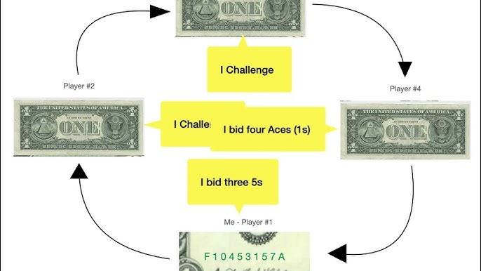

Liar's Poker is an intriguing blend of strategy, psychology, and statistical reasoning, deeply embedded in Wall Street's trading culture. The game, popularized by Michael Lewis's semi-autobiographical book, embodies the competitive nature and risk-taking behavior that characterize financial markets. This article focuses on the intricacies of Liar's Poker, aiming to elucidate its rules, strategies, and its surprising connections to algorithmic trading.

By exploring the fundamentals of Liar's Poker, we can gain valuable insights into finance and automated trading strategies. The game emphasizes elements crucial to these arenas, such as deception, statistical analysis, and decision-making under uncertainty. A solid understanding of Liar's Poker equips an individual with skills relevant to evaluating market trends and predicting competitor actions, echoing the key tactics employed by contemporary algorithmic traders.



The guide that follows will cover the basic rules of Liar's Poker, explore popular strategies to outwit opponents, and examine the cultural impact of Michael Lewis's influential book. For beginners eager to grasp the fundamentals or advanced players aiming to refine their abilities, this comprehensive guide serves as a resource for navigating the dynamic link between gaming and finance.

By closely examining Liar's Poker, enthusiasts and professionals alike can enhance their understanding of risk management and strategic play, drawing parallels to financial markets where similar principles guide successful trading operations.

## Table of Contents

## The Origins of Liar's Poker

Liar's Poker holds a unique place in financial history, closely intertwined with the culture of Wall Street's trading floors. The game's origins are famously chronicled in Michael Lewis's semi-autobiographical book, "Liar's Poker: Rising Through the Wreckage on Wall Street," where it serves as both a literal game played among traders and a metaphor for the high-stakes environment of bond trading during the 1980s.

Michael Lewis's narrative provides readers with a vivid portrayal of Salomon Brothers, a leading investment bank at the time, known for its aggressive trading culture. The book captures the essence of the era, where bond traders engaged in risky speculative practices, often blurring the line between audacity and recklessness. Liar's Poker, played with the serial numbers on dollar bills, encapsulated this culture. Traders would bluff and bet on the frequency of numbers appearing on these bills, mirroring the high-risk decisions they made in their professional dealings.

The game of Liar's Poker, as described by Lewis, became symbolic of the Wall Street ethos—one characterized by deceptive tactics and high-risk speculation. Traders excelled not only in financial acumen but also in psychological manipulation, fostering an atmosphere where confidence and bluffing were as valuable as numerical prowess. This blending of skill, bravado, and deception in the game reflects the strategic maneuverings prevalent in the financial markets.

Understanding the origins of Liar's Poker is pivotal, as it sheds light on the psychological and strategic elements inherent in both the game and the broader financial industry. These elements—bluffing, calculated risk-taking, and psychological insight—continue to influence trading strategies today, demonstrating the enduring relevance of Liar's Poker as a metaphor for Wall Street culture. Michael Lewis's book remains a critical resource for those seeking to comprehend the competitive and often opaque world of finance during the 1980s, offering insights that extend beyond the trading floor to contemporary financial practices.

## How to Play Liar's Poker

Liar's Poker is a game that blends elements of bluffing and statistical analysis, played using U.S. dollar bills. Each participant holds a bill and the aim is to outwit opponents by making strategic bids concerning the printed serial numbers. The game's objective is to effectively bluff about the frequency of particular digits on the dollar bills in play.

To begin, each player examines their bill's serial number. Players take turns making bids on the potential total number of digits present among all the bills in the game. For instance, a player might bid that there are five '7s' across all bills. These bids continue in increasing magnitude, reflecting either total quantity or a higher digit. 

A crucial aspect of Liar's Poker is the capacity for gauging opponents' psychological tactics. Each player must assess the likelihood that the current bid is truthful, based on their bill and any perceived signals from other players. Bidding continues until a player suspects a bluff and challenges the bid, declaring it a 'lie.' 

If a bid is contested, all participants reveal their bills, and the actual frequency of the digits is tallied. If the challenger is correct, and the bid was indeed a bluff, the player who made the incorrect bid loses the round. Conversely, if the contested bid was accurate, the challenger loses. The strategic component lies in knowing not only when to raise the bidding stakes but also discerning the opportune moment to confront perceived dishonesty.

Understanding these mechanics enhances one's ability to navigate the complexities of the game, balancing between analytical strategies and psychological intuition to outmaneuver opponents.

## Strategies for Liar's Poker

Strategies for Liar's Poker involve a nuanced blend of psychological insight and statistical reasoning. Players need to master a balance between analyzing numerical probabilities and interpreting human behavior, which makes the game both intellectually challenging and psychologically complex.

Observing opponents and understanding their betting patterns is a fundamental strategy in Liar's Poker. Players must be vigilant in identifying recurring patterns or tendencies in their opponents' behaviors. This involves not only scrutinizing the frequency and sequence of their bids but also paying close attention to body language and verbal cues that might indicate confidence or hesitation. By doing so, players can better predict the likelihood of an opponent bluffing or holding a strong hand.

Balancing between conservative bidding and aggressive bluffing is paramount. A conservative approach would involve making bids that safely align with one's own hand while careful attention is paid to the numbers revealed during prior rounds. Conversely, aggressive bluffing entails making higher bids to unsettle opponents and force them into revealing their hands or making mistakes. The key lies in reading the room and adjusting one's strategy based on opponents' perceived strengths and weaknesses.

Effective strategy in Liar's Poker also includes knowing when to raise the stakes or when to call a bluff. This decision often hinges on evaluating the risk-reward ratio of current bids and the likelihood of another player's hand surpassing yours. If a player is confident in the statistical probability of their hand being strong, raising the stakes might pressure others into folding, thereby securing a win without reveal. Alternatively, calling a bluff can expose an opponent's vulnerability if you suspect they are overestimating their position.

Understanding the dynamics of the game allows players to make calculated moves to outwit competitors. The serial numbers on U.S. dollar bills, used uniquely in this game, form the foundation for these calculations. Statistical analysis of these numbers can guide decisions about what numerical sequences to prioritize or dismiss in bids. For instance, players can track the distribution of numbers through computational methods. Here is a simple Python approach to analyze frequency:

```python
from collections import Counter

def analyze_serial_numbers(bills):
    serial_numbers = [str(bill) for bill in bills]
    digit_count = Counter("".join(serial_numbers))
    return digit_count

bills = [123456789, 987654321, 112233445]
digit_distribution = analyze_serial_numbers(bills)
print(digit_distribution)
```

This code helps players identify which numbers appear most frequently across multiple bills, and thus, which numbers could be more strategically advantageous to bid on.

By embracing these strategies and maintaining an acute awareness of both statistical elements and psychological dynamics, players can enhance their ability to succeed in Liar's Poker. Understanding not only the numbers on the bills but also the minds behind the bids is crucial to mastering this captivating game.

## Liar's Poker Book Influence

Michael Lewis's "Liar's Poker" is a landmark publication that provides a penetrating view into the bond trading world during the 1980s. The book captures the essence of Wall Street's aggressive and high-stakes environment, focusing on the author's experiences at Salomon Brothers, a dominant force in the financial sector at the time. Lewis vividly describes the culture of risk-taking that pervaded the trading floor, highlighting not only the potential for financial gain but also the ethical lapses that often accompanied such strategies.

The depiction of Wall Street in "Liar's Poker" has significantly shaped public and professional perceptions of finance. Lewis presents a cautionary tale, illustrating the consequences of excessive risk and questionable ethics. This narrative has influenced both critics and practitioners of the financial industry, serving as a reminder of the potential dangers inherent in a profit-driven culture. It underscores the importance of maintaining ethical standards amidst the pursuit of financial success.

Interestingly, some traders have paradoxically adopted "Liar's Poker" as a training guide to emulate the aggressive tactics conveyed within its pages. They view it as a manual of sorts, learning from the experiences recounted by Lewis to navigate and succeed in the competitive world of finance. This approach points to the complexity of the book's impact—serving both as a warning and as inspiration, depending on the reader's interpretation.

"Liar's Poker" remains an essential read for those keen to understand the nuances of trading culture. Its narrative provides valuable insights into the mindset and operations of Wall Street traders during a transformative era. For finance enthusiasts and professionals alike, the book offers a comprehensive look into the factors that drive market behavior, the allure of financial markets, and the ethical considerations that cannot be ignored.

## Liar’s Poker and Algorithmic Trading

Liar's Poker and [algorithmic trading](/wiki/algorithmic-trading) both emphasize the strategic blend of statistical analysis and psychological observation. In the trading domain, this involves leveraging data to make informed decisions while incorporating the behavioral tendencies of market participants. Algorithmic trading, specifically, builds on these principles to automate trading decisions using algorithms that can process vast amounts of data efficiently.

The core aspect of Liar's Poker revolves around predicting outcomes using statistical intuition and bluffing, a concept that finds parallels in algorithmic trading. Traders use data and algorithms to forecast market directions, often integrating behavioral finance theories to predict how market participants might react under certain conditions. This is somewhat akin to anticipating an opponent's potential moves in Liar's Poker based on their previous behavior and betting patterns.

In practical terms, algorithmic trading strategies might employ statistical techniques such as regression analysis, time series forecasting, or [machine learning](/wiki/machine-learning) models to analyze and predict price movements. Here's a simple Python example of how one might use a rolling mean strategy to identify trading signals:

```python
import pandas as pd
import numpy as np

# Simulated price data
price_data = pd.Series(np.random.randn(100).cumsum() + 100)

# Calculate rolling means
short_rolling = price_data.rolling(window=20).mean()
long_rolling = price_data.rolling(window=50).mean()

# Generate signals
signals = pd.DataFrame(index=price_data.index)
signals['price'] = price_data
signals['short_ma'] = short_rolling
signals['long_ma'] = long_rolling
signals['signal'] = 0

# Create buy signal
signals['signal'][20:] = np.where(signals['short_ma'][20:] > signals['long_ma'][20:], 1, 0)
signals['positions'] = signals['signal'].diff()

print(signals.head())
```

This code generates buy and sell signals based on the crossover of short-term and long-term moving averages, a basic form of algorithmic trading. Similar to Liar's Poker, where players aim to outsmart one another through calculated bids, algorithmic trading strategies often involve recognizing inefficiencies or patterns in the market before others do.

Understanding market psychology is another shared focus between Liar's Poker and algorithmic trading. The former hinges on reading opponents' bluffs and betting patterns, which translates into algorithmic trading as market sentiment analysis. Such analysis can be performed using sentiment data from news, social media, and other sources to gauge broader market moods and potential reactions.

Ultimately, mastering Liar's Poker equips individuals with a mindset attuned to quick, strategic decision-making, which is invaluable in algorithmic trading. By applying the psychological elements of bluffing and statistical pattern recognition from Liar's Poker, traders can enhance their algorithmic strategies, leading to more informed and potentially more successful trading outcomes.

## Conclusion

Liar's Poker offers a captivating study of the convergence between games, psychology, and strategic decision-making, making it an engaging subject for finance enthusiasts and strategic thinkers alike. At its core, the game enhances one's understanding of risk management and trading strategies, crucial competencies in the financial world. Playing Liar's Poker requires mastering deception and statistical reasoning, thus offering a nuanced analogy for understanding financial markets. The game embodies the delicate balance of calculated risks and psychological manipulation, echoing the challenges traders face in fluctuating markets.

Throughout this article, the intricate rules and strategies of Liar's Poker have been dissected, showing its deep cultural and strategic impact. From its historical roots in Wall Street to its parallels with modern algorithmic trading, the insights provided can equip individuals with enhanced strategic acumen. Whether engaged for personal enjoyment or professional growth, Liar's Poker serves as a powerful tool for refining one’s strategic mindset and preparing for the complex dynamics of financial decision-making. Understanding this game enriches one's perspective on the high-stakes world of finance and trading.

## References & Further Reading

[1]: Lewis, M. (1989). ["Liar's Poker: Rising Through the Wreckage on Wall Street."](https://www.amazon.com/Liars-Poker-Rising-Through-Wreckage/dp/0393027503) W.W. Norton & Company.

[2]: Lopez de Prado, M. (2018). ["Advances in Financial Machine Learning."](https://www.amazon.com/Advances-Financial-Machine-Learning-Marcos/dp/1119482089) Wiley.

[3]: Chan, E. P. (2009). ["Quantitative Trading: How to Build Your Own Algorithmic Trading Business."](https://github.com/ftvision/quant_trading_echan_book) Wiley.

[4]: Jansen, S. (2020). ["Machine Learning for Algorithmic Trading."](https://github.com/stefan-jansen/machine-learning-for-trading) Packt Publishing.

[5]: Aronson, D. R. (2006). ["Evidence-Based Technical Analysis: Applying the Scientific Method and Statistical Inference to Trading Signals."](https://www.amazon.com/Evidence-Based-Technical-Analysis-Scientific-Statistical/dp/0470008741) Wiley.