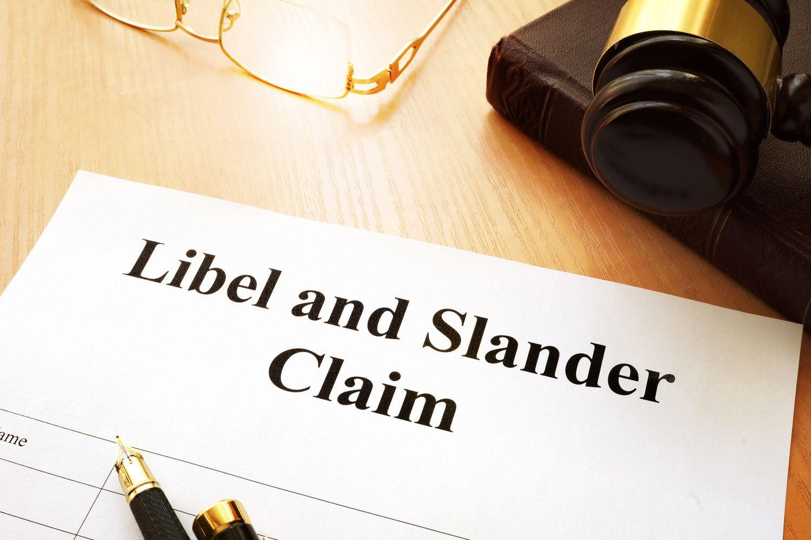

The world of finance and investing has been markedly transformed by the advent of technology, most notably through algorithmic trading. This form of trading, which utilizes computer algorithms to automate trading decisions and strategies, offers significant benefits such as increased trading speed, reduced transaction costs, and enhanced execution capabilities. However, despite these advantages, algorithmic trading also introduces a spectrum of complexities and potential pitfalls, among which legal challenges such as libel, defamation, and slander are prominent.

Libel, defamation, and slander represent serious legal concerns, particularly in an industry where reputation is paramount. Defamation, the broader term, involves false statements that harm an individual's or firm's reputation. Within this, libel refers to defamatory statements made in written or broadcasted form, while slander pertains to those spoken verbally. In the context of algorithmic trading, such statements might falsely depict the effectiveness, integrity, or ethical standards of trading strategies or firms, potentially causing severe reputational and financial damage.

Understanding these legal issues within algorithmic trading is crucial for market participants. Distinguishing between libel, defamation, and slander involves recognizing the nuances of how false information is disseminated and its potential impact. In the fast-paced world of algorithmic trading, where competitive advantage often hinges on proprietary technology and strategy, unfounded claims can lead not only to a loss of client trust but also to expensive legal battles and regulatory scrutiny.

This article seeks to explore these legal intricacies, providing clear definitions and highlighting the differences among these terms while discussing their implications for financial markets. An examination of these concepts aims to equip traders and firms with the knowledge to better protect both their reputation and operations in an industry where information accuracy is critical. The following sections will dissect these legal challenges in more detail, offering insights and strategies for proactively safeguarding against allegations of defamation within the sphere of algorithmic trading.

## Table of Contents

## Understanding Libel, Defamation, and Slander

Defamation is a legal concept that encompasses any false statement that unjustly harms the reputation of an individual or entity. In legal terms, defamation is categorized into two types: libel and slander. Libel pertains to defamatory statements that are expressed in a permanent form, primarily through written or broadcasted media. This could include false accusations published in financial reports, articles, or even social media posts concerning a firm's trading practices or financial strategies. On the other hand, slander refers to defamatory statements that are spoken and typically considered less permanent. This could involve false verbal statements about the integrity or performance of a trading firm or its algorithms during conversations or speeches.

For a statement to legally qualify as defamation, it must meet specific criteria. Firstly, the statement must be demonstrably false. Truthful statements, regardless of their impact on a subject's reputation, do not constitute defamation. Secondly, the statement must be communicated to a third party; a defamatory statement shared only between the speaker and the subject does not meet this criterion. Lastly, the statement must result in harm to the subject's reputation, potentially leading to financial losses or damage to professional and personal relationships.

In the financial trading sector, these false statements can have significant implications. For example, false allegations regarding the effectiveness or legality of a trading algorithm can cause substantial reputational damage and economic loss for a firm. Accusations of unethical trading practices, if unfounded and publicized, can lead to a loss of client trust and business opportunities. Thus, understanding the nuances of libel and slander is essential for trading firms and individuals to protect their reputation and ensure the integrity of their operations in a competitive market environment.

## Legal Implications of Defamation in Algo Trading

Algorithmic trading, also known as algo trading, is a method of executing trade orders via pre-programmed automated trading instructions. These algorithms rely heavily on data integrity and a firm’s reputation, as market participants must have confidence in both the trading strategies and the entities deploying them. In such a high-stakes environment, the repercussions of defamation—whether through libelous written statements or slanderous spoken words—can be particularly severe.

False or misleading statements can severely damage a trading firm's reputation, leading not only to decreased trust and potential client attrition but also to significant financial losses. This decline in reputation may manifest in reduced market participation or the loss of strategic partnerships. For instance, a false claim suggesting that a firm’s [algorithmic trading](/wiki/algorithmic-trading) strategies are consistently underperforming or engaging in unethical trading practices could dissuade investors and partners, thereby eroding market confidence.

In the context of algo trading, legal implications arise when defamatory statements are made public, necessitating a response through libel and defamation lawsuits. Such lawsuits often require the plaintiff to establish several critical elements to prevail: the statement in question must be demonstrably false, have been communicated to at least one third party, and must have caused quantifiable harm to the subject's reputation. In many jurisdictions, proving these elements involves demonstrating the existence of falsehood alongside clear evidence of intent and damage suffered.

The legal framework for resolving defamation disputes varies significantly by jurisdiction, reflecting diverse legal standards and approaches to freedom of expression versus protection of reputation. For example, in the United States, the First Amendment often provides robust protections for speech, thus requiring the plaintiff in defamation cases involving public figures or matters of public concern to prove "actual malice." This means they must show that the false statement was made with knowledge of its falsity or with reckless disregard for the truth, as established in the landmark case New York Times Co. v. Sullivan.

Similarly, in the United Kingdom, defamation laws tend to favor the protection of individual and corporate reputations more stringently. Under the Defamation Act 2013, claimants must demonstrate that the defamatory statement has caused or is likely to cause "serious harm" to their reputation or, for corporations, financial loss.

For firms engaged in algorithmic trading, these legal nuances underscore the importance of diligent reputation management and preemptive legal preparedness. Any public communication about rivals or regarding the performance, strategy, or integrity of trading algorithms should be meticulously verified to preclude potential defamation claims. The implementation of strong internal controls and adherence to legal guidelines can mitigate the risk of defamation-related financial and reputational damages.

## Case Studies and Examples

Several landmark defamation cases have had a profound effect on the legal landscape, providing valuable insights into how defamation in the trading industry can be addressed. One seminal case is New York Times Co. v. Sullivan, which established the "actual malice" standard, requiring public figures to prove that defamatory statements were made with knowledge of their falsehood or with reckless disregard for the truth.[^1] This standard is significant when applied to high-profile entities such as trading firms, where proving malice can be challenging yet crucial for a successful defamation claim.

In the trading industry, defamation disputes may arise from accusations about algorithmic inefficiencies or alleged misconduct. For instance, if a competitor falsely claims that a firm's trading algorithm produces suboptimal or erroneous results, this could result in significant reputational damage and financial loss. Such situations necessitate a robust legal framework to address and resolve the claims.

Understanding past legal outcomes is vital for firms seeking to protect themselves against potential defamation claims. Historical cases illustrate the importance of meticulous evidence gathering and the establishment of clear proof to substantiate claims of defamation. For example, in cases where trading firms have been accused of unethical algorithmic practices, demonstrating the truthfulness of their operations is paramount to countering defamatory statements.

Learning from these precedents, firms can implement comprehensive strategies to safeguard against defamation risks. Such strategies may involve maintaining detailed records of algorithm performance, ensuring transparency in operations, and actively monitoring public discourse around their trading strategies.

By studying the outcomes of landmark cases and applying these lessons to the trading industry, firms can better arm themselves against the complexities of defamation claims, thereby protecting their reputation and ensuring the continued trust of their stakeholders.

[^1]: New York Times Co. v. Sullivan, 376 U.S. 254 (1964).

## Preventive Measures and Best Practices

To reduce the risk of defamatory claims in algorithmic trading, firms can establish robust internal policies for data verification and communication. Ensuring the accuracy and reliability of the data used in trading algorithms is crucial, as misinformation or errors can lead to false statements that may harm reputations. Implementing standardized procedures for data validation and employing advanced data analytics tools can help verify the integrity of the information, reducing the likelihood of disseminating false claims.

Training programs focused on legal implications play a critical role in educating employees about the potential consequences of their statements. These programs should emphasize the importance of accuracy and truthfulness in both internal and external communications. Employees need to understand that careless remarks, whether spoken or written, can lead to legal challenges under libel, defamation, or slander laws. Workshops and seminars led by legal professionals can help employees grasp the intricacies of these legal concepts and the specific vulnerabilities related to algorithmic trading.

Regular monitoring of online content and discussions about a firm is essential for identifying potentially libelous content quickly. Many firms employ social media monitoring tools and web crawlers to track mentions of their brand and key personnel across the internet. By staying vigilant, firms can address defamatory statements before they cause significant harm. If defamatory content is found, it is important to respond swiftly, possibly by issuing a public correction or initiating legal proceedings if necessary.

Consultation with legal experts specializing in defamation in the financial industry can provide tailored advice. These professionals can offer insights into the nuances of defamation law as it relates to finance and trading, advising on how best to navigate potential legal disputes. Such experts can assist in drafting clear communication policies, reviewing public statements for potential defamation, and representing the firm in any legal actions that arise from defamatory claims. Having a legal team well-versed in the peculiarities of financial defamation can be invaluable in safeguarding a firm's reputation and ensuring the smooth operation of trading activities.

## Conclusion

As algorithmic trading continues to progress, the importance of recognizing and addressing legal challenges such as defamation cannot be overstated. The reputations of traders and firms are invaluable assets, and protecting them is crucial for maintaining trust and operational stability. Legal disputes arising from defamatory statements not only threaten financial performance but also undermine the strategic advantages of algorithmic advancements.

To effectively manage these risks, trading entities must prioritize an understanding of the legal environment. Knowledge of defamation laws and relevant case precedents is essential for navigating potential conflicts. Proactive measures, including the implementation of robust communication policies and employee training programs, can mitigate the likelihood of defamatory claims, ensuring that personnel are well-informed of the consequences associated with careless or malicious statements.

Furthermore, continuous monitoring of online and media content for potentially libelous material is paramount. Quick identification and response to such content can prevent escalation into costly legal battles. Consulting with legal professionals who specialize in defamation within the financial sector offers tailored guidance, helping firms preemptively address vulnerabilities.

Ultimately, fostering a culture that emphasizes the importance of accuracy and honesty in all communications is foundational. By embedding these values into organizational practices, businesses in the algorithmic trading sector can safeguard themselves against defamation-related issues and focus on innovation and growth. Such a culture not only defends against legal challenges but also enhances the firm's reputation and trustworthiness in an increasingly competitive market.

## References & Further Reading

[1]: Barker, D. (2007). ["Reputation and Efficiency in Online Marketplaces: Evidence from a Trust Model."](https://hbr.org/2007/02/reputation-and-its-risks) *The Journal of Law and Economics*.

[2]: DaRin, M., & Phalippou, L. (2004). ["Testing Strategic Antitrust Theories: Califano v. Yamasaki and the Economics of Allegations."](https://www.researchgate.net/publication/272777021_Decision-making_Theory_and_practice) *Economics Working Paper Series*.

[3]: "New York Times Co. v. Sullivan, 376 U.S. 254 (1964)." *U.S. Supreme Court Reports*.

[4]: ["Defamation Act 2013"](https://www.legislation.gov.uk/ukpga/2013/26/contents) by UK Government Legislation Archive

[5]: Scott, C. (2015). ["Internet libel: Protecting reputation in a virtual world."](https://www.eff.org/issues/bloggers/legal/liability/defamation) *Telematics and Informatics*, 32(2).

[6]: Tiddy, R., & Andrew, C. (2017). ["Defamation in the Digital Age: From Law to Content Management."](https://www.cshlaw.com/resources/defamation-and-reputation-management-in-the-digital-age/) *Oxford Handbook of Communication in Organizations*.

[7]: Hofrichter, Jurbke, & Rønn, K. (2019). ["Algorithmic Trading: Practical Insights into Predominant Strategies and Tools."](https://www.nature.com/articles/s41599-019-0266-1) *SpringerLink*.