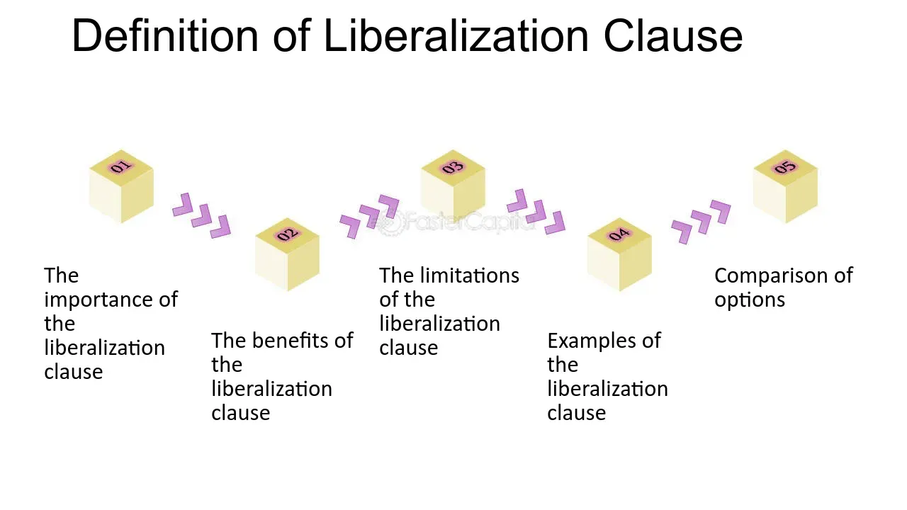

## Table of Contents

## What is a liberalization clause?

A liberalization clause is a part of an insurance policy that says if the insurance company makes the policy better for everyone with the same type of policy, those improvements will also apply to your policy. This means that if the company decides to add new benefits or reduce restrictions, you get those changes automatically, even if your policy hasn't been renewed yet.

For example, if the insurance company decides to lower the deductible for all similar policies, your policy will also get the lower deductible without you having to do anything. This clause helps make sure that policyholders don't miss out on improvements just because their policy is older. It's a way for insurance companies to keep their policies fair and up-to-date for everyone.

## Why is a liberalization clause important in insurance policies?

A liberalization clause is important in insurance policies because it makes sure that everyone gets the same benefits, even if they bought their policy a long time ago. If an insurance company decides to make their policy better by adding new benefits or reducing costs, everyone with that type of policy gets those improvements. This means you don't have to wait until your policy is up for renewal to get the new benefits.

This clause helps keep things fair for all policyholders. It stops the insurance company from only giving new benefits to people who buy policies after the changes are made. By including a liberalization clause, the insurance company shows that they want to treat everyone equally and keep their policies up to date for everyone, not just new customers.

## How does a liberalization clause benefit policyholders?

A liberalization clause in an insurance policy helps policyholders by making sure they get any new benefits or improvements the insurance company adds to similar policies. This means if the company decides to lower costs or add new coverage, you get these changes right away, even if your policy hasn't been renewed yet. It's like getting an automatic update to your policy, so you don't miss out on anything new and good.

This clause keeps things fair for everyone who has the same type of policy. Without it, only people who buy a new policy after the changes would get the new benefits. But with a liberalization clause, everyone is treated the same, no matter when they bought their policy. This way, you can feel confident that your insurance company is looking out for all its customers and keeping everyone's policies up to date.

## Can you explain the mechanism of a liberalization clause?

A liberalization clause in an insurance policy works by making sure that if the insurance company makes the policy better for everyone with the same type of policy, those improvements will also apply to your policy. If the company decides to add new benefits or make the policy cheaper, you get those changes automatically, even if your policy hasn't been renewed yet. It's like getting an automatic update to your policy, so you don't have to do anything to get the new benefits.

The way it works is simple: the insurance company keeps track of all the policies that are the same as yours. If they decide to make a change that helps everyone with those policies, they apply that change to all of them, including yours. This means you don't miss out on any new benefits just because you bought your policy a long time ago. It's a way for the insurance company to make sure everyone is treated fairly and gets the same improvements.

## What are the typical conditions under which a liberalization clause is activated?

A liberalization clause gets activated when the insurance company makes the policy better for everyone who has the same type of policy. This could mean adding new benefits, lowering costs, or making the policy easier to use. The key is that the change has to be good for all policyholders with that type of policy, not just some of them.

For example, if the insurance company decides to lower the deductible for all similar policies, the liberalization clause makes sure that everyone gets that lower deductible, even if their policy hasn't been renewed yet. The company keeps track of all the policies that are the same, and when they make a change, they apply it to all of them. This way, everyone gets the new benefits right away, without having to wait or do anything extra.

## How does a liberalization clause affect existing policies?

A liberalization clause in an insurance policy makes sure that if the insurance company makes the policy better for everyone with the same type of policy, those improvements will also apply to your policy. This means if they decide to add new benefits or make the policy cheaper, you get those changes right away, even if your policy hasn't been renewed yet. It's like getting an automatic update to your policy, so you don't have to do anything to get the new benefits.

This clause helps keep things fair for everyone who has the same type of policy. Without it, only people who buy a new policy after the changes would get the new benefits. But with a liberalization clause, everyone is treated the same, no matter when they bought their policy. This way, you can feel confident that your insurance company is looking out for all its customers and keeping everyone's policies up to date.

## Are there any limitations or exclusions to a liberalization clause?

A liberalization clause in an insurance policy is meant to help everyone, but it can have some limits. For example, the clause might only apply to changes that the insurance company makes during your policy term. If they make changes after your policy has ended or been renewed, you might not get those new benefits right away. Also, the clause might not cover changes that only affect a small group of policyholders, like changes made just for people in a certain area or with a specific type of coverage.

Sometimes, the liberalization clause might not apply to all parts of your policy. For example, if the insurance company makes changes to the terms about how to file a claim, those changes might not be included in the liberalization clause. It's also possible that the clause might not apply if the changes are not considered improvements, like if the company adds new restrictions or increases costs for some policyholders. It's always a good idea to read your policy carefully to understand any limits or exclusions that might apply to the liberalization clause.

## What is the historical background of liberalization clauses in insurance?

Liberalization clauses in insurance policies started to become common in the mid-20th century. Before that, insurance companies would often change their policies, but those changes only applied to new policies. This meant that people who had older policies didn't get the new benefits. Insurance regulators and consumer groups started to see this as unfair, so they pushed for changes. The idea of a liberalization clause was to make sure that all policyholders, no matter when they bought their policy, would get the same benefits if the insurance company made the policy better.

Over time, liberalization clauses became a standard part of many insurance policies. They help keep things fair for everyone and make sure that insurance companies treat all their customers the same way. Today, these clauses are important because they show that insurance companies want to improve their policies for everyone, not just new customers. This helps build trust between the insurance company and its policyholders, knowing that everyone will benefit from any improvements made to the policy.

## How do regulatory bodies influence the implementation of liberalization clauses?

Regulatory bodies play a big role in making sure insurance companies use liberalization clauses. They make rules that insurance companies have to follow. These rules are meant to protect people who buy insurance. The regulators check that insurance companies are treating everyone fairly. They want to make sure that if an insurance company makes a policy better, everyone with that type of policy gets the new benefits, not just new customers. This helps keep things fair and stops insurance companies from only giving good changes to new policyholders.

Sometimes, regulatory bodies will even tell insurance companies that they have to add a liberalization clause to their policies. This is to make sure that all policyholders are treated the same. If an insurance company doesn't follow these rules, the regulators can punish them. This could mean fines or other penalties. By making and enforcing these rules, regulatory bodies help make sure that insurance companies keep their policies up to date for everyone, which builds trust between the insurance company and its customers.

## What are the differences between a liberalization clause and other similar policy provisions?

A liberalization clause is different from other policy provisions because it makes sure that if the insurance company improves the policy for everyone with the same type of policy, you get those improvements right away, even if your policy hasn't been renewed yet. Other provisions, like an endorsement or a rider, might add new benefits or change the policy, but they usually only apply to your specific policy and not to everyone with the same type of policy. An endorsement or rider needs to be added to your policy, and you might have to pay more for it.

Another similar provision is a renewal provision, which says what happens when your policy is up for renewal. A renewal provision might allow the insurance company to change the policy terms when you renew, but those changes only apply at the time of renewal, not before. Unlike a liberalization clause, a renewal provision doesn't automatically give you any new benefits during your current policy term. So, while both types of provisions can change your policy, they work in different ways and at different times.

## How can policyholders ensure they are taking full advantage of a liberalization clause?

To make sure you're getting all the benefits from a liberalization clause, it's important to stay updated on any changes the insurance company makes to similar policies. You can do this by regularly checking the insurance company's website or newsletter for any updates or improvements they announce. If you hear about a change that should apply to your policy, reach out to your insurance agent or customer service to confirm that you're getting the new benefits. They can help you understand if the change applies to you and how it affects your coverage.

It's also a good idea to read your policy carefully, especially the part about the liberalization clause. This will help you know exactly what kind of changes you should be looking out for. If you're ever unsure about whether a change should apply to your policy, don't hesitate to ask your insurance company. By staying informed and proactive, you can make sure you're taking full advantage of any improvements the insurance company makes, without missing out on any new benefits.

## What are some case studies or examples where a liberalization clause significantly impacted policy outcomes?

In one case, a major insurance company decided to lower the deductible for all their auto insurance policies. Because of the liberalization clause, everyone who already had a policy got the lower deductible right away, even if their policy wasn't up for renewal yet. This helped a lot of people save money on their insurance. One policyholder, who had just had an accident, was really happy because the lower deductible meant they had to pay less out of pocket to fix their car.

In another example, a health insurance company added new coverage for mental health services to all their policies. Thanks to the liberalization clause, everyone with a similar policy got this new benefit without having to wait. This was a big help for many people who needed mental health care but couldn't afford it before. One policyholder shared how the new coverage allowed them to get the therapy they needed, which improved their quality of life a lot.

## References & Further Reading

[1]: Narang, R. (2013). ["Inside the Black Box: A Simple Guide to Quantitative and High-Frequency Trading"](https://onlinelibrary.wiley.com/doi/book/10.1002/9781118662717). Wiley.

[2]: Hull, J. C. (2017). ["Options, Futures, and Other Derivatives"](https://www.semanticscholar.org/paper/Options%2C-Futures%2C-and-Other-Derivatives-Hull/89bdee500c8623864fc9eb7a471546aa713acc44). Pearson Education.

[3]: MacCarthy, M. (2020). ["AI, Algorithms, and Equity: Not too fast"](https://www.brookings.edu/articles/ai-needs-more-regulation-not-less/). Brookings Institution.

[4]: Kishan, R. (2010). ["The Flash Crash: A New Regulatory in Wake of Market Meltdown"](https://www.researchgate.net/publication/320965956_The_flash_crash_a_review).

[5]: Scopino, G. (2015). ["The Algo Arms Race: Trading Execution, Market Regulation, and Innovation"](https://link.springer.com/article/10.1007/s11408-021-00401-8). CFA Institute.